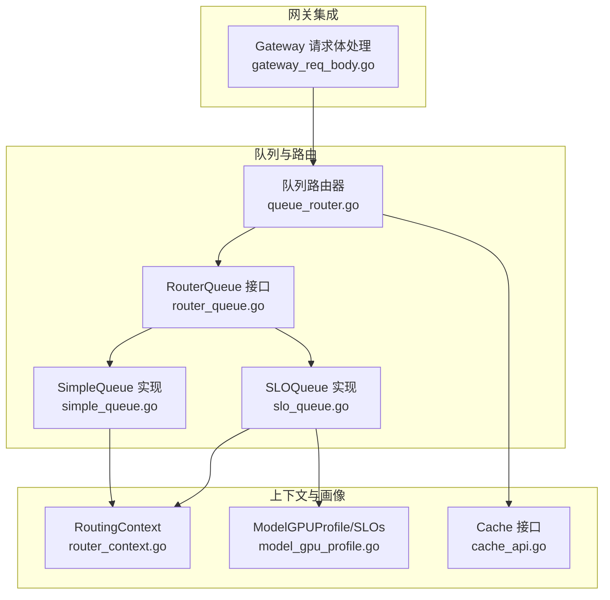
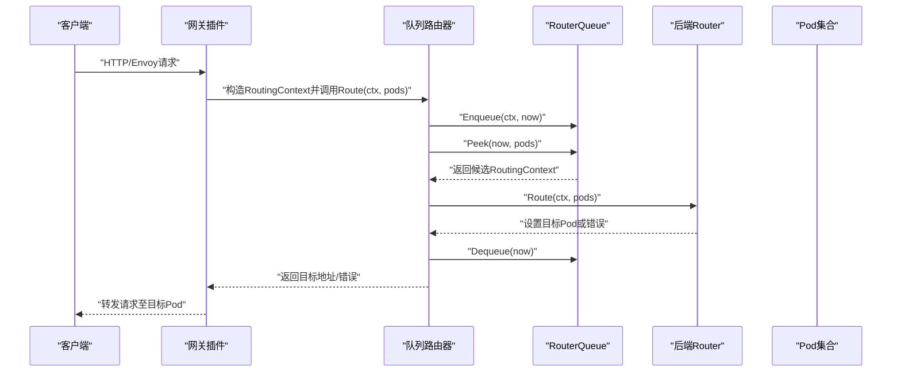
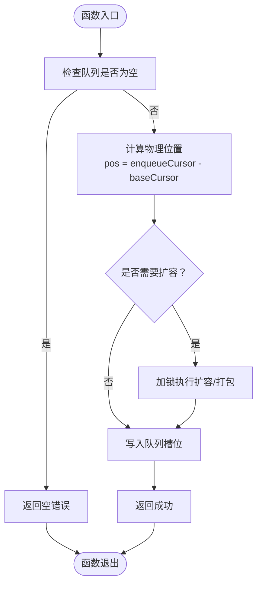
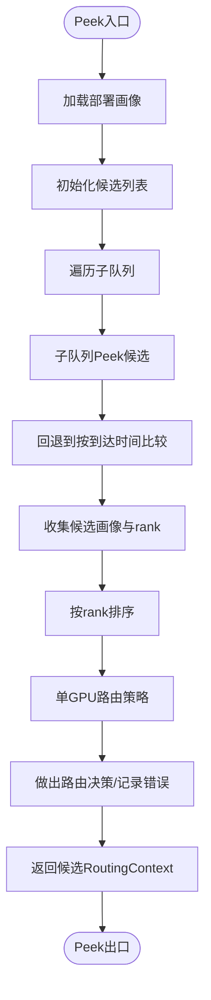
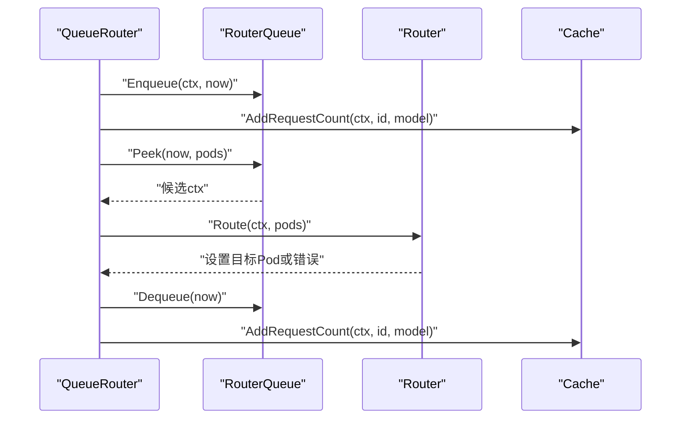
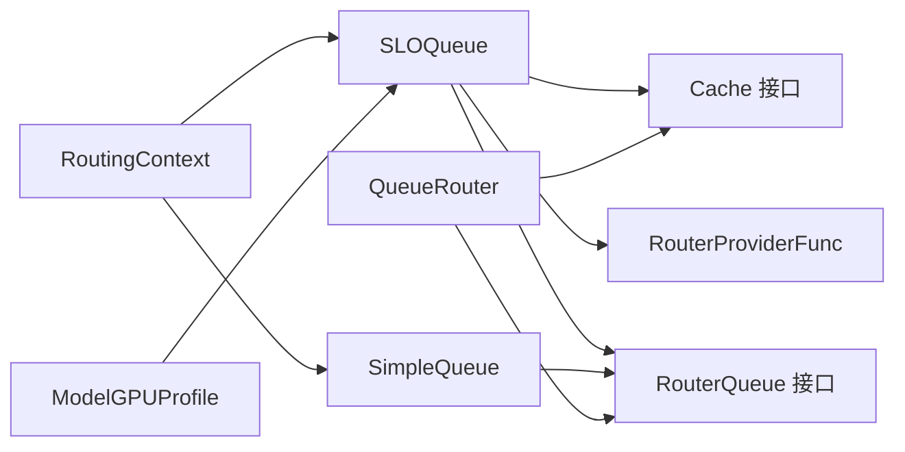

# 请求队列管理

<cite>
**本文引用的文件**
- [simple_queue.go](file://pkg/plugins/gateway/queue/simple_queue.go)
- [slo_queue.go](file://pkg/plugins/gateway/queue/slo_queue.go)
- [router_queue.go](file://pkg/types/router_queue.go)
- [queue_router.go](file://pkg/plugins/gateway/algorithms/queue_router.go)
- [router_context.go](file://pkg/types/router_context.go)
- [model_gpu_profile.go](file://pkg/cache/model_gpu_profile.go)
- [cache_api.go](file://pkg/cache/cache_api.go)
- [gateway_req_body.go](file://pkg/plugins/gateway/gateway_req_body.go)
- [simple_queue_test.go](file://pkg/plugins/gateway/queue/simple_queue_test.go)
</cite>

## 目录
1. [简介](#简介)
2. [项目结构](#项目结构)
3. [核心组件](#核心组件)
4. [架构总览](#架构总览)
5. [详细组件分析](#详细组件分析)
6. [依赖关系分析](#依赖关系分析)
7. [性能考量](#性能考量)
8. [故障排查指南](#故障排查指南)
9. [结论](#结论)
10. [附录](#附录)

## 简介
本技术文档聚焦于AIBrix网关插件中的请求队列管理系统，系统提供两类队列实现：SimpleQueue（先进先出FIFO）与SLOQueue（基于服务级别目标SLO的智能队列）。前者以无锁环形缓冲区实现高并发下的低开销入队/出队；后者在FIFO基础上引入特征化排序与多SLO指标（如TTFT、TPOT、TPAT、E2E），结合模型GPU性能画像进行“排队时延”与“吞吐”预估，从而在满足SLA的前提下进行优先级调度与动态队列调整。

## 项目结构
与队列管理直接相关的代码主要位于以下模块：
- 队列接口与通用类型：pkg/types/router_queue.go
- FIFO队列实现：pkg/plugins/gateway/queue/simple_queue.go
- SLO智能队列实现：pkg/plugins/gateway/queue/slo_queue.go
- 队列驱动的路由器：pkg/plugins/gateway/algorithms/queue_router.go
- 路由上下文与特征提取：pkg/types/router_context.go
- 模型GPU画像与SLO指标：pkg/cache/model_gpu_profile.go
- 缓存接口与能力：pkg/cache/cache_api.go
- 网关集成与运行时统计：pkg/plugins/gateway/gateway_req_body.go
- 单元测试：pkg/plugins/gateway/queue/simple_queue_test.go

**图表来源**
- [router_queue.go:30-35](file://pkg/types/router_queue.go#L30-L35)
- [simple_queue.go:33-42](file://pkg/plugins/gateway/queue/simple_queue.go#L33-L42)
- [slo_queue.go:80-92](file://pkg/plugins/gateway/queue/slo_queue.go#L80-L92)
- [queue_router.go:47-52](file://pkg/plugins/gateway/algorithms/queue_router.go#L47-L52)
- [router_context.go:59-105](file://pkg/types/router_context.go#L59-L105)
- [model_gpu_profile.go:59-79](file://pkg/cache/model_gpu_profile.go#L59-L79)
- [cache_api.go:25-35](file://pkg/cache/cache_api.go#L25-L35)
- [gateway_req_body.go:139-175](file://pkg/plugins/gateway/gateway_req_body.go#L139-L175)

**章节来源**
- [router_queue.go:24-35](file://pkg/types/router_queue.go#L24-L35)
- [simple_queue.go:44-55](file://pkg/plugins/gateway/queue/simple_queue.go#L44-L55)
- [slo_queue.go:94-109](file://pkg/plugins/gateway/queue/slo_queue.go#L94-L109)
- [queue_router.go:47-70](file://pkg/plugins/gateway/algorithms/queue_router.go#L47-L70)
- [router_context.go:178-192](file://pkg/types/router_context.go#L178-L192)
- [model_gpu_profile.go:59-79](file://pkg/cache/model_gpu_profile.go#L59-L79)
- [cache_api.go:25-35](file://pkg/cache/cache_api.go#L25-L35)
- [gateway_req_body.go:139-175](file://pkg/plugins/gateway/gateway_req_body.go#L139-L175)

## 核心组件
- RouterQueue接口：统一定义入队、窥视、出队与长度查询，支持泛型承载RoutingContext。
- SimpleQueue：基于原子游标与逻辑地址映射的无锁环形缓冲，支持按需扩容与元素打包，保障并发安全与低竞争。
- SLOQueue：在多子队列（按请求特征分桶）之上，利用模型GPU画像的SLO指标与吞吐曲线，对候选请求进行“违反SLO风险”排序，优先调度更可能满足SLA的请求，并在必要时回退到FIFO。
- QueueRouter：协调后端Router与RouterQueue，通过通道触发路由尝试，实现“入队—窥视—路由—出队”的流水线。
- RoutingContext：封装请求特征（提示词/输出长度）、时间戳、目标Pod与错误状态，支撑SLO评分与路由决策。
- ModelGPUProfile：提供E2E、TTFT、TPOT、TPAT等SLO指标与吞吐曲线，用于排队时延与服务时长预估。

**章节来源**
- [router_queue.go:30-35](file://pkg/types/router_queue.go#L30-L35)
- [simple_queue.go:33-55](file://pkg/plugins/gateway/queue/simple_queue.go#L33-L55)
- [slo_queue.go:80-92](file://pkg/plugins/gateway/queue/slo_queue.go#L80-L92)
- [queue_router.go:47-70](file://pkg/plugins/gateway/algorithms/queue_router.go#L47-L70)
- [router_context.go:59-105](file://pkg/types/router_context.go#L59-L105)
- [model_gpu_profile.go:59-79](file://pkg/cache/model_gpu_profile.go#L59-L79)

## 架构总览
下图展示从请求进入网关到被路由至推理引擎的整体流程，以及队列在其中的关键作用。

**图表来源**
- [queue_router.go:72-97](file://pkg/plugins/gateway/algorithms/queue_router.go#L72-L97)
- [simple_queue.go:57-75](file://pkg/plugins/gateway/queue/simple_queue.go#L57-L75)
- [slo_queue.go:111-135](file://pkg/plugins/gateway/queue/slo_queue.go#L111-L135)
- [router_context.go:194-211](file://pkg/types/router_context.go#L194-L211)

**章节来源**
- [queue_router.go:72-146](file://pkg/plugins/gateway/algorithms/queue_router.go#L72-L146)
- [simple_queue.go:57-151](file://pkg/plugins/gateway/queue/simple_queue.go#L57-L151)
- [slo_queue.go:111-320](file://pkg/plugins/gateway/queue/slo_queue.go#L111-L320)
- [router_context.go:194-211](file://pkg/types/router_context.go#L194-L211)

## 详细组件分析

### SimpleQueue 组件分析
- 设计要点
  - 原子游标与逻辑地址映射：enqueueCursor/dequeueCursor为原子变量，物理位置通过逻辑位置减去baseCursor计算，避免频繁扩容导致的索引越界。
  - 扩容策略：当使用量超过容量一半时按倍数扩容并复制元素；否则进行元素打包并将旧空间零值填充，减少内存碎片。
  - 并发安全：读写锁保护，入队/出队前检查边界，必要时触发扩容；扩容过程在互斥锁内完成，确保一致性。
  - 空值检测：Peek/Dequeue中若发现空值，主动让出读锁并让扩容有机会完成，随后重试，避免死锁。
- 复杂度与性能
  - 入队/出队摊还O(1)，扩容时O(n)但频率较低。
  - 内存占用随使用率变化，低利用率时通过打包降低空间占用。
- 关键路径
  - 入队：[Enqueue:57-75](file://pkg/plugins/gateway/queue/simple_queue.go#L57-L75)
  - 出队：[Dequeue:104-151](file://pkg/plugins/gateway/queue/simple_queue.go#L104-L151)
  - 扩容：[expand:172-218](file://pkg/plugins/gateway/queue/simple_queue.go#L172-L218)

**图表来源**
- [simple_queue.go:57-75](file://pkg/plugins/gateway/queue/simple_queue.go#L57-L75)
- [simple_queue.go:172-218](file://pkg/plugins/gateway/queue/simple_queue.go#L172-L218)

**章节来源**
- [simple_queue.go:33-219](file://pkg/plugins/gateway/queue/simple_queue.go#L33-L219)
- [simple_queue_test.go:53-107](file://pkg/plugins/gateway/queue/simple_queue_test.go#L53-L107)

### SLOQueue 组件分析
- 设计理念
  - 子队列分桶：依据请求特征（输出长度、提示长度）取对数并四舍五入作为特征向量，映射到不同子队列，隔离不同负载特征的请求。
  - SLO评分：对每个子队列的候选请求，结合模型GPU画像的SLO指标（TTFT/TPOT/TPAT/E2E）与当前队列长度，计算“违反SLO风险”rank，优先选择更可能满足SLA的请求。
  - 回退策略：当无可用画像或画像不包含SLO信息时，回退到按到达时间的FIFO比较。
  - GPU路由策略：可选单一GPU类型路由（monogenousGPURouting），并在满足SLA前提下尽早停止尝试其他部署。
- 关键流程
  - Enqueue：设置输出预测器，按特征生成子队列键，入队到对应子队列。[Enqueue:111-135](file://pkg/plugins/gateway/queue/slo_queue.go#L111-L135)
  - Peek：遍历所有子队列，收集候选请求；对每个候选计算多部署画像的rank并排序；根据策略决定最终候选。[Peek:137-300](file://pkg/plugins/gateway/queue/slo_queue.go#L137-L300)
  - Dequeue：必须在Peek之后调用，取出对应子队列头部请求。[Dequeue:302-312](file://pkg/plugins/gateway/queue/slo_queue.go#L302-L312)
  - SLO评分：支持E2E、TTFT、TPOT、TPAT四种SLO指标，结合吞吐曲线与排队长度进行综合评估。[rankImpl系列:400-464](file://pkg/plugins/gateway/queue/slo_queue.go#L400-L464)

**图表来源**
- [slo_queue.go:137-300](file://pkg/plugins/gateway/queue/slo_queue.go#L137-L300)
- [model_gpu_profile.go:59-79](file://pkg/cache/model_gpu_profile.go#L59-L79)

**章节来源**
- [slo_queue.go:80-366](file://pkg/plugins/gateway/queue/slo_queue.go#L80-L366)
- [model_gpu_profile.go:59-197](file://pkg/cache/model_gpu_profile.go#L59-L197)

### QueueRouter 组件分析
- 角色定位：将“入队—窥视—路由—出队”的流程封装为一个协程驱动的状态机，通过通道触发路由尝试，避免阻塞主请求路径。
- 关键行为
  - Route(ctx, pods)：当ctx非空时，入队并尝试路由；当ctx为空时，仅触发一次路由尝试以处理可用Pod导致的排队释放。[Route:72-97](file://pkg/plugins/gateway/algorithms/queue_router.go#L72-L97)
  - serve循环：持续从通道接收Pod列表，循环Peek/Route/Dequeue，实时响应Pod容量变化。[serve:111-146](file://pkg/plugins/gateway/algorithms/queue_router.go#L111-L146)
- 与缓存交互：在入队/路由成功后更新请求计数与实时指标。[AddRequestCount:84-87](file://pkg/plugins/gateway/algorithms/queue_router.go#L84-L87)

**图表来源**
- [queue_router.go:72-146](file://pkg/plugins/gateway/algorithms/queue_router.go#L72-L146)
- [cache_api.go:111-145](file://pkg/cache/cache_api.go#L111-L145)

**章节来源**
- [queue_router.go:47-146](file://pkg/plugins/gateway/algorithms/queue_router.go#L47-L146)
- [cache_api.go:111-145](file://pkg/cache/cache_api.go#L111-L145)

### RoutingContext 与特征提取
- 特征提取：输出长度与提示长度经对数变换后作为请求特征，用于SLOQueue的子队列分桶与画像签名匹配。[Features:178-192](file://pkg/types/router_context.go#L178-L192)
- 输出预测：若存在OutputPredictor，可预测输出长度，支撑TPAT/TPOT等SLO计算。[TokenLength:164-176](file://pkg/types/router_context.go#L164-L176)
- 目标设置：路由器设置目标Pod后，阻塞的TargetPod()立即返回，实现异步路由结果同步。[SetTargetPod/TargetPod:194-228](file://pkg/types/router_context.go#L194-L228)

**章节来源**
- [router_context.go:178-192](file://pkg/types/router_context.go#L178-L192)
- [router_context.go:164-176](file://pkg/types/router_context.go#L164-L176)
- [router_context.go:194-228](file://pkg/types/router_context.go#L194-L228)

### 模型GPU画像与SLO指标
- 指标体系：E2E、TTFT、TPOT、TPAT四种SLO指标，配合吞吐曲线（ThroughputRPS）与延迟曲线（Latency/TTFT/TPOT），用于排队时延与服务时长预估。[ModelGPUProfile:59-79](file://pkg/cache/model_gpu_profile.go#L59-L79)
- 签名匹配：将特征向量映射到画像网格索引，支持容忍度内的近邻分配，保证在特征连续空间内的稳定匹配。[GetSignature:99-154](file://pkg/cache/model_gpu_profile.go#L99-L154)

**章节来源**
- [model_gpu_profile.go:59-197](file://pkg/cache/model_gpu_profile.go#L59-L197)

## 依赖关系分析
- 组件耦合
  - SLOQueue依赖Cache接口获取模型画像与输出预测器；依赖RouterProviderFunc获取后端Router实例；依赖SyncMap维护子队列池。
  - SimpleQueue独立性强，仅依赖RouterQueue接口与通用类型。
  - QueueRouter依赖RouterQueue接口与Cache接口，协调入队/窥视/出队与路由。
- 外部依赖
  - Kubernetes Pod列表与状态通过types.PodList传递给后端Router，影响路由决策。
  - 日志与调试：SLOQueue提供子队列统计与候选日志，便于排障。

**图表来源**
- [slo_queue.go:80-92](file://pkg/plugins/gateway/queue/slo_queue.go#L80-L92)
- [simple_queue.go:33-42](file://pkg/plugins/gateway/queue/simple_queue.go#L33-L42)
- [queue_router.go:47-52](file://pkg/plugins/gateway/algorithms/queue_router.go#L47-L52)
- [cache_api.go:25-35](file://pkg/cache/cache_api.go#L25-L35)
- [router_context.go:59-105](file://pkg/types/router_context.go#L59-L105)
- [model_gpu_profile.go:59-79](file://pkg/cache/model_gpu_profile.go#L59-L79)

**章节来源**
- [slo_queue.go:80-92](file://pkg/plugins/gateway/queue/slo_queue.go#L80-L92)
- [simple_queue.go:33-42](file://pkg/plugins/gateway/queue/simple_queue.go#L33-L42)
- [queue_router.go:47-52](file://pkg/plugins/gateway/algorithms/queue_router.go#L47-L52)
- [cache_api.go:25-35](file://pkg/cache/cache_api.go#L25-L35)
- [router_context.go:59-105](file://pkg/types/router_context.go#L59-L105)
- [model_gpu_profile.go:59-79](file://pkg/cache/model_gpu_profile.go#L59-L79)

## 性能考量
- 队列容量与扩展
  - 初始子队列大小与总子队列数量可通过常量配置，避免频繁扩容带来的抖动。[常量定义:35-42](file://pkg/plugins/gateway/queue/slo_queue.go#L35-L42)
  - SimpleQueue在低利用率时采用打包策略，减少内存占用；高利用率时按倍数扩容，保持O(1)摊还复杂度。[expand:172-218](file://pkg/plugins/gateway/queue/simple_queue.go#L172-L218)
- SLO评分与排序
  - 通过多部署画像的rank排序，优先路由更可能满足SLA的请求，降低整体排队时延与丢弃概率。
  - 可选monogenousGPURouting策略，减少跨GPU类型路由失败的概率与成本。
- 调度与并发
  - QueueRouter使用带缓冲通道触发路由尝试，避免阻塞请求路径；并发路由与队列操作通过原子游标与互斥锁协同保证正确性。
- 运行时统计
  - 网关侧记录路由耗时、目标Pod运行请求数等指标，辅助容量规划与SLA监控。[统计输出:139-175](file://pkg/plugins/gateway/gateway_req_body.go#L139-L175)

**章节来源**
- [slo_queue.go:35-42](file://pkg/plugins/gateway/queue/slo_queue.go#L35-L42)
- [simple_queue.go:172-218](file://pkg/plugins/gateway/queue/simple_queue.go#L172-L218)
- [queue_router.go:111-146](file://pkg/plugins/gateway/algorithms/queue_router.go#L111-L146)
- [gateway_req_body.go:139-175](file://pkg/plugins/gateway/gateway_req_body.go#L139-L175)

## 故障排查指南
- 常见错误与定位
  - 队列为空：Peek/Dequeue返回空错误时，确认是否已入队或队列已被清空。[ErrQueueEmpty:27-28](file://pkg/types/router_queue.go#L27-L28)
  - 未先Peek直接Dequeue：SLOQueue要求先Peek再Dequeue，否则会报错。[Dequeue校验:302-305](file://pkg/plugins/gateway/queue/slo_queue.go#L302-L305)
  - 无可用画像或SLO信息：SLOQueue会在无画像或画像不含SLO时回退到FIFO，检查模型画像加载与SLO字段配置。[回退逻辑:154-156](file://pkg/plugins/gateway/queue/slo_queue.go#L154-L156)
  - 路由失败：QueueRouter在路由失败时设置RoutingContext错误，随后Dequeue；可在网关侧查看错误信息与目标Pod状态。[错误设置:129-132](file://pkg/plugins/gateway/algorithms/queue_router.go#L129-L132)
- 调试手段
  - 启用SLOQueue内部日志，观察子队列长度与候选rank排序情况。[调试日志:470-504](file://pkg/plugins/gateway/queue/slo_queue.go#L470-L504)
  - 使用单元测试验证队列扩容与并发行为。[测试用例:53-107](file://pkg/plugins/gateway/queue/simple_queue_test.go#L53-L107)
- 资源回收
  - RoutingContext在完成或出错后应调用Delete回收到对象池，避免内存泄漏。[Delete:132-136](file://pkg/types/router_context.go#L132-L136)

**章节来源**
- [router_queue.go:27-28](file://pkg/types/router_queue.go#L27-L28)
- [slo_queue.go:302-305](file://pkg/plugins/gateway/queue/slo_queue.go#L302-L305)
- [queue_router.go:129-132](file://pkg/plugins/gateway/algorithms/queue_router.go#L129-L132)
- [slo_queue.go:470-504](file://pkg/plugins/gateway/queue/slo_queue.go#L470-L504)
- [simple_queue_test.go:53-107](file://pkg/plugins/gateway/queue/simple_queue_test.go#L53-L107)
- [router_context.go:132-136](file://pkg/types/router_context.go#L132-L136)

## 结论
AIBrix请求队列管理通过SimpleQueue与SLOQueue两种策略，实现了从基础FIFO到面向SLA的智能调度的完整覆盖。SimpleQueue在高并发场景下提供稳定的低开销队列能力；SLOQueue则在多维度画像与SLO指标的加持下，实现更优的排队公平性与SLA达成率。配合QueueRouter的流水线式编排与网关侧的运行时统计，系统具备良好的可观测性与可运维性。

## 附录

### 配置参数与调优建议
- SLOQueue关键开关
  - fifoOnNonSLOViolation：当无SLO违规时保持FIFO顺序，有助于维持公平性。[开关位置](file://pkg/plugins/gateway/queue/slo_queue.go#L36)
  - queueOverallSLO：是否考虑排队时延的总体SLO，影响rank计算方式。[开关位置](file://pkg/plugins/gateway/queue/slo_queue.go#L37)
  - monogenousGPURouting / monogenousGPURoutingOnly：限制路由到单一GPU类型，提升成功率与稳定性。[开关位置:38-39](file://pkg/plugins/gateway/queue/slo_queue.go#L38-L39)
  - initialTotalSubQueues / initialSubQueueSize：初始子队列数量与子队列容量，平衡内存与并发隔离。[常量定义:40-41](file://pkg/plugins/gateway/queue/slo_queue.go#L40-L41)
- SimpleQueue容量
  - initialCapacity：默认容量，过小会导致频繁扩容；过大则浪费内存。[构造逻辑:44-55](file://pkg/plugins/gateway/queue/simple_queue.go#L44-L55)
- 调优建议
  - 在高波动工作负载下，适当增大initialSubQueueSize以减少扩容次数。
  - 开启monogenousGPURoutingOnly可降低跨GPU失败率，但需确保部署画像覆盖目标GPU类型。
  - 对于延迟敏感场景，优先启用queueOverallSLO以考虑排队时延。

**章节来源**
- [slo_queue.go:35-42](file://pkg/plugins/gateway/queue/slo_queue.go#L35-L42)
- [simple_queue.go:44-55](file://pkg/plugins/gateway/queue/simple_queue.go#L44-L55)

### 容量规划指南
- 依据模型GPU画像的吞吐曲线与SLO目标，估算峰值RPS与平均排队长度，结合队列容量与子队列数量确定Pod规模。
- 通过网关侧运行时统计（路由耗时、目标Pod运行请求数）持续观测SLA达成率与排队时延，动态调整部署与队列参数。

**章节来源**
- [model_gpu_profile.go:170-197](file://pkg/cache/model_gpu_profile.go#L170-L197)
- [gateway_req_body.go:139-175](file://pkg/plugins/gateway/gateway_req_body.go#L139-L175)