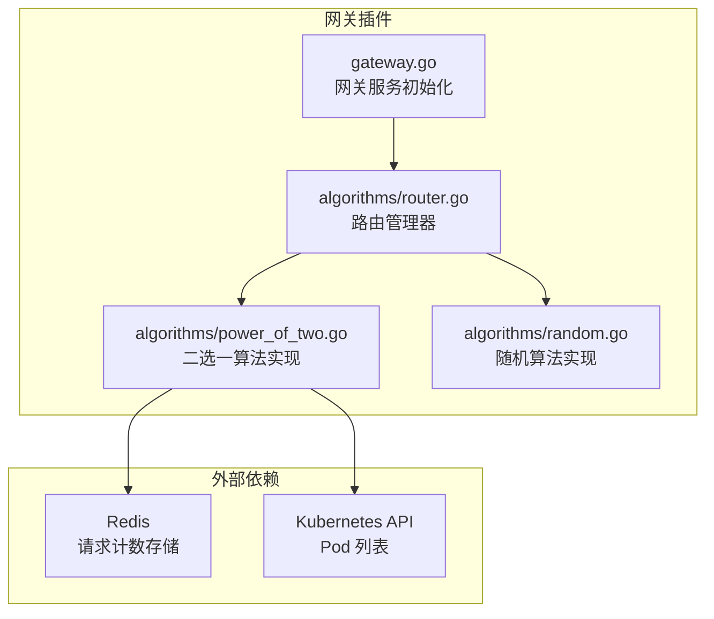
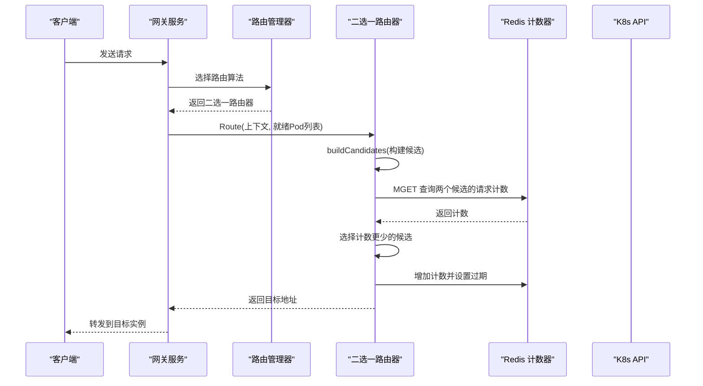
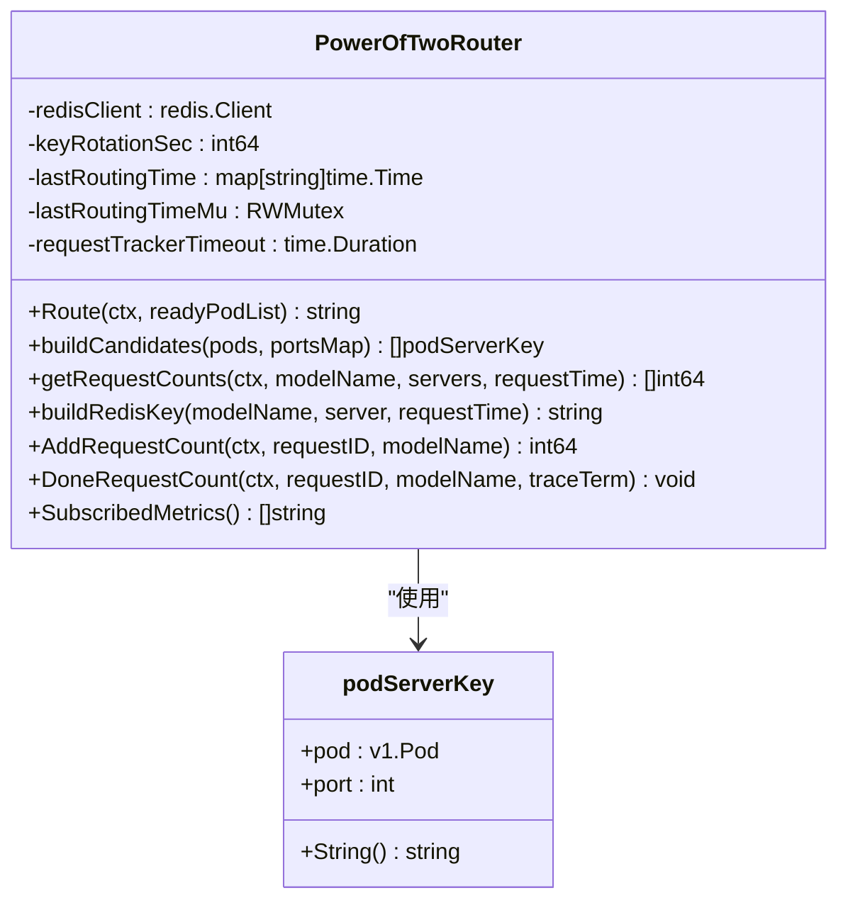
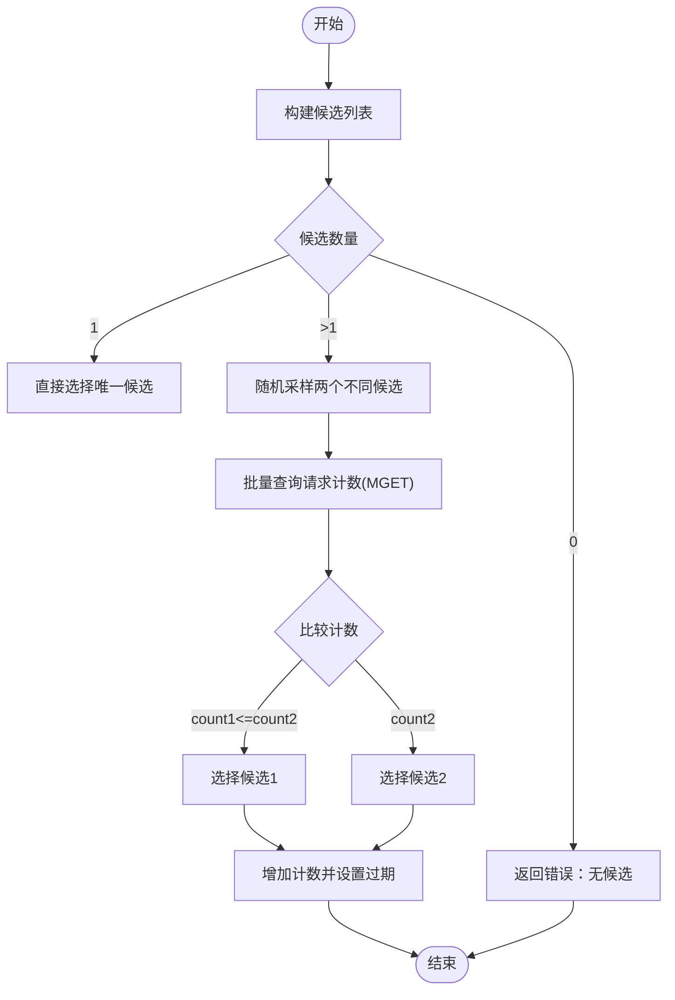
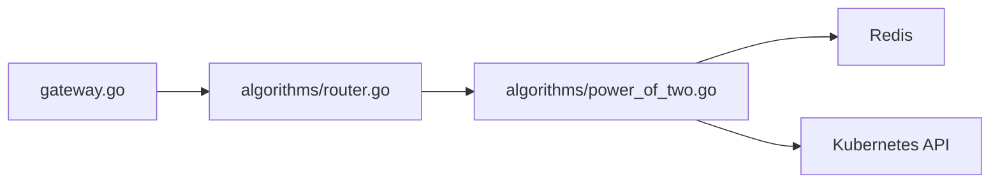

# 二选一算法

<cite>
**本文档引用的文件**
- [pkg/plugins/gateway/algorithms/power_of_two.go](file://pkg/plugins/gateway/algorithms/power_of_two.go)
- [pkg/plugins/gateway/algorithms/power_of_two_test.go](file://pkg/plugins/gateway/algorithms/power_of_two_test.go)
- [pkg/plugins/gateway/algorithms/random.go](file://pkg/plugins/gateway/algorithms/random.go)
- [pkg/plugins/gateway/algorithms/router.go](file://pkg/plugins/gateway/algorithms/router.go)
- [pkg/plugins/gateway/gateway.go](file://pkg/plugins/gateway/gateway.go)
- [benchmarks/scenarios/gateway/benchmark.py](file://benchmarks/scenarios/gateway/benchmark.py)
- [benchmarks/plot/aibrix0.3-routing_vtc-basic-vs-random.ipynb](file://benchmarks/plot/aibrix0.3-routing_vtc-basic-vs-random.ipynb)
</cite>

## 目录
1. [简介](#简介)
2. [项目结构](#项目结构)
3. [核心组件](#核心组件)
4. [架构概览](#架构概览)
5. [详细组件分析](#详细组件分析)
6. [依赖分析](#依赖分析)
7. [性能考虑](#性能考虑)
8. [故障排查指南](#故障排查指南)
9. [结论](#结论)
10. [附录](#附录)

## 简介
本技术文档围绕 AIBrix 的二选一（二选二）路由算法展开，系统性解析 power_of_two 算法的随机选择机制、性能对比评估与负载分布优化策略。该算法通过在候选实例中随机选取两个目标，基于实时运行中的请求计数进行对比，选择负载更低的实例进行转发，从而在不依赖复杂指标的情况下实现动态均衡与负载优化。

与传统随机算法相比，二选一算法具备以下优势：
- 基于“双实例随机选择 + 实时请求计数对比”的决策逻辑，能有效避免热点实例被持续选中；
- 通过 Redis 计数器记录每个实例在时间窗口内的并发请求数，实现近似“最少请求”策略；
- 在多端口 Pod 场景下自动扩展候选集合，提升路由灵活性；
- 通过键旋转与过期策略控制内存占用，降低长期运行压力。

## 项目结构
与二选一算法直接相关的核心代码位于网关插件的路由算法模块中，主要文件如下：
- 二选一算法实现：pkg/plugins/gateway/algorithms/power_of_two.go
- 随机算法实现（对比参考）：pkg/plugins/gateway/algorithms/random.go
- 路由管理器注册与选择：pkg/plugins/gateway/algorithms/router.go
- 网关服务初始化与路由加载：pkg/plugins/gateway/gateway.go
- 基准测试脚本（含路由策略切换）：benchmarks/scenarios/gateway/benchmark.py
- 性能对比可视化（随机 vs 其他策略）：benchmarks/plot/aibrix0.3-routing_vtc-basic-vs-random.ipynb

**图表来源**
- [pkg/plugins/gateway/gateway.go:94-121](file://pkg/plugins/gateway/gateway.go#L94-L121)
- [pkg/plugins/gateway/algorithms/router.go:141-153](file://pkg/plugins/gateway/algorithms/router.go#L141-L153)
- [pkg/plugins/gateway/algorithms/power_of_two.go:56-100](file://pkg/plugins/gateway/algorithms/power_of_two.go#L56-L100)
- [pkg/plugins/gateway/algorithms/random.go:27-36](file://pkg/plugins/gateway/algorithms/random.go#L27-L36)

**章节来源**
- [pkg/plugins/gateway/gateway.go:94-121](file://pkg/plugins/gateway/gateway.go#L94-L121)
- [pkg/plugins/gateway/algorithms/router.go:141-153](file://pkg/plugins/gateway/algorithms/router.go#L141-L153)

## 核心组件
- 二选一路由器 PowerOfTwoRouter
  - 负责从候选实例中随机挑选两个，查询其当前运行中的请求计数，选择计数更少的实例作为目标。
  - 使用 Redis 存储每个实例在时间窗口内的并发请求数，并支持键旋转与过期策略。
  - 支持多端口 Pod 的候选扩展，确保每个端口都独立计数与选择。
- 路由管理器 RouterManager
  - 统一注册与选择路由算法，支持算法验证与回退策略配置。
- 随机路由器 RandomRouter（对比参考）
  - 提供基础的随机选择能力，便于与二选一算法进行性能对比。

关键实现要点：
- 候选构建：buildCandidates 将单端口与多端口 Pod 组合为候选列表。
- 请求计数：getRequestCounts 使用 MGET 批量查询，减少网络往返。
- 键设计：po2_req_count:<modelName>:<podName>_<port>:timestamp，按 keyRotationSec 进行时间窗口轮转。
- 计数跟踪：AddRequestCount/DoneRequestCount 在请求开始与结束时对 Redis 计数器进行自增/自减，并设置过期时间。

**章节来源**
- [pkg/plugins/gateway/algorithms/power_of_two.go:65-100](file://pkg/plugins/gateway/algorithms/power_of_two.go#L65-L100)
- [pkg/plugins/gateway/algorithms/power_of_two.go:186-210](file://pkg/plugins/gateway/algorithms/power_of_two.go#L186-L210)
- [pkg/plugins/gateway/algorithms/power_of_two.go:221-281](file://pkg/plugins/gateway/algorithms/power_of_two.go#L221-L281)
- [pkg/plugins/gateway/algorithms/power_of_two.go:283-301](file://pkg/plugins/gateway/algorithms/power_of_two.go#L283-L301)
- [pkg/plugins/gateway/algorithms/power_of_two.go:303-398](file://pkg/plugins/gateway/algorithms/power_of_two.go#L303-L398)
- [pkg/plugins/gateway/algorithms/random.go:27-61](file://pkg/plugins/gateway/algorithms/random.go#L27-L61)

## 架构概览
二选一算法在网关插件中的整体工作流如下：

**图表来源**
- [pkg/plugins/gateway/gateway.go:94-121](file://pkg/plugins/gateway/gateway.go#L94-L121)
- [pkg/plugins/gateway/algorithms/router.go:73-85](file://pkg/plugins/gateway/algorithms/router.go#L73-L85)
- [pkg/plugins/gateway/algorithms/power_of_two.go:115-184](file://pkg/plugins/gateway/algorithms/power_of_two.go#L115-L184)
- [pkg/plugins/gateway/algorithms/power_of_two.go:221-281](file://pkg/plugins/gateway/algorithms/power_of_two.go#L221-L281)
- [pkg/plugins/gateway/algorithms/power_of_two.go:303-354](file://pkg/plugins/gateway/algorithms/power_of_two.go#L303-L354)

## 详细组件分析

### 二选一算法类图

**图表来源**
- [pkg/plugins/gateway/algorithms/power_of_two.go:65-113](file://pkg/plugins/gateway/algorithms/power_of_two.go#L65-L113)
- [pkg/plugins/gateway/algorithms/power_of_two.go:102-113](file://pkg/plugins/gateway/algorithms/power_of_two.go#L102-L113)

**章节来源**
- [pkg/plugins/gateway/algorithms/power_of_two.go:65-113](file://pkg/plugins/gateway/algorithms/power_of_two.go#L65-L113)

### 算法流程与决策逻辑
- 候选构建：遍历就绪 Pod，若某 Pod 多端口则为每个端口生成一个候选；否则使用默认端口。
- 双实例随机选择：从候选集中随机抽取两个不同实例（当候选数大于1时），避免重复选择同一实例。
- 请求计数查询：批量查询两个候选的当前运行中请求数（MGET），若键不存在则视为0。
- 决策：选择计数更少的实例；若计数相等优先选择第一个候选。
- 计数跟踪：在路由完成后增加 Redis 计数器并在请求结束后递减，同时设置过期时间防止内存泄漏。

**图表来源**
- [pkg/plugins/gateway/algorithms/power_of_two.go:115-184](file://pkg/plugins/gateway/algorithms/power_of_two.go#L115-L184)
- [pkg/plugins/gateway/algorithms/power_of_two.go:221-281](file://pkg/plugins/gateway/algorithms/power_of_two.go#L221-L281)
- [pkg/plugins/gateway/algorithms/power_of_two.go:303-354](file://pkg/plugins/gateway/algorithms/power_of_two.go#L303-L354)

**章节来源**
- [pkg/plugins/gateway/algorithms/power_of_two.go:115-184](file://pkg/plugins/gateway/algorithms/power_of_two.go#L115-L184)
- [pkg/plugins/gateway/algorithms/power_of_two.go:221-281](file://pkg/plugins/gateway/algorithms/power_of_two.go#L221-L281)
- [pkg/plugins/gateway/algorithms/power_of_two.go:303-354](file://pkg/plugins/gateway/algorithms/power_of_two.go#L303-L354)

### 与传统随机算法的对比
- 随机算法（random）：每次从就绪 Pod 中随机选择一个实例，不考虑实例当前负载。
- 二选一算法：在候选集中随机选择两个实例，基于实时请求计数进行对比，倾向于选择负载更低的实例，从而实现动态负载均衡。

对比优势：
- 二选一算法在高并发场景下能有效避免热点实例被持续选中，提升整体吞吐与稳定性。
- 随机算法简单但缺乏自适应能力，容易导致实例间负载不均。

**章节来源**
- [pkg/plugins/gateway/algorithms/random.go:27-61](file://pkg/plugins/gateway/algorithms/random.go#L27-L61)
- [pkg/plugins/gateway/algorithms/power_of_two.go:115-184](file://pkg/plugins/gateway/algorithms/power_of_two.go#L115-L184)

### Redis 计数与键设计
- 键前缀：po2_req_count
- 键格式：po2_req_count:<modelName>:<podName>_<port>:<timestamp>
- 时间戳轮转：按 keyRotationSec 对时间戳取模，实现每小时轮转，避免计数累积。
- 过期策略：默认过期时间为 5 分钟，降低长期运行的内存压力。
- 计数器操作：AddRequestCount 增加计数并设置过期；DoneRequestCount 递减计数，防止资源泄漏。

**章节来源**
- [pkg/plugins/gateway/algorithms/power_of_two.go:41-54](file://pkg/plugins/gateway/algorithms/power_of_two.go#L41-L54)
- [pkg/plugins/gateway/algorithms/power_of_two.go:283-301](file://pkg/plugins/gateway/algorithms/power_of_two.go#L283-L301)
- [pkg/plugins/gateway/algorithms/power_of_two.go:303-398](file://pkg/plugins/gateway/algorithms/power_of_two.go#L303-L398)

### 多端口 Pod 支持
- 当 Pod 暴露多个端口时，算法会为每个端口生成独立候选，确保每个端口的请求计数独立统计与选择。
- 若 Pod 仅暴露单端口，则使用默认端口进行计数与选择。

**章节来源**
- [pkg/plugins/gateway/algorithms/power_of_two.go:186-210](file://pkg/plugins/gateway/algorithms/power_of_two.go#L186-L210)

### 路由管理与注册
- 路由管理器负责注册与选择路由算法，支持算法验证与回退策略。
- 二选一算法通过 RegisterPowerOfTwoRouter 注册，需要提供 Redis 客户端配置。

**章节来源**
- [pkg/plugins/gateway/algorithms/router.go:87-113](file://pkg/plugins/gateway/algorithms/router.go#L87-L113)
- [pkg/plugins/gateway/algorithms/power_of_two.go:56-63](file://pkg/plugins/gateway/algorithms/power_of_two.go#L56-L63)

## 依赖分析
- 内部依赖
  - 路由管理器 RouterManager：统一管理算法注册与选择。
  - 网关服务 gateway：初始化路由模块，加载算法。
- 外部依赖
  - Redis：用于存储实时请求计数，支持键轮转与过期。
  - Kubernetes API：获取就绪 Pod 列表与端口信息。

**图表来源**
- [pkg/plugins/gateway/gateway.go:94-121](file://pkg/plugins/gateway/gateway.go#L94-L121)
- [pkg/plugins/gateway/algorithms/router.go:141-153](file://pkg/plugins/gateway/algorithms/router.go#L141-L153)
- [pkg/plugins/gateway/algorithms/power_of_two.go:56-100](file://pkg/plugins/gateway/algorithms/power_of_two.go#L56-L100)

**章节来源**
- [pkg/plugins/gateway/gateway.go:94-121](file://pkg/plugins/gateway/gateway.go#L94-L121)
- [pkg/plugins/gateway/algorithms/router.go:141-153](file://pkg/plugins/gateway/algorithms/router.go#L141-L153)

## 性能考虑
- Redis 批量查询：使用 MGET 批量获取两个候选的计数，减少网络往返，提高查询效率。
- 键轮转与过期：通过时间窗口轮转与过期策略控制内存占用，避免长期运行导致的内存膨胀。
- 并发安全：使用互斥锁保护 lastRoutingTime 映射，避免并发访问冲突。
- 选择策略：双实例随机选择 + 计数对比，兼顾随机性与负载均衡，适合高并发场景。

调优建议：
- keyRotationSec：根据业务峰值与流量波动调整轮转周期，平衡准确性与时效性。
- requestTrackerTimeout：控制计数跟踪的有效期，避免长时间未路由的模型继续计数。
- Redis 连接池与超时：合理配置连接参数，避免高并发下的连接瓶颈。

**章节来源**
- [pkg/plugins/gateway/algorithms/power_of_two.go:221-281](file://pkg/plugins/gateway/algorithms/power_of_two.go#L221-L281)
- [pkg/plugins/gateway/algorithms/power_of_two.go:65-73](file://pkg/plugins/gateway/algorithms/power_of_two.go#L65-L73)
- [pkg/plugins/gateway/algorithms/power_of_two.go:283-291](file://pkg/plugins/gateway/algorithms/power_of_two.go#L283-L291)

## 故障排查指南
常见问题与处理：
- Redis 连接失败
  - 现象：注册二选一算法时报错，提示需要 Redis 配置。
  - 处理：检查 Redis 客户端配置是否正确，确认网络连通性与权限。
- 无候选实例
  - 现象：路由返回错误，提示无候选实例或无有效候选。
  - 处理：确认就绪 Pod 列表与端口映射，检查标签与端口配置。
- 计数异常
  - 现象：计数不增不减或计数为 0。
  - 处理：检查 AddRequestCount/DoneRequestCount 是否被调用，确认过期策略与键格式。
- 性能下降
  - 现象：查询延迟升高或内存占用上升。
  - 处理：调整 keyRotationSec 与过期时间，优化 Redis 连接参数。

**章节来源**
- [pkg/plugins/gateway/algorithms/power_of_two.go:56-63](file://pkg/plugins/gateway/algorithms/power_of_two.go#L56-L63)
- [pkg/plugins/gateway/algorithms/power_of_two.go:118-127](file://pkg/plugins/gateway/algorithms/power_of_two.go#L118-L127)
- [pkg/plugins/gateway/algorithms/power_of_two.go:303-398](file://pkg/plugins/gateway/algorithms/power_of_two.go#L303-L398)

## 结论
二选一算法通过“双实例随机选择 + 实时请求计数对比”的机制，在不依赖复杂指标的前提下实现了动态负载均衡与稳定性提升。结合 Redis 的高效计数与键轮转策略，算法在高并发场景下具备良好的可扩展性与资源控制能力。与传统随机算法相比，二选一算法在避免热点实例、提升整体吞吐方面具有明显优势，适用于需要自适应负载均衡的推理网关场景。

## 附录

### 算法配置选项
- keyRotationSec：键轮转间隔（秒），默认 3600（1 小时）。
- requestTrackerTimeout：计数跟踪超时（秒），默认 300（5 分钟）。
- Redis 过期时间：默认 300 秒，防止内存泄漏。

**章节来源**
- [pkg/plugins/gateway/algorithms/power_of_two.go:47-54](file://pkg/plugins/gateway/algorithms/power_of_two.go#L47-L54)
- [pkg/plugins/gateway/algorithms/power_of_two.go:283-291](file://pkg/plugins/gateway/algorithms/power_of_two.go#L283-L291)
- [pkg/plugins/gateway/algorithms/power_of_two.go:303-354](file://pkg/plugins/gateway/algorithms/power_of_two.go#L303-L354)

### 性能调优建议
- 合理设置 keyRotationSec，避免过短导致频繁键轮转，或过长导致计数不准。
- 监控 Redis 延迟与内存使用，必要时调整连接池大小与超时参数。
- 在高并发场景下，优先使用批量查询与键轮转策略，减少计数误差。

**章节来源**
- [pkg/plugins/gateway/algorithms/power_of_two.go:221-281](file://pkg/plugins/gateway/algorithms/power_of_two.go#L221-L281)
- [pkg/plugins/gateway/algorithms/power_of_two.go:283-301](file://pkg/plugins/gateway/algorithms/power_of_two.go#L283-L301)

### 监控指标说明
- 计数跟踪：AddRequestCount/DoneRequestCount 返回 traceTerm，可用于追踪请求生命周期。
- 日志输出：算法在关键节点输出 InfoS 日志，便于审计与排障。

**章节来源**
- [pkg/plugins/gateway/algorithms/power_of_two.go:303-398](file://pkg/plugins/gateway/algorithms/power_of_two.go#L303-L398)

### 算法效果分析与实际应用案例
- 基准测试脚本支持切换路由策略（如 random、least-request、throughput），可用于对比二选一算法在不同场景下的表现。
- 可视化 Notebook 展示了不同路由策略在小用户保护与公平性方面的差异，可作为二选一算法效果分析的参考。

**章节来源**
- [benchmarks/scenarios/gateway/benchmark.py:57-61](file://benchmarks/scenarios/gateway/benchmark.py#L57-L61)
- [benchmarks/plot/aibrix0.3-routing_vtc-basic-vs-random.ipynb:1-32](file://benchmarks/plot/aibrix0.3-routing_vtc-basic-vs-random.ipynb#L1-L32)