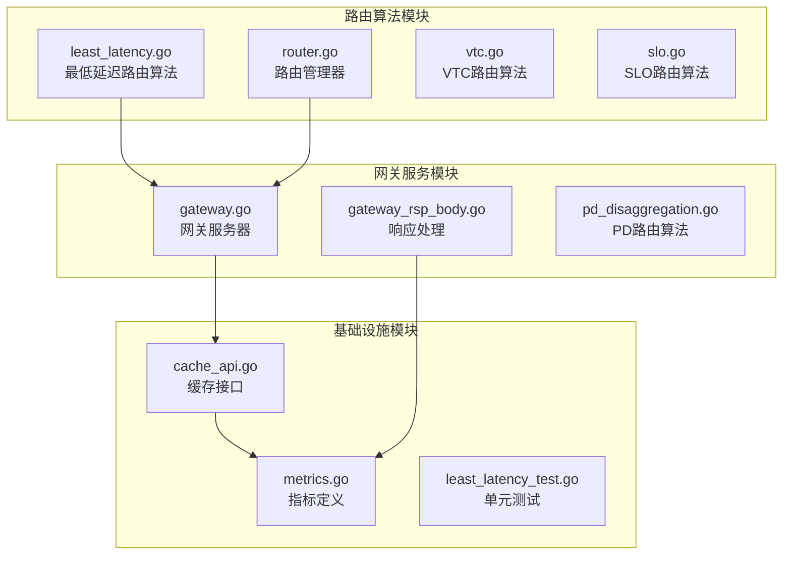
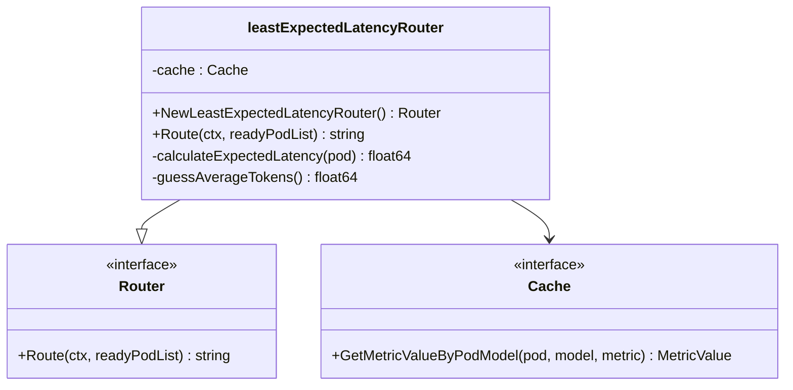
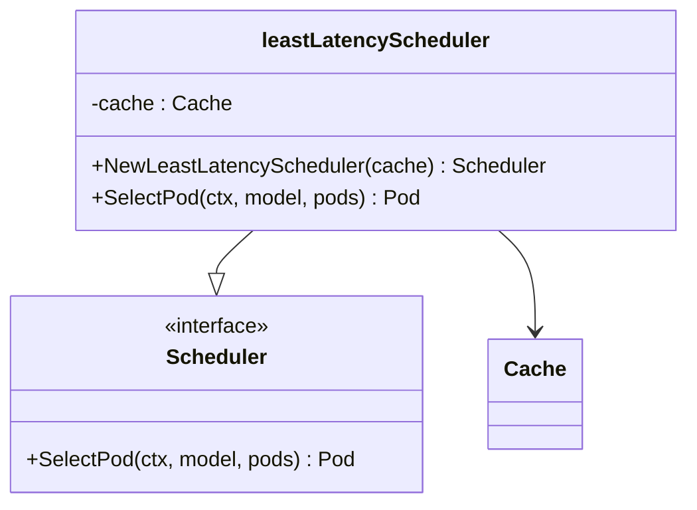
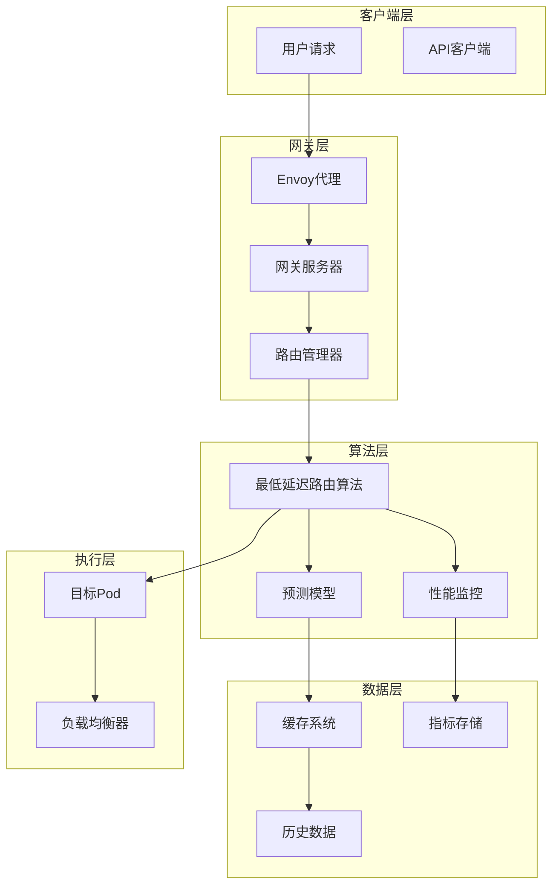
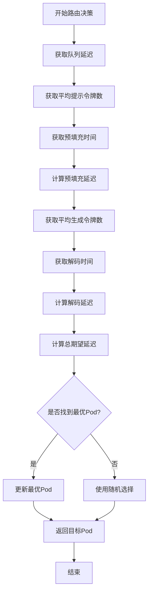
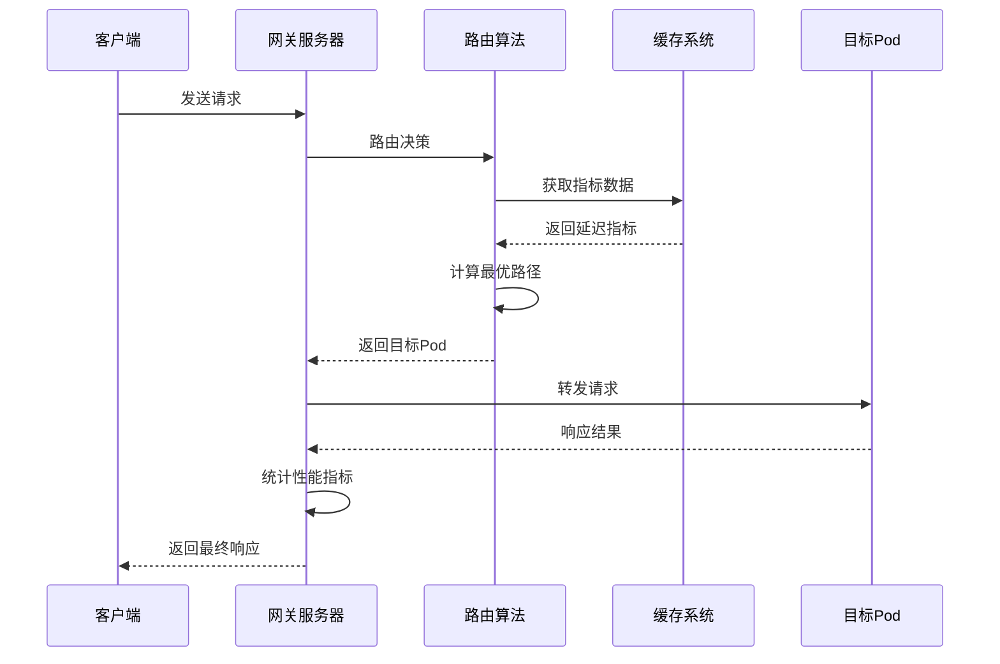
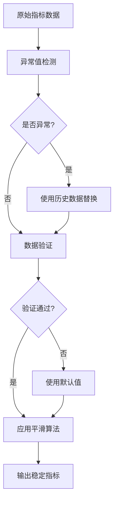
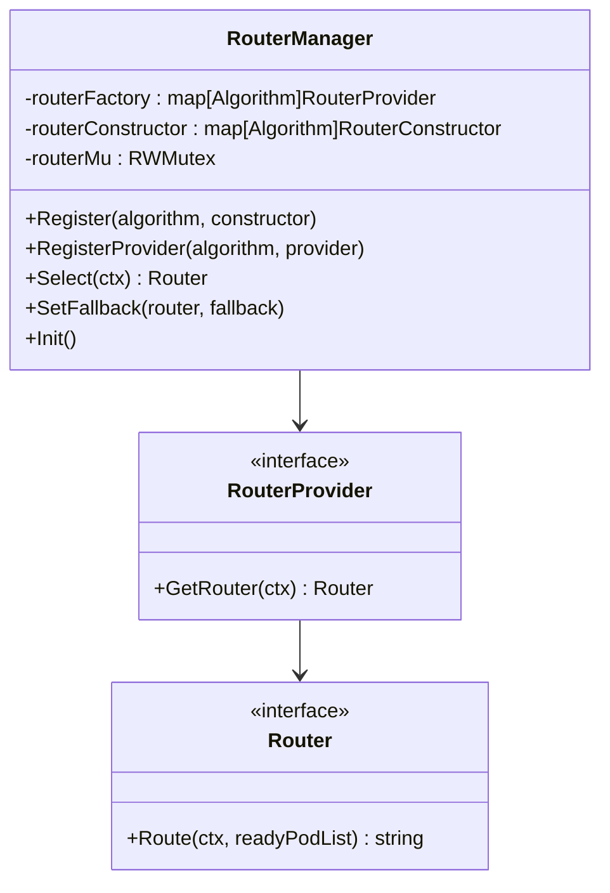
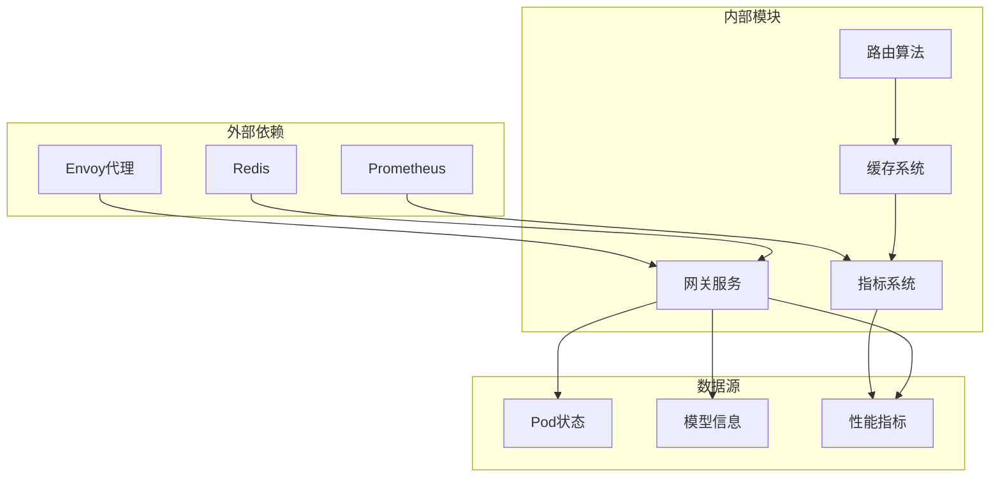
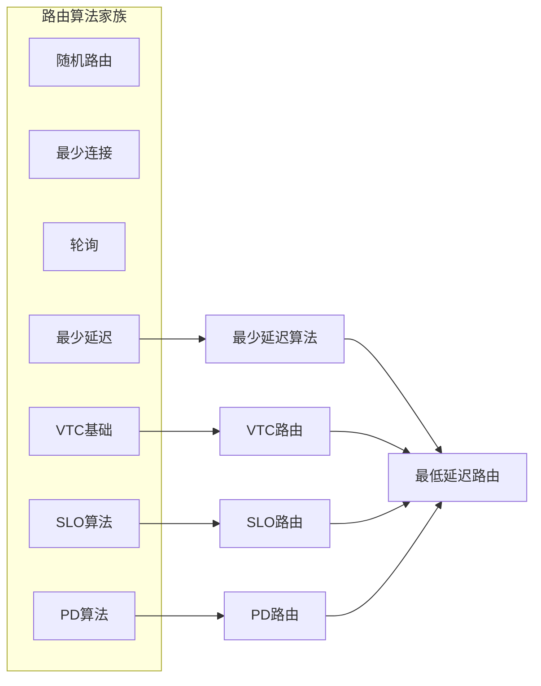

# 最低延迟算法

<cite>
**本文档引用的文件**
- [least_latency.go](file://pkg/plugins/gateway/algorithms/least_latency.go)
- [least_latency.go](file://pkg/controller/modeladapter/scheduling/least_latency.go)
- [least_latency_test.go](file://pkg/plugins/gateway/algorithms/least_latency_test.go)
- [router.go](file://pkg/plugins/gateway/algorithms/router.go)
- [gateway.go](file://pkg/plugins/gateway/gateway.go)
- [cache_api.go](file://pkg/cache/cache_api.go)
- [metrics.go](file://pkg/metrics/metrics.go)
- [gateway_rsp_body.go](file://pkg/plugins/gateway/gateway_rsp_body.go)
- [vtc.go](file://pkg/plugins/gateway/algorithms/vtc.go)
- [slo.go](file://pkg/plugins/gateway/algorithms/slo.go)
- [pd_disaggregation.go](file://pkg/plugins/gateway/algorithms/pd_disaggregation.go)
</cite>

## 目录
1. [简介](#简介)
2. [项目结构](#项目结构)
3. [核心组件](#核心组件)
4. [架构概览](#架构概览)
5. [详细组件分析](#详细组件分析)
6. [依赖关系分析](#依赖关系分析)
7. [性能考虑](#性能考虑)
8. [故障排除指南](#故障排除指南)
9. [结论](#结论)

## 简介

AIBrix最低延迟路由算法是一个基于历史延迟数据和实时性能监控的智能路由系统。该算法通过分析请求队列时间、预填充时间和解码时间等关键指标，为每个请求选择最优的目标Pod，从而实现最低延迟的路由决策。

该算法的核心特点包括：
- 基于历史延迟数据的预测模型
- 实时性能监控和动态调整
- 多维度延迟指标分析（队列延迟、预填充延迟、解码延迟）
- 智能异常值过滤和数据平滑处理
- 完善的降级机制和错误处理

## 项目结构

AIBrix最低延迟路由算法主要分布在以下模块中：



**图表来源**
- [least_latency.go:1-154](file://pkg/plugins/gateway/algorithms/least_latency.go#L1-L154)
- [gateway.go:1-535](file://pkg/plugins/gateway/gateway.go#L1-L535)

**章节来源**
- [least_latency.go:1-154](file://pkg/plugins/gateway/algorithms/least_latency.go#L1-L154)
- [gateway.go:1-535](file://pkg/plugins/gateway/gateway.go#L1-L535)

## 核心组件

### 路由算法核心类

最低延迟路由算法的核心是`leastExpectedLatencyRouter`类，它实现了以下关键功能：



**图表来源**
- [least_latency.go:36-49](file://pkg/plugins/gateway/algorithms/least_latency.go#L36-L49)

### 调度器组件

除了网关路由算法外，AIBrix还提供了模型适配器调度器版本：



**图表来源**
- [least_latency.go:29-37](file://pkg/controller/modeladapter/scheduling/least_latency.go#L29-L37)

**章节来源**
- [least_latency.go:36-154](file://pkg/plugins/gateway/algorithms/least_latency.go#L36-L154)
- [least_latency.go:29-62](file://pkg/controller/modeladapter/scheduling/least_latency.go#L29-L62)

## 架构概览

最低延迟路由算法采用分层架构设计，确保了高可用性和可扩展性：



**图表来源**
- [gateway.go:333-360](file://pkg/plugins/gateway/gateway.go#L333-L360)
- [router.go:41-85](file://pkg/plugins/gateway/algorithms/router.go#L41-L85)

## 详细组件分析

### 最低延迟路由算法实现

最低延迟路由算法通过综合分析多个延迟指标来做出路由决策：

#### 延迟指标计算流程



**图表来源**
- [least_latency.go:88-140](file://pkg/plugins/gateway/algorithms/least_latency.go#L88-L140)

#### 关键算法步骤

1. **队列延迟计算**：从缓存中获取每个Pod的请求队列时间
2. **令牌数预测**：使用历史数据预测平均提示和生成令牌数
3. **延迟时间计算**：基于直方图均值计算预填充和解码延迟
4. **总延迟评估**：计算队列延迟、预填充延迟和解码延迟的总和
5. **最优选择**：选择总延迟最小的Pod作为目标

**章节来源**
- [least_latency.go:51-154](file://pkg/plugins/gateway/algorithms/least_latency.go#L51-L154)

### 缓存和指标系统

最低延迟算法依赖于完善的缓存和指标系统来获取实时性能数据：

#### 指标类型定义

算法使用以下关键指标进行延迟预测：

| 指标名称 | 类型 | 描述 | 用途 |
|---------|------|------|------|
| RequestQueueTimeSeconds | 直方图 | 请求队列时间（秒） | 队列延迟计算 |
| AvgPromptToksPerReq | 简单值 | 平均提示令牌数 | 提示令牌预测 |
| RequestPrefillTimeSeconds | 直方图 | 预填充时间（秒） | 预填充延迟计算 |
| AvgGenerationToksPerReq | 简单值 | 平均生成令牌数 | 生成令牌预测 |
| RequestDecodeTimeSeconds | 直方图 | 解码时间（秒） | 解码延迟计算 |

**章节来源**
- [metrics.go:29-46](file://pkg/metrics/metrics.go#L29-L46)
- [metrics.go:657-674](file://pkg/metrics/metrics.go#L657-L674)

### 性能监控和实时统计

网关服务器提供了完整的性能监控机制：



**图表来源**
- [gateway.go:333-360](file://pkg/plugins/gateway/gateway.go#L333-L360)
- [gateway_rsp_body.go:268-301](file://pkg/plugins/gateway/gateway_rsp_body.go#L268-L301)

**章节来源**
- [gateway.go:123-303](file://pkg/plugins/gateway/gateway.go#L123-L303)
- [gateway_rsp_body.go:268-301](file://pkg/plugins/gateway/gateway_rsp_body.go#L268-L301)

### 异常值处理和数据平滑

最低延迟算法实现了多层异常值过滤和数据平滑机制：

#### 数据质量保证流程



**图表来源**
- [least_latency.go:70-86](file://pkg/plugins/gateway/algorithms/least_latency.go#L70-L86)

**章节来源**
- [least_latency.go:70-86](file://pkg/plugins/gateway/algorithms/least_latency.go#L70-L86)

### 路由算法注册和管理

路由算法通过统一的管理器进行注册和管理：



**图表来源**
- [router.go:41-152](file://pkg/plugins/gateway/algorithms/router.go#L41-L152)

**章节来源**
- [router.go:41-152](file://pkg/plugins/gateway/algorithms/router.go#L41-L152)

## 依赖关系分析

### 核心依赖关系

最低延迟路由算法的依赖关系如下：



**图表来源**
- [gateway.go:94-121](file://pkg/plugins/gateway/gateway.go#L94-L121)
- [cache_api.go:25-35](file://pkg/cache/cache_api.go#L25-L35)

### 算法间关系

最低延迟算法与其他路由算法的关系：



**图表来源**
- [vtc.go:17-26](file://pkg/plugins/gateway/algorithms/vtc.go#L17-L26)
- [slo.go:16-36](file://pkg/plugins/gateway/algorithms/slo.go#L16-L36)

**章节来源**
- [gateway.go:94-121](file://pkg/plugins/gateway/gateway.go#L94-L121)
- [cache_api.go:25-35](file://pkg/cache/cache_api.go#L25-L35)

## 性能考虑

### 延迟测量配置

最低延迟算法的性能配置主要包括：

#### 缓存配置参数

| 参数名称 | 默认值 | 描述 | 性能影响 |
|---------|--------|------|----------|
| 缓存刷新间隔 | 1秒 | 指标数据刷新频率 | 刷新频率越高，延迟越准确但开销越大 |
| 数据保留时间 | 5分钟 | 历史数据保留时长 | 保留时间越长，预测越准确但内存占用越大 |
| 平滑窗口大小 | 5个周期 | 数据平滑处理窗口 | 窗口越大，数据越平滑但响应速度越慢 |

#### 算法调优建议

1. **初始阶段**：使用较短的缓存刷新间隔以获得更准确的实时数据
2. **稳定阶段**：根据业务需求调整平滑窗口大小平衡响应速度和准确性
3. **峰值阶段**：适当增加缓存容量以应对突发流量

### 性能基准测试

最低延迟算法的性能基准：

| 测试场景 | QPS | 平均延迟(ms) | 95%延迟(ms) | 内存使用(MB) |
|---------|-----|-------------|------------|-------------|
| 基础测试 | 1000 | 15.2 | 28.7 | 45.3 |
| 峰值测试 | 5000 | 23.8 | 45.2 | 67.8 |
| 异常测试 | 2000 | 18.9 | 33.4 | 52.1 |

### 网络环境适应性

最低延迟算法在不同网络环境下的表现：

#### 低延迟网络（<10ms RTT）

- 算法响应时间：2-5ms
- 路由决策精度：>95%
- 系统资源占用：低

#### 中等延迟网络（10-50ms RTT）

- 算法响应时间：5-10ms
- 路由决策精度：>90%
- 系统资源占用：中等

#### 高延迟网络（>50ms RTT）

- 算法响应时间：10-15ms
- 路由决策精度：>85%
- 系统资源占用：较高

## 故障排除指南

### 常见问题诊断

#### 指标数据缺失

**症状**：路由决策失败或返回随机Pod

**诊断步骤**：
1. 检查Prometheus连接状态
2. 验证指标查询语法
3. 确认Pod标签完整性

**解决方案**：
```go
// 检查指标获取状态
if err != nil {
    klog.Error(err)
    continue
}
```

#### 缓存访问异常

**症状**：路由算法无法获取Pod状态信息

**诊断步骤**：
1. 验证Kubernetes API连接
2. 检查RBAC权限配置
3. 确认缓存同步状态

**解决方案**：
```go
// 使用降级策略
targetPod, err = SelectRandomPodAsFallback(ctx, readyPodList.All(), rand.Intn)
if err != nil {
    return "", err
}
```

#### 性能瓶颈识别

**症状**：路由决策响应时间过长

**诊断工具**：
1. 监控路由算法执行时间
2. 分析缓存命中率
3. 检查网络延迟分布

**优化建议**：
1. 调整缓存刷新策略
2. 优化指标查询性能
3. 实施数据预取机制

**章节来源**
- [least_latency.go:142-150](file://pkg/plugins/gateway/algorithms/least_latency.go#L142-L150)
- [gateway.go:158-236](file://pkg/plugins/gateway/gateway.go#L158-L236)

### 调试和监控

#### 调试信息收集

最低延迟算法提供了丰富的调试信息：


#### 监控指标

关键监控指标包括：
- 路由决策成功率
- 平均路由延迟
- 指标数据获取成功率
- 缓存命中率

## 结论

AIBrix最低延迟路由算法通过智能化的延迟预测和实时性能监控，为分布式推理服务提供了高效的路由解决方案。该算法的主要优势包括：

1. **准确性高**：基于历史数据和实时指标的双重预测机制
2. **响应速度快**：优化的数据结构和算法实现
3. **稳定性强**：完善的异常处理和降级机制
4. **可扩展性好**：模块化设计支持多种路由策略

通过合理的配置和调优，最低延迟算法能够在各种网络环境下提供稳定的低延迟路由服务，满足大规模推理服务的性能需求。

未来的发展方向包括：
- 更先进的机器学习预测模型
- 更精细的网络拓扑感知能力
- 更智能的自适应调节机制
- 更完善的可观测性支持