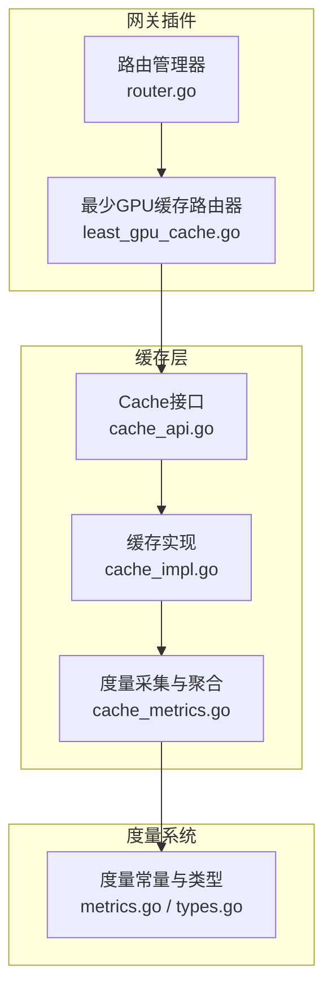
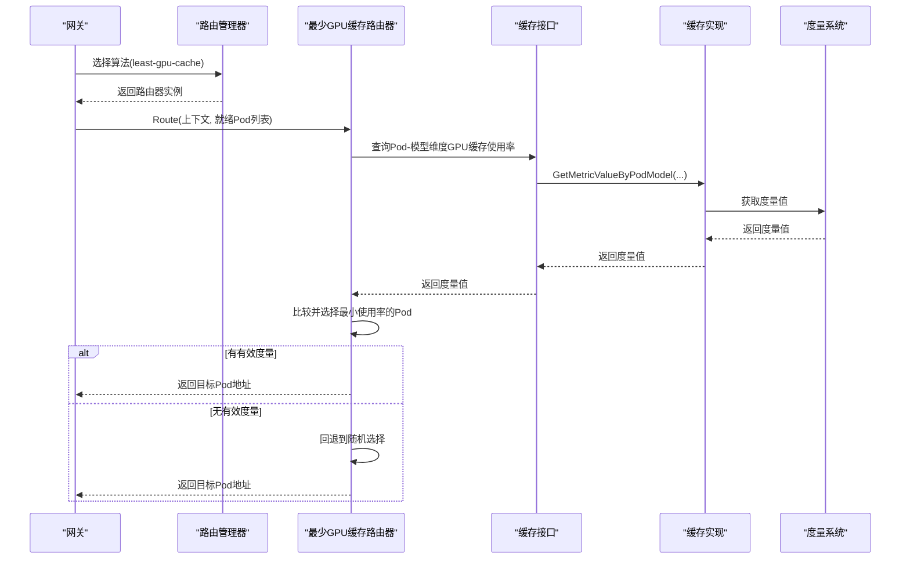
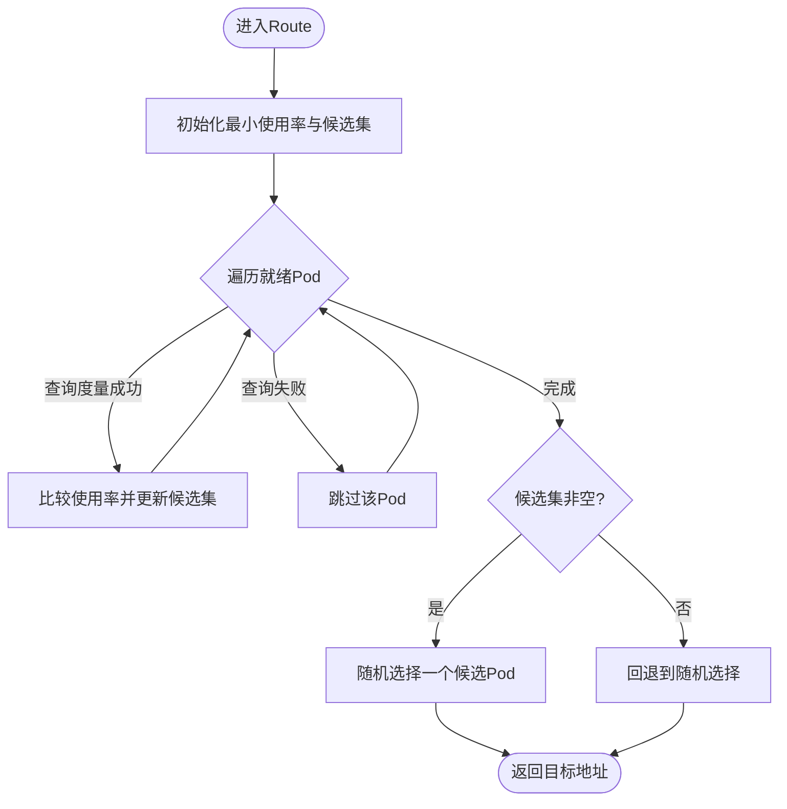
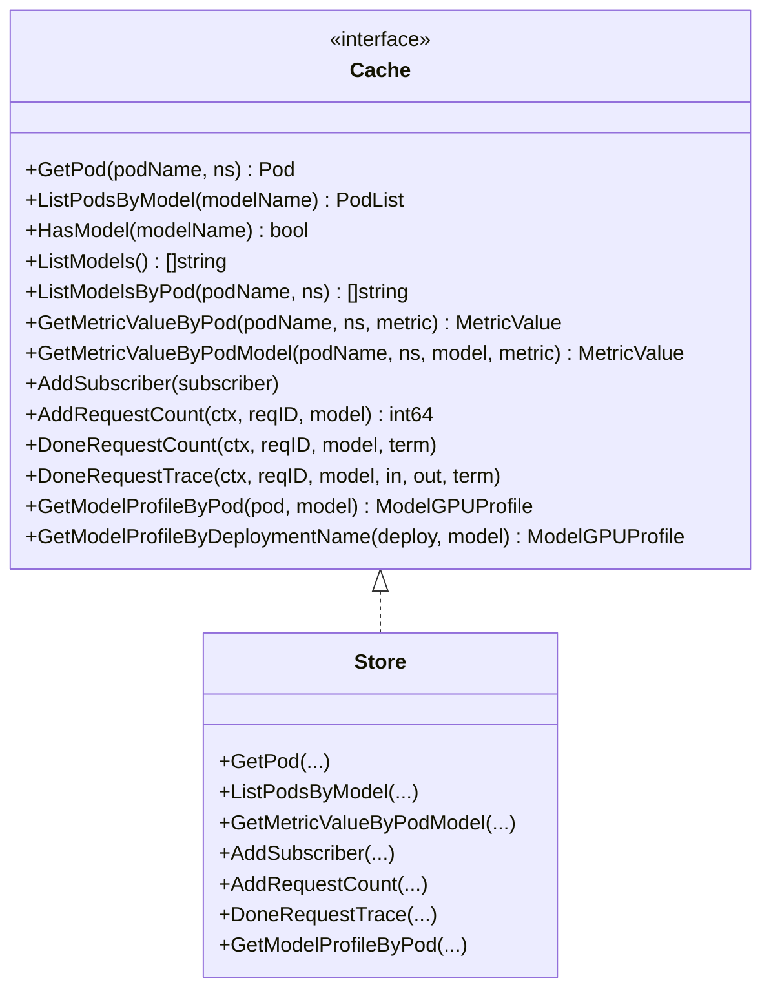
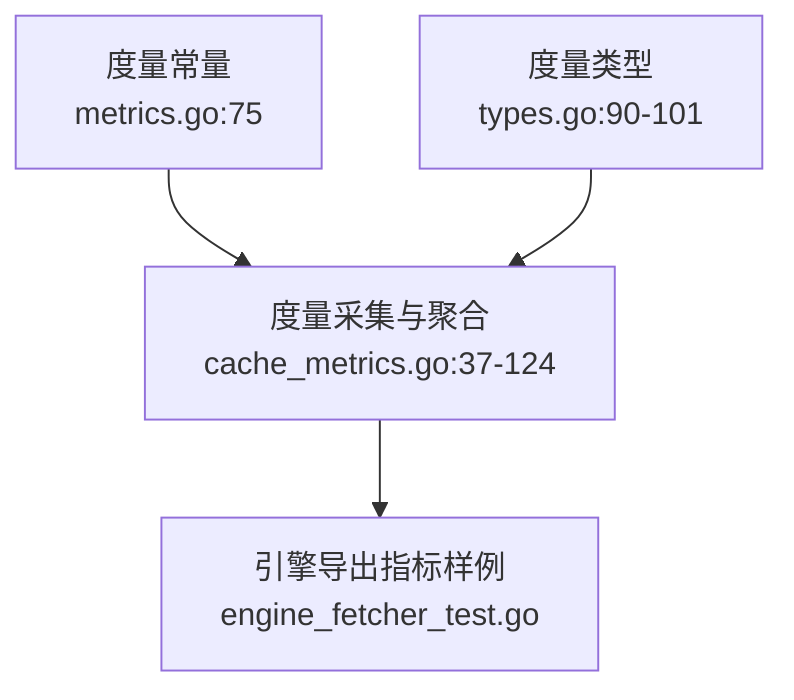
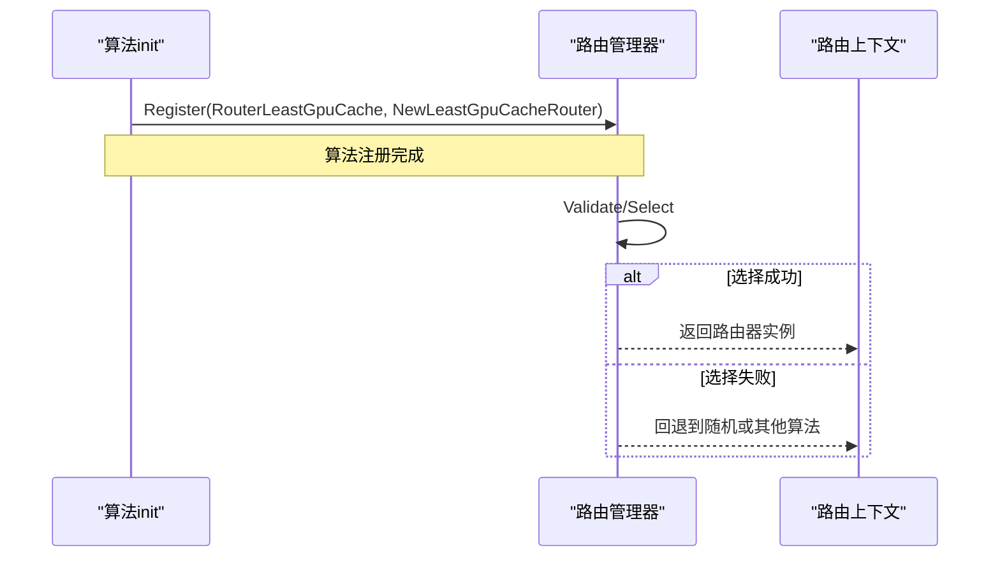
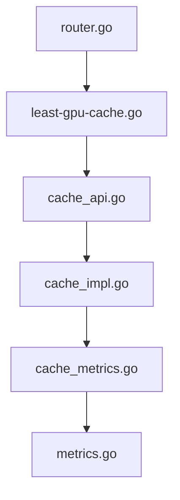

# 最少GPU缓存算法

<cite>
**本文引用的文件**   
- [least_gpu_cache.go](file://pkg/plugins/gateway/algorithms/least_gpu_cache.go)
- [least_gpu_cache_test.go](file://pkg/plugins/gateway/algorithms/least_gpu_cache_test.go)
- [cache_api.go](file://pkg/cache/cache_api.go)
- [cache_impl.go](file://pkg/cache/cache_impl.go)
- [cache_metrics.go](file://pkg/cache/cache_metrics.go)
- [metrics.go](file://pkg/metrics/metrics.go)
- [types.go](file://pkg/metrics/types.go)
- [router.go](file://pkg/plugins/gateway/algorithms/router.go)
- [model_gpu_profile.go](file://pkg/cache/model_gpu_profile.go)
- [engine_fetcher_test.go](file://pkg/metrics/engine_fetcher_test.go)
</cite>

## 目录
1. [引言](#引言)
2. [项目结构](#项目结构)
3. [核心组件](#核心组件)
4. [架构总览](#架构总览)
5. [详细组件分析](#详细组件分析)
6. [依赖分析](#依赖分析)
7. [性能考量](#性能考量)
8. [故障排查指南](#故障排查指南)
9. [结论](#结论)
10. [附录](#附录)

## 引言
本技术文档围绕 AIBrix 的“最少GPU缓存路由算法”（least-gpu-cache）展开，系统性解析其设计原理、实现细节与运行机制。该算法通过监测各推理引擎实例的 GPU 缓存使用率，选择剩余可用空间最大的实例进行请求转发，从而提升整体吞吐并降低缓存抖动风险。文档涵盖以下主题：
- GPU缓存使用情况监测与度量来源
- 内存占用计算与缓存效率评估
- 基于GPU缓存剩余空间与使用率的选择策略
- 缓存统计方法、内存压力判断与性能影响分析
- 不同硬件配置下的表现差异与调优建议
- 算法配置指南、监控指标说明与实际应用案例

## 项目结构
least-gpu-cache 路由器位于网关插件算法模块中，通过统一的路由管理器注册与调度；其运行依赖于缓存层对 Pod/模型/度量数据的聚合与查询能力。

图示来源
- [router.go:49-152](file://pkg/plugins/gateway/algorithms/router.go#L49-L152)
- [least_gpu_cache.go:31-100](file://pkg/plugins/gateway/algorithms/least_gpu_cache.go#L31-L100)
- [cache_api.go:25-170](file://pkg/cache/cache_api.go#L25-L170)
- [cache_impl.go:124-165](file://pkg/cache/cache_impl.go#L124-L165)
- [cache_metrics.go:37-124](file://pkg/cache/cache_metrics.go#L37-L124)
- [metrics.go:70-100](file://pkg/metrics/metrics.go#L70-L100)
- [types.go:90-101](file://pkg/metrics/types.go#L90-L101)

章节来源
- [router.go:49-152](file://pkg/plugins/gateway/algorithms/router.go#L49-L152)
- [least_gpu_cache.go:31-100](file://pkg/plugins/gateway/algorithms/least_gpu_cache.go#L31-L100)
- [cache_api.go:25-170](file://pkg/cache/cache_api.go#L25-L170)
- [cache_impl.go:124-165](file://pkg/cache/cache_impl.go#L124-L165)
- [cache_metrics.go:37-124](file://pkg/cache/cache_metrics.go#L37-L124)
- [metrics.go:70-100](file://pkg/metrics/metrics.go#L70-L100)
- [types.go:90-101](file://pkg/metrics/types.go#L90-L101)

## 核心组件
- 路由器注册与管理
  - least-gpu-cache 在初始化时向路由管理器注册，名称常量标识为“least-gpu-cache”，随后可被网关按策略选择。
- 缓存接口与实现
  - Cache 接口抽象了 Pod、模型、度量、请求追踪与模型画像等能力；具体实现负责从缓存中获取 Pod 模型维度的度量值。
- 度量系统
  - 定义了 GPU 缓存使用率等关键指标，并提供度量值抽象类型，支持简单值与直方图等多形态。
- 算法主体
  - 遍历候选 Pod，查询每个 Pod-模型 维度的 GPU 缓存使用率，选择使用率最小（即剩余空间最大）的 Pod；若无有效度量，则回退到随机选择。

章节来源
- [least_gpu_cache.go:31-100](file://pkg/plugins/gateway/algorithms/least_gpu_cache.go#L31-L100)
- [cache_api.go:25-170](file://pkg/cache/cache_api.go#L25-L170)
- [cache_impl.go:124-165](file://pkg/cache/cache_impl.go#L124-L165)
- [metrics.go:70-100](file://pkg/metrics/metrics.go#L70-L100)
- [types.go:90-101](file://pkg/metrics/types.go#L90-L101)

## 架构总览
下图展示 least-gpu-cache 路由流程：网关根据上下文选择路由器，路由器从缓存层查询 Pod-模型 维度的 GPU 缓存使用率，比较后选择最优目标 Pod 并返回地址。

图示来源
- [router.go:73-85](file://pkg/plugins/gateway/algorithms/router.go#L73-L85)
- [least_gpu_cache.go:52-99](file://pkg/plugins/gateway/algorithms/least_gpu_cache.go#L52-L99)
- [cache_api.go:82-109](file://pkg/cache/cache_api.go#L82-L109)
- [cache_impl.go:145-165](file://pkg/cache/cache_impl.go#L145-L165)
- [metrics.go:70-100](file://pkg/metrics/metrics.go#L70-L100)

## 详细组件分析

### least-gpu-cache 路由器
- 设计要点
  - 使用 GPU 缓存使用率作为排序依据，数值越小代表剩余空间越大，更有利于后续生成。
  - 对候选 Pod 进行一次遍历，维护当前最小使用率与候选集合；相同时机随机选择一个以避免偏置。
  - 当无法获取有效度量时，触发回退逻辑，随机选择一个就绪 Pod，保证可用性。
- 关键路径
  - 查询度量：GetMetricValueByPodModel(podName, podNamespace, modelName, “gpu_cache_usage_perc”)
  - 选择策略：min(cache_usage_perc)
  - 回退策略：SelectRandomPodAsFallback(...)
- 日志与可观测性
  - 记录每次候选 Pod 的使用率与最终选择结果，便于排障与审计。

图示来源
- [least_gpu_cache.go:52-99](file://pkg/plugins/gateway/algorithms/least_gpu_cache.go#L52-L99)

章节来源
- [least_gpu_cache.go:52-99](file://pkg/plugins/gateway/algorithms/least_gpu_cache.go#L52-L99)
- [least_gpu_cache_test.go:31-145](file://pkg/plugins/gateway/algorithms/least_gpu_cache_test.go#L31-L145)

### 缓存接口与实现
- Cache 接口职责
  - 提供 Pod/模型/度量/请求追踪/画像等统一访问能力，路由算法通过该接口查询 Pod-模型 维度的度量值。
- 实现细节
  - GetMetricValueByPodModel 支持按 Pod 与模型组合查询特定度量；内部通过键值映射定位度量并返回抽象值。
  - 支持订阅度量变更，驱动缓存聚合与更新。
- 性能与可靠性
  - 采用并发安全的数据结构与原子操作，保障高并发场景下的稳定性。
  - 提供模型画像缓存能力，减少重复计算与外部依赖。

图示来源
- [cache_api.go:25-170](file://pkg/cache/cache_api.go#L25-L170)
- [cache_impl.go:30-200](file://pkg/cache/cache_impl.go#L30-L200)

章节来源
- [cache_api.go:25-170](file://pkg/cache/cache_api.go#L25-L170)
- [cache_impl.go:124-165](file://pkg/cache/cache_impl.go#L124-L165)
- [cache_impl.go:167-200](file://pkg/cache/cache_impl.go#L167-L200)
- [cache_impl.go:288-323](file://pkg/cache/cache_impl.go#L288-L323)

### 度量系统与GPU缓存使用率
- 指标定义
  - GPUCacheUsagePerc：GPU KV-cache 使用率，1.0 表示 100% 使用。
- 类型与抽象
  - SimpleMetricValue：用于表示简单度量（如使用率）。
  - HistogramMetricValue：用于直方图类度量（如延迟分布）。
- 来源与采集
  - 通过缓存层的度量采集器定期拉取或订阅度量，支持 Prometheus 与 Pod 原生指标两种来源。
- 测试验证
  - 引擎侧导出样例指标，验证度量采集与解析链路。

图示来源
- [metrics.go:70-100](file://pkg/metrics/metrics.go#L70-L100)
- [types.go:90-101](file://pkg/metrics/types.go#L90-L101)
- [cache_metrics.go:37-124](file://pkg/cache/cache_metrics.go#L37-L124)
- [engine_fetcher_test.go:38-40](file://pkg/metrics/engine_fetcher_test.go#L38-L40)

章节来源
- [metrics.go:70-100](file://pkg/metrics/metrics.go#L70-L100)
- [types.go:90-101](file://pkg/metrics/types.go#L90-L101)
- [cache_metrics.go:37-124](file://pkg/cache/cache_metrics.go#L37-L124)
- [engine_fetcher_test.go:38-40](file://pkg/metrics/engine_fetcher_test.go#L38-L40)

### 路由管理器与算法注册
- 注册机制
  - least-gpu-cache 在 init 中注册到路由工厂，名称为 RouterLeastGpuCache。
  - 路由管理器负责算法校验、选择与回退设置。
- 回退策略
  - 若目标算法不可用，可回退到指定算法（例如随机），确保系统稳定。

图示来源
- [least_gpu_cache.go:31-35](file://pkg/plugins/gateway/algorithms/least_gpu_cache.go#L31-L35)
- [router.go:57-85](file://pkg/plugins/gateway/algorithms/router.go#L57-L85)
- [router.go:115-139](file://pkg/plugins/gateway/algorithms/router.go#L115-L139)

章节来源
- [least_gpu_cache.go:31-35](file://pkg/plugins/gateway/algorithms/least_gpu_cache.go#L31-L35)
- [router.go:57-85](file://pkg/plugins/gateway/algorithms/router.go#L57-L85)
- [router.go:115-139](file://pkg/plugins/gateway/algorithms/router.go#L115-L139)

## 依赖分析
- 组件耦合
  - least-gpu-cache 路由器仅依赖 Cache 接口与度量常量，耦合度低，便于替换与扩展。
  - 路由管理器集中管理算法注册与回退，避免路由算法直接感知环境差异。
- 外部依赖
  - Prometheus 与引擎原生指标作为度量来源，缓存层负责聚合与查询。
- 循环依赖
  - 未发现循环依赖迹象；算法、缓存与度量分层清晰。

图示来源
- [least_gpu_cache.go:31-100](file://pkg/plugins/gateway/algorithms/least_gpu_cache.go#L31-L100)
- [cache_api.go:25-170](file://pkg/cache/cache_api.go#L25-L170)
- [cache_impl.go:124-165](file://pkg/cache/cache_impl.go#L124-L165)
- [cache_metrics.go:37-124](file://pkg/cache/cache_metrics.go#L37-L124)
- [metrics.go:70-100](file://pkg/metrics/metrics.go#L70-L100)
- [router.go:49-152](file://pkg/plugins/gateway/algorithms/router.go#L49-L152)

章节来源
- [least_gpu_cache.go:31-100](file://pkg/plugins/gateway/algorithms/least_gpu_cache.go#L31-L100)
- [cache_api.go:25-170](file://pkg/cache/cache_api.go#L25-L170)
- [cache_impl.go:124-165](file://pkg/cache/cache_impl.go#L124-L165)
- [cache_metrics.go:37-124](file://pkg/cache/cache_metrics.go#L37-L124)
- [metrics.go:70-100](file://pkg/metrics/metrics.go#L70-L100)
- [router.go:49-152](file://pkg/plugins/gateway/algorithms/router.go#L49-L152)

## 性能考量
- 选择策略的复杂度
  - 单次遍历候选 Pod 列表，时间复杂度 O(n)，空间复杂度 O(k)（k 为相同最小值的候选数），开销极低。
- 度量查询与缓存
  - 通过缓存接口查询度量，避免重复拉取；度量聚合器支持批量与异步更新，降低对下游系统的压力。
- 内存压力与碎片
  - 该算法不直接操作显存分配，但可通过“剩余空间更大”的隐含策略降低频繁换出/重算的概率，间接缓解碎片化带来的抖动。
- 算法适用性
  - 在 GPU 显存充足且模型尺寸适配良好时，效果显著；当显存普遍紧张时，需结合其他策略（如按吞吐/延迟评分）综合评估。

## 故障排查指南
- 常见问题
  - 无就绪 Pod：返回错误提示“没有可转发的Pod”。
  - 度量缺失：日志记录查询错误，触发回退到随机选择。
  - 使用率异常：检查度量采集是否正常，确认引擎导出指标与标签一致。
- 排查步骤
  - 确认路由算法已正确注册并启用。
  - 检查缓存层是否能返回 Pod-模型 维度的度量值。
  - 查看日志中关于候选 Pod 使用率与最终选择的记录。
  - 如出现持续回退，核对度量来源与网络连通性。

章节来源
- [least_gpu_cache.go:58-62](file://pkg/plugins/gateway/algorithms/least_gpu_cache.go#L58-L62)
- [least_gpu_cache.go:80-94](file://pkg/plugins/gateway/algorithms/least_gpu_cache.go#L80-L94)
- [cache_impl.go:145-165](file://pkg/cache/cache_impl.go#L145-L165)

## 结论
least-gpu-cache 算法以 GPU 缓存使用率为单一决策依据，实现简单、开销低、易于部署。它通过优先选择“剩余空间更大”的实例，有助于维持稳定的吞吐与较低的抖动。在实际生产中，建议结合其他指标（如吞吐、延迟、排队长度）进行综合评估，并根据硬件配置与模型规模调整阈值与回退策略，以获得更优的整体性能。

## 附录

### 算法配置指南
- 启用与选择
  - 在网关配置中选择算法名为“least-gpu-cache”，路由管理器会自动加载并注册。
- 回退策略
  - 可设置回退算法（如随机），在网络波动或度量缺失时保障可用性。
- 环境变量与参数
  - 度量刷新间隔、Prometheus 查询间隔与超时等参数可通过环境变量配置，以平衡实时性与资源消耗。

章节来源
- [router.go:73-85](file://pkg/plugins/gateway/algorithms/router.go#L73-L85)
- [router.go:115-139](file://pkg/plugins/gateway/algorithms/router.go#L115-L139)
- [cache_metrics.go:121-124](file://pkg/cache/cache_metrics.go#L121-L124)

### 监控指标说明
- 关键指标
  - gpu_cache_usage_perc：GPU KV-cache 使用率，数值越小越好。
  - realtime_num_requests_running：实时运行中的请求数，辅助判断负载。
  - avg_generation_throughput_toks_per_s：平均生成吞吐（tokens/s），用于评估性能。
- 指标来源
  - 引擎导出与 Prometheus 抓取，经缓存层聚合后供路由算法使用。

章节来源
- [metrics.go:70-100](file://pkg/metrics/metrics.go#L70-L100)
- [engine_fetcher_test.go:38-40](file://pkg/metrics/engine_fetcher_test.go#L38-L40)

### 实际应用场景与使用案例
- 场景一：多实例推理池
  - 在同一模型的多个 Pod 之间进行动态分流，优先选择缓存剩余空间更大的实例，降低因缓存不足导致的重算概率。
- 场景二：混合硬件配置
  - 在不同 GPU 型号与显存容量的实例间，通过使用率对比实现更均衡的负载分配。
- 场景三：突发流量
  - 当流量突增时，算法倾向于选择使用率更低的实例，避免热点实例过载，提高整体稳定性。

章节来源
- [least_gpu_cache_test.go:31-145](file://pkg/plugins/gateway/algorithms/least_gpu_cache_test.go#L31-L145)