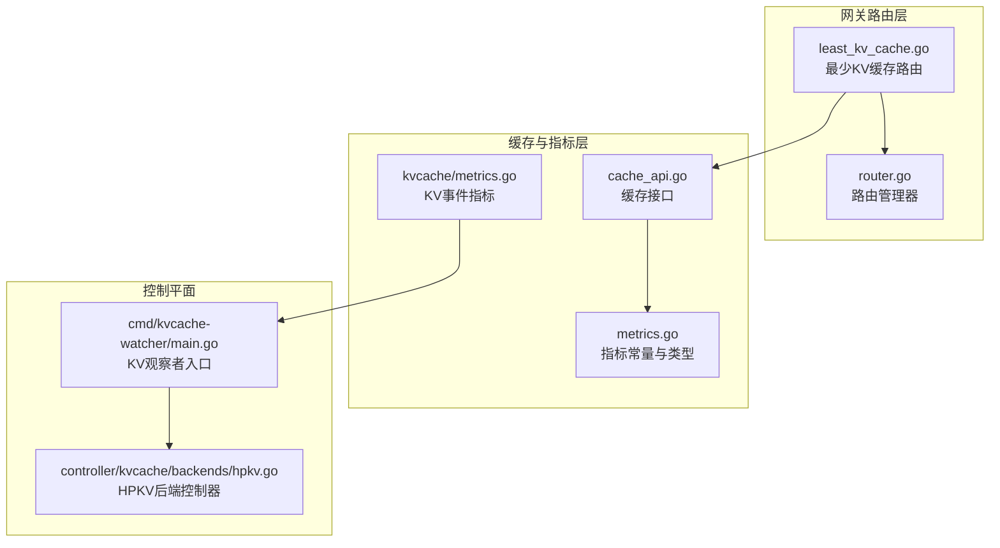
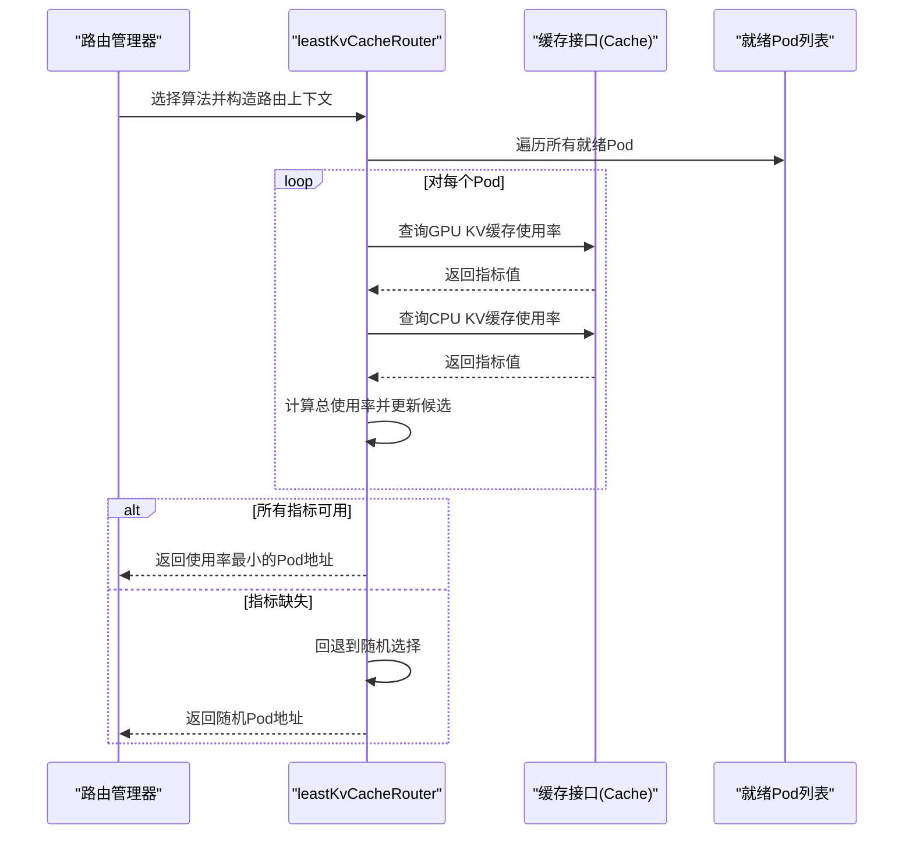
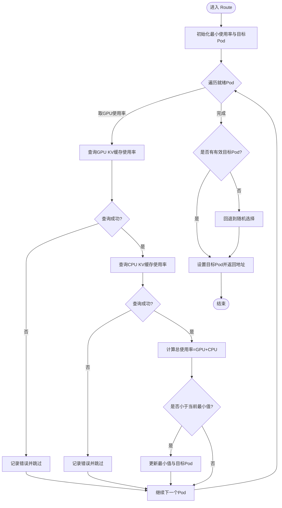
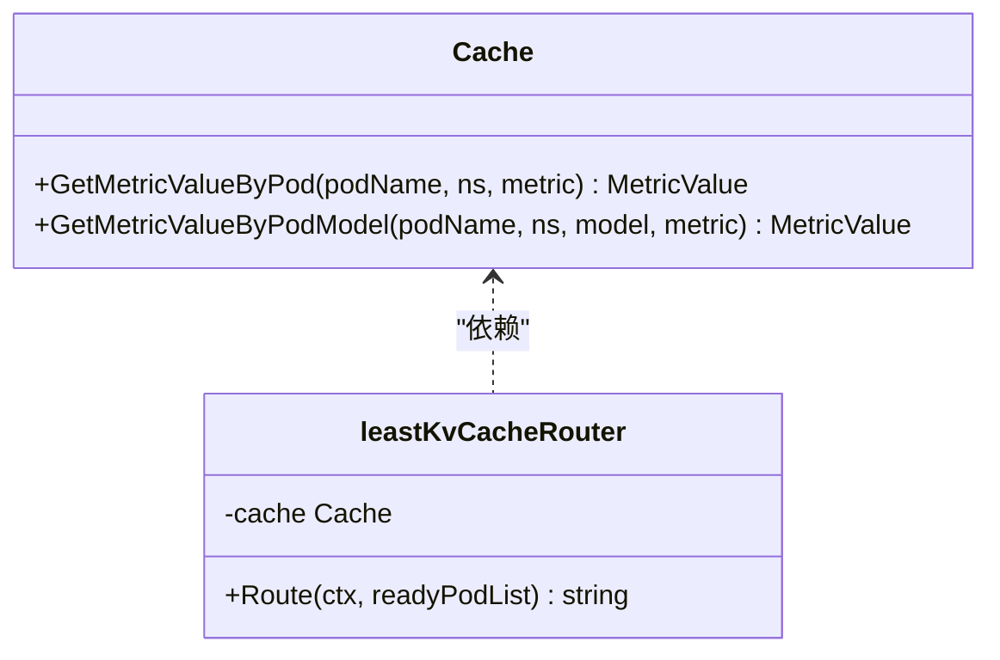
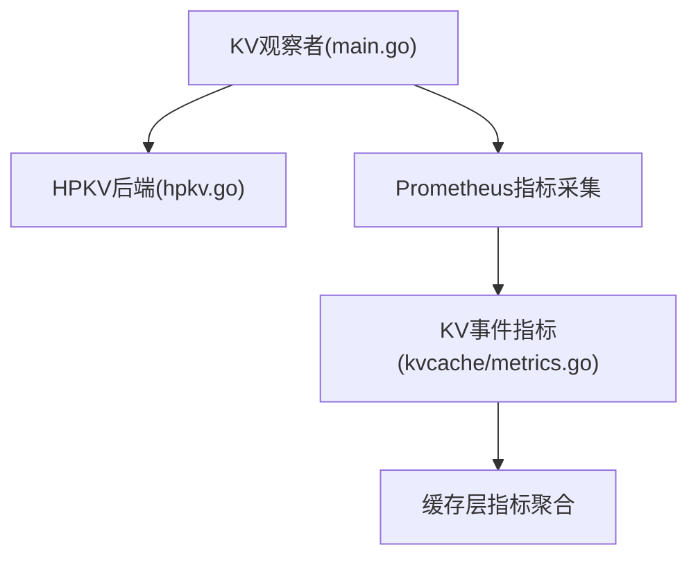
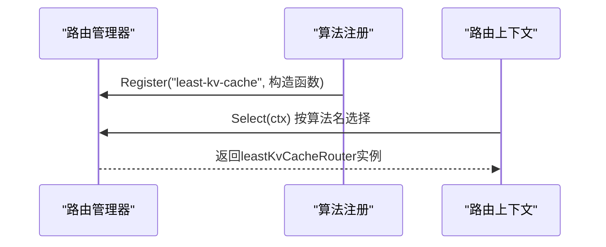
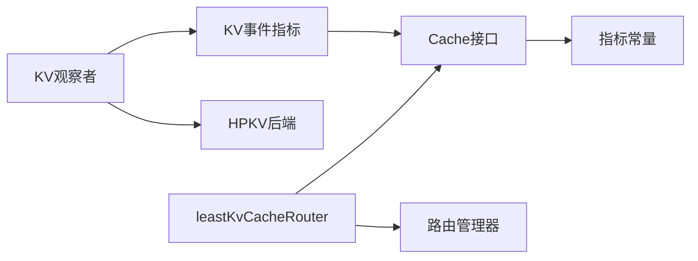

# 最少KV缓存算法

<cite>
**本文引用的文件**
- [least_kv_cache.go](file://pkg/plugins/gateway/algorithms/least_kv_cache.go)
- [metrics.go](file://pkg/metrics/metrics.go)
- [cache_api.go](file://pkg/cache/cache_api.go)
- [router.go](file://pkg/plugins/gateway/algorithms/router.go)
- [metrics.go](file://pkg/cache/kvcache/metrics.go)
- [hpkv.go](file://pkg/controller/kvcache/backends/hpkv.go)
- [main.go](file://cmd/kvcache-watcher/main.go)
</cite>

## 目录
1. [简介](#简介)
2. [项目结构](#项目结构)
3. [核心组件](#核心组件)
4. [架构总览](#架构总览)
5. [详细组件分析](#详细组件分析)
6. [依赖关系分析](#依赖关系分析)
7. [性能考量](#性能考量)
8. [故障排查指南](#故障排查指南)
9. [结论](#结论)
10. [附录](#附录)

## 简介
本技术文档围绕AIBrix中“最少KV缓存路由算法”（least-kv-cache）展开，系统性解析其核心机制与实现细节，包括：
- KV缓存容量监控与使用率统计
- 缓存命中率与内存使用评估
- 基于各模型实例KV缓存使用情况的智能路由决策
- 与AIBrix缓存系统的集成方式、缓存一致性保障与性能优化策略
- 调优参数、监控配置与故障诊断方法
- 实际部署案例与性能基准测试参考路径

该算法通过拉取每个就绪Pod的GPU与CPU KV缓存使用百分比，计算二者之和并选择使用率最小的实例进行请求转发；当无法获取有效指标时，回退到随机选择策略，确保系统鲁棒性。

## 项目结构
least-kv-cache算法位于网关插件路由算法模块中，依赖AIBrix缓存层提供的指标查询能力，并与路由管理器协同工作。整体涉及以下关键目录与文件：
- 网关路由算法：pkg/plugins/gateway/algorithms/least_kv_cache.go
- 指标常量定义：pkg/metrics/metrics.go
- 缓存接口定义：pkg/cache/cache_api.go
- 路由管理器：pkg/plugins/gateway/algorithms/router.go
- KV事件同步指标：pkg/cache/kvcache/metrics.go
- HPKV后端控制器：pkg/controller/kvcache/backends/hpkv.go
- KV缓存观察者入口：cmd/kvcache-watcher/main.go

**图表来源**
- [least_kv_cache.go:52-97](file://pkg/plugins/gateway/algorithms/least_kv_cache.go#L52-L97)
- [router.go:73-84](file://pkg/plugins/gateway/algorithms/router.go#L73-L84)
- [cache_api.go:82-109](file://pkg/cache/cache_api.go#L82-L109)
- [metrics.go:52-53](file://pkg/metrics/metrics.go#L52-L53)
- [metrics.go:96-214](file://pkg/cache/kvcache/metrics.go#L96-L214)
- [hpkv.go:139-186](file://pkg/controller/kvcache/backends/hpkv.go#L139-L186)
- [main.go:93-142](file://cmd/kvcache-watcher/main.go#L93-L142)

**章节来源**
- [least_kv_cache.go:52-97](file://pkg/plugins/gateway/algorithms/least_kv_cache.go#L52-L97)
- [router.go:73-84](file://pkg/plugins/gateway/algorithms/router.go#L73-L84)

## 核心组件
- leastKvCacheRouter：实现“最少KV缓存”路由策略，负责从就绪Pod列表中选择KV缓存使用率最低的目标实例。
- Cache接口：提供按Pod与模型维度查询指标值的能力，是算法获取GPU/CPU KV缓存使用率的基础。
- 指标常量：KVCacheUsagePerc、CPUCacheUsagePerc等，用于定位具体指标名称。
- 路由管理器：负责算法注册、选择与回退策略配置。
- KV事件指标：提供ZMQ连接、事件处理、重放与错误等指标，支撑缓存一致性与可观测性。
- HPKV后端控制器与KV观察者：负责在集群中部署KV缓存观察者Pod，暴露Prometheus指标，供缓存层聚合与查询。

**章节来源**
- [least_kv_cache.go:37-50](file://pkg/plugins/gateway/algorithms/least_kv_cache.go#L37-L50)
- [cache_api.go:82-109](file://pkg/cache/cache_api.go#L82-L109)
- [metrics.go:52-53](file://pkg/metrics/metrics.go#L52-L53)
- [router.go:101-103](file://pkg/plugins/gateway/algorithms/router.go#L101-L103)
- [metrics.go:96-214](file://pkg/cache/kvcache/metrics.go#L96-L214)
- [hpkv.go:139-186](file://pkg/controller/kvcache/backends/hpkv.go#L139-L186)
- [main.go:93-142](file://cmd/kvcache-watcher/main.go#L93-L142)

## 架构总览
least-kv-cache路由算法的工作流如下：
1. 路由管理器根据上下文算法选择least-kv-cache路由器。
2. 路由器遍历就绪Pod列表，对每个Pod分别查询GPU与CPU KV缓存使用率指标。
3. 将两个指标相加得到总使用率，选择最小者作为目标实例。
4. 若所有指标均不可用，则回退到随机选择策略。
5. 路由结果写入上下文，返回目标地址。

**图表来源**
- [router.go:73-84](file://pkg/plugins/gateway/algorithms/router.go#L73-L84)
- [least_kv_cache.go:52-97](file://pkg/plugins/gateway/algorithms/least_kv_cache.go#L52-L97)
- [cache_api.go:93-103](file://pkg/cache/cache_api.go#L93-L103)

## 详细组件分析

### leastKvCacheRouter 组件
- 角色与职责
  - 通过Cache接口按Pod与模型维度查询GPU与CPU KV缓存使用率。
  - 计算总使用率并选择最小者；若均不可用则回退到随机选择。
- 关键流程
  - 初始化：从全局缓存获取实例。
  - 路由：遍历就绪Pod，累计GPU与CPU使用率，记录最小值与对应Pod。
  - 回退：当无有效指标时，随机选择一个可路由Pod。
  - 输出：设置目标Pod并返回目标地址。

**图表来源**
- [least_kv_cache.go:52-97](file://pkg/plugins/gateway/algorithms/least_kv_cache.go#L52-L97)

**章节来源**
- [least_kv_cache.go:37-50](file://pkg/plugins/gateway/algorithms/least_kv_cache.go#L37-L50)
- [least_kv_cache.go:52-97](file://pkg/plugins/gateway/algorithms/least_kv_cache.go#L52-L97)

### 缓存统计接口与使用率计算
- 接口能力
  - 支持按Pod与模型维度查询指标值，包括GPU与CPU KV缓存使用率。
- 使用率计算
  - 总使用率 = GPU KV缓存使用率 + CPU KV缓存使用率。
  - 选择最小总使用率对应的Pod作为目标实例。
- 容量监控与预警
  - 通过持续查询使用率，可在上层策略中结合阈值实现容量预警与调度动作。

**图表来源**
- [cache_api.go:82-109](file://pkg/cache/cache_api.go#L82-L109)
- [least_kv_cache.go:37-50](file://pkg/plugins/gateway/algorithms/least_kv_cache.go#L37-L50)

**章节来源**
- [cache_api.go:82-109](file://pkg/cache/cache_api.go#L82-L109)
- [metrics.go:52-53](file://pkg/metrics/metrics.go#L52-L53)

### 缓存一致性与KV事件指标
- KV事件指标
  - 提供ZMQ连接、事件接收/处理、重放请求/成功/失败、错误计数与连接状态等指标。
  - 通过Prometheus采集，辅助判断缓存事件同步健康状况。
- KV观察者与HPKV后端
  - KV观察者以Pod形式运行，暴露指标端口，HPKV后端控制器负责生成该Pod的部署参数与资源声明。
  - 通过一致哈希槽位与虚拟节点参数，支持分布式缓存拓扑管理。

**图表来源**
- [main.go:93-142](file://cmd/kvcache-watcher/main.go#L93-L142)
- [hpkv.go:139-186](file://pkg/controller/kvcache/backends/hpkv.go#L139-L186)
- [metrics.go:96-214](file://pkg/cache/kvcache/metrics.go#L96-L214)

**章节来源**
- [metrics.go:96-214](file://pkg/cache/kvcache/metrics.go#L96-L214)
- [hpkv.go:139-186](file://pkg/controller/kvcache/backends/hpkv.go#L139-L186)
- [main.go:93-142](file://cmd/kvcache-watcher/main.go#L93-L142)

### 路由管理器与算法注册
- 注册与选择
  - least-kv-cache算法在初始化时注册到路由管理器。
  - 路由管理器根据上下文算法选择对应路由器实例。
- 回退机制
  - 可配置回退算法（如随机），当目标算法不可用或异常时启用。

**图表来源**
- [router.go:33-35](file://pkg/plugins/gateway/algorithms/router.go#L33-L35)
- [router.go:73-84](file://pkg/plugins/gateway/algorithms/router.go#L73-L84)
- [router.go:101-103](file://pkg/plugins/gateway/algorithms/router.go#L101-L103)

**章节来源**
- [router.go:33-35](file://pkg/plugins/gateway/algorithms/router.go#L33-L35)
- [router.go:73-84](file://pkg/plugins/gateway/algorithms/router.go#L73-L84)
- [router.go:101-103](file://pkg/plugins/gateway/algorithms/router.go#L101-L103)

## 依赖关系分析
- leastKvCacheRouter依赖Cache接口进行指标查询。
- Cache接口定义了按Pod与模型维度查询指标的方法，是算法实现的契约。
- 指标常量KVCacheUsagePerc、CPUCacheUsagePerc用于定位具体指标名称。
- 路由管理器负责算法注册与实例化，确保算法可插拔与可扩展。
- KV事件指标与HPKV后端控制器共同保障缓存事件同步与可观测性。

**图表来源**
- [least_kv_cache.go:24-28](file://pkg/plugins/gateway/algorithms/least_kv_cache.go#L24-L28)
- [cache_api.go:82-109](file://pkg/cache/cache_api.go#L82-L109)
- [metrics.go:52-53](file://pkg/metrics/metrics.go#L52-L53)
- [router.go:73-84](file://pkg/plugins/gateway/algorithms/router.go#L73-L84)
- [metrics.go:96-214](file://pkg/cache/kvcache/metrics.go#L96-L214)
- [hpkv.go:139-186](file://pkg/controller/kvcache/backends/hpkv.go#L139-L186)
- [main.go:93-142](file://cmd/kvcache-watcher/main.go#L93-L142)

**章节来源**
- [least_kv_cache.go:24-28](file://pkg/plugins/gateway/algorithms/least_kv_cache.go#L24-L28)
- [cache_api.go:82-109](file://pkg/cache/cache_api.go#L82-L109)
- [metrics.go:52-53](file://pkg/metrics/metrics.go#L52-L53)
- [router.go:73-84](file://pkg/plugins/gateway/algorithms/router.go#L73-L84)
- [metrics.go:96-214](file://pkg/cache/kvcache/metrics.go#L96-L214)
- [hpkv.go:139-186](file://pkg/controller/kvcache/backends/hpkv.go#L139-L186)
- [main.go:93-142](file://cmd/kvcache-watcher/main.go#L93-L142)

## 性能考量
- 指标查询开销
  - 在每次路由决策时对每个就绪Pod执行两次指标查询，复杂度O(N)。
  - 建议在高并发场景下结合缓存层指标聚合与批量查询能力，降低查询压力。
- 使用率计算与比较
  - 仅进行简单的加法与比较操作，开销极低。
- 回退策略
  - 当指标缺失时采用随机回退，避免因单点指标异常导致路由失败。
- 缓存事件同步
  - 通过KV事件指标观测ZMQ连接状态、事件处理耗时与重放成功率，有助于识别缓存事件丢失或延迟问题，从而优化缓存一致性与吞吐。

[本节为通用性能讨论，不直接分析具体文件，故无“章节来源”]

## 故障排查指南
- 指标缺失或为空
  - 现象：日志出现指标查询错误，最终回退到随机选择。
  - 排查：检查缓存层指标采集是否正常、Prometheus抓取是否可达、指标名称是否匹配。
- 路由失败
  - 现象：无可用Pod或目标Pod不可达。
  - 排查：确认就绪Pod列表、网络连通性与端口配置；检查路由上下文目标设置。
- 缓存事件异常
  - 现象：ZMQ断线、重连、事件处理耗时异常或丢失事件增多。
  - 排查：查看KV事件指标（连接总数、断线总数、事件处理耗时直方图、重放失败等），定位网络或后端问题。
- HPKV后端配置
  - 现象：KV观察者Pod未正确暴露指标或资源不足。
  - 排查：核对HPKV后端控制器生成的Pod参数（RDMA端口、管理端口、一致性哈希槽位与虚拟节点数）与环境配置。

**章节来源**
- [least_kv_cache.go:61-68](file://pkg/plugins/gateway/algorithms/least_kv_cache.go#L61-L68)
- [metrics.go:96-214](file://pkg/cache/kvcache/metrics.go#L96-L214)
- [hpkv.go:139-186](file://pkg/controller/kvcache/backends/hpkv.go#L139-L186)
- [main.go:93-142](file://cmd/kvcache-watcher/main.go#L93-L142)

## 结论
least-kv-cache算法通过简单而有效的“使用率最小优先”策略，实现了基于KV缓存使用情况的智能路由。其核心优势在于：
- 利用GPU与CPU KV缓存使用率指标，快速识别空闲实例。
- 在指标缺失时具备稳健的回退机制，提升系统可靠性。
- 与AIBrix缓存系统深度集成，配合KV事件指标与HPKV后端控制器，保障缓存一致性与可观测性。

建议在生产环境中结合容量阈值与动态扩缩容策略，进一步提升资源利用率与稳定性。

[本节为总结性内容，不直接分析具体文件，故无“章节来源”]

## 附录

### 算法调优参数与监控配置
- 路由算法选择
  - 在路由上下文中指定算法名为“least-kv-cache”，由路由管理器选择对应路由器。
- 指标名称
  - 使用KVCacheUsagePerc与CPUCacheUsagePerc作为GPU与CPU KV缓存使用率指标。
- KV事件指标
  - 通过Prometheus采集以下关键指标，用于评估缓存事件同步健康状况：
    - 连接总数、断线总数、重连尝试总数
    - 事件接收总数、事件处理总数、事件处理耗时直方图
    - 重放请求总数、成功/失败总数
    - 错误计数与连接状态、最后序列号

**章节来源**
- [router.go:58-69](file://pkg/plugins/gateway/algorithms/router.go#L58-L69)
- [metrics.go:52-53](file://pkg/metrics/metrics.go#L52-L53)
- [metrics.go:96-214](file://pkg/cache/kvcache/metrics.go#L96-L214)

### 部署案例与性能基准测试
- 部署案例
  - HPKV后端控制器会生成KV观察者Pod，暴露指标端口，便于Prometheus抓取。
  - KV观察者入口程序负责注册指标并维护ZMQ客户端状态。
- 性能基准测试
  - 仓库提供多种场景的基准测试脚本与可视化笔记本，可用于评估不同路由策略的性能表现与资源占用。
  - 参考路径：benchmarks/plot/ 与 benchmarks/scenarios/ 下的相关脚本与配置。

**章节来源**
- [hpkv.go:139-186](file://pkg/controller/kvcache/backends/hpkv.go#L139-L186)
- [main.go:93-142](file://cmd/kvcache-watcher/main.go#L93-L142)
- [README.md](file://benchmarks/README.md)