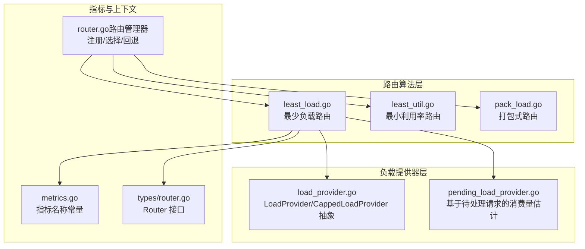
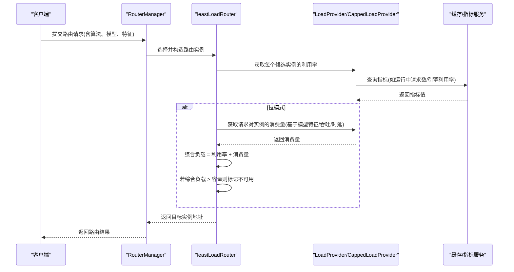
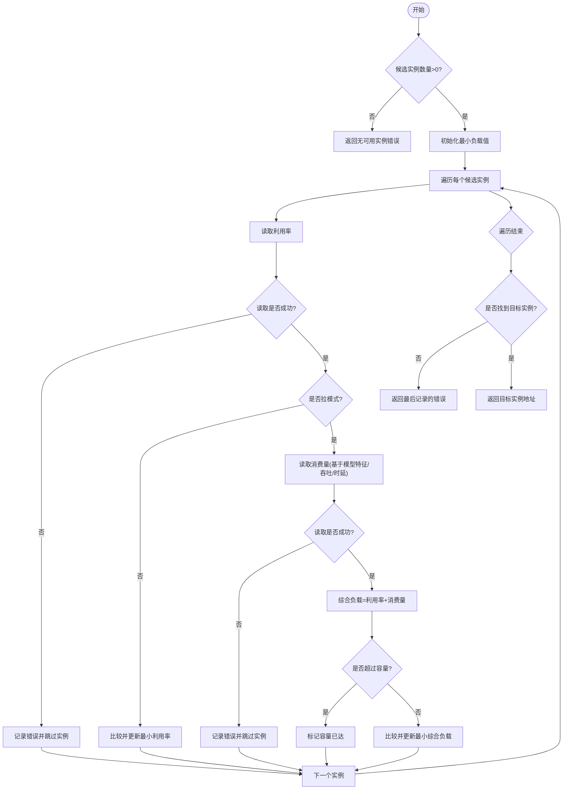
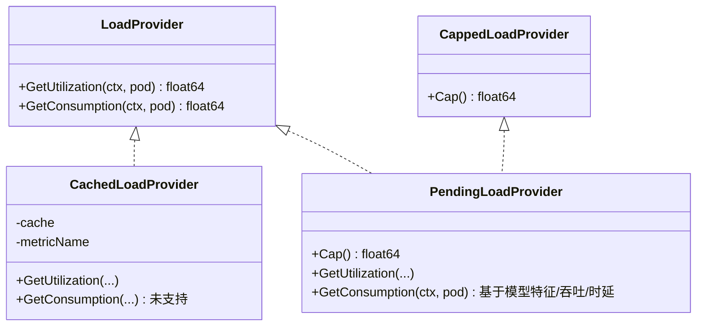
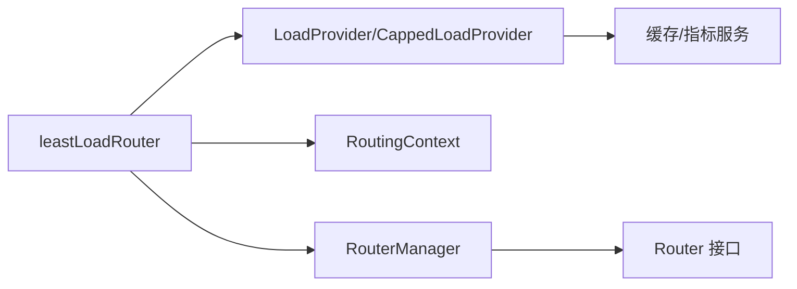

# 最少负载算法

<cite>
**本文引用的文件**
- [least_load.go](file://pkg/plugins/gateway/algorithms/least_load.go)
- [least_load_test.go](file://pkg/plugins/gateway/algorithms/least_load_test.go)
- [load_provider.go](file://pkg/cache/load_provider.go)
- [pending_load_provider.go](file://pkg/cache/pending_load_provider.go)
- [metrics.go](file://pkg/metrics/metrics.go)
- [router.go（路由管理器）](file://pkg/plugins/gateway/algorithms/router.go)
- [router.go（类型接口）](file://pkg/types/router.go)
- [least_util.go](file://pkg/plugins/gateway/algorithms/least_util.go)
- [pack_load.go](file://pkg/plugins/gateway/algorithms/pack_load.go)
- [slo.go](file://pkg/plugins/gateway/algorithms/slo.go)
</cite>

## 目录
1. [简介](#简介)
2. [项目结构](#项目结构)
3. [核心组件](#核心组件)
4. [架构总览](#架构总览)
5. [详细组件分析](#详细组件分析)
6. [依赖分析](#依赖分析)
7. [性能考虑](#性能考虑)
8. [故障排查指南](#故障排查指南)
9. [结论](#结论)
10. [附录：配置与调优](#附录配置与调优)

## 简介
本文件面向AIBrix网关中的“最少负载路由算法”，系统性阐述其负载计算方法、综合评估流程、权重与动态调整机制、负载均衡效果与稳定性保障，并提供监控配置、阈值设定与性能调优建议。该算法支持推模式（push）与拉模式（pull）两种运行方式，通过统一的负载提供器抽象，结合引擎侧指标与模型特征，实现对多模型实例的均衡调度。

## 项目结构
围绕最少负载路由算法的关键文件组织如下：
- 路由算法实现：least_load.go
- 负载提供器抽象与实现：load_provider.go、pending_load_provider.go
- 指标常量定义：metrics.go
- 路由注册与选择：router.go（算法注册/选择）、types/router.go（接口）
- 其他对比路由：least_util.go、pack_load.go
- SLO感知路由族：slo.go

图表来源
- [least_load.go:1-140](file://pkg/plugins/gateway/algorithms/least_load.go#L1-L140)
- [load_provider.go:31-87](file://pkg/cache/load_provider.go#L31-L87)
- [pending_load_provider.go:24-86](file://pkg/cache/pending_load_provider.go#L24-L86)
- [metrics.go:19-100](file://pkg/metrics/metrics.go#L19-L100)
- [router.go（路由管理器）:1-153](file://pkg/plugins/gateway/algorithms/router.go#L1-L153)
- [router.go（类型接口）:19-56](file://pkg/types/router.go#L19-L56)
- [least_util.go:1-92](file://pkg/plugins/gateway/algorithms/least_util.go#L1-L92)
- [pack_load.go:1-47](file://pkg/plugins/gateway/algorithms/pack_load.go#L1-L47)

章节来源
- [least_load.go:1-140](file://pkg/plugins/gateway/algorithms/least_load.go#L1-L140)
- [load_provider.go:31-87](file://pkg/cache/load_provider.go#L31-L87)
- [pending_load_provider.go:24-86](file://pkg/cache/pending_load_provider.go#L24-L86)
- [metrics.go:19-100](file://pkg/metrics/metrics.go#L19-L100)
- [router.go（路由管理器）:1-153](file://pkg/plugins/gateway/algorithms/router.go#L1-L153)
- [router.go（类型接口）:19-56](file://pkg/types/router.go#L19-L56)
- [least_util.go:1-92](file://pkg/plugins/gateway/algorithms/least_util.go#L1-L92)
- [pack_load.go:1-47](file://pkg/plugins/gateway/algorithms/pack_load.go#L1-L47)

## 核心组件
- 最少负载路由（push/pull双模）
  - 支持两种模式：
    - 推模式：由网关向实例派发请求，不强制受容量限制。
    - 拉模式：由实例从网关按自身容量拉取请求，需提供容量上限与消费量估计。
  - 负载计算：在推模式下以“利用率”作为唯一负载；在拉模式下以“利用率+消费量”作为综合负载。
  - 容量检查：拉模式下若综合负载超过容量则标记不可用，最终在可用实例中选择最小负载者。
- 负载提供器抽象
  - LoadProvider：提供利用率与消费量。
  - CappedLoadProvider：在LoadProvider基础上提供容量Cap()。
  - CachedLoadProvider：从缓存读取指标值。
  - PendingLoadProvider：基于模型特征与吞吐/时延预测，估算请求对实例的“消费量”（pending load），并以1.0为容量上限。
- 指标常量
  - 引擎侧关键指标：运行中请求数、等待队列长度、引擎利用率、GPU/CPU缓存使用率等。
  - 实时指标：实时运行中请求数、归一化pending、实时出流速率等。
- 路由注册与选择
  - RouterManager负责算法注册、初始化、选择与回退设置。
  - Router接口定义路由选择行为。

章节来源
- [least_load.go:33-140](file://pkg/plugins/gateway/algorithms/least_load.go#L33-L140)
- [load_provider.go:31-87](file://pkg/cache/load_provider.go#L31-L87)
- [pending_load_provider.go:24-86](file://pkg/cache/pending_load_provider.go#L24-L86)
- [metrics.go:19-100](file://pkg/metrics/metrics.go#L19-L100)
- [router.go（路由管理器）:49-152](file://pkg/plugins/gateway/algorithms/router.go#L49-L152)
- [router.go（类型接口）:19-56](file://pkg/types/router.go#L19-L56)

## 架构总览
最少负载路由在网关侧完成实例筛选与目标选择，核心流程如下：

图表来源
- [least_load.go:64-130](file://pkg/plugins/gateway/algorithms/least_load.go#L64-L130)
- [load_provider.go:31-87](file://pkg/cache/load_provider.go#L31-L87)
- [pending_load_provider.go:61-86](file://pkg/cache/pending_load_provider.go#L61-L86)
- [router.go（路由管理器）:73-84](file://pkg/plugins/gateway/algorithms/router.go#L73-L84)

## 详细组件分析

### 最少负载路由（leastLoadRouter）
- 推模式
  - 使用LoadProvider获取利用率，选择最小利用率的就绪实例。
  - 不进行容量检查，可能将请求派发到已高负载实例。
- 拉模式
  - 使用CappedLoadProvider，同时获取利用率与消费量。
  - 综合负载 = 利用度 + 消费量；若超过容量则视为不可用。
  - 在所有可用实例中选择最小综合负载者。
- 错误处理
  - 对单实例指标读取失败，记录错误并跳过该实例，保留最近一次错误用于最终返回。
  - 当请求被判定无法满足SLO（ErrorSLOFailureRequest）时，视为不可用。
- 目标选择
  - 将目标实例写入RoutingContext，返回目标地址。

图表来源
- [least_load.go:64-140](file://pkg/plugins/gateway/algorithms/least_load.go#L64-L140)

章节来源
- [least_load.go:33-140](file://pkg/plugins/gateway/algorithms/least_load.go#L33-L140)

### 负载提供器抽象与实现
- LoadProvider
  - GetUtilization：按Pod维度读取利用率指标。
  - GetConsumption：按请求与Pod维度读取消费量（在某些提供器中不支持）。
- CappedLoadProvider
  - 在LoadProvider基础上增加Cap()，表示实例容量上限。
- CachedLoadProvider
  - 从缓存读取指定指标名的值。
- PendingLoadProvider
  - 基于模型特征签名，查询吞吐（RPS）与平均时延，计算消费量 = 1/(RPS*平均时延)，容量为1.0。
  - 若无法获取或RPS为0，则返回SLO失败错误，表示请求无法在当前实例上满足SLA。

图表来源
- [load_provider.go:31-87](file://pkg/cache/load_provider.go#L31-L87)
- [pending_load_provider.go:24-86](file://pkg/cache/pending_load_provider.go#L24-L86)

章节来源
- [load_provider.go:31-87](file://pkg/cache/load_provider.go#L31-L87)
- [pending_load_provider.go:24-86](file://pkg/cache/pending_load_provider.go#L24-L86)

### 指标与特征
- 引擎侧常用指标
  - 运行中请求数、等待队列长度、引擎睡眠状态、HTTP请求总数、预填充/解码阶段时延、端到端时延、吞吐等。
- 实时指标
  - 实时运行中请求数、归一化pending、实时出流速率等。
- 特征
  - 请求特征（如输入/输出token数）用于签名查询模型配置，进而得到吞吐与时延，用于消费量估计。

章节来源
- [metrics.go:19-100](file://pkg/metrics/metrics.go#L19-L100)
- [pending_load_provider.go:61-86](file://pkg/cache/pending_load_provider.go#L61-L86)

### 路由注册与选择
- RouterManager
  - 注册算法构造器或直接注册Provider函数。
  - 初始化完成后，根据RoutingContext中的算法标识选择对应路由器。
  - 支持设置回退路由（需实现FallbackRouter接口）。
- Router接口
  - 定义Route(ctx, readyPodList)返回目标地址。

章节来源
- [router.go（路由管理器）:49-152](file://pkg/plugins/gateway/algorithms/router.go#L49-L152)
- [router.go（类型接口）:19-56](file://pkg/types/router.go#L19-L56)

### 对比路由：最小利用率与打包式路由
- 最小利用率路由（least_util）
  - 仅依据引擎利用率选择最小者，若无有效指标则随机回退。
- 打包式路由（pack_load）
  - 优先选择利用率最高的实例，用于“打包/填满”高利用率实例，减少碎片化。

章节来源
- [least_util.go:1-92](file://pkg/plugins/gateway/algorithms/least_util.go#L1-L92)
- [pack_load.go:1-47](file://pkg/plugins/gateway/algorithms/pack_load.go#L1-L47)

### SLO感知路由族
- 提供基于SLO队列与最少负载/打包式路由的组合，支持拉模式与推模式变体，便于在满足SLA前提下进行负载均衡。

章节来源
- [slo.go:1-36](file://pkg/plugins/gateway/algorithms/slo.go#L1-L36)

## 依赖分析
- leastLoadRouter依赖
  - 负载提供器：LoadProvider（推模式）或CappedLoadProvider（拉模式）。
  - 指标常量：用于查询运行中请求数、引擎利用率等。
  - 路由上下文：包含模型、特征、请求ID等。
  - 路由管理器：负责算法注册与选择。
- 负载提供器依赖
  - 缓存/指标服务：提供指标值读取能力。
  - 模型配置：用于根据特征签名查询吞吐与时延，计算消费量。

图表来源
- [least_load.go:42-62](file://pkg/plugins/gateway/algorithms/least_load.go#L42-L62)
- [load_provider.go:31-87](file://pkg/cache/load_provider.go#L31-L87)
- [router.go（路由管理器）:73-84](file://pkg/plugins/gateway/algorithms/router.go#L73-L84)
- [router.go（类型接口）:19-56](file://pkg/types/router.go#L19-L56)

章节来源
- [least_load.go:42-62](file://pkg/plugins/gateway/algorithms/least_load.go#L42-L62)
- [load_provider.go:31-87](file://pkg/cache/load_provider.go#L31-L87)
- [router.go（路由管理器）:73-84](file://pkg/plugins/gateway/algorithms/router.go#L73-L84)
- [router.go（类型接口）:19-56](file://pkg/types/router.go#L19-L56)

## 性能考虑
- 复杂度
  - 单次路由：O(N)，N为候选实例数；主要为遍历与比较。
- 指标读取
  - 推模式仅读取利用率，拉模式额外读取消费量，增加一次查询开销。
- 容量检查
  - 拉模式在每次迭代中进行容量判断，避免将请求派发至超载实例，提升稳定性。
- 并发与抖动
  - 建议结合时间窗口聚合与平滑策略，降低瞬时指标波动对路由决策的影响。
- 回退策略
  - 当无可用实例时返回最近错误，避免盲目选择导致雪崩；可配合随机回退策略提升鲁棒性。

[本节为通用性能讨论，无需特定文件引用]

## 故障排查指南
- 常见错误
  - 无可用实例：当所有实例均不可用时返回。
  - 指标读取失败：针对单实例读取失败会跳过该实例并记录错误。
  - 容量已达：拉模式下综合负载超过容量时标记为不可用。
  - SLO失败请求：消费量估计显示无法满足SLA，请求被拒绝。
- 定位步骤
  - 检查候选实例是否具备PodIP与健康状态。
  - 查看利用率与消费量指标是否可正常读取。
  - 验证模型特征签名是否正确，以确保吞吐与时延查询成功。
  - 在拉模式下确认容量上限设置合理。
- 测试参考
  - 单元测试覆盖了推/拉模式、容量边界、错误传播等场景，可对照验证实现。

章节来源
- [least_load.go:132-140](file://pkg/plugins/gateway/algorithms/least_load.go#L132-L140)
- [least_load_test.go:224-368](file://pkg/plugins/gateway/algorithms/least_load_test.go#L224-L368)
- [pending_load_provider.go:77-85](file://pkg/cache/pending_load_provider.go#L77-L85)

## 结论
最少负载路由通过统一的负载提供器抽象，将引擎侧利用率与请求级消费量整合，形成可插拔的负载评估框架。推模式适合快速派发，拉模式在满足容量与SLA前提下实现更稳健的均衡。结合SLO感知与队列机制，可在高负载场景下保持稳定与收敛。

[本节为总结性内容，无需特定文件引用]

## 附录：配置与调优

### 负载计算与评估
- 推模式
  - 负载 = 实例利用率（如运行中请求数/引擎利用率）。
  - 选择最小利用率实例。
- 拉模式
  - 负载 = 利用率 + 消费量。
  - 消费量 = f(模型特征, 吞吐RPS, 平均时延)；容量上限通常为1.0。
  - 仅在综合负载不超过容量时选择。

章节来源
- [least_load.go:64-130](file://pkg/plugins/gateway/algorithms/least_load.go#L64-L130)
- [pending_load_provider.go:61-86](file://pkg/cache/pending_load_provider.go#L61-L86)

### 监控与指标
- 关键指标
  - 运行中请求数、等待队列长度、引擎利用率、GPU/CPU缓存使用率、端到端时延、吞吐等。
  - 实时指标：实时运行中请求数、归一化pending、实时出流速率。
- 指标来源
  - 引擎导出指标与Prometheus查询。
- 建议
  - 使用时间窗口聚合（如1分钟）平滑瞬时波动。
  - 结合模型特征签名查询吞吐与时延，提高消费量估计精度。

章节来源
- [metrics.go:19-100](file://pkg/metrics/metrics.go#L19-L100)
- [pending_load_provider.go:61-86](file://pkg/cache/pending_load_provider.go#L61-L86)

### 阈值与权重
- 拉模式容量阈值
  - 通常以1.0为单位容量，综合负载超过即不可用。
- 消费量权重
  - 默认采用1/(RPS*平均时延)作为消费量，体现请求对实例的资源占用。
- 权重调整建议
  - 可根据业务SLA与实例规格，对消费量与利用率赋予不同权重（在自定义提供器中实现）。

章节来源
- [pending_load_provider.go:77-85](file://pkg/cache/pending_load_provider.go#L77-L85)
- [least_load.go:113-119](file://pkg/plugins/gateway/algorithms/least_load.go#L113-L119)

### 动态调整机制
- 拉模式内建容量检查，自动过滤超载实例。
- SLO感知路由族可结合队列与后端实例的实际处理能力，动态调节派发节奏。
- 建议
  - 结合历史指标与趋势分析，动态调整容量阈值与权重。
  - 在高负载场景启用拉模式，避免过度派发导致尾延迟恶化。

章节来源
- [least_load.go:114-119](file://pkg/plugins/gateway/algorithms/least_load.go#L114-L119)
- [slo.go:24-36](file://pkg/plugins/gateway/algorithms/slo.go#L24-L36)

### 负载场景与最佳实践
- 低负载场景
  - 推模式即可满足需求；关注指标读取稳定性与回退策略。
- 中高负载场景
  - 优先使用拉模式；结合实时pending与吞吐/时延估计，避免超载。
- 突发流量
  - 配置合理的容量阈值与队列长度，防止瞬时过载；必要时启用SLO队列阻塞策略。
- 模型差异
  - 不同模型的吞吐与时延差异较大，需确保特征签名准确，消费量估计可靠。

章节来源
- [least_load_test.go:224-368](file://pkg/plugins/gateway/algorithms/least_load_test.go#L224-L368)
- [pending_load_provider.go:61-86](file://pkg/cache/pending_load_provider.go#L61-L86)