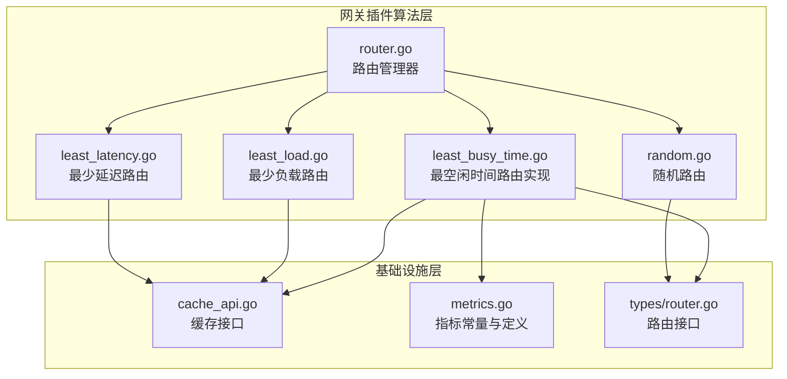
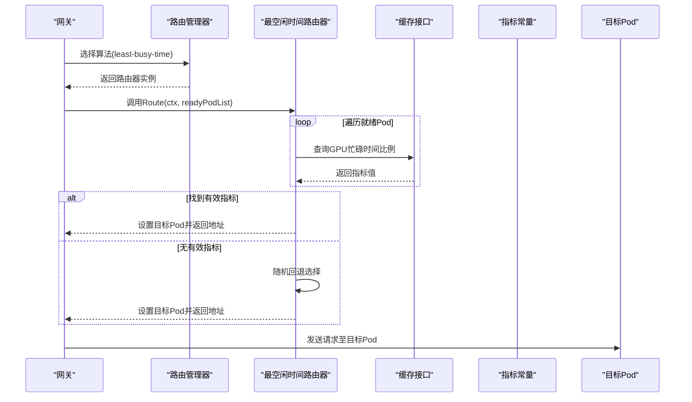
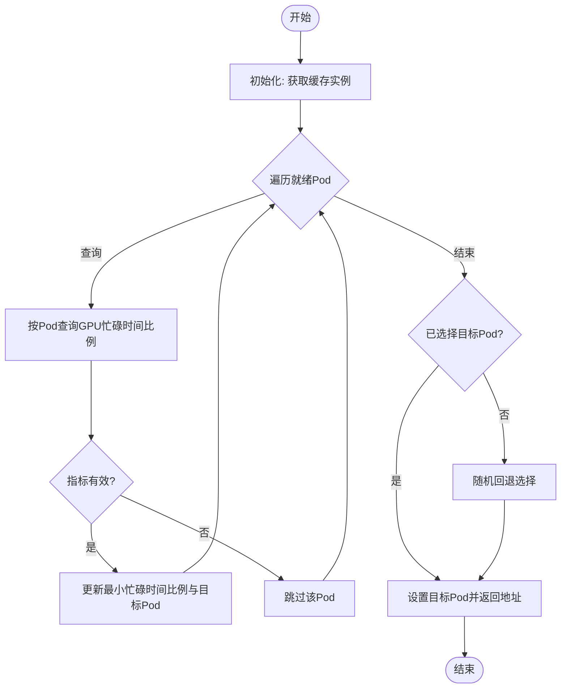
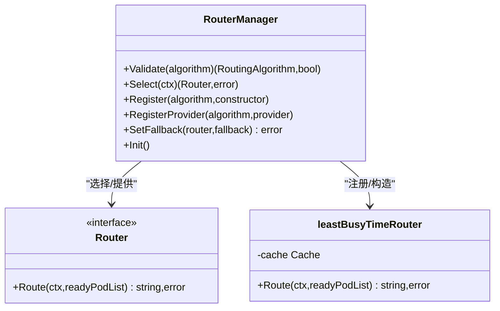
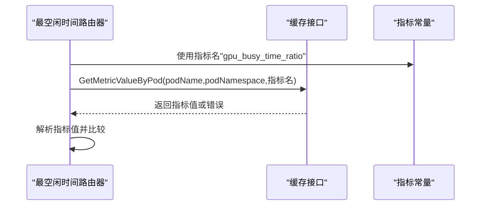
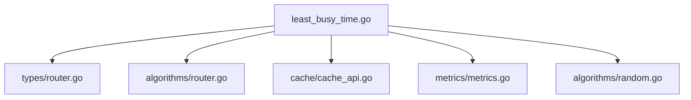

# 最空闲时间算法

<cite>
**本文引用的文件**
- [least_busy_time.go](file://pkg/plugins/gateway/algorithms/least_busy_time.go)
- [least_busy_time_test.go](file://pkg/plugins/gateway/algorithms/least_busy_time_test.go)
- [router.go](file://pkg/plugins/gateway/algorithms/router.go)
- [cache_api.go](file://pkg/cache/cache_api.go)
- [metrics.go](file://pkg/metrics/metrics.go)
- [router.go](file://pkg/types/router.go)
- [random.go](file://pkg/plugins/gateway/algorithms/random.go)
- [least_load.go](file://pkg/plugins/gateway/algorithms/least_load.go)
- [least_latency.go](file://pkg/plugins/gateway/algorithms/least_latency.go)
</cite>

## 目录
1. [简介](#简介)
2. [项目结构](#项目结构)
3. [核心组件](#核心组件)
4. [架构总览](#架构总览)
5. [详细组件分析](#详细组件分析)
6. [依赖关系分析](#依赖关系分析)
7. [性能考量](#性能考量)
8. [故障排除指南](#故障排除指南)
9. [结论](#结论)
10. [附录](#附录)

## 简介
本文件针对 AIBrix 网关插件中的“最空闲时间”路由算法（least-busy-time）进行系统化技术文档整理。该算法通过比较各就绪 Pod 的 GPU 忙碌时间比例，选择当前最空闲的目标实例进行请求转发，从而在多实例场景下实现更均衡的负载分配与更低的排队等待。

该算法具备以下关键特性：
- 基于 GPU 忙碌时间比例的实时负载评估
- 对缺失或异常指标的稳健回退策略（随机选择）
- 与网关路由管理器的注册与选择机制集成
- 可扩展到其他基于指标的路由策略

## 项目结构
least-busy-time 算法位于网关插件的算法目录中，与其它路由算法并列，共享统一的路由接口与注册机制，并通过缓存层获取指标数据。

图表来源
- [least_busy_time.go:1-82](file://pkg/plugins/gateway/algorithms/least_busy_time.go#L1-L82)
- [router.go:1-153](file://pkg/plugins/gateway/algorithms/router.go#L1-L153)
- [cache_api.go:1-170](file://pkg/cache/cache_api.go#L1-L170)
- [metrics.go:1-796](file://pkg/metrics/metrics.go#L1-L796)
- [router.go:1-56](file://pkg/types/router.go#L1-L56)
- [random.go:1-62](file://pkg/plugins/gateway/algorithms/random.go#L1-L62)
- [least_load.go:1-140](file://pkg/plugins/gateway/algorithms/least_load.go#L1-L140)
- [least_latency.go:1-154](file://pkg/plugins/gateway/algorithms/least_latency.go#L1-L154)

章节来源
- [least_busy_time.go:1-82](file://pkg/plugins/gateway/algorithms/least_busy_time.go#L1-L82)
- [router.go:1-153](file://pkg/plugins/gateway/algorithms/router.go#L1-L153)

## 核心组件
- 路由器接口：定义统一的 Route(ctx, readyPodList) -> 目标地址 的路由能力，支持队列路由与回退路由扩展。
- 路由管理器：负责算法注册、校验与选择，支持默认回退到随机路由。
- 缓存接口：提供按 Pod 或 Pod-Model 维度查询指标值的能力，是算法获取负载信息的数据源。
- 指标常量：集中定义可用指标名称，其中 GPU 忙碌时间比例用于本算法的核心判断。

章节来源
- [router.go:19-56](file://pkg/types/router.go#L19-L56)
- [router.go:41-153](file://pkg/plugins/gateway/algorithms/router.go#L41-L153)
- [cache_api.go:81-109](file://pkg/cache/cache_api.go#L81-L109)
- [metrics.go:76](file://pkg/metrics/metrics.go#L76)

## 架构总览
最空闲时间算法的运行流程如下：

图表来源
- [least_busy_time.go:51-81](file://pkg/plugins/gateway/algorithms/least_busy_time.go#L51-L81)
- [router.go:73-85](file://pkg/plugins/gateway/algorithms/router.go#L73-L85)
- [cache_api.go:83-103](file://pkg/cache/cache_api.go#L83-L103)
- [metrics.go:76](file://pkg/metrics/metrics.go#L76)
- [random.go:45-57](file://pkg/plugins/gateway/algorithms/random.go#L45-L57)

## 详细组件分析

### 最空闲时间路由器实现
- 注册与构造
  - 在初始化时向路由管理器注册算法名与构造函数。
  - 构造函数从全局缓存获取实例，供后续指标查询使用。
- 路由决策
  - 遍历就绪 Pod 列表，按 Pod 名称与命名空间查询 GPU 忙碌时间比例。
  - 选择忙碌时间比例最小的 Pod 作为目标；若所有指标均不可用，则回退到随机选择。
  - 将目标 Pod 写入上下文并返回其地址字符串。

图表来源
- [least_busy_time.go:51-81](file://pkg/plugins/gateway/algorithms/least_busy_time.go#L51-L81)
- [random.go:45-57](file://pkg/plugins/gateway/algorithms/random.go#L45-L57)

章节来源
- [least_busy_time.go:30-81](file://pkg/plugins/gateway/algorithms/least_busy_time.go#L30-L81)

### 路由管理器与算法注册
- 路由管理器提供算法注册、校验与选择功能，支持默认回退到随机算法。
- least-busy-time 通过 init() 注册到管理器，便于网关按名称选择。

图表来源
- [router.go:41-153](file://pkg/plugins/gateway/algorithms/router.go#L41-L153)
- [least_busy_time.go:30-49](file://pkg/plugins/gateway/algorithms/least_busy_time.go#L30-L49)

章节来源
- [router.go:41-153](file://pkg/plugins/gateway/algorithms/router.go#L41-L153)

### 指标与缓存交互
- 指标常量：GPU 忙碌时间比例指标名为固定常量，算法直接使用该名称查询。
- 缓存接口：提供按 Pod 或 Pod-Model 维度查询指标值的方法，算法通过该接口获取实时指标。

图表来源
- [metrics.go:76](file://pkg/metrics/metrics.go#L76)
- [cache_api.go:83-103](file://pkg/cache/cache_api.go#L83-L103)
- [least_busy_time.go:56](file://pkg/plugins/gateway/algorithms/least_busy_time.go#L56)

章节来源
- [metrics.go:76](file://pkg/metrics/metrics.go#L76)
- [cache_api.go:81-109](file://pkg/cache/cache_api.go#L81-L109)

### 与其他算法的对比
- 与最少负载算法对比
  - 最少负载算法通常基于整体利用率或吞吐等综合指标，可能需要容量感知与拉取模式支持。
  - 最空闲时间算法聚焦于 GPU 忙碌时间比例，实现更简单、对指标要求更低。
- 与最少延迟算法对比
  - 最少延迟算法基于排队、预填充与解码阶段的期望耗时，计算更复杂且依赖更多指标。
  - 最空闲时间算法以“空闲度”为单一判据，适合快速、稳定的负载均衡场景。
- 与随机算法对比
  - 随机算法不考虑负载状态，仅做均匀分布，缺乏自适应性。
  - 最空闲时间算法在有指标可用时具备自适应能力，无指标时回退到随机，兼顾稳定性与效率。

章节来源
- [least_load.go:33-140](file://pkg/plugins/gateway/algorithms/least_load.go#L33-L140)
- [least_latency.go:30-154](file://pkg/plugins/gateway/algorithms/least_latency.go#L30-L154)
- [random.go:27-62](file://pkg/plugins/gateway/algorithms/random.go#L27-L62)

## 依赖关系分析
- 算法依赖
  - 路由接口：确保与网关框架一致的调用方式。
  - 路由管理器：提供注册、校验与选择能力。
  - 缓存接口：提供指标查询能力。
  - 指标常量：提供稳定的指标名称。
- 外部依赖
  - 日志库：用于记录指标查询与错误信息。
  - 随机数：用于回退时的随机选择。

图表来源
- [least_busy_time.go:19-28](file://pkg/plugins/gateway/algorithms/least_busy_time.go#L19-L28)
- [router.go:19-28](file://pkg/plugins/gateway/algorithms/router.go#L19-L28)
- [cache_api.go:19-23](file://pkg/cache/cache_api.go#L19-L23)
- [metrics.go:19-20](file://pkg/metrics/metrics.go#L19-L20)
- [random.go:19-25](file://pkg/plugins/gateway/algorithms/random.go#L19-L25)

章节来源
- [least_busy_time.go:19-28](file://pkg/plugins/gateway/algorithms/least_busy_time.go#L19-L28)
- [router.go:19-28](file://pkg/plugins/gateway/algorithms/router.go#L19-L28)
- [cache_api.go:19-23](file://pkg/cache/cache_api.go#L19-L23)
- [metrics.go:19-20](file://pkg/metrics/metrics.go#L19-L20)
- [random.go:19-25](file://pkg/plugins/gateway/algorithms/random.go#L19-L25)

## 性能考量
- 时间复杂度
  - 单次路由：O(N)，N 为就绪 Pod 数量；主要开销来自遍历与指标查询。
- 空间复杂度
  - O(1)，仅维护最小忙碌时间比例与目标 Pod 引用。
- 指标可用性
  - 若指标缺失或异常，算法会回退到随机选择，避免阻塞请求；建议确保引擎侧指标采集稳定。
- 回退策略
  - 随机回退在极端情况下保证系统可用性，但可能导致负载不均；建议结合业务需求调整回退阈值或引入其他策略。

[本节为通用性能讨论，无需特定文件来源]

## 故障排除指南
- 症状：路由返回错误或无法选择目标
  - 可能原因：就绪 Pod 列表为空、指标查询失败、所有 Pod 指标无效。
  - 排查步骤：
    - 检查 Pod 就绪状态与网络连通性。
    - 确认指标采集是否正常，特别是 GPU 忙碌时间比例。
    - 观察日志中关于指标查询错误的记录。
- 症状：路由结果不稳定或频繁切换
  - 可能原因：指标波动大、Pod 负载变化快。
  - 排查步骤：
    - 检查指标采集周期与窗口大小，确认指标平滑性。
    - 结合最少负载或最少延迟算法进行对比测试，验证指标稳定性。
- 测试覆盖
  - 单元测试覆盖了多种边界情况，如空 Pod 列表、部分指标缺失、全部指标缺失、相同最小值等，可参考测试用例定位问题。

章节来源
- [least_busy_time_test.go:32-242](file://pkg/plugins/gateway/algorithms/least_busy_time_test.go#L32-L242)

## 结论
最空闲时间算法以 GPU 忙碌时间比例为核心判据，实现简单、易于部署且具备稳健的回退机制。在指标可用的前提下，能够有效提升实例间的负载均衡与响应质量；在指标缺失时，通过随机回退保障系统可用性。建议在生产环境中配合监控与告警，持续观察指标稳定性与路由效果，并根据业务特征选择合适的回退策略或与其他算法组合使用。

[本节为总结性内容，无需特定文件来源]

## 附录

### 算法使用示例（路径指引）
- 在网关配置中选择算法名称为“least-busy-time”，路由管理器将自动构造并使用该路由器。
- 示例路径（不含代码内容）：
  - [least_busy_time.go:30-34](file://pkg/plugins/gateway/algorithms/least_busy_time.go#L30-L34)
  - [router.go:73-85](file://pkg/plugins/gateway/algorithms/router.go#L73-L85)

### 性能调优建议
- 指标稳定性
  - 确保引擎侧指标采集稳定，减少 NaN 或异常值对算法的影响。
- 采样与窗口
  - 合理设置指标采样周期与窗口长度，避免短期波动导致频繁切换。
- 回退策略
  - 在极端情况下启用随机回退，避免因指标异常导致的路由停滞。

[本节为通用建议，无需特定文件来源]

### 最佳实践
- 在多实例部署中优先采用“最空闲时间”算法，以获得更均衡的负载分配。
- 当业务对延迟敏感时，可结合“最少延迟”算法进行对比测试。
- 对于新上线的实例，建议先观察一段时间的指标稳定性再启用该算法。

[本节为通用建议，无需特定文件来源]