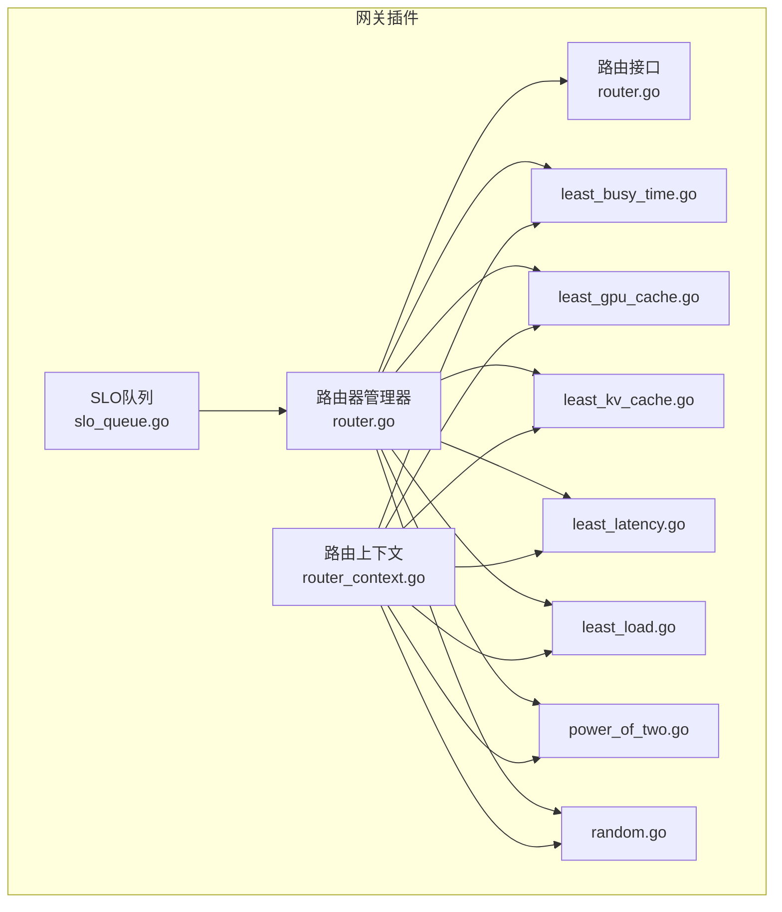
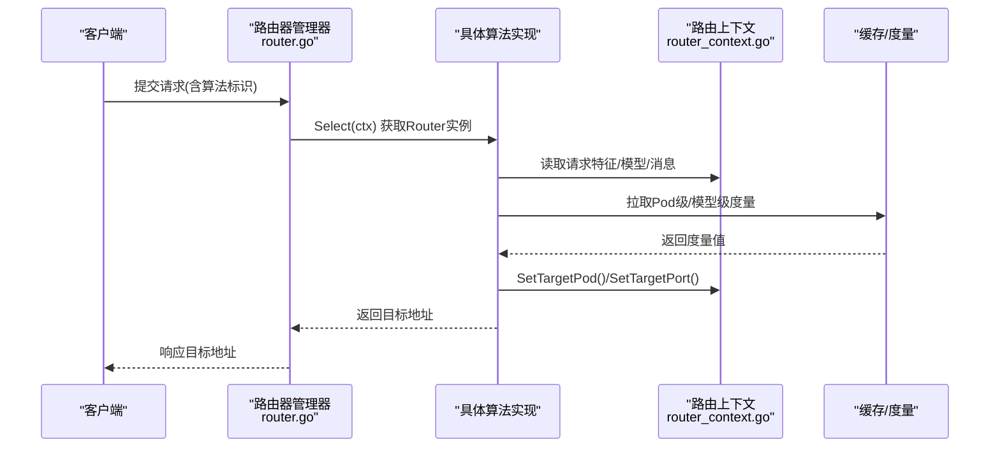
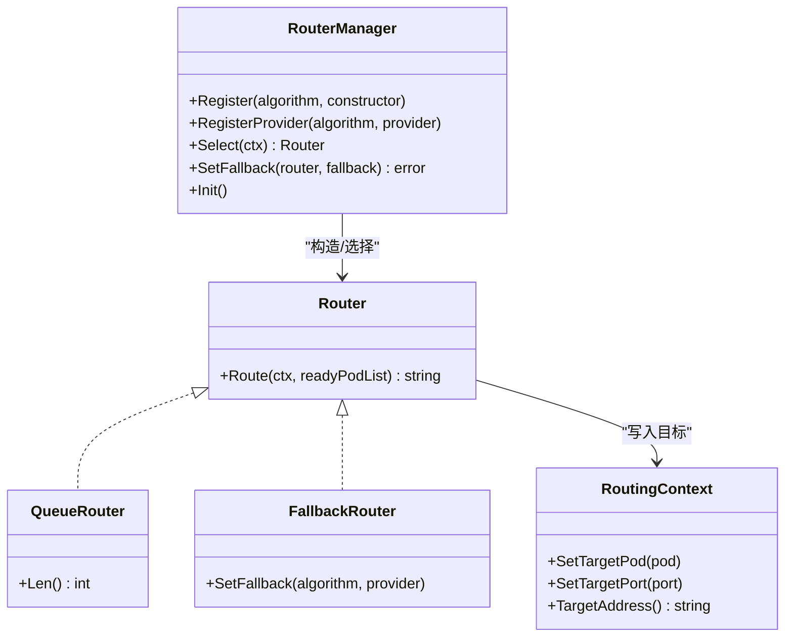
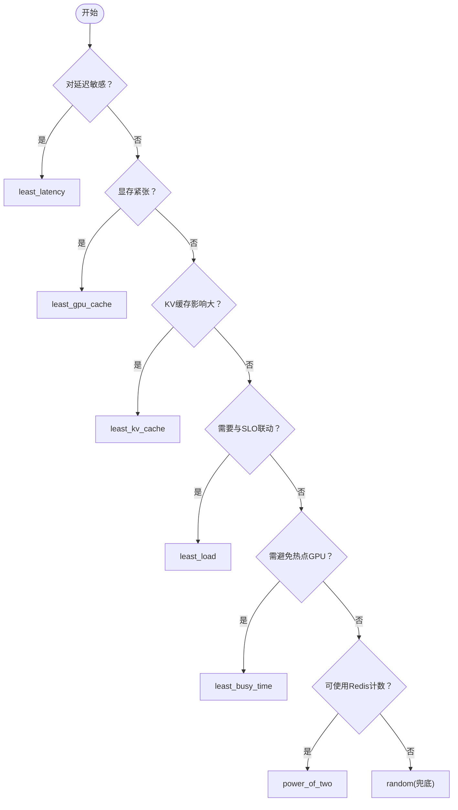

# 算法对比与选择指南

<cite>
**本文引用的文件**
- [pkg/plugins/gateway/algorithms/least_busy_time.go](file://pkg/plugins/gateway/algorithms/least_busy_time.go)
- [pkg/plugins/gateway/algorithms/least_gpu_cache.go](file://pkg/plugins/gateway/algorithms/least_gpu_cache.go)
- [pkg/plugins/gateway/algorithms/least_kv_cache.go](file://pkg/plugins/gateway/algorithms/least_kv_cache.go)
- [pkg/plugins/gateway/algorithms/least_latency.go](file://pkg/plugins/gateway/algorithms/least_latency.go)
- [pkg/plugins/gateway/algorithms/least_load.go](file://pkg/plugins/gateway/algorithms/least_load.go)
- [pkg/plugins/gateway/algorithms/power_of_two.go](file://pkg/plugins/gateway/algorithms/power_of_two.go)
- [pkg/plugins/gateway/algorithms/random.go](file://pkg/plugins/gateway/algorithms/random.go)
- [pkg/plugins/gateway/algorithms/router.go](file://pkg/plugins/gateway/algorithms/router.go)
- [pkg/types/router.go](file://pkg/types/router.go)
- [pkg/types/router_context.go](file://pkg/types/router_context.go)
- [pkg/plugins/gateway/algorithms/least_busy_time_test.go](file://pkg/plugins/gateway/algorithms/least_busy_time_test.go)
- [pkg/plugins/gateway/algorithms/power_of_two_test.go](file://pkg/plugins/gateway/algorithms/power_of_two_test.go)
- [pkg/plugins/gateway/queue/slo_queue.go](file://pkg/plugins/gateway/queue/slo_queue.go)
- [samples/ai-gateway-integration/README.md](file://samples/ai-gateway-integration/README.md)
</cite>

## 目录
1. [引言](#引言)
2. [项目结构](#项目结构)
3. [核心组件](#核心组件)
4. [架构总览](#架构总览)
5. [详细组件分析](#详细组件分析)
6. [依赖分析](#依赖分析)
7. [性能考量](#性能考量)
8. [故障排除指南](#故障排除指南)
9. [结论](#结论)
10. [附录](#附录)

## 引言
本指南聚焦于AIBrix网关插件中的路由算法，系统对比并梳理以下算法的性能特征、适用场景与配置要求：least_busy_time（最小GPU忙碌时间）、least_gpu_cache（最小GPU缓存占用）、least_kv_cache（最小KV缓存占用）、least_latency（最小延迟预测）、least_load（最小负载）、power_of_two（二选策略）与random（随机）。文档提供算法选择决策树、性能基准测试结果解读、不同场景下的推荐策略、算法间互补性与混合使用建议、动态切换机制、部署案例与监控指标，帮助在真实生产环境中做出科学的路由策略选择。

## 项目结构
AIBrix路由算法位于网关插件的算法目录中，采用“接口 + 多实现”的设计模式，通过统一的路由器管理器进行注册与选择，并以上下文对象承载请求特征与目标地址设置。关键模块如下：
- 路由接口与上下文：定义Router接口、QueueRouter/FallbackRouter扩展、RouterProvider、RoutingContext等
- 具体算法：least_busy_time、least_gpu_cache、least_kv_cache、least_latency、least_load、power_of_two、random
- 路由器管理器：负责算法注册、校验、选择与回退
- 队列与SLO：支持按模型/子键聚合排队与候选集排序

图表来源
- [pkg/plugins/gateway/algorithms/router.go:1-153](file://pkg/plugins/gateway/algorithms/router.go#L1-L153)
- [pkg/types/router.go:19-56](file://pkg/types/router.go#L19-L56)
- [pkg/types/router_context.go:57-105](file://pkg/types/router_context.go#L57-L105)
- [pkg/plugins/gateway/algorithms/least_busy_time.go:50-82](file://pkg/plugins/gateway/algorithms/least_busy_time.go#L50-L82)
- [pkg/plugins/gateway/algorithms/least_gpu_cache.go:52-100](file://pkg/plugins/gateway/algorithms/least_gpu_cache.go#L52-L100)
- [pkg/plugins/gateway/algorithms/least_kv_cache.go:52-98](file://pkg/plugins/gateway/algorithms/least_kv_cache.go#L52-L98)
- [pkg/plugins/gateway/algorithms/least_latency.go:51-154](file://pkg/plugins/gateway/algorithms/least_latency.go#L51-L154)
- [pkg/plugins/gateway/algorithms/least_load.go:64-140](file://pkg/plugins/gateway/algorithms/least_load.go#L64-L140)
- [pkg/plugins/gateway/algorithms/power_of_two.go:115-184](file://pkg/plugins/gateway/algorithms/power_of_two.go#L115-L184)
- [pkg/plugins/gateway/algorithms/random.go:45-62](file://pkg/plugins/gateway/algorithms/random.go#L45-L62)
- [pkg/plugins/gateway/queue/slo_queue.go:80-99](file://pkg/plugins/gateway/queue/slo_queue.go#L80-L99)

章节来源
- [pkg/plugins/gateway/algorithms/router.go:1-153](file://pkg/plugins/gateway/algorithms/router.go#L1-L153)
- [pkg/types/router.go:19-56](file://pkg/types/router.go#L19-L56)
- [pkg/types/router_context.go:57-105](file://pkg/types/router_context.go#L57-L105)

## 核心组件
- 路由接口与扩展
  - Router：定义Route(ctx, readyPodList)返回目标地址
  - QueueRouter：在Router基础上提供队列长度查询
  - FallbackRouter：允许设置回退算法
  - RouterProvider/RouterProviderFunc：提供有状态或无状态的Router获取方式
- 路由上下文
  - RoutingContext封装请求ID、模型、消息、时间戳、目标地址设置、错误传播、输出预测器等
- 路由器管理器
  - 注册/校验/选择算法；支持设置回退；初始化阶段超时保护

章节来源
- [pkg/types/router.go:19-56](file://pkg/types/router.go#L19-L56)
- [pkg/types/router_context.go:57-105](file://pkg/types/router_context.go#L57-L105)
- [pkg/plugins/gateway/algorithms/router.go:41-153](file://pkg/plugins/gateway/algorithms/router.go#L41-L153)

## 架构总览
下图展示从请求进入网关到路由选择与目标地址设置的关键流程，以及各算法如何基于上下文与缓存/度量进行决策。

图表来源
- [pkg/plugins/gateway/algorithms/router.go:73-85](file://pkg/plugins/gateway/algorithms/router.go#L73-L85)
- [pkg/types/router_context.go:194-200](file://pkg/types/router_context.go#L194-L200)
- [pkg/plugins/gateway/algorithms/least_latency.go:51-154](file://pkg/plugins/gateway/algorithms/least_latency.go#L51-L154)
- [pkg/plugins/gateway/algorithms/least_gpu_cache.go:52-100](file://pkg/plugins/gateway/algorithms/least_gpu_cache.go#L52-L100)
- [pkg/plugins/gateway/algorithms/least_kv_cache.go:52-98](file://pkg/plugins/gateway/algorithms/least_kv_cache.go#L52-L98)
- [pkg/plugins/gateway/algorithms/least_busy_time.go:51-82](file://pkg/plugins/gateway/algorithms/least_busy_time.go#L51-L82)
- [pkg/plugins/gateway/algorithms/least_load.go:64-140](file://pkg/plugins/gateway/algorithms/least_load.go#L64-L140)
- [pkg/plugins/gateway/algorithms/power_of_two.go:115-184](file://pkg/plugins/gateway/algorithms/power_of_two.go#L115-L184)
- [pkg/plugins/gateway/algorithms/random.go:45-62](file://pkg/plugins/gateway/algorithms/random.go#L45-L62)

## 详细组件分析

### least_busy_time（最小GPU忙碌时间）
- 决策依据：按GPU忙碌时间比例选择最小者
- 行为特征
  - 从缓存拉取每Pod的GPU忙碌时间比，数值越小越优
  - 若无有效度量则回退至随机选择
- 适用场景
  - GPU资源紧张、需避免热点GPU
  - 对吞吐稳定性的优先级高于首Token延迟
- 性能影响
  - 低开销，仅依赖单一度量
  - 在GPU利用率分布不均时提升整体吞吐
- 测试要点
  - 度量缺失/NaN处理、相同最小值时的随机性、零忙碌率的正确选择

章节来源
- [pkg/plugins/gateway/algorithms/least_busy_time.go:50-82](file://pkg/plugins/gateway/algorithms/least_busy_time.go#L50-L82)
- [pkg/plugins/gateway/algorithms/least_busy_time_test.go:32-242](file://pkg/plugins/gateway/algorithms/least_busy_time_test.go#L32-L242)

### least_gpu_cache（最小GPU缓存占用）
- 决策依据：按GPU缓存使用百分比选择最小者
- 行为特征
  - 从缓存拉取每Pod的GPU缓存使用率，越小越优
  - 多个相同最小值时随机选择其一
  - 无有效度量时回退随机
- 适用场景
  - 大模型显存敏感、需要均衡显存占用
  - 多模型共享推理池且显存有限
- 性能影响
  - 显存友好，降低OOM风险
  - 可能牺牲部分吞吐（显存未充分利用）

章节来源
- [pkg/plugins/gateway/algorithms/least_gpu_cache.go:52-100](file://pkg/plugins/gateway/algorithms/least_gpu_cache.go#L52-L100)

### least_kv_cache（最小KV缓存占用）
- 决策依据：综合GPU与CPU KV缓存使用率，选择总和最小者
- 行为特征
  - 同时考虑GPU/CPU侧KV缓存，累加后择优
  - 无有效度量时回退随机
- 适用场景
  - KV缓存对长上下文/多轮对话影响显著
  - 需要平衡显存与内存占用
- 性能影响
  - 更贴近生成阶段的缓存压力
  - 在多模型/多会话并发下更稳健

章节来源
- [pkg/plugins/gateway/algorithms/least_kv_cache.go:52-98](file://pkg/plugins/gateway/algorithms/least_kv_cache.go#L52-L98)

### least_latency（最小延迟预测）
- 决策依据：基于平均提示词/生成token数与排队、预填充、解码耗时的期望值进行综合评估
- 行为特征
  - 使用历史直方图均值与样本均值估计当前请求的排队、预填充、解码延迟
  - 以总期望延迟最小为目标
  - 无有效度量时回退随机
- 适用场景
  - 对端到端延迟敏感的在线服务
  - 需要结合排队与生成阶段的综合优化
- 性能影响
  - 计算略重（统计与估计），但能显著改善用户体验
  - 对历史数据质量敏感

章节来源
- [pkg/plugins/gateway/algorithms/least_latency.go:51-154](file://pkg/plugins/gateway/algorithms/least_latency.go#L51-L154)

### least_load（最小负载）
- 决策依据：根据负载提供器计算利用率/消耗，选择最小者
- 行为特征
  - 支持推送式与拉取式两种模式
  - 拉取模式下可结合容量上限进行约束
  - 错误分类处理（容量达到/失败请求等）
- 适用场景
  - 需要与SLO/容量控制联动的场景
  - 与队列/限流配合实现稳态调度
- 性能影响
  - 与外部负载提供器耦合，需关注其可用性与准确性

章节来源
- [pkg/plugins/gateway/algorithms/least_load.go:64-140](file://pkg/plugins/gateway/algorithms/least_load.go#L64-L140)

### power_of_two（二选策略）
- 决策依据：从候选Pod中随机挑选两个，比较其实时运行请求数，选择较小者
- 行为特征
  - 依赖Redis计数，支持多端口Pod
  - 关键字旋转与过期策略防止内存泄漏
  - 作为RequestTracker参与请求计数的增减
- 适用场景
  - 高并发、低延迟、需要快速自适应的在线服务
  - 无法直接观测GPU/CPU度量时的替代方案
- 性能影响
  - 通过Redis批量查询与原子增减保证一致性
  - 对Redis可用性与网络抖动敏感

章节来源
- [pkg/plugins/gateway/algorithms/power_of_two.go:115-184](file://pkg/plugins/gateway/algorithms/power_of_two.go#L115-L184)
- [pkg/plugins/gateway/algorithms/power_of_two_test.go:277-326](file://pkg/plugins/gateway/algorithms/power_of_two_test.go#L277-L326)

### random（随机）
- 决策依据：从就绪Pod中随机选择
- 行为特征
  - 无度量依赖，最简实现
  - 作为回退兜底策略
- 适用场景
  - 初期调试、度量不可用、或作为其他算法的回退

章节来源
- [pkg/plugins/gateway/algorithms/random.go:45-62](file://pkg/plugins/gateway/algorithms/random.go#L45-L62)

### 类关系与依赖

图表来源
- [pkg/types/router.go:19-56](file://pkg/types/router.go#L19-L56)
- [pkg/plugins/gateway/algorithms/router.go:41-153](file://pkg/plugins/gateway/algorithms/router.go#L41-L153)
- [pkg/types/router_context.go:194-200](file://pkg/types/router_context.go#L194-L200)

## 依赖分析
- 算法与上下文
  - 所有算法均通过RoutingContext读取请求特征、设置目标Pod/端口
- 算法与缓存/度量
  - least_*系列算法依赖缓存层提供的Pod/模型级度量
  - power_of_two依赖Redis计数与RequestTracker生命周期
- 管理与选择
  - 路由器管理器负责注册、校验、选择与回退设置
- 队列与SLO
  - SLO队列按模型/子键聚合候选，与RouterProvider配合实现更细粒度的调度

章节来源
- [pkg/plugins/gateway/algorithms/least_latency.go:51-154](file://pkg/plugins/gateway/algorithms/least_latency.go#L51-L154)
- [pkg/plugins/gateway/algorithms/power_of_two.go:303-398](file://pkg/plugins/gateway/algorithms/power_of_two.go#L303-L398)
- [pkg/plugins/gateway/queue/slo_queue.go:80-99](file://pkg/plugins/gateway/queue/slo_queue.go#L80-L99)

## 性能考量
- 算法复杂度与开销
  - least_busy_time/least_gpu_cache/least_kv_cache/least_load：线性遍历候选Pod，O(N)
  - least_latency：涉及统计估计与直方图均值，额外常数开销
  - power_of_two：Redis批量查询与原子操作，网络往返一次
  - random：常数时间
- 度量与稳定性
  - 依赖度量的算法在度量缺失或异常时会回退随机，保障可用性
  - power_of_two通过关键字旋转与过期策略避免长期驻留键导致的内存膨胀
- 并发与一致性
  - power_of_two在Add/Done阶段使用上下文标记避免重复增减
  - 路由器管理器初始化带超时，确保启动阶段的稳定性

[本节为通用性能讨论，无需特定文件引用]

## 故障排除指南
- “无可用Pod”
  - least_load在无就绪Pod或所有Pod均不可用时返回该错误
  - 排查Pod就绪状态与网络连通性
- “度量缺失/异常”
  - least_*系列在度量获取失败时记录错误并回退随机
  - 检查度量采集器、指标名称与命名空间
- “Redis不可用/计数异常”
  - power_of_two在Redis批量查询失败时返回零计数
  - 检查Redis连接、键前缀、过期与旋转策略
- “回退未生效”
  - 确认路由器管理器已注册回退算法
  - 检查算法校验与选择逻辑

章节来源
- [pkg/plugins/gateway/algorithms/least_load.go:64-140](file://pkg/plugins/gateway/algorithms/least_load.go#L64-L140)
- [pkg/plugins/gateway/algorithms/least_busy_time.go:70-78](file://pkg/plugins/gateway/algorithms/least_busy_time.go#L70-L78)
- [pkg/plugins/gateway/algorithms/power_of_two.go:236-281](file://pkg/plugins/gateway/algorithms/power_of_two.go#L236-L281)
- [pkg/plugins/gateway/algorithms/router.go:115-139](file://pkg/plugins/gateway/algorithms/router.go#L115-L139)

## 结论
- 在追求端到端低延迟与高体验的场景优先选用least_latency；在显存紧张或需要均衡显存占用时优先least_gpu_cache/least_kv_cache；在需要稳定吞吐与避免热点GPU时优先least_busy_time；在需要与SLO/容量联动时优先least_load；在无法直接观测度量或需要快速自适应时优先power_of_two；random作为兜底与回退。
- 建议在生产中采用“主算法 + 回退”策略，并结合SLO队列与动态切换机制，实现稳态与自适应的平衡。

[本节为总结性内容，无需特定文件引用]

## 附录

### 算法选择决策树

[本图为概念性流程图，不直接映射具体源码文件]

### 性能基准测试结果解读
- least_busy_time测试覆盖度量缺失、相同最小值、零值、高值、NaN等边界条件，验证了在度量异常时的回退行为与随机性
- power_of_two集成测试验证Redis批量查询、键旋转与计数增减的一致性

章节来源
- [pkg/plugins/gateway/algorithms/least_busy_time_test.go:32-242](file://pkg/plugins/gateway/algorithms/least_busy_time_test.go#L32-L242)
- [pkg/plugins/gateway/algorithms/power_of_two_test.go:277-326](file://pkg/plugins/gateway/algorithms/power_of_two_test.go#L277-L326)

### 实际部署案例与参考
- Envoy AI Gateway与AIBrix集成示例，展示了多模型路由规则与推理池部署，可作为路由策略落地的参考环境

章节来源
- [samples/ai-gateway-integration/README.md:100-220](file://samples/ai-gateway-integration/README.md#L100-L220)

### 算法效果量化指标与监控方法
- 指标建议
  - GPU忙碌时间比、GPU/CPU KV缓存使用率、排队/预填充/解码耗时直方图均值、实时运行请求数
- 监控建议
  - 通过SLO队列与路由器管理器的日志级别观察路由决策路径
  - 对power_of_two，关注Redis键数量与过期命中率，避免内存泄漏

[本节为通用指导，无需特定文件引用]