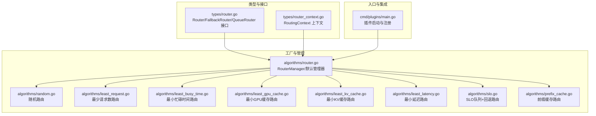
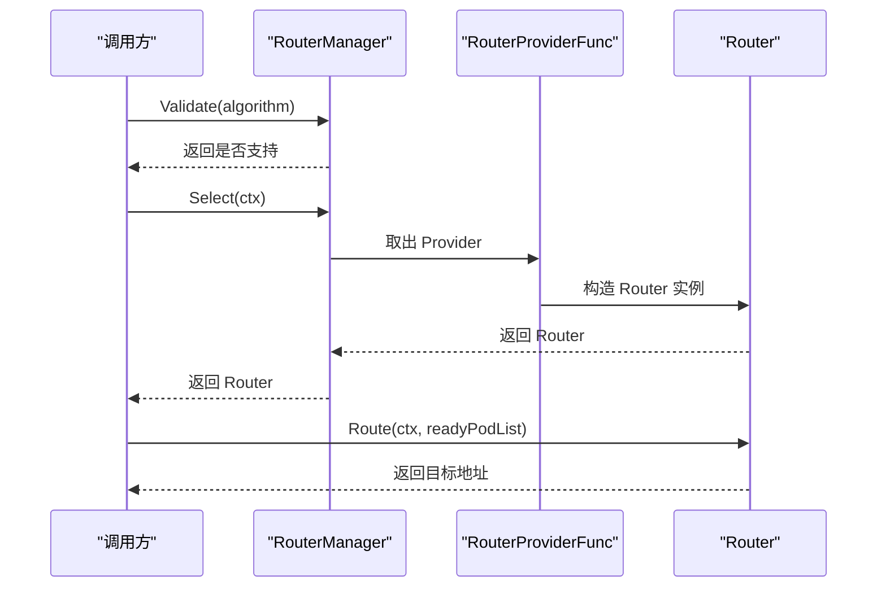
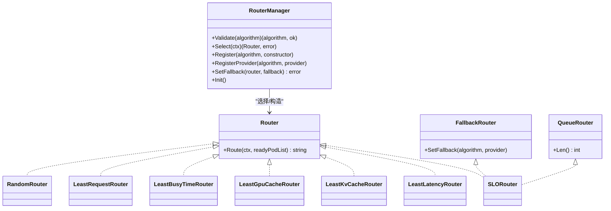
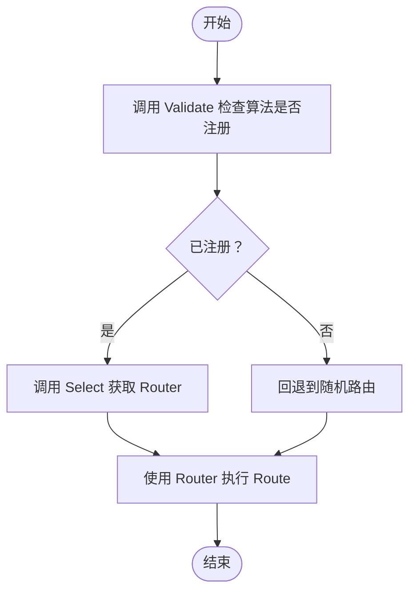
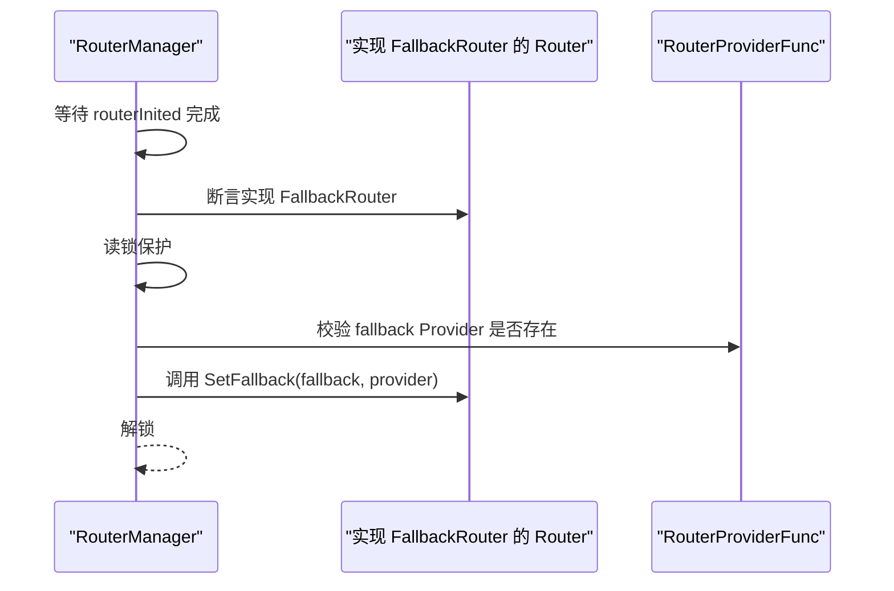
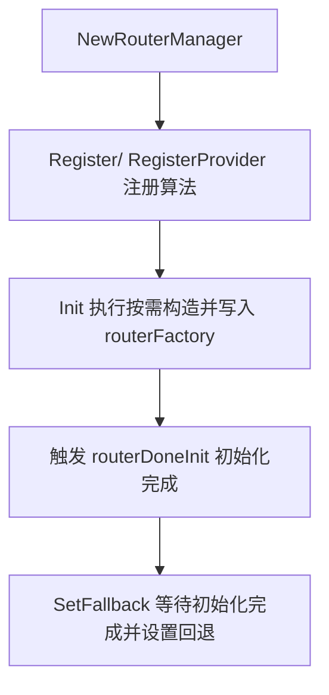
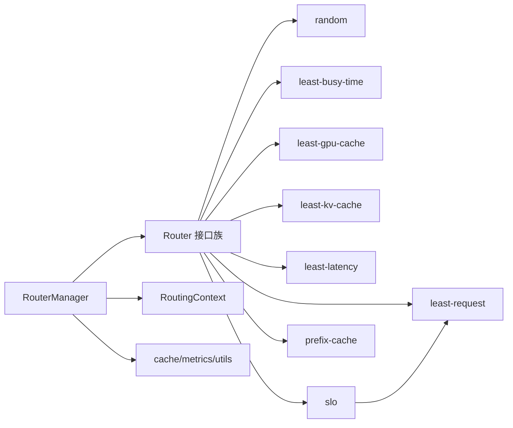

# 路由器工厂模式

<cite>
**本文引用的文件**
- [pkg/plugins/gateway/algorithms/router.go](file://pkg/plugins/gateway/algorithms/router.go)
- [pkg/types/router.go](file://pkg/types/router.go)
- [pkg/types/router_context.go](file://pkg/types/router_context.go)
- [pkg/plugins/gateway/algorithms/random.go](file://pkg/plugins/gateway/algorithms/random.go)
- [pkg/plugins/gateway/algorithms/least_request.go](file://pkg/plugins/gateway/algorithms/least_request.go)
- [pkg/plugins/gateway/algorithms/least_busy_time.go](file://pkg/plugins/gateway/algorithms/least_busy_time.go)
- [pkg/plugins/gateway/algorithms/least_gpu_cache.go](file://pkg/plugins/gateway/algorithms/least_gpu_cache.go)
- [pkg/plugins/gateway/algorithms/least_kv_cache.go](file://pkg/plugins/gateway/algorithms/least_kv_cache.go)
- [pkg/plugins/gateway/algorithms/least_latency.go](file://pkg/plugins/gateway/algorithms/least_latency.go)
- [pkg/plugins/gateway/algorithms/slo.go](file://pkg/plugins/gateway/algorithms/slo.go)
- [pkg/plugins/gateway/algorithms/prefix_cache.go](file://pkg/plugins/gateway/algorithms/prefix_cache.go)
- [pkg/plugins/gateway/algorithms/router_test.go](file://pkg/plugins/gateway/algorithms/router_test.go)
- [cmd/plugins/main.go](file://cmd/plugins/main.go)
</cite>

## 目录
1. [简介](#简介)
2. [项目结构](#项目结构)
3. [核心组件](#核心组件)
4. [架构总览](#架构总览)
5. [详细组件分析](#详细组件分析)
6. [依赖分析](#依赖分析)
7. [性能考虑](#性能考虑)
8. [故障排查指南](#故障排查指南)
9. [结论](#结论)
10. [附录：扩展与最佳实践](#附录扩展与最佳实践)

## 简介
本文件系统性阐述 AIBrix 路由器工厂模式的设计与实现，重点围绕 RouterManager 的工厂架构、路由器注册机制（Register 与 RegisterProvider）、算法构造器管理、路由器验证与选择流程、回退机制（SetFallback）以及线程安全与初始化/超时控制。同时提供扩展指南与最佳实践，帮助开发者快速实现自定义路由器并正确接入路由体系。

## 项目结构
与路由器工厂模式直接相关的代码主要位于以下模块：
- 路由器接口与上下文类型定义：pkg/types
- 路由器工厂与默认管理器：pkg/plugins/gateway/algorithms/router.go
- 典型路由器实现：random、least-request、least-busy-time、least-gpu-cache、least-kv-cache、least-latency、slo、prefix-cache 等
- 使用示例与集成入口：cmd/plugins/main.go
- 单元测试：pkg/plugins/gateway/algorithms/router_test.go

**图表来源**
- [pkg/types/router.go:19-55](file://pkg/types/router.go#L19-L55)
- [pkg/types/router_context.go:57-105](file://pkg/types/router_context.go#L57-L105)
- [pkg/plugins/gateway/algorithms/router.go:41-152](file://pkg/plugins/gateway/algorithms/router.go#L41-L152)
- [pkg/plugins/gateway/algorithms/random.go:27-36](file://pkg/plugins/gateway/algorithms/random.go#L27-L36)
- [pkg/plugins/gateway/algorithms/least_request.go:35-39](file://pkg/plugins/gateway/algorithms/least_request.go#L35-L39)
- [pkg/plugins/gateway/algorithms/least_busy_time.go:30-34](file://pkg/plugins/gateway/algorithms/least_busy_time.go#L30-L34)
- [pkg/plugins/gateway/algorithms/least_gpu_cache.go:31-35](file://pkg/plugins/gateway/algorithms/least_gpu_cache.go#L31-L35)
- [pkg/plugins/gateway/algorithms/least_kv_cache.go:32-35](file://pkg/plugins/gateway/algorithms/least_kv_cache.go#L32-L35)
- [pkg/plugins/gateway/algorithms/least_latency.go:30-34](file://pkg/plugins/gateway/algorithms/least_latency.go#L30-L34)
- [pkg/plugins/gateway/algorithms/slo.go:24-54](file://pkg/plugins/gateway/algorithms/slo.go#L24-L54)
- [pkg/plugins/gateway/algorithms/prefix_cache.go:54-58](file://pkg/plugins/gateway/algorithms/prefix_cache.go#L54-L58)
- [cmd/plugins/main.go:95-98](file://cmd/plugins/main.go#L95-L98)

**章节来源**
- [pkg/plugins/gateway/algorithms/router.go:17-152](file://pkg/plugins/gateway/algorithms/router.go#L17-L152)
- [pkg/types/router.go:19-55](file://pkg/types/router.go#L19-L55)
- [pkg/types/router_context.go:57-105](file://pkg/types/router_context.go#L57-L105)
- [cmd/plugins/main.go:95-98](file://cmd/plugins/main.go#L95-L98)

## 核心组件
- Router 接口：定义路由选择的核心方法 Route(ctx, readyPodList) → 目标地址
- FallbackRouter 接口：支持设置回退策略的路由器
- QueueRouter 接口：内置队列能力的路由器
- RouterProvider/RouterProviderFunc/RouterProviderRegistrationFunc/RouterConstructor：提供“按需构造”或“直接提供”的两种注册方式
- RouterManager：全局路由器工厂与注册中心，负责注册、验证、选择、初始化与回退设置
- 默认管理器 defaultRM 与全局函数：对外暴露 Validate、Select、Register、RegisterProvider、SetFallback、Init 等便捷入口

关键职责与行为：
- 注册机制：Register(algorithm, constructor) 将构造器注册为“按需构造”，RegisterProvider(algorithm, provider) 直接注册“已构造实例”
- 验证流程：Validate 检查算法是否已注册
- 选择逻辑：Select 基于 RoutingContext.Algorithm 获取对应 RouterProvider 并构造 Router；若未注册则回退到随机路由
- 回退机制：SetFallback 仅对实现了 FallbackRouter 的路由器生效，并在初始化完成信号触发后进行校验与设置
- 初始化与超时：Init 将“按需构造”转换为“已提供”，并在内部通过带超时的 context 标记初始化完成；SetFallback 在初始化完成前阻塞等待

**章节来源**
- [pkg/types/router.go:19-55](file://pkg/types/router.go#L19-L55)
- [pkg/plugins/gateway/algorithms/router.go:41-152](file://pkg/plugins/gateway/algorithms/router.go#L41-L152)

## 架构总览
RouterManager 作为工厂与注册中心，统一管理所有路由算法的注册与选择。典型调用链如下：

**图表来源**
- [pkg/plugins/gateway/algorithms/router.go:57-85](file://pkg/plugins/gateway/algorithms/router.go#L57-L85)
- [pkg/types/router.go:42-55](file://pkg/types/router.go#L42-L55)

## 详细组件分析

### RouterManager 设计与实现
- 数据结构
  - routerFactory：算法到 RouterProviderFunc 的映射
  - routerConstructor：算法到 RouterProviderRegistrationFunc 的映射（用于延迟构造）
  - routerInited/routerDoneInit：带超时的初始化完成信号
  - routerMu：读写锁，保证并发安全
- 关键方法
  - Validate：只读锁保护，检查算法是否已注册
  - Select：只读锁保护，取出 Provider 并构造 Router；不支持则回退随机
  - Register：注册“按需构造”；失败时记录日志
  - RegisterProvider：注册“已提供”的 RouterProviderFunc
  - SetFallback：要求 Router 实现 FallbackRouter；在初始化完成后校验 fallback 是否已注册并设置
  - Init：遍历 routerConstructor，执行构造并将结果写入 routerFactory；随后发出初始化完成信号

并发与初始化要点：
- 读多写少场景采用 RWMutex；Select 仅读取，Register/SetFallback/Init 写入
- 初始化超时：NewRouterManager 创建带 5 秒超时的 context；SetFallback 在初始化完成前阻塞等待
- 回退设置失败的错误类型：不支持回退、回退算法未注册、未初始化等

**章节来源**
- [pkg/plugins/gateway/algorithms/router.go:41-152](file://pkg/plugins/gateway/algorithms/router.go#L41-L152)

### 路由器接口族
- Router：Route(ctx, readyPodList) → 目标地址
- QueueRouter：在 Router 基础上增加 Len() 队列长度查询
- FallbackRouter：在 Router 基础上增加 SetFallback(algorithm, providerFunc)
- Provider 与 Constructor：
  - RouterProviderFunc(ctx) → (Router, error)
  - RouterProviderRegistrationFunc() → RouterProviderFunc
  - RouterConstructor() → (Router, error)

这些接口为“按需构造”和“直接提供”两种注册路径提供了统一抽象。

**章节来源**
- [pkg/types/router.go:19-55](file://pkg/types/router.go#L19-L55)

### 路由器上下文 RoutingContext
- 字段：算法、模型、消息、请求ID、用户、请求/结束/路由耗时、响应头、配置文件、目标Pod原子指针、端口原子值、错误原子指针、令牌化缓存、输出预测器等
- 方法：
  - NewContext/ NewRoutingContext：从对象池获取上下文
  - SetTargetPod/TargetPod/TargetAddress：设置/等待/返回目标Pod与地址
  - SetError/HasError/HasRouted：异步设置错误与状态查询
  - PromptTokens/TokenLength/Features：特征提取
  - TargetPort/SetTargetPort：端口设置与读取
  - Delete：释放回池并解除阻塞

该上下文是所有路由器实现的输入与输出载体，确保跨组件的一致性与可观察性。

**章节来源**
- [pkg/types/router_context.go:57-353](file://pkg/types/router_context.go#L57-L353)

### 典型路由器实现与特性
- 随机路由（random.go）
  - 算法常量：random
  - 提供 Provider：RandomRouterProviderFunc
  - 路由策略：随机选择可用 Pod，无指标依赖
- 最少请求数（least_request.go）
  - 算法常量：least-request
  - 依赖：本地缓存统计 Running Requests
  - 回退：当无有效指标时回退随机
- 最小忙碌时间（least_busy_time.go）
  - 算法常量：least-busy-time
  - 依赖：GPU 忙碌时间比例
  - 回退：无指标时回退随机
- 最小GPU缓存（least_gpu_cache.go）
  - 算法常量：least-gpu-cache
  - 依赖：GPU 缓存使用百分比
  - 回退：无指标时回退随机
- 最小KV缓存（least_kv_cache.go）
  - 算法常量：least-kv-cache
  - 依赖：GPU/CPU 缓存使用百分比之和
  - 回退：无指标时回退随机
- 最小延迟（least_latency.go）
  - 算法常量：least-latency
  - 依赖：排队/预填充/解码期望延迟
  - 回退：无指标时回退随机
- SLO 路由（slo.go）
  - 算法常量：slo、slo-pack-load、slo-least-load、slo-least-load-pulling
  - 特点：基于队列的 SLO-aware 路由，支持回退机制
  - 构造：NewSLORouter 中注册默认回退为 RouterLeastRequest
- 前缀缓存（prefix_cache.go）
  - 算法常量：prefix-cache
  - 特点：基于前缀缓存索引与分词器的复杂路由决策，支持本地指标与KV同步
  - 注册：init 中注册为 RouterPrefixCache

**图表来源**
- [pkg/types/router.go:19-55](file://pkg/types/router.go#L19-L55)
- [pkg/plugins/gateway/algorithms/router.go:41-152](file://pkg/plugins/gateway/algorithms/router.go#L41-L152)
- [pkg/plugins/gateway/algorithms/random.go:27-62](file://pkg/plugins/gateway/algorithms/random.go#L27-L62)
- [pkg/plugins/gateway/algorithms/least_request.go:35-97](file://pkg/plugins/gateway/algorithms/least_request.go#L35-L97)
- [pkg/plugins/gateway/algorithms/least_busy_time.go:30-81](file://pkg/plugins/gateway/algorithms/least_busy_time.go#L30-L81)
- [pkg/plugins/gateway/algorithms/least_gpu_cache.go:31-99](file://pkg/plugins/gateway/algorithms/least_gpu_cache.go#L31-L99)
- [pkg/plugins/gateway/algorithms/least_kv_cache.go:32-97](file://pkg/plugins/gateway/algorithms/least_kv_cache.go#L32-L97)
- [pkg/plugins/gateway/algorithms/least_latency.go:30-153](file://pkg/plugins/gateway/algorithms/least_latency.go#L30-L153)
- [pkg/plugins/gateway/algorithms/slo.go:56-94](file://pkg/plugins/gateway/algorithms/slo.go#L56-L94)

**章节来源**
- [pkg/plugins/gateway/algorithms/random.go:27-62](file://pkg/plugins/gateway/algorithms/random.go#L27-L62)
- [pkg/plugins/gateway/algorithms/least_request.go:35-97](file://pkg/plugins/gateway/algorithms/least_request.go#L35-L97)
- [pkg/plugins/gateway/algorithms/least_busy_time.go:30-81](file://pkg/plugins/gateway/algorithms/least_busy_time.go#L30-L81)
- [pkg/plugins/gateway/algorithms/least_gpu_cache.go:31-99](file://pkg/plugins/gateway/algorithms/least_gpu_cache.go#L31-L99)
- [pkg/plugins/gateway/algorithms/least_kv_cache.go:32-97](file://pkg/plugins/gateway/algorithms/least_kv_cache.go#L32-L97)
- [pkg/plugins/gateway/algorithms/least_latency.go:30-153](file://pkg/plugins/gateway/algorithms/least_latency.go#L30-L153)
- [pkg/plugins/gateway/algorithms/slo.go:56-94](file://pkg/plugins/gateway/algorithms/slo.go#L56-L94)
- [pkg/plugins/gateway/algorithms/prefix_cache.go:54-58](file://pkg/plugins/gateway/algorithms/prefix_cache.go#L54-L58)

### 路由器验证与选择流程
- 验证（Validate）：在只读锁保护下检查算法是否已注册
- 选择（Select）：在只读锁保护下取出 Provider 并构造 Router；若未注册则回退随机路由
- 回退（SetFallback）：要求传入的 Router 实现 FallbackRouter；在初始化完成信号触发后，校验 fallback 是否已注册并设置

**图表来源**
- [pkg/plugins/gateway/algorithms/router.go:57-85](file://pkg/plugins/gateway/algorithms/router.go#L57-L85)

**章节来源**
- [pkg/plugins/gateway/algorithms/router.go:57-85](file://pkg/plugins/gateway/algorithms/router.go#L57-L85)

### 回退机制（SetFallback）
- 适用条件：传入的 Router 必须实现 FallbackRouter
- 初始化等待：在 RouterManager 初始化完成信号触发前阻塞等待
- 校验与设置：在只读锁保护下检查 fallback 对应的 Provider 是否已注册，然后调用 SetFallback 设置

**图表来源**
- [pkg/plugins/gateway/algorithms/router.go:115-139](file://pkg/plugins/gateway/algorithms/router.go#L115-L139)

**章节来源**
- [pkg/plugins/gateway/algorithms/router.go:115-139](file://pkg/plugins/gateway/algorithms/router.go#L115-L139)

### 线程安全设计
- 读写分离：Select/Validate 使用 RWMutex 的读锁；Register/SetFallback/Init 使用写锁
- 并发安全：所有共享状态（routerFactory、routerConstructor、routerInited）均受锁保护
- 初始化信号：通过带超时的 context 控制初始化完成时机，避免阻塞

**章节来源**
- [pkg/plugins/gateway/algorithms/router.go:41-55](file://pkg/plugins/gateway/algorithms/router.go#L41-L55)
- [pkg/plugins/gateway/algorithms/router.go:141-149](file://pkg/plugins/gateway/algorithms/router.go#L141-L149)

### 初始化流程与超时处理
- NewRouterManager：创建带 5 秒超时的初始化上下文
- Register：注册“按需构造”函数
- Init：遍历“按需构造”函数，逐一执行构造并写入 routerFactory，最后触发初始化完成信号
- SetFallback：在初始化完成前阻塞等待，防止在未完全注册时设置回退

**图表来源**
- [pkg/plugins/gateway/algorithms/router.go:49-55](file://pkg/plugins/gateway/algorithms/router.go#L49-L55)
- [pkg/plugins/gateway/algorithms/router.go:87-103](file://pkg/plugins/gateway/algorithms/router.go#L87-L103)
- [pkg/plugins/gateway/algorithms/router.go:141-149](file://pkg/plugins/gateway/algorithms/router.go#L141-L149)
- [pkg/plugins/gateway/algorithms/router.go:115-139](file://pkg/plugins/gateway/algorithms/router.go#L115-L139)

**章节来源**
- [pkg/plugins/gateway/algorithms/router.go:49-55](file://pkg/plugins/gateway/algorithms/router.go#L49-L55)
- [pkg/plugins/gateway/algorithms/router.go:87-103](file://pkg/plugins/gateway/algorithms/router.go#L87-L103)
- [pkg/plugins/gateway/algorithms/router.go:141-149](file://pkg/plugins/gateway/algorithms/router.go#L141-L149)
- [pkg/plugins/gateway/algorithms/router.go:115-139](file://pkg/plugins/gateway/algorithms/router.go#L115-L139)

### 集成入口与使用示例
- 插件启动时注册依赖型算法（如 Power of Two）
- 通过 cache.InitWithOptions 注入 ModelRouterProvider，使路由工厂与缓存/发现服务协同工作

**章节来源**
- [cmd/plugins/main.go:95-98](file://cmd/plugins/main.go#L95-L98)
- [cmd/plugins/main.go:147-152](file://cmd/plugins/main.go#L147-L152)

## 依赖分析
- RouterManager 依赖 Router 接口族与 RoutingContext
- 具体路由器实现依赖 cache/metrics/utils 等基础设施
- SLO 路由依赖 queue.SLOQueue 与 RouterLeastRequest 作为回退
- 插件入口通过 Redis/K8s/DiscoveryProvider 注入依赖，驱动路由工厂与缓存初始化

**图表来源**
- [pkg/plugins/gateway/algorithms/router.go:41-152](file://pkg/plugins/gateway/algorithms/router.go#L41-L152)
- [pkg/types/router.go:19-55](file://pkg/types/router.go#L19-L55)
- [pkg/types/router_context.go:57-105](file://pkg/types/router_context.go#L57-L105)
- [pkg/plugins/gateway/algorithms/slo.go:56-94](file://pkg/plugins/gateway/algorithms/slo.go#L56-L94)

**章节来源**
- [pkg/plugins/gateway/algorithms/router.go:41-152](file://pkg/plugins/gateway/algorithms/router.go#L41-L152)
- [pkg/plugins/gateway/algorithms/slo.go:56-94](file://pkg/plugins/gateway/algorithms/slo.go#L56-L94)

## 性能考虑
- 路由选择为 O(n) 遍历候选 Pod，建议在上游过滤不可用 Pod，减少无效计算
- 指标获取依赖缓存层，注意缓存命中率与更新频率，避免热点指标带来的抖动
- 随机回退策略简单高效，适合指标缺失或异常场景
- SLO 路由引入队列与预测，适合高吞吐与低延迟场景，但需要更严格的指标质量保障

## 故障排查指南
常见错误与定位：
- 初始化超时：检查 Init 是否被调用、依赖服务是否就绪
- 不支持回退：确认传入的 Router 实现了 FallbackRouter
- 回退算法未注册：确认 SetFallback 中的 fallback 已通过 Register 或 RegisterProvider 注册
- 无可用 Pod：检查 Ready 条件与 PodIP，必要时启用随机回退
- 指标缺失：针对 least-* 系列路由，确认指标采集与缓存可用性

单元测试覆盖：
- 无 Pod/无 IP Pod 场景
- 随机/最少请求数/吞吐等路由的基本行为
- 回退等待初始化完成的行为

**章节来源**
- [pkg/plugins/gateway/algorithms/router_test.go:42-196](file://pkg/plugins/gateway/algorithms/router_test.go#L42-L196)
- [pkg/plugins/gateway/algorithms/router.go:34-39](file://pkg/plugins/gateway/algorithms/router.go#L34-L39)

## 结论
RouterManager 以工厂模式为核心，结合 Provider/Constructor 两种注册路径，提供了灵活、可扩展且线程安全的路由器注册与选择机制。通过初始化超时与回退设置，系统在异常情况下仍能保持稳健运行。配合 SLO 队列与多种指标感知路由策略，AIBrix 路由器工厂能够满足多样化的推理路由需求。

## 附录：扩展与最佳实践

### 如何实现自定义路由器
- 实现 Router 接口的 Route(ctx, readyPodList) 方法
- 若需要回退能力，实现 FallbackRouter.SetFallback
- 若需要内置队列能力，实现 QueueRouter
- 在 init 中注册算法：
  - 若需要延迟构造：使用 Register(算法常量, New自定义路由器)
  - 若已有实例：使用 RegisterProvider(算法常量, ProviderFunc)

参考实现位置：
- [pkg/plugins/gateway/algorithms/random.go:27-62](file://pkg/plugins/gateway/algorithms/random.go#L27-L62)
- [pkg/plugins/gateway/algorithms/least_request.go:35-97](file://pkg/plugins/gateway/algorithms/least_request.go#L35-L97)
- [pkg/plugins/gateway/algorithms/slo.go:56-94](file://pkg/plugins/gateway/algorithms/slo.go#L56-L94)

**章节来源**
- [pkg/plugins/gateway/algorithms/random.go:27-62](file://pkg/plugins/gateway/algorithms/random.go#L27-L62)
- [pkg/plugins/gateway/algorithms/least_request.go:35-97](file://pkg/plugins/gateway/algorithms/least_request.go#L35-L97)
- [pkg/plugins/gateway/algorithms/slo.go:56-94](file://pkg/plugins/gateway/algorithms/slo.go#L56-L94)

### 如何注册新算法
- 使用 Register：适用于需要延迟构造的算法
- 使用 RegisterProvider：适用于已有 Router 实例或需要状态化 Provider 的场景
- 在 Init 前确保所有算法已注册；若依赖外部服务（如 Redis），在插件启动阶段完成注册

参考位置：
- [pkg/plugins/gateway/algorithms/router.go:87-113](file://pkg/plugins/gateway/algorithms/router.go#L87-L113)
- [cmd/plugins/main.go:95-98](file://cmd/plugins/main.go#L95-L98)

**章节来源**
- [pkg/plugins/gateway/algorithms/router.go:87-113](file://pkg/plugins/gateway/algorithms/router.go#L87-L113)
- [cmd/plugins/main.go:95-98](file://cmd/plugins/main.go#L95-L98)

### 处理初始化错误
- 确保 Init 在依赖服务就绪后调用
- 对 Register 中的构造错误进行日志记录与告警
- 使用 SetFallback 时，先验证 fallback 算法是否已注册

参考位置：
- [pkg/plugins/gateway/algorithms/router.go:87-103](file://pkg/plugins/gateway/algorithms/router.go#L87-L103)
- [pkg/plugins/gateway/algorithms/router.go:115-139](file://pkg/plugins/gateway/algorithms/router.go#L115-L139)

**章节来源**
- [pkg/plugins/gateway/algorithms/router.go:87-103](file://pkg/plugins/gateway/algorithms/router.go#L87-L103)
- [pkg/plugins/gateway/algorithms/router.go:115-139](file://pkg/plugins/gateway/algorithms/router.go#L115-L139)

### 使用模式与最佳实践
- 在插件启动阶段完成算法注册与 Init
- 对于指标敏感的路由（least-* 系列），确保指标采集与缓存稳定
- 对关键路由启用回退策略，提升鲁棒性
- 使用 RoutingContext 的特征与输出预测器，优化路由决策

参考位置：
- [cmd/plugins/main.go:147-152](file://cmd/plugins/main.go#L147-L152)
- [pkg/types/router_context.go:178-192](file://pkg/types/router_context.go#L178-L192)

**章节来源**
- [cmd/plugins/main.go:147-152](file://cmd/plugins/main.go#L147-L152)
- [pkg/types/router_context.go:178-192](file://pkg/types/router_context.go#L178-L192)