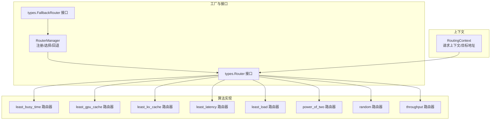
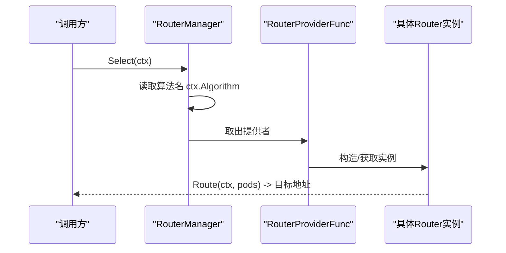
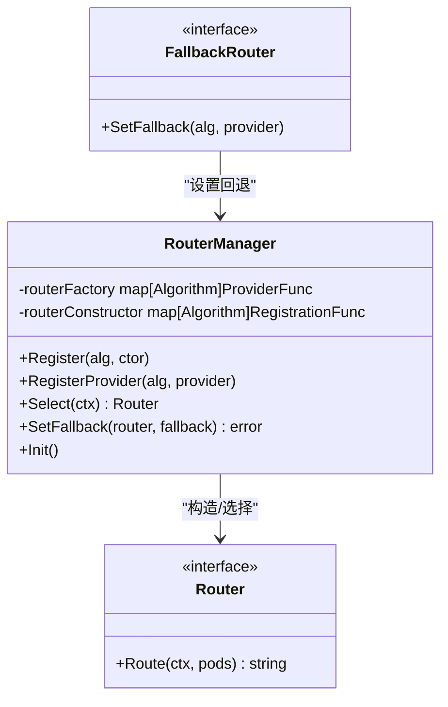
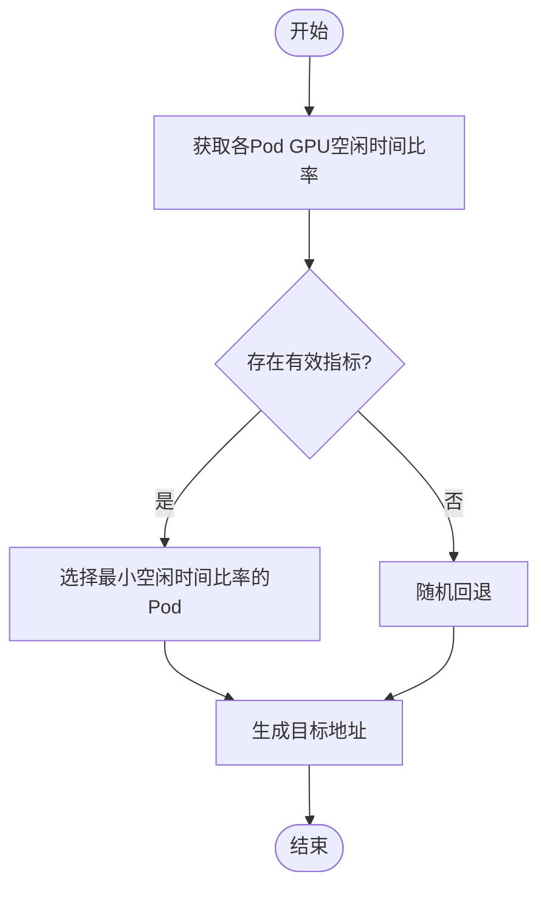
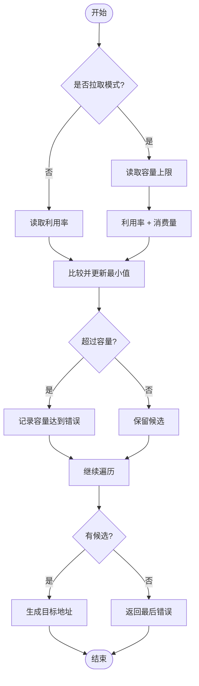
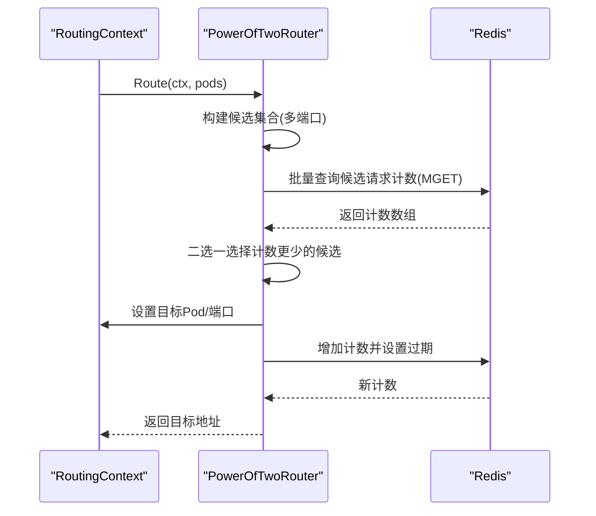
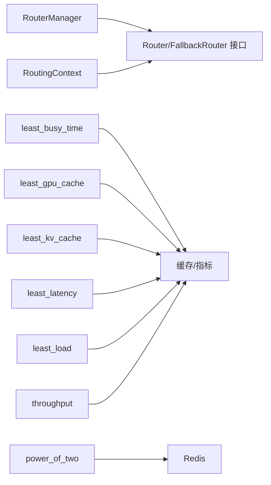

# 路由算法系统

<cite>
**本文引用的文件**
- [pkg/plugins/gateway/algorithms/router.go](file://pkg/plugins/gateway/algorithms/router.go)
- [pkg/plugins/gateway/algorithms/model_router_factory.go](file://pkg/plugins/gateway/algorithms/model_router_factory.go)
- [pkg/types/router.go](file://pkg/types/router.go)
- [pkg/types/router_context.go](file://pkg/types/router_context.go)
- [pkg/plugins/gateway/algorithms/least_busy_time.go](file://pkg/plugins/gateway/algorithms/least_busy_time.go)
- [pkg/plugins/gateway/algorithms/least_gpu_cache.go](file://pkg/plugins/gateway/algorithms/least_gpu_cache.go)
- [pkg/plugins/gateway/algorithms/least_kv_cache.go](file://pkg/plugins/gateway/algorithms/least_kv_cache.go)
- [pkg/plugins/gateway/algorithms/least_latency.go](file://pkg/plugins/gateway/algorithms/least_latency.go)
- [pkg/plugins/gateway/algorithms/least_load.go](file://pkg/plugins/gateway/algorithms/least_load.go)
- [pkg/plugins/gateway/algorithms/power_of_two.go](file://pkg/plugins/gateway/algorithms/power_of_two.go)
- [pkg/plugins/gateway/algorithms/random.go](file://pkg/plugins/gateway/algorithms/random.go)
- [pkg/plugins/gateway/algorithms/throughput.go](file://pkg/plugins/gateway/algorithms/throughput.go)
- [pkg/plugins/gateway/algorithms/fallback.go](file://pkg/plugins/gateway/algorithms/fallback.go)
- [pkg/plugins/gateway/algorithms/util.go](file://pkg/plugins/gateway/algorithms/util.go)
- [pkg/plugins/gateway/algorithms/least_busy_time_test.go](file://pkg/plugins/gateway/algorithms/least_busy_time_test.go)
- [pkg/plugins/gateway/algorithms/least_gpu_cache_test.go](file://pkg/plugins/gateway/algorithms/least_gpu_cache_test.go)
- [pkg/plugins/gateway/algorithms/least_kv_cache_test.go](file://pkg/plugins/gateway/algorithms/least_kv_cache_test.go)
- [pkg/plugins/gateway/algorithms/least_latency_test.go](file://pkg/plugins/gateway/algorithms/least_latency_test.go)
- [pkg/plugins/gateway/algorithms/least_load_test.go](file://pkg/plugins/gateway/algorithms/least_load_test.go)
</cite>

## 目录
1. [简介](#简介)
2. [项目结构](#项目结构)
3. [核心组件](#核心组件)
4. [架构总览](#架构总览)
5. [详细组件分析](#详细组件分析)
6. [依赖关系分析](#依赖关系分析)
7. [性能考量](#性能考量)
8. [故障排查指南](#故障排查指南)
9. [结论](#结论)
10. [附录](#附录)

## 简介
本技术文档面向AIBrix路由算法系统，聚焦于“路由算法工厂模式”的设计与实现，涵盖RouterFactory的注册与选择机制、各路由算法的实现原理与适用场景（least_busy_time、least_gpu_cache、least_kv_cache、least_latency、least_load、power_of_two等），并提供算法选择逻辑、权重计算方式、负载均衡策略、使用场景建议、性能对比分析以及扩展指南。

## 项目结构
路由算法位于网关插件模块中，采用“工厂 + 接口 + 多实现”的分层组织方式：
- 工厂与管理器：RouterManager负责算法注册、构造、选择与回退设置
- 接口层：types.Router定义统一路由接口；types.FallbackRouter支持链式回退
- 实现层：各具体路由算法以init函数在包级完成注册
- 上下文层：types.RoutingContext封装请求上下文、目标Pod与端口、统计与追踪信息

图表来源
- [pkg/plugins/gateway/algorithms/router.go:41-153](file://pkg/plugins/gateway/algorithms/router.go#L41-L153)
- [pkg/types/router.go:20-56](file://pkg/types/router.go#L20-L56)
- [pkg/types/router_context.go:59-105](file://pkg/types/router_context.go#L59-L105)

章节来源
- [pkg/plugins/gateway/algorithms/router.go:41-153](file://pkg/plugins/gateway/algorithms/router.go#L41-L153)
- [pkg/types/router.go:20-56](file://pkg/types/router.go#L20-L56)
- [pkg/types/router_context.go:59-105](file://pkg/types/router_context.go#L59-L105)

## 核心组件
- RouterManager：全局单例，维护算法名到构造器与提供者的映射，支持初始化、注册、选择与回退设置
- Router接口：统一的Route方法，输入为RoutingContext与可路由Pod列表，输出为目标地址字符串或错误
- FallbackRouter接口：支持设置回退算法与提供者，实现链式回退
- RoutingContext：承载请求上下文、目标Pod/端口、统计与追踪字段，提供目标地址生成与状态查询

章节来源
- [pkg/plugins/gateway/algorithms/router.go:41-153](file://pkg/plugins/gateway/algorithms/router.go#L41-L153)
- [pkg/types/router.go:20-56](file://pkg/types/router.go#L20-L56)
- [pkg/types/router_context.go:59-105](file://pkg/types/router_context.go#L59-L105)

## 架构总览
路由算法工厂通过init函数在包加载时注册具体路由器，RouterManager在初始化阶段批量构造并注入工厂映射。运行时根据RoutingContext中的算法名选择对应路由器实例执行路由决策。

图表来源
- [pkg/plugins/gateway/algorithms/router.go:73-85](file://pkg/plugins/gateway/algorithms/router.go#L73-L85)
- [pkg/plugins/gateway/algorithms/router.go:105-113](file://pkg/plugins/gateway/algorithms/router.go#L105-L113)

章节来源
- [pkg/plugins/gateway/algorithms/router.go:73-85](file://pkg/plugins/gateway/algorithms/router.go#L73-L85)
- [pkg/plugins/gateway/algorithms/router.go:105-113](file://pkg/plugins/gateway/algorithms/router.go#L105-L113)

## 详细组件分析

### 工厂模式与算法注册流程
- 包级注册：各算法包在init中调用Register或RegisterProvider完成注册
- 构造器注册：Register接收RouterConstructor，在RouterManager.Init中批量构造并转为ProviderFunc
- 提供者注册：RegisterProvider直接注册ProviderFunc
- 选择与回退：Select根据算法名返回ProviderFunc并构造实例；SetFallback为实现了FallbackRouter的实例设置回退算法

图表来源
- [pkg/plugins/gateway/algorithms/router.go:41-153](file://pkg/plugins/gateway/algorithms/router.go#L41-L153)
- [pkg/types/router.go:34-40](file://pkg/types/router.go#L34-L40)

章节来源
- [pkg/plugins/gateway/algorithms/router.go:87-153](file://pkg/plugins/gateway/algorithms/router.go#L87-L153)
- [pkg/types/router.go:34-40](file://pkg/types/router.go#L34-L40)

### least_busy_time（最空闲时间）
- 选择逻辑：基于GPU空闲时间比率最小化，优先选择空闲率高的节点
- 指标来源：从缓存获取GPUBusyTimeRatio指标
- 回退策略：若无有效指标，随机回退
- 适用场景：追求低占用与高资源利用率，避免GPU过热或满载

图表来源
- [pkg/plugins/gateway/algorithms/least_busy_time.go:52-55](file://pkg/plugins/gateway/algorithms/least_busy_time.go#L52-L55)
- [pkg/plugins/gateway/algorithms/least_busy_time_test.go:32-191](file://pkg/plugins/gateway/algorithms/least_busy_time_test.go#L32-L191)

章节来源
- [pkg/plugins/gateway/algorithms/least_busy_time.go:52-55](file://pkg/plugins/gateway/algorithms/least_busy_time.go#L52-L55)
- [pkg/plugins/gateway/algorithms/least_busy_time_test.go:32-191](file://pkg/plugins/gateway/algorithms/least_busy_time_test.go#L32-L191)

### least_gpu_cache（最少GPU缓存）
- 选择逻辑：基于GPU缓存使用百分比最小化，优先选择缓存占用较低的节点
- 指标来源：从缓存获取GPUCacheUsagePerc指标
- 回退策略：若无有效指标，随机回退
- 适用场景：显存紧张或需要避免缓存污染的推理场景

章节来源
- [pkg/plugins/gateway/algorithms/least_gpu_cache.go:52-55](file://pkg/plugins/gateway/algorithms/least_gpu_cache.go#L52-L55)
- [pkg/plugins/gateway/algorithms/least_gpu_cache_test.go:31-146](file://pkg/plugins/gateway/algorithms/least_gpu_cache_test.go#L31-L146)

### least_kv_cache（最少KV缓存）
- 选择逻辑：基于KV缓存使用百分比最小化，同时考虑CPU缓存使用情况
- 指标来源：从缓存获取KVCacheUsagePerc与CPUCacheUsagePerc指标
- 回退策略：若无有效指标，随机回退
- 适用场景：KV缓存占用敏感、长上下文推理或缓存命中率优化

章节来源
- [pkg/plugins/gateway/algorithms/least_kv_cache.go:52-55](file://pkg/plugins/gateway/algorithms/least_kv_cache.go#L52-L55)
- [pkg/plugins/gateway/algorithms/least_kv_cache_test.go:30-169](file://pkg/plugins/gateway/algorithms/least_kv_cache_test.go#L30-L169)

### least_latency（最低延迟）
- 选择逻辑：综合队列等待时间、预填充与解码耗时、提示/生成吞吐量估算期望延迟
- 指标来源：队列时间、预填充/解码时间、平均提示/生成吞吐量
- 回退策略：若无有效指标，随机回退
- 适用场景：对端到端延迟敏感的在线服务

章节来源
- [pkg/plugins/gateway/algorithms/least_latency.go:51-53](file://pkg/plugins/gateway/algorithms/least_latency.go#L51-L53)
- [pkg/plugins/gateway/algorithms/least_latency_test.go:31-252](file://pkg/plugins/gateway/algorithms/least_latency_test.go#L31-L252)

### least_load（最少负载）
- 选择逻辑：在推送模式下基于利用率最小化；在拉取模式下基于容量上限与消费量综合评估
- 指标来源：利用率与消费量（可结合SLO判断）
- 错误处理：针对容量达到、SLO失败等错误进行分类与回退
- 适用场景：具备负载能力感知的推理池，支持推/拉两种模式

图表来源
- [pkg/plugins/gateway/algorithms/least_load.go:64-130](file://pkg/plugins/gateway/algorithms/least_load.go#L64-L130)

章节来源
- [pkg/plugins/gateway/algorithms/least_load.go:64-130](file://pkg/plugins/gateway/algorithms/least_load.go#L64-L130)
- [pkg/plugins/gateway/algorithms/least_load_test.go:115-369](file://pkg/plugins/gateway/algorithms/least_load_test.go#L115-L369)

### power_of_two（二选一）
- 选择逻辑：随机挑选两个候选Pod（含多端口组合），基于Redis计数选择当前运行请求数更少的节点
- 计数存储：按模型+Pod+端口+时间窗口键聚合，周期性轮换键避免数据膨胀
- 追踪与幂等：实现RequestTracker接口，确保Add/Done配对，避免重复增减
- 适用场景：大规模在线推理、热点均衡与低延迟排队

图表来源
- [pkg/plugins/gateway/algorithms/power_of_two.go:117-184](file://pkg/plugins/gateway/algorithms/power_of_two.go#L117-L184)
- [pkg/plugins/gateway/algorithms/power_of_two.go:224-281](file://pkg/plugins/gateway/algorithms/power_of_two.go#L224-L281)
- [pkg/plugins/gateway/algorithms/power_of_two.go:304-354](file://pkg/plugins/gateway/algorithms/power_of_two.go#L304-L354)

章节来源
- [pkg/plugins/gateway/algorithms/power_of_two.go:117-184](file://pkg/plugins/gateway/algorithms/power_of_two.go#L117-L184)
- [pkg/plugins/gateway/algorithms/power_of_two.go:224-281](file://pkg/plugins/gateway/algorithms/power_of_two.go#L224-L281)
- [pkg/plugins/gateway/algorithms/power_of_two.go:304-354](file://pkg/plugins/gateway/algorithms/power_of_two.go#L304-L354)

### random（随机）
- 选择逻辑：从可路由Pod中随机选择
- 适用场景：快速验证、无特殊负载特征的场景或作为回退兜底

章节来源
- [pkg/plugins/gateway/algorithms/random.go:45-57](file://pkg/plugins/gateway/algorithms/random.go#L45-L57)

### throughput（吞吐）
- 选择逻辑：基于平均提示/生成吞吐量加权计算总吞吐，选择吞吐更高的节点
- 指标来源：AvgPromptToksPerReq、AvgGenerationToksPerReq
- 回退策略：若无有效指标，随机回退
- 适用场景：追求整体吞吐最大化、批处理友好的推理集群

章节来源
- [pkg/plugins/gateway/algorithms/throughput.go:52-91](file://pkg/plugins/gateway/algorithms/throughput.go#L52-L91)

### FallbackRouter（回退机制）
- 设计：实现FallbackRouter接口的路由器可在主算法失败时自动切换到回退算法
- 默认回退：默认回退至random算法
- 使用：通过SetFallback在RouterManager初始化完成后设置

章节来源
- [pkg/plugins/gateway/algorithms/fallback.go:26-48](file://pkg/plugins/gateway/algorithms/fallback.go#L26-L48)
- [pkg/plugins/gateway/algorithms/router.go:115-139](file://pkg/plugins/gateway/algorithms/router.go#L115-L139)

## 依赖关系分析
- RouterManager依赖types.Router与types.FallbackRouter接口，实现算法注册、选择与回退
- 各算法实现依赖缓存与指标系统（metrics）获取运行时指标
- PowerOfTwoRouter额外依赖Redis用于实时请求计数
- RoutingContext提供目标地址生成、并发安全的目标Pod设置与错误传播

图表来源
- [pkg/plugins/gateway/algorithms/router.go:41-153](file://pkg/plugins/gateway/algorithms/router.go#L41-L153)
- [pkg/plugins/gateway/algorithms/power_of_two.go:91-100](file://pkg/plugins/gateway/algorithms/power_of_two.go#L91-L100)

章节来源
- [pkg/plugins/gateway/algorithms/router.go:41-153](file://pkg/plugins/gateway/algorithms/router.go#L41-L153)
- [pkg/plugins/gateway/algorithms/power_of_two.go:91-100](file://pkg/plugins/gateway/algorithms/power_of_two.go#L91-L100)

## 性能考量
- least_load：支持拉取模式，结合容量上限与消费量，避免超载；错误类型区分有助于快速失败与降级
- power_of_two：Redis批量查询与键轮换降低网络开销与内存压力；计数增删配对保证一致性
- least_latency：综合队列、预填充与解码时间，适合低延迟场景；无指标时回退随机
- least_gpu_cache/least_kv_cache：基于缓存使用率，适合显存/缓存敏感场景
- throughput：基于吞吐量加权，适合高吞吐场景；无指标时回退随机
- random：简单高效，适合作为兜底或基准对比

## 故障排查指南
- 无可用Pod：检查Pod就绪状态与IP分配；相关算法会返回相应错误
- 指标缺失：确认指标采集与缓存可用；必要时启用回退算法
- Redis不可用：PowerOfTwoRouter在批量查询失败时返回零计数并记录日志；检查连接与键空间
- 容量达到/SLO失败：least_load在拉取模式下遇到容量达到或SLO失败会跳过该Pod并尝试其他候选
- 回退未生效：确认RouterManager.Init已完成，且SetFallback已正确设置

章节来源
- [pkg/plugins/gateway/algorithms/least_load.go:132-140](file://pkg/plugins/gateway/algorithms/least_load.go#L132-L140)
- [pkg/plugins/gateway/algorithms/power_of_two.go:236-243](file://pkg/plugins/gateway/algorithms/power_of_two.go#L236-L243)
- [pkg/plugins/gateway/algorithms/fallback.go:36-47](file://pkg/plugins/gateway/algorithms/fallback.go#L36-L47)

## 结论
AIBrix路由算法系统通过工厂模式实现了高度可扩展的路由策略体系。各算法围绕不同目标（空闲度、缓存占用、延迟、负载、吞吐、均衡）提供针对性方案，并辅以回退与错误处理机制提升鲁棒性。生产部署中应结合业务特征选择合适算法，并在指标缺失或异常情况下启用回退策略。

## 附录

### 算法选择逻辑与权重计算
- least_busy_time：以GPU空闲时间比率作为权重，越小越优
- least_gpu_cache/least_kv_cache：以缓存使用百分比作为权重，越小越优
- least_latency：综合队列等待、预填充/解码时间与吞吐估算，越低越优
- least_load：推送模式以利用率，拉取模式以利用率+消费量为权重，越小越优
- power_of_two：以Redis计数为权重，越小越优
- throughput：以平均提示/生成吞吐量加权总吞吐，越大越优
- random：无权重，均匀分布

### 使用场景建议
- 在线低延迟服务：least_latency 或 least_busy_time
- 显存/缓存敏感：least_gpu_cache 或 least_kv_cache
- 高吞吐批处理：throughput
- 规模化在线推理：power_of_two
- 快速验证/兜底：random
- 具备容量感知的推理池：least_load（推/拉模式）

### 配置参数说明
- least_busy_time/least_gpu_cache/least_kv_cache/least_latency/throughput：依赖缓存指标，需确保指标可用
- power_of_two：
  - Redis客户端：必须配置
  - 键轮换间隔：默认1小时
  - 请求追踪超时：默认5分钟
- least_load：
  - 推送模式：仅使用利用率
  - 拉取模式：使用利用率+消费量并与容量上限比较

### 算法扩展指南
- 实现步骤
  - 定义算法常量与构造函数
  - 在init中调用Register或RegisterProvider完成注册
  - 实现types.Router接口的Route方法
  - 如需回退，实现types.FallbackRouter接口
  - 在RouterManager.Init后通过SetFallback设置回退算法
- 注意事项
  - 正确处理无指标/错误场景并提供回退
  - 并发安全地设置RoutingContext的目标Pod
  - 对外部依赖（如Redis）做好错误处理与可观测性

章节来源
- [pkg/plugins/gateway/algorithms/router.go:87-153](file://pkg/plugins/gateway/algorithms/router.go#L87-L153)
- [pkg/plugins/gateway/algorithms/fallback.go:26-48](file://pkg/plugins/gateway/algorithms/fallback.go#L26-L48)
- [pkg/plugins/gateway/algorithms/util.go:121-133](file://pkg/plugins/gateway/algorithms/util.go#L121-L133)