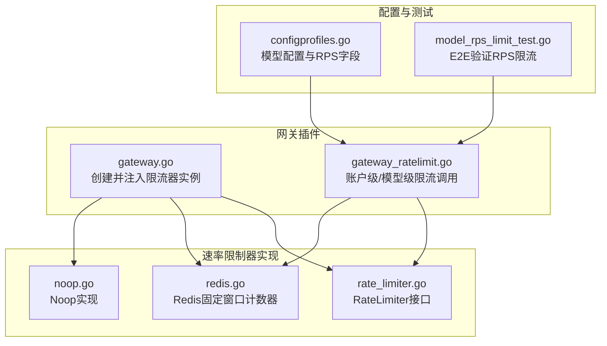
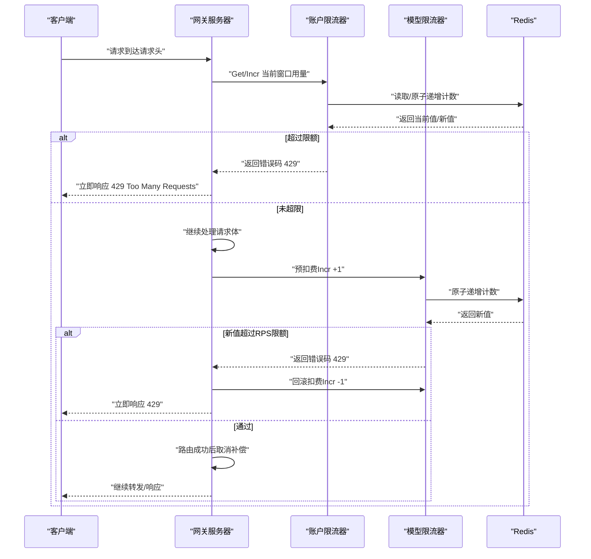
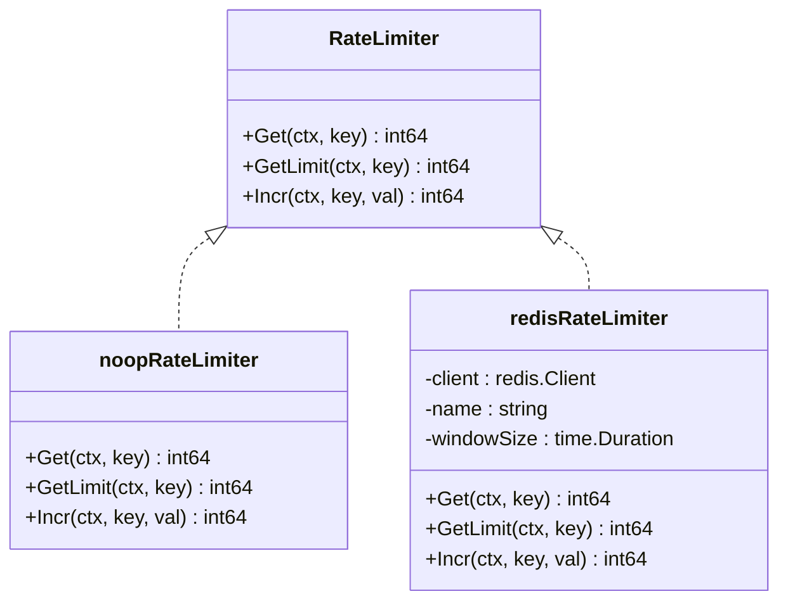
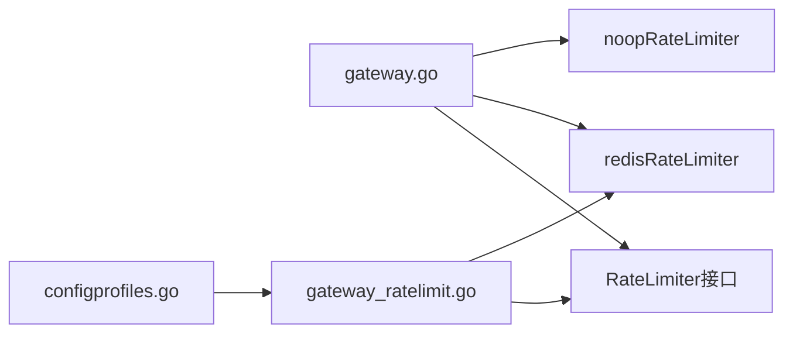

# 速率限制系统

<cite>
**本文引用的文件**
- [rate_limiter.go](file://pkg/plugins/gateway/ratelimiter/rate_limiter.go)
- [noop.go](file://pkg/plugins/gateway/ratelimiter/noop.go)
- [redis.go](file://pkg/plugins/gateway/ratelimiter/redis.go)
- [README.md](file://pkg/plugins/gateway/ratelimiter/README.md)
- [ratelimiter_test.go](file://pkg/plugins/gateway/ratelimiter/ratelimiter_test.go)
- [gateway.go](file://pkg/plugins/gateway/gateway.go)
- [gateway_ratelimit.go](file://pkg/plugins/gateway/gateway_ratelimit.go)
- [configprofiles.go](file://pkg/plugins/gateway/configprofiles/configprofiles.go)
- [model_rps_limit_test.go](file://test/e2e/model_rps_limit_test.go)
</cite>

## 目录
1. [简介](#简介)
2. [项目结构](#项目结构)
3. [核心组件](#核心组件)
4. [架构总览](#架构总览)
5. [组件详解](#组件详解)
6. [依赖关系分析](#依赖关系分析)
7. [性能考量](#性能考量)
8. [故障排除指南](#故障排除指南)
9. [结论](#结论)
10. [附录](#附录)

## 简介
本技术文档面向AIBrix速率限制系统，聚焦于网关侧的分布式速率控制能力。系统通过统一的RateLimiter接口抽象，提供两种实现：Redis后端的固定窗口计数器（用于账户级与模型级限流）与Noop实现（用于禁用限流，常见于本地或测试环境）。文档将深入解析接口设计、实现策略选择与切换机制，详述Redis实现的键空间设计、窗口滚动与过期策略，并对比账户级限流与模型级限流的差异与适用场景。同时提供配置指南、性能调优建议、故障排除方法以及Redis集群与高可用部署建议。

## 项目结构
速率限制相关代码集中在网关插件的ratelimiter子包中，并在网关主流程中被调用。关键文件如下：
- 接口定义：pkg/plugins/gateway/ratelimiter/rate_limiter.go
- Noop实现：pkg/plugins/gateway/ratelimiter/noop.go
- Redis实现：pkg/plugins/gateway/ratelimiter/redis.go
- 使用说明与键空间设计：pkg/plugins/gateway/ratelimiter/README.md
- 网关集成与调用点：pkg/plugins/gateway/gateway.go、pkg/plugins/gateway/gateway_ratelimit.go
- 模型配置文件与请求每秒限制字段：pkg/plugins/gateway/configprofiles/configprofiles.go
- E2E测试（验证模型RPS限流）：test/e2e/model_rps_limit_test.go

图表来源
- [gateway.go:94-121](file://pkg/plugins/gateway/gateway.go#L94-L121)
- [gateway_ratelimit.go:80-155](file://pkg/plugins/gateway/gateway_ratelimit.go#L80-L155)
- [rate_limiter.go:23-37](file://pkg/plugins/gateway/ratelimiter/rate_limiter.go#L23-L37)
- [noop.go:21-37](file://pkg/plugins/gateway/ratelimiter/noop.go#L21-L37)
- [redis.go:30-88](file://pkg/plugins/gateway/ratelimiter/redis.go#L30-L88)
- [configprofiles.go:38-49](file://pkg/plugins/gateway/configprofiles/configprofiles.go#L38-L49)
- [model_rps_limit_test.go:30-104](file://test/e2e/model_rps_limit_test.go#L30-L104)

章节来源
- [gateway.go:94-121](file://pkg/plugins/gateway/gateway.go#L94-L121)
- [rate_limiter.go:23-37](file://pkg/plugins/gateway/ratelimiter/rate_limiter.go#L23-L37)
- [noop.go:21-37](file://pkg/plugins/gateway/ratelimiter/noop.go#L21-L37)
- [redis.go:30-88](file://pkg/plugins/gateway/ratelimiter/redis.go#L30-L88)
- [README.md:1-89](file://pkg/plugins/gateway/ratelimiter/README.md#L1-L89)
- [configprofiles.go:38-49](file://pkg/plugins/gateway/configprofiles/configprofiles.go#L38-L49)
- [model_rps_limit_test.go:30-104](file://test/e2e/model_rps_limit_test.go#L30-L104)

## 核心组件
- RateLimiter接口：定义Get、GetLimit、Incr三个核心操作，支持查询当前用量、读取限额、原子递增计数并设置过期时间。
- Noop实现：在Redis不可用时启用，始终允许请求，GetLimit返回极大值，适合开发与测试。
- Redis实现：基于固定窗口计数器，使用Redis管道保证原子性；键名包含命名空间、业务键与时间分桶，窗口到期自动过期清理。

章节来源
- [rate_limiter.go:23-37](file://pkg/plugins/gateway/ratelimiter/rate_limiter.go#L23-L37)
- [noop.go:21-37](file://pkg/plugins/gateway/ratelimiter/noop.go#L21-L37)
- [redis.go:30-88](file://pkg/plugins/gateway/ratelimiter/redis.go#L30-L88)

## 架构总览
网关启动时根据是否提供Redis客户端选择限流器实例：
- 启用Redis：创建两个实例，分别用于账户级限流（分钟级窗口）与模型级限流（秒级窗口），键前缀不同避免冲突。
- 禁用Redis：创建两个Noop实例，不执行任何限流逻辑。

在请求处理阶段：
- 账户级限流（RPM/TPM）：在请求头阶段检查当前窗口用量与限额，必要时进行原子递增。
- 模型级限流（RPS）：在请求体阶段预扣费，若超过限额立即拒绝；若后续路由失败则回滚扣费；成功后取消补偿。

图表来源
- [gateway.go:94-121](file://pkg/plugins/gateway/gateway.go#L94-L121)
- [gateway_ratelimit.go:80-155](file://pkg/plugins/gateway/gateway_ratelimit.go#L80-L155)
- [redis.go:76-88](file://pkg/plugins/gateway/ratelimiter/redis.go#L76-L88)

章节来源
- [gateway.go:94-121](file://pkg/plugins/gateway/gateway.go#L94-L121)
- [gateway_ratelimit.go:80-155](file://pkg/plugins/gateway/gateway_ratelimit.go#L80-L155)

## 组件详解

### 接口与实现类图

图表来源
- [rate_limiter.go:23-37](file://pkg/plugins/gateway/ratelimiter/rate_limiter.go#L23-L37)
- [noop.go:21-37](file://pkg/plugins/gateway/ratelimiter/noop.go#L21-L37)
- [redis.go:30-47](file://pkg/plugins/gateway/ratelimiter/redis.go#L30-L47)

章节来源
- [rate_limiter.go:23-37](file://pkg/plugins/gateway/ratelimiter/rate_limiter.go#L23-L37)
- [noop.go:21-37](file://pkg/plugins/gateway/ratelimiter/noop.go#L21-L37)
- [redis.go:30-47](file://pkg/plugins/gateway/ratelimiter/redis.go#L30-L47)

### Noop实现（禁用模式）
- 行为特征：Get返回0，GetLimit返回极大值，Incr返回0且不产生副作用。
- 适用场景：本地开发、测试环境或Redis不可用时临时禁用限流。
- 集成方式：当未提供Redis客户端时，网关创建两个Noop实例。

章节来源
- [noop.go:21-37](file://pkg/plugins/gateway/ratelimiter/noop.go#L21-L37)
- [gateway.go:99-107](file://pkg/plugins/gateway/gateway.go#L99-L107)

### Redis实现（固定窗口计数器）
- 固定窗口：按windowSize切分时间片，每个窗口内计数独立，窗口到期自动过期。
- 键空间设计：
  - 账户级：前缀“aibrix”，键形如“{username}_{RPM|TPM}_CURRENT:{timebin}”
  - 模型级：前缀“aibrix_model”，键形如“{modelName}_MODEL_RPS_CURRENT:{timebin}”
- 时间分桶：timebin = (当前Unix秒 / windowSeconds) % 64，最多64个活跃桶，避免无限增长。
- 原子操作：Incr使用Pipeline组合INCRBY与EXPIRE，确保单次往返原子性。
- 过期策略：每个计数键的TTL等于windowSize，过期后自动回收。
- 最小窗口：构造函数会将windowSize最小化为1秒。

章节来源
- [redis.go:36-47](file://pkg/plugins/gateway/ratelimiter/redis.go#L36-L47)
- [redis.go:72-74](file://pkg/plugins/gateway/ratelimiter/redis.go#L72-L74)
- [redis.go:76-88](file://pkg/plugins/gateway/ratelimiter/redis.go#L76-L88)
- [README.md:21-44](file://pkg/plugins/gateway/ratelimiter/README.md#L21-L44)

### 账户级限流（Account Rate Limiter）
- 窗口类型：分钟级（默认1分钟），用于RPM（每用户每分钟）与TPM（每用户每分钟令牌）。
- 键生成：用户名后缀“_RPM_CURRENT”或“_TPM_CURRENT”，结合时间分桶。
- 调用流程：在请求头阶段读取当前窗口用量与限额，必要时原子递增；若超限返回429。
- 与Noop对比：启用Redis时，Get/Incr会访问真实存储；禁用时等价于无限制。

章节来源
- [gateway_ratelimit.go:80-113](file://pkg/plugins/gateway/gateway_ratelimit.go#L80-L113)
- [README.md:56-58](file://pkg/plugins/gateway/ratelimiter/README.md#L56-L58)

### 模型级限流（Model Rate Limiter）
- 窗口类型：秒级（默认1秒），用于RPS（每模型每秒）。
- 键生成：模型名后缀“_MODEL_RPS_CURRENT”，结合时间分桶。
- 配置来源：通过模型配置文件的requestsPerSecond字段指定限额；可通过config-profile请求头选择配置文件中的具体profile。
- 强制预扣费：在请求体阶段先原子递增计数，若新值超过限额则立即拒绝并回滚；路由成功后取消补偿。
- 与Noop对比：启用Redis时，预扣费与回滚均通过真实存储完成；禁用时跳过该检查。

章节来源
- [gateway_ratelimit.go:115-155](file://pkg/plugins/gateway/gateway_ratelimit.go#L115-L155)
- [configprofiles.go:38-49](file://pkg/plugins/gateway/configprofiles/configprofiles.go#L38-L49)
- [README.md:60-88](file://pkg/plugins/gateway/ratelimiter/README.md#L60-L88)
- [model_rps_limit_test.go:30-104](file://test/e2e/model_rps_limit_test.go#L30-L104)

### 测试与验证
- 并发递增：多协程对同一键进行递增，最终计数等于并发数，验证原子性。
- 键空间与过期：验证缺失键视为0，过期键自动回收。
- 模型RPS限流：验证同一窗口内第二请求被拒绝，窗口滚动后恢复。

章节来源
- [ratelimiter_test.go:115-151](file://pkg/plugins/gateway/ratelimiter/ratelimiter_test.go#L115-L151)
- [ratelimiter_test.go:67-95](file://pkg/plugins/gateway/ratelimiter/ratelimiter_test.go#L67-L95)
- [model_rps_limit_test.go:30-104](file://test/e2e/model_rps_limit_test.go#L30-L104)

## 依赖关系分析
- 网关启动时根据Redis客户端存在与否选择实现：Redis实现依赖go-redis库；Noop实现零外部依赖。
- 网关在请求头与请求体阶段分别调用账户级与模型级限流器，二者通过不同的键空间与窗口大小隔离。
- 模型级限流依赖配置文件中的requestsPerSecond字段，若未设置或为非正数，则跳过该检查。

图表来源
- [gateway.go:94-121](file://pkg/plugins/gateway/gateway.go#L94-L121)
- [gateway_ratelimit.go:80-155](file://pkg/plugins/gateway/gateway_ratelimit.go#L80-L155)
- [configprofiles.go:38-49](file://pkg/plugins/gateway/configprofiles/configprofiles.go#L38-L49)

章节来源
- [gateway.go:94-121](file://pkg/plugins/gateway/gateway.go#L94-L121)
- [gateway_ratelimit.go:80-155](file://pkg/plugins/gateway/gateway_ratelimit.go#L80-L155)
- [configprofiles.go:38-49](file://pkg/plugins/gateway/configprofiles/configprofiles.go#L38-L49)

## 性能考量
- Redis管道：Incr使用Pipeline组合INCRBY与EXPIRE，减少RTT，提升吞吐。
- 时间分桶：最大64个桶，窗口滚动时仅保留最近窗口，降低键数量与内存占用。
- 最小窗口：构造函数将windowSize最小化为1秒，避免过小窗口导致频繁过期与热点问题。
- 并发安全：Redis原子递增保证并发场景下不会出现竞态，避免超卖。
- 降级策略：Redis不可用时自动切换到Noop，保障服务可用性但失去限流效果。

章节来源
- [redis.go:76-88](file://pkg/plugins/gateway/ratelimiter/redis.go#L76-L88)
- [redis.go:36-47](file://pkg/plugins/gateway/ratelimiter/redis.go#L36-L47)
- [ratelimiter_test.go:115-151](file://pkg/plugins/gateway/ratelimiter/ratelimiter_test.go#L115-L151)

## 故障排除指南
- 429 Too Many Requests
  - 账户级：当前窗口用量达到RPM/TPM限额。检查用户限额配置与当前窗口是否已耗尽。
  - 模型级：当前窗口用量达到RPS限额。检查模型配置文件中的requestsPerSecond与当前窗口。
- 内部错误（500）
  - Redis连接异常或命令失败。检查Redis可达性与网络连通性。
- 计数异常（负值或突变）
  - 模型级回滚发生在窗口边界附近可能造成短暂负值，属于预期行为，窗口滚动后自愈。
- 开发/测试环境
  - 若启用Noop，所有限流检查被跳过。确认是否正确注入了Redis客户端。

章节来源
- [gateway_ratelimit.go:80-155](file://pkg/plugins/gateway/gateway_ratelimit.go#L80-L155)
- [noop.go:21-37](file://pkg/plugins/gateway/ratelimiter/noop.go#L21-L37)

## 结论
AIBrix速率限制系统通过统一接口抽象与双实现策略，实现了跨实例一致的分布式限流能力。Redis固定窗口计数器在键空间设计、时间分桶与过期策略上兼顾了准确性与性能；Noop实现提供了可靠的降级路径。账户级与模型级限流分别针对用户维度与模型维度的资源保护需求，配合配置文件的requestsPerSecond字段，可灵活地在不同场景下实施精细化限流。

## 附录

### 配置指南
- 启用Redis
  - 在网关启动时传入Redis客户端，将创建两个限流器实例：账户级（1分钟窗口）、模型级（1秒窗口）。
- 禁用Redis
  - 不传入Redis客户端，将创建两个Noop实例，跳过所有限流检查。
- 模型级限流配置
  - 在模型配置文件中设置requestsPerSecond字段，并通过config-profile请求头选择对应profile。
  - 若未设置或为非正数，模型级RPS检查将被跳过。

章节来源
- [gateway.go:99-107](file://pkg/plugins/gateway/gateway.go#L99-L107)
- [README.md:45-75](file://pkg/plugins/gateway/ratelimiter/README.md#L45-L75)
- [configprofiles.go:38-49](file://pkg/plugins/gateway/configprofiles/configprofiles.go#L38-L49)

### Redis集群与高可用建议
- 集群部署
  - 使用Redis Cluster或Redis Sentinel实现高可用与自动故障转移。
  - 客户端需支持重定向与自动重试，避免单点故障影响限流功能。
- 连接与超时
  - 设置合理的连接池大小、超时与重试策略，避免在高并发下成为瓶颈。
- 键空间与过期
  - 利用时间分桶与TTL机制，确保键数量可控；定期监控键总量与内存使用。
- 安全
  - 为Redis配置认证与网络隔离，防止未授权访问。

章节来源
- [redis.go:76-88](file://pkg/plugins/gateway/ratelimiter/redis.go#L76-L88)
- [README.md:21-44](file://pkg/plugins/gateway/ratelimiter/README.md#L21-L44)