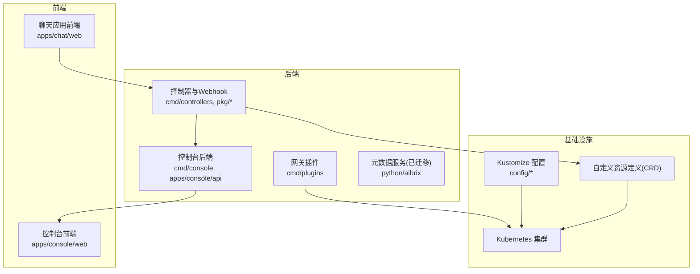
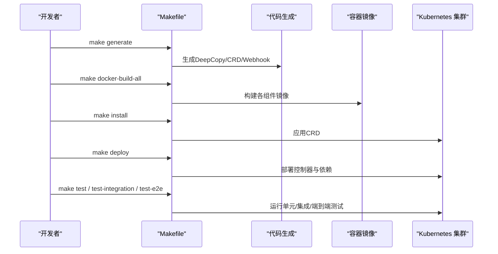
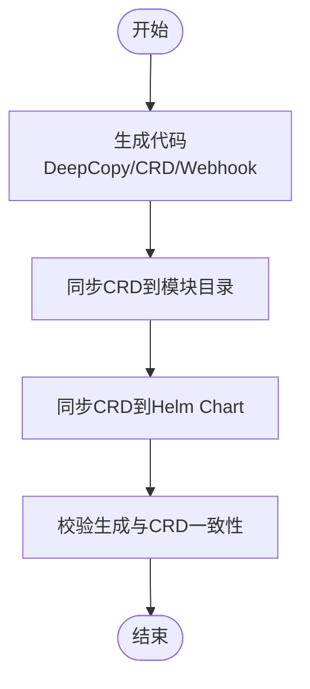
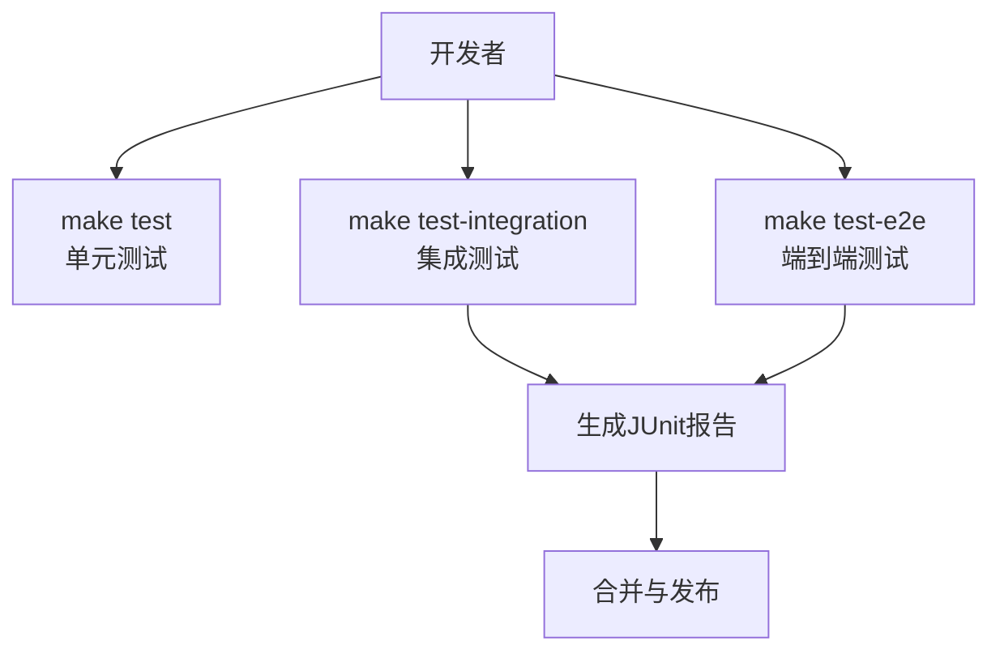
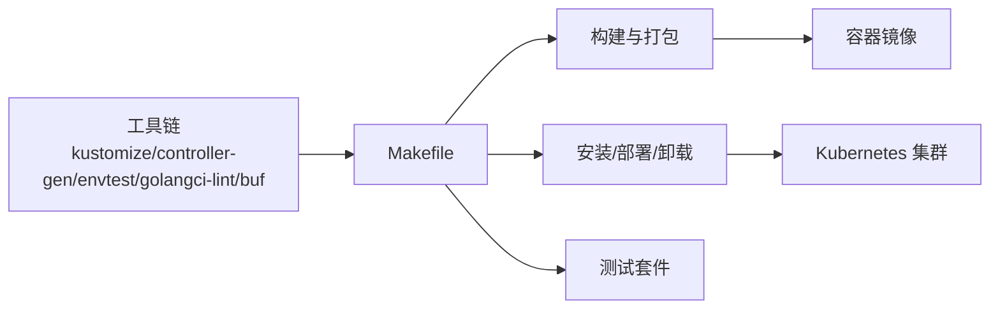

# 贡献指南

<cite>
**本文引用的文件**
- [CONTRIBUTING.md](file://CONTRIBUTING.md)
- [CODE_OF_CONDUCT.md](file://CODE_OF_CONDUCT.md)
- [SECURITY.md](file://SECURITY.md)
- [.github/PULL_REQUEST_TEMPLATE.md](file://.github/PULL_REQUEST_TEMPLATE.md)
- [Makefile](file://Makefile)
- [.golangci.yml](file://.golangci.yml)
- [development/README.md](file://development/README.md)
- [docs/source/community/contribution.rst](file://docs/source/community/contribution.rst)
- [apps/chat/README.md](file://apps/chat/README.md)
- [apps/chat/web/GUIDELINES.md](file://apps/chat/web/GUIDELINES.md)
- [apps/console/README.md](file://apps/console/README.md)
- [benchmarks/README.md](file://benchmarks/README.md)
- [test/README.md](file://test/README.md)
- [python/aibrix/README.md](file://python/aibrix/README.md)
</cite>

## 目录
1. [简介](#简介)
2. [项目结构](#项目结构)
3. [核心组件](#核心组件)
4. [架构总览](#架构总览)
5. [详细组件分析](#详细组件分析)
6. [依赖关系分析](#依赖关系分析)
7. [性能考虑](#性能考虑)
8. [故障排查指南](#故障排查指南)
9. [结论](#结论)
10. [附录](#附录)

## 简介
本贡献指南面向希望参与 AIBrix 开发与维护的贡献者，系统性地介绍开发规范、提交流程、代码审查与质量保障机制、项目组织结构与模块划分、开发环境搭建与调试、测试策略、行为准则与社区参与方式以及安全问题上报流程。文档同时提供可视化图示，帮助新贡献者快速理解代码库架构与开发模式。

## 项目结构
AIBrix 是一个基于 Kubernetes 的 AI 推理与编排平台，采用多语言混合架构：后端控制器与运行时服务以 Go 实现，前端管理控制台与聊天应用使用 React/Vite/TypeScript，部分能力（如元数据服务）采用 Python。项目通过 Kustomize 进行部署编排，并提供丰富的样例与基准测试工具。

图表来源
- [Makefile: 构建与部署目标:210-337](file://Makefile#L210-L337)
- [apps/console/README.md: 控制台前后端结构:1-21](file://apps/console/README.md#L1-L21)
- [apps/chat/README.md: 聊天应用前后端结构:1-96](file://apps/chat/README.md#L1-L96)
- [development/README.md: 安装与部署步骤:60-82](file://development/README.md#L60-L82)

章节来源
- [development/README.md: 开发与部署概览:1-147](file://development/README.md#L1-L147)
- [Makefile: 构建与部署目标:210-337](file://Makefile#L210-L337)

## 核心组件
- 后端控制器与 Webhook：负责 CRD 的生命周期管理、状态同步与准入校验，位于 cmd/controllers 与 pkg/controller、pkg/webhook。
- 网关插件：处理路由、限流、请求头/响应头/响应体改写等网关增强逻辑，位于 cmd/plugins。
- 控制台后端：提供 gRPC/HTTP 网关，管理模型、部署、密钥、配额等资源，位于 apps/console/api 与 cmd/console。
- 聊天应用：React 前端 + FastAPI 后端，作为用户交互入口，位于 apps/chat。
- 元数据服务：Python 实现，现已迁移为 AI Runtime（见 python/aibrix），提供模型下载与指标标准化。
- 基础设施：Kustomize 配置与 CRD 定义，位于 config/ 与各模块目录。

章节来源
- [apps/console/README.md: 控制台前后端结构与运行方式:1-87](file://apps/console/README.md#L1-L87)
- [apps/chat/README.md: 聊天应用前后端结构与运行方式:1-145](file://apps/chat/README.md#L1-L145)
- [python/aibrix/README.md: AI Runtime 概述与贡献说明:1-51](file://python/aibrix/README.md#L1-L51)

## 架构总览
下图展示 AIBrix 在本地开发与 CI 中的关键流程：从代码生成、构建镜像、安装 CRD、部署控制器到运行测试与端到端验证。

图表来源
- [Makefile: 代码生成与构建部署流程:110-170](file://Makefile#L110-L170)
- [Makefile: 测试与覆盖率:138-170](file://Makefile#L138-L170)
- [development/README.md: 安装与部署步骤:60-82](file://development/README.md#L60-L82)

## 详细组件分析

### 开发规范与提交流程
- 代码风格
  - Go 遵循 Google Go 风格指南；使用 golangci-lint 进行静态检查，启用 gofmt、goimports、govet、errcheck、staticcheck 等规则。
  - 前端使用 Biome 进行类型检查与格式化；后端 Python 使用 Ruff 进行 lint 与格式化。
- 提交与分支
  - 分支命名：/<你的名字>/(feat|patch|bug_fix) 描述
  - 提交信息：详尽描述变更内容，遵循“解释为什么而非只是做了什么”的原则
  - PR：使用提供的模板，按类别前缀标记标题（如 [Bug]/[Docs]/[API] 等）
- 代码审查
  - PR 描述清晰、引用相关 Issue、提供测试覆盖、遵循风格与最佳实践
  - 审查反馈需及时响应并逐步更新，避免强制推送以免破坏审查历史

章节来源
- [CONTRIBUTING.md: 贡献流程与PR规范:8-29](file://CONTRIBUTING.md#L8-L29)
- [.github/PULL_REQUEST_TEMPLATE.md: PR模板与检查清单:1-40](file://.github/PULL_REQUEST_TEMPLATE.md#L1-L40)
- [.golangci.yml: Lint规则配置:23-45](file://.golangci.yml#L23-L45)
- [apps/chat/README.md: 前端与后端Lint/格式化:100-135](file://apps/chat/README.md#L100-L135)
- [docs/source/community/contribution.rst: PR流程与代码审查要点:56-90](file://docs/source/community/contribution.rst#L56-L90)

### 代码生成与CRD同步
- 生成 DeepCopy、CRD、Webhook 等代码，确保 API 层与控制器一致
- 同步 CRD 到模块目录与 Helm Chart，保证 Kustomize 与 Helm 使用统一定义

图表来源
- [Makefile: 代码生成与CRD同步:110-129](file://Makefile#L110-L129)
- [Makefile: CRD同步到模块与Helm:79-108](file://Makefile#L79-L108)

章节来源
- [Makefile: 代码生成与CRD同步:71-129](file://Makefile#L71-L129)

### 测试策略与质量保障
- 单元测试：在各包内就近编写，使用 go test 运行，支持覆盖率统计
- 集成测试：使用 Ginkgo 框架，分别运行 Webhook 与控制器集成测试
- 端到端测试：支持本地已有集群与 CI 自动化集群两种模式
- 性能回归：发布前运行 regression 目录下的基准配置进行对比

图表来源
- [Makefile: 测试与覆盖率:138-170](file://Makefile#L138-L170)
- [test/README.md: 测试结构与运行方式:25-116](file://test/README.md#L25-L116)

章节来源
- [test/README.md: 测试结构与运行方式:1-116](file://test/README.md#L1-L116)
- [Makefile: 测试与覆盖率:138-170](file://Makefile#L138-L170)

### 开发环境搭建与调试
- 前置条件：Go 1.21+、Docker 26+、kubectl 1.25+、Kubernetes 集群
- 本地开发：可直接运行控制器或通过 IDE 调试；也可使用 Kind 快速搭建本地集群
- 部署与卸载：通过 make install/deploy/uninstall/undeploy 完成 CRD 与控制器的安装与移除
- 端口转发：提供脚本用于本地访问 Prometheus、Grafana、Envoy 等监控与网关

章节来源
- [development/README.md: 开发与部署概览:16-121](file://development/README.md#L16-L121)
- [Makefile: 开发安装/卸载与端口转发:344-420](file://Makefile#L344-L420)

### 行为准则与社区参与
- 行为准则：遵循 CNCF 行为准则，违规举报邮箱与处理流程明确
- 社区渠道：Slack、微信、邮件、论坛等联系方式待补充
- 维护者联系信息：待补充

章节来源
- [CODE_OF_CONDUCT.md: 行为准则与执行:1-14](file://CODE_OF_CONDUCT.md#L1-L14)
- [CONTRIBUTING.md: 社区与沟通:36-52](file://CONTRIBUTING.md#L36-L52)

### 安全政策与漏洞上报
- 受支持版本：当前支持 0.2.x，0.1.x 不再受支持
- 漏洞上报：通过 maintainers 邮箱上报

章节来源
- [SECURITY.md: 安全策略与漏洞上报:1-15](file://SECURITY.md#L1-L15)

### 基准测试与工作负载生成
- 数据集生成：支持合成共享、多轮合成、ShareGPT 转换、客户端轨迹转换
- 工作负载生成：支持常量/合成波动、统计文件、Azure/Mooncake 轨迹回放
- 客户端调度：支持批量与流式模式，支持 TTFT/TPOT 等指标采集
- 分析输出：支持阈值与指标配置，输出分析结果

章节来源
- [benchmarks/README.md: 基准测试组件与参数:1-431](file://benchmarks/README.md#L1-L431)

### 控制台与聊天应用开发指南
- 控制台：React 前端 + Go 后端（gRPC/HTTP），支持模型、部署、批任务、密钥、配额管理
- 聊天应用：React 前端 + FastAPI 后端，支持 SSE 流式对话
- 前端设计指南：提供设计系统与组件使用规范

章节来源
- [apps/console/README.md: 控制台前后端结构与运行方式:1-87](file://apps/console/README.md#L1-L87)
- [apps/chat/README.md: 聊天应用前后端结构与运行方式:1-145](file://apps/chat/README.md#L1-L145)
- [apps/chat/web/GUIDELINES.md: 设计系统与组件使用规范:1-62](file://apps/chat/web/GUIDELINES.md#L1-L62)

## 依赖关系分析
- 工具链：Kustomize、controller-gen、envtest、golangci-lint、buf（protobuf）、pytest、ruff、biome 等
- 构建与部署：Makefile 封装了生成、构建、打包、安装、部署、卸载、测试等常用命令
- 依赖安装：通过 go-install-tool 下载所需工具，确保本地与 CI 一致

图表来源
- [Makefile: 工具安装与目标:489-527](file://Makefile#L489-L527)

章节来源
- [Makefile: 工具安装与目标:489-527](file://Makefile#L489-L527)

## 性能考虑
- 代码生成与 CRD 同步：减少重复与不一致，提升构建稳定性
- 测试分层：单元测试优先，集成与端到端测试保障整体功能
- 基准测试：通过多种数据集与工作负载类型模拟真实场景，辅助性能回归与优化
- 并发与资源：合理设置并发会话数与超时参数，避免资源争用与抖动

## 故障排查指南
- 构建失败
  - 检查 Go 版本与依赖是否满足前置条件
  - 使用 make generate 与 make manifests-all 确保代码与 CRD 一致
- 集群安装问题
  - 确认 CRD 已正确安装，RBAC 权限充足
  - 如遇镜像拉取失败，检查镜像仓库权限与命名空间
- 测试失败
  - 单元测试：查看覆盖率与测试日志
  - 集成测试：确认 envtest 与 Ginkgo 版本匹配
  - 端到端测试：确保 Kind 集群或现有集群健康，必要时使用 make dev-install-in-kind
- 性能异常
  - 使用基准测试工具复现并定位瓶颈
  - 对比 regression 目录中的基线配置，识别回归点

章节来源
- [development/README.md: 安装与部署步骤:60-121](file://development/README.md#L60-L121)
- [test/README.md: 测试结构与运行方式:54-116](file://test/README.md#L54-L116)
- [benchmarks/README.md: 基准测试组件与参数:1-431](file://benchmarks/README.md#L1-L431)

## 结论
本指南为 AIBrix 贡献者提供了从开发规范、提交流程、代码审查到测试与部署的完整路径。建议新贡献者先通读开发与测试文档，再结合具体模块深入学习。遵循行为准则与安全策略，积极参与社区讨论与问题反馈，共同推动项目演进。

## 附录
- 快速参考
  - 开发与部署：make build / docker-build-all / install / deploy
  - 测试：make test / test-integration / test-e2e
  - 代码生成：make generate / manifests-all
  - 文档与教程：docs/source/community/contribution.rst 与 development/tutorials