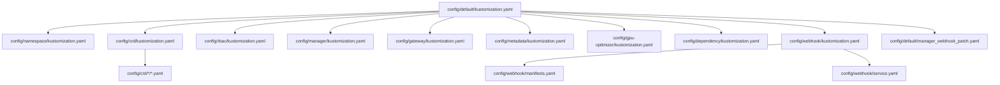
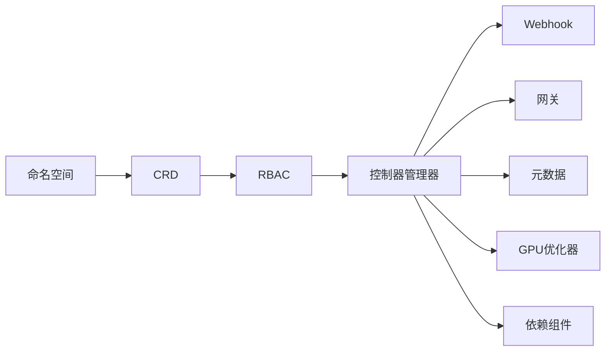

# Kubernetes原生部署

<cite>
**本文引用的文件**
- [config/default/kustomization.yaml](file://config/default/kustomization.yaml)
- [config/crd/kustomization.yaml](file://config/crd/kustomization.yaml)
- [config/webhook/kustomization.yaml](file://config/webhook/kustomization.yaml)
- [config/webhook/manifests.yaml](file://config/webhook/manifests.yaml)
- [config/webhook/service.yaml](file://config/webhook/service.yaml)
- [config/default/manager_webhook_patch.yaml](file://config/default/manager_webhook_patch.yaml)
- [config/namespace/kustomization.yaml](file://config/namespace/kustomization.yaml)
- [config/namespace/namespace.yaml](file://config/namespace/namespace.yaml)
- [config/rbac/kustomization.yaml](file://config/rbac/kustomization.yaml)
- [config/manager/kustomization.yaml](file://config/manager/kustomization.yaml)
- [config/manager/manager.yaml](file://config/manager/manager.yaml)
- [config/gateway/kustomization.yaml](file://config/gateway/kustomization.yaml)
- [config/metadata/kustomization.yaml](file://config/metadata/kustomization.yaml)
- [config/gpu-optimizer/kustomization.yaml](file://config/gpu-optimizer/kustomization.yaml)
- [config/dependency/kustomization.yaml](file://config/dependency/kustomization.yaml)
</cite>

## 目录
1. [简介](#简介)
2. [项目结构](#项目结构)
3. [核心组件](#核心组件)
4. [架构总览](#架构总览)
5. [详细组件分析](#详细组件分析)
6. [依赖关系分析](#依赖关系分析)
7. [性能考虑](#性能考虑)
8. [故障排查指南](#故障排查指南)
9. [结论](#结论)
10. [附录：部署命令与执行顺序](#附录部署命令与执行顺序)

## 简介
本技术文档面向在Kubernetes上原生部署AIBrix的工程团队，系统性解析Kustomize配置体系，覆盖CRD安装、RBAC权限、Webhook设置、服务发现、命名空间与资源前缀、镜像配置等关键要素。文档提供完整部署步骤、组件依赖与启动顺序说明，并通过图示帮助读者快速理解各配置文件的作用与相互关系。

## 项目结构
AIBrix采用分层Kustomize组织方式：
- config/default：顶层编排入口，统一注入命名空间、资源前缀、镜像版本与标签，聚合CRD、RBAC、控制器、网关、元数据、GPU优化器、依赖组件与Webhook。
- config/crd：集中管理所有自定义资源定义（CRD），并提供可选的转换Webhook与CA注入补丁。
- config/webhook：定义Mutating/Validating Webhook配置及后端Service。
- config/namespace：声明系统命名空间及其标签。
- config/rbac：按功能域拆分RBAC角色与绑定，覆盖控制器、编排、模型、自动伸缩与网关。
- config/manager：控制器管理器Deployment与指标Service。
- config/gateway：网关与插件资源。
- config/metadata：元数据服务与Redis依赖。
- config/gpu-optimizer：GPU优化器的部署、Service与RBAC。
- config/dependency：外部依赖（如Envoy Gateway、KubeRay CRDs）。
- config/overlays：环境覆盖（dev/release/vke等），用于差异化定制。

图表来源
- [config/default/kustomization.yaml:1-90](file://config/default/kustomization.yaml#L1-L90)
- [config/crd/kustomization.yaml:1-31](file://config/crd/kustomization.yaml#L1-L31)
- [config/webhook/kustomization.yaml:1-7](file://config/webhook/kustomization.yaml#L1-L7)
- [config/webhook/manifests.yaml:1-213](file://config/webhook/manifests.yaml#L1-L213)
- [config/webhook/service.yaml:1-20](file://config/webhook/service.yaml#L1-L20)
- [config/default/manager_webhook_patch.yaml:1-24](file://config/default/manager_webhook_patch.yaml#L1-L24)
- [config/namespace/kustomization.yaml:1-6](file://config/namespace/kustomization.yaml#L1-L6)
- [config/rbac/kustomization.yaml:1-23](file://config/rbac/kustomization.yaml#L1-L23)
- [config/manager/kustomization.yaml:1-8](file://config/manager/kustomization.yaml#L1-L8)
- [config/gateway/kustomization.yaml:1-10](file://config/gateway/kustomization.yaml#L1-L10)
- [config/metadata/kustomization.yaml:1-19](file://config/metadata/kustomization.yaml#L1-L19)
- [config/gpu-optimizer/kustomization.yaml:1-8](file://config/gpu-optimizer/kustomization.yaml#L1-L8)
- [config/dependency/kustomization.yaml:1-8](file://config/dependency/kustomization.yaml#L1-L8)

章节来源
- [config/default/kustomization.yaml:1-90](file://config/default/kustomization.yaml#L1-L90)

## 核心组件
- 命名空间与资源前缀
  - 默认命名空间：aibrix-system
  - 资源前缀：aibrix-
  - 作用：统一标识与隔离，避免资源冲突；前缀需与命名空间前缀保持一致。
- 镜像配置
  - 控制器管理器、网关插件、元数据服务、运行时、Redis、BusyBox等镜像均在default层进行统一替换与打标。
- CRD与Webhook
  - CRD由config/crd聚合，支持转换Webhook与CA注入补丁；Webhook由config/webhook定义，包含Mutating/Validating两类配置与后端Service。
- RBAC
  - 按模块拆分：控制器、编排、模型、自动伸缩、网关，便于最小权限治理。
- 依赖组件
  - Envoy Gateway与KubeRay CRDs作为依赖被引入，确保运行时编排能力。
- 元数据与GPU优化器
  - 提供元数据服务与Redis依赖，以及独立的GPU优化器组件。

章节来源
- [config/default/kustomization.yaml:4-18](file://config/default/kustomization.yaml#L4-L18)
- [config/default/kustomization.yaml:65-84](file://config/default/kustomization.yaml#L65-L84)
- [config/crd/kustomization.yaml:4-8](file://config/crd/kustomization.yaml#L4-L8)
- [config/webhook/kustomization.yaml:1-7](file://config/webhook/kustomization.yaml#L1-L7)
- [config/rbac/kustomization.yaml:1-17](file://config/rbac/kustomization.yaml#L1-L17)
- [config/dependency/kustomization.yaml:1-8](file://config/dependency/kustomization.yaml#L1-L8)
- [config/metadata/kustomization.yaml:1-19](file://config/metadata/kustomization.yaml#L1-L19)
- [config/gpu-optimizer/kustomization.yaml:1-8](file://config/gpu-optimizer/kustomization.yaml#L1-L8)

## 架构总览
下图展示AIBrix在Kubernetes中的核心组件交互：控制器管理器负责协调CRD资源；Webhook在资源创建/更新时进行校验与注入；Gateway提供流量入口；Metadata与Redis支撑元数据；GPU优化器提供GPU调度优化；依赖组件（Envoy Gateway、KubeRay）提供网关与Ray集群编排能力。

```mermaid
graph TB
subgraph "系统命名空间 aibrix-system"
CM["控制器管理器 Deployment<br/>config/manager/manager.yaml"]
SVC["控制器指标 Service<br/>config/manager/manager.yaml"]
WHC["Webhook 服务 Service<br/>config/webhook/service.yaml"]
VWC["ValidatingWebhookConfiguration<br/>config/webhook/manifests.yaml"]
MWC["MutatingWebhookConfiguration<br/>config/webhook/manifests.yaml"]
GW["网关与插件<br/>config/gateway/kustomization.yaml"]
META["元数据服务与Redis<br/>config/metadata/kustomization.yaml"]
GPU["GPU优化器<br/>config/gpu-optimizer/kustomization.yaml"]
end
DEP["config/default/kustomization.yaml"] --> NS["命名空间<br/>config/namespace/namespace.yaml"]
DEP --> CRD["CRD集合<br/>config/crd/kustomization.yaml"]
DEP --> RB["RBAC<br/>config/rbac/kustomization.yaml"]
DEP --> MAN["控制器管理器<br/>config/manager/kustomization.yaml"]
DEP --> GW
DEP --> META
DEP --> GPU
DEP --> DEPND["依赖组件<br/>config/dependency/kustomization.yaml"]
DEP --> WH["Webhook<br/>config/webhook/kustomization.yaml"]
CM --> SVC
WHC --> VWC
WHC --> MWC
CM -.->|调用| CRD
CM -.->|读写| META
CM -.->|集成| DEPND
```

图表来源
- [config/default/kustomization.yaml:1-90](file://config/default/kustomization.yaml#L1-L90)
- [config/namespace/namespace.yaml:1-8](file://config/namespace/namespace.yaml#L1-L8)
- [config/crd/kustomization.yaml:1-31](file://config/crd/kustomization.yaml#L1-L31)
- [config/rbac/kustomization.yaml:1-23](file://config/rbac/kustomization.yaml#L1-L23)
- [config/manager/manager.yaml:1-87](file://config/manager/manager.yaml#L1-L87)
- [config/webhook/manifests.yaml:1-213](file://config/webhook/manifests.yaml#L1-L213)
- [config/webhook/service.yaml:1-20](file://config/webhook/service.yaml#L1-L20)
- [config/gateway/kustomization.yaml:1-10](file://config/gateway/kustomization.yaml#L1-L10)
- [config/metadata/kustomization.yaml:1-19](file://config/metadata/kustomization.yaml#L1-L19)
- [config/gpu-optimizer/kustomization.yaml:1-8](file://config/gpu-optimizer/kustomization.yaml#L1-L8)
- [config/dependency/kustomization.yaml:1-8](file://config/dependency/kustomization.yaml#L1-L8)

## 详细组件分析

### 命名空间与资源前缀
- 命名空间：aibrix-system
- 资源前缀：aibrix-
- 影响范围：所有资源名称将被前缀化；命名空间标签与选择器需匹配该前缀以保证一致性。
- 关键文件：
  - config/default/kustomization.yaml（设置namespace与namePrefix）
  - config/namespace/namespace.yaml（定义命名空间）

章节来源
- [config/default/kustomization.yaml:4-12](file://config/default/kustomization.yaml#L4-L12)
- [config/namespace/namespace.yaml:1-8](file://config/namespace/namespace.yaml#L1-L8)

### CRD安装与转换Webhook
- CRD聚合：通过config/crd/kustomization.yaml聚合autoscaling、model、orchestration三类CRD。
- 转换Webhook：注释区提供启用转换Webhook的路径，便于跨版本兼容。
- CA注入：注释区提供CA注入补丁示例，用于证书链注入。
- 关键文件：
  - config/crd/kustomization.yaml
  - config/webhook/manifests.yaml（定义Webhook规则）

章节来源
- [config/crd/kustomization.yaml:4-8](file://config/crd/kustomization.yaml#L4-L8)
- [config/webhook/manifests.yaml:1-213](file://config/webhook/manifests.yaml#L1-L213)

### RBAC权限配置
- 分层RBAC：控制器、编排、模型、自动伸缩、网关分别提供Editor/Viewer角色与绑定，便于最小权限治理。
- 组件标签：通过labels为各组件打上component标签，便于运维与审计。
- 关键文件：
  - config/rbac/kustomization.yaml

章节来源
- [config/rbac/kustomization.yaml:1-17](file://config/rbac/kustomization.yaml#L1-L17)

### Webhook设置与服务发现
- Webhook类型：Mutating与Validating两类，覆盖Deployment与多个CRD组。
- 后端服务：Webhook Service指向控制平面Pod，端口为9443。
- 补丁：通过manager_webhook_patch.yaml为控制器管理器容器添加Webhook端口与证书卷挂载。
- 关键文件：
  - config/webhook/kustomization.yaml
  - config/webhook/manifests.yaml
  - config/webhook/service.yaml
  - config/default/manager_webhook_patch.yaml

章节来源
- [config/webhook/kustomization.yaml:1-7](file://config/webhook/kustomization.yaml#L1-L7)
- [config/webhook/manifests.yaml:1-213](file://config/webhook/manifests.yaml#L1-L213)
- [config/webhook/service.yaml:1-20](file://config/webhook/service.yaml#L1-L20)
- [config/default/manager_webhook_patch.yaml:1-24](file://config/default/manager_webhook_patch.yaml#L1-L24)

### 控制器管理器（Controller Manager）
- 资源：Deployment与指标Service，暴露健康检查与指标端口。
- 安全与探针：限制特权、设置存活/就绪探针、资源请求与限制。
- 环境变量：包含网关超时等运行时参数。
- 关键文件：
  - config/manager/kustomization.yaml
  - config/manager/manager.yaml

章节来源
- [config/manager/kustomization.yaml:1-8](file://config/manager/kustomization.yaml#L1-L8)
- [config/manager/manager.yaml:1-87](file://config/manager/manager.yaml#L1-L87)

### 网关与插件
- 资源：网关与插件目录，统一打上component标签。
- 关键文件：
  - config/gateway/kustomization.yaml

章节来源
- [config/gateway/kustomization.yaml:1-10](file://config/gateway/kustomization.yaml#L1-L10)

### 元数据服务与Redis
- 资源：元数据服务与Redis，支持S3/TOS对象存储的可选补丁。
- ConfigMap生成：基于job_template_patch.yaml生成metadata-config。
- 关键文件：
  - config/metadata/kustomization.yaml

章节来源
- [config/metadata/kustomization.yaml:1-19](file://config/metadata/kustomization.yaml#L1-L19)

### GPU优化器
- 资源：部署、Service与RBAC，独立组件。
- 关键文件：
  - config/gpu-optimizer/kustomization.yaml

章节来源
- [config/gpu-optimizer/kustomization.yaml:1-8](file://config/gpu-optimizer/kustomization.yaml#L1-L8)

### 依赖组件（Envoy Gateway、KubeRay）
- 资源：Envoy Gateway与KubeRay CRDs，确保网关与Ray集群编排能力。
- 关键文件：
  - config/dependency/kustomization.yaml

章节来源
- [config/dependency/kustomization.yaml:1-8](file://config/dependency/kustomization.yaml#L1-L8)

## 依赖关系分析
- 组件耦合
  - 控制器管理器依赖CRD、RBAC与Webhook补丁；Webhook依赖控制器管理器的证书与Service。
  - 网关与元数据服务由控制器管理器协调；GPU优化器为独立组件。
  - 依赖组件（Envoy Gateway、KubeRay）在default层统一引入。
- 外部依赖
  - 可选Prometheus监控与cert-manager（注释区提供启用路径）。
- 关键依赖链
  - 命名空间 → CRD → RBAC → 控制器管理器 → Webhook → 网关/元数据/GPU优化器 → 依赖组件

图表来源
- [config/default/kustomization.yaml:20-39](file://config/default/kustomization.yaml#L20-L39)
- [config/crd/kustomization.yaml:4-8](file://config/crd/kustomization.yaml#L4-L8)
- [config/rbac/kustomization.yaml:1-17](file://config/rbac/kustomization.yaml#L1-L17)
- [config/manager/manager.yaml:1-87](file://config/manager/manager.yaml#L1-L87)
- [config/webhook/manifests.yaml:1-213](file://config/webhook/manifests.yaml#L1-L213)
- [config/gateway/kustomization.yaml:1-10](file://config/gateway/kustomization.yaml#L1-L10)
- [config/metadata/kustomization.yaml:1-19](file://config/metadata/kustomization.yaml#L1-L19)
- [config/gpu-optimizer/kustomization.yaml:1-8](file://config/gpu-optimizer/kustomization.yaml#L1-L8)
- [config/dependency/kustomization.yaml:1-8](file://config/dependency/kustomization.yaml#L1-L8)

## 性能考虑
- 资源配额：控制器管理器设置了CPU与内存的requests/limits，建议根据集群规模与负载进行调整。
- 探针配置：健康检查与就绪探针有助于快速发现异常并触发重建。
- Webhook性能：Webhook端口与证书卷挂载需稳定可用，避免影响资源创建/更新时延。
- 依赖组件：Envoy Gateway与KubeRay的CRD与控制器会占用额外资源，建议在生产环境中评估其对节点与网络的影响。

## 故障排查指南
- Webhook不生效
  - 检查Webhook Service是否指向正确的Pod标签与端口。
  - 确认控制器管理器容器已挂载证书卷并开放9443端口。
  - 查看Validating/MutatingWebhookConfiguration的规则与路径。
- CRD未注册
  - 确认CRD已在default层被聚合加载。
  - 检查是否存在转换Webhook或CA注入补丁的启用注释。
- RBAC拒绝
  - 核对控制器、网关、编排、模型、自动伸缩等RBAC角色与绑定是否正确应用。
- 命名空间与前缀不一致
  - 确保命名空间前缀与资源前缀一致，避免选择器不匹配导致的资源不可见。

章节来源
- [config/webhook/service.yaml:1-20](file://config/webhook/service.yaml#L1-L20)
- [config/default/manager_webhook_patch.yaml:1-24](file://config/default/manager_webhook_patch.yaml#L1-L24)
- [config/webhook/manifests.yaml:1-213](file://config/webhook/manifests.yaml#L1-L213)
- [config/crd/kustomization.yaml:10-24](file://config/crd/kustomization.yaml#L10-L24)
- [config/rbac/kustomization.yaml:1-17](file://config/rbac/kustomization.yaml#L1-L17)
- [config/default/kustomization.yaml:4-12](file://config/default/kustomization.yaml#L4-L12)

## 结论
通过分层Kustomize配置，AIBrix实现了清晰的命名空间与资源前缀管理、统一的镜像版本控制、模块化的RBAC与Webhook、以及可扩展的依赖组件引入。遵循本文档提供的部署顺序与依赖关系，可确保各组件正确安装与协同工作。

## 附录：部署命令与执行顺序
- 基础准备
  - 确保kubectl已连接目标集群，具备创建CRD、ClusterRole/Binding与命名空间的权限。
- 执行顺序（推荐）
  1) 应用命名空间与基础资源
     - kubectl apply -k config/default
  2) 检查CRD是否成功安装
     - kubectl get crd | grep aibrix.ai
  3) 检查控制器管理器状态
     - kubectl -n aibrix-system rollout status deployment/aibrix-controller-manager
  4) 验证Webhook
     - kubectl get mutatingwebhookconfiguration,validatingwebhookconfiguration
     - kubectl -n aibrix-system get svc,aibrix-webhook-service
  5) 验证网关、元数据与GPU优化器
     - kubectl -n aibrix-system get pods -l app.kubernetes.io/component=aibrix-gateway-plugin
     - kubectl -n aibrix-system get pods -l app.kubernetes.io/component=aibrix-metadata-service
     - kubectl -n aibrix-system get pods -l app.kubernetes.io/component=aibrix-gpu-optimizer
  6) 可选：启用Prometheus监控或cert-manager（参考注释区）
- 注意事项
  - 若启用Webhook，请确认证书Secret已存在且控制器管理器容器已挂载证书卷。
  - 如需使用S3/TOS对象存储，请在metadata层启用相应补丁。
  - 生产环境建议为控制器管理器设置更严格的资源限制与副本数。

章节来源
- [config/default/kustomization.yaml:20-39](file://config/default/kustomization.yaml#L20-L39)
- [config/manager/manager.yaml:1-87](file://config/manager/manager.yaml#L1-L87)
- [config/webhook/manifests.yaml:1-213](file://config/webhook/manifests.yaml#L1-L213)
- [config/webhook/service.yaml:1-20](file://config/webhook/service.yaml#L1-L20)
- [config/metadata/kustomization.yaml:11-15](file://config/metadata/kustomization.yaml#L11-L15)