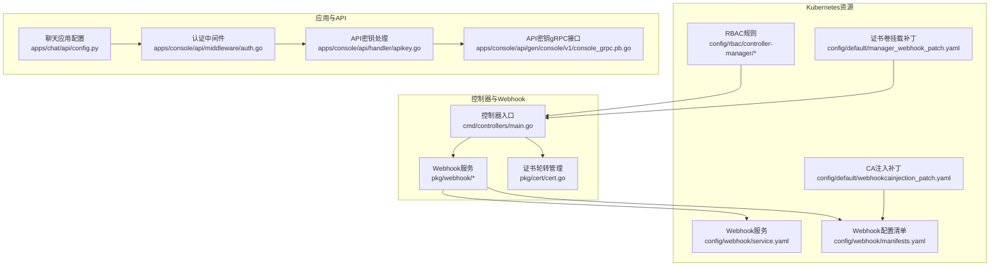
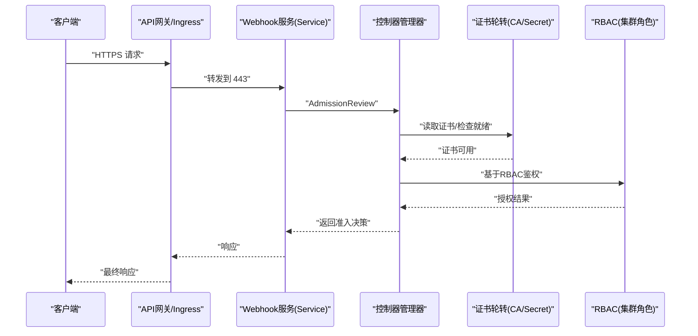
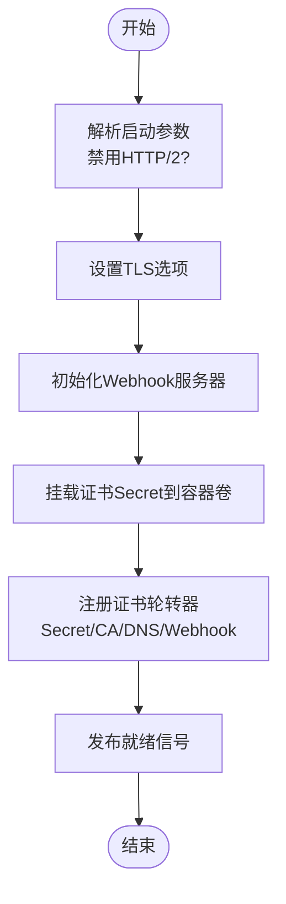
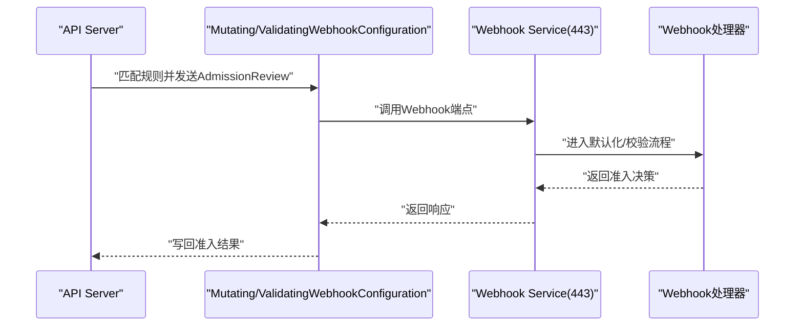
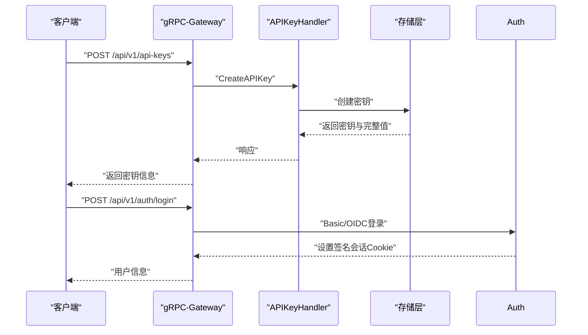
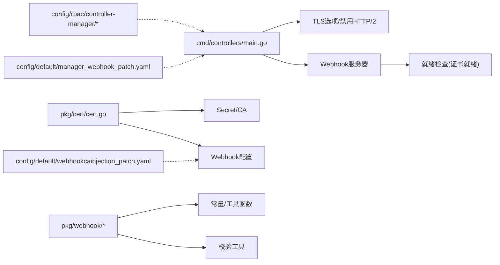

# 安全配置

<cite>
**本文引用的文件**
- [pkg/cert/cert.go](file://pkg/cert/cert.go)
- [config/internalcert/secret.yaml](file://config/internalcert/secret.yaml)
- [config/webhook/service.yaml](file://config/webhook/service.yaml)
- [config/webhook/manifests.yaml](file://config/webhook/manifests.yaml)
- [config/default/manager_webhook_patch.yaml](file://config/default/manager_webhook_patch.yaml)
- [config/default/webhookcainjection_patch.yaml](file://config/default/webhookcainjection_patch.yaml)
- [pkg/webhook/deployment_webhook.go](file://pkg/webhook/deployment_webhook.go)
- [pkg/webhook/kvcache_webhook.go](file://pkg/webhook/kvcache_webhook.go)
- [pkg/webhook/sidecar_injection.go](file://pkg/webhook/sidecar_injection.go)
- [cmd/controllers/main.go](file://cmd/controllers/main.go)
- [apps/console/api/config.py](file://apps/chat/api/config.py)
- [apps/console/api/middleware/auth.go](file://apps/console/api/middleware/auth.go)
- [apps/console/api/handler/apikey.go](file://apps/console/api/handler/apikey.go)
- [apps/console/api/gen/console/v1/console_grpc.pb.go](file://apps/console/api/gen/console/v1/console_grpc.pb.go)
- [SECURITY.md](file://SECURITY.md)
</cite>

## 目录
1. [简介](#简介)
2. [项目结构](#项目结构)
3. [核心组件](#核心组件)
4. [架构总览](#架构总览)
5. [详细组件分析](#详细组件分析)
6. [依赖分析](#依赖分析)
7. [性能考虑](#性能考虑)
8. [故障排查指南](#故障排查指南)
9. [结论](#结论)
10. [附录](#附录)

## 简介
本技术指南面向AIBrix在生产环境中的安全配置，围绕以下目标展开：TLS证书管理（含内部证书生成与轮换）、RBAC权限控制（角色定义与最小权限原则）、Webhook安全（准入控制、请求验证、安全策略）、API密钥管理与访问控制、网络安全加固（如禁用不安全协议）。文档以仓库中现有实现为依据，结合Kubernetes与Go生态最佳实践，提供可操作的配置建议与排障指引。

## 项目结构
AIBrix的安全相关能力主要分布在如下位置：
- 控制器与Webhook：控制器入口负责TLS与Webhook服务器初始化；Webhook用于资源默认化与校验；证书轮转由独立模块管理。
- RBAC：通过ClusterRole/ClusterRoleBinding对控制器进行权限约束。
- 应用侧安全：聊天应用与控制台API提供认证中间件与API密钥服务，支持多种认证模式与会话安全。
- 配置与补丁：Kustomize补丁注入证书卷与CA注入注解，保障Webhook通信安全。



**图示来源**
- [cmd/controllers/main.go:197-319](file://cmd/controllers/main.go#L197-L319)
- [pkg/webhook/deployment_webhook.go:34-170](file://pkg/webhook/deployment_webhook.go#L34-L170)
- [pkg/webhook/kvcache_webhook.go:38-119](file://pkg/webhook/kvcache_webhook.go#L38-L119)
- [pkg/cert/cert.go:41-67](file://pkg/cert/cert.go#L41-L67)
- [config/webhook/service.yaml:1-20](file://config/webhook/service.yaml#L1-L20)
- [config/webhook/manifests.yaml:1-213](file://config/webhook/manifests.yaml#L1-L213)
- [config/default/manager_webhook_patch.yaml:1-23](file://config/default/manager_webhook_patch.yaml#L1-L23)
- [config/default/webhookcainjection_patch.yaml:1-29](file://config/default/webhookcainjection_patch.yaml#L1-L29)
- [apps/chat/api/config.py:1-94](file://apps/chat/api/config.py#L1-L94)
- [apps/console/api/middleware/auth.go:129-659](file://apps/console/api/middleware/auth.go#L129-L659)
- [apps/console/api/handler/apikey.go:46-62](file://apps/console/api/handler/apikey.go#L46-L62)
- [apps/console/api/gen/console/v1/console_grpc.pb.go:942-1061](file://apps/console/api/gen/console/v1/console_grpc.pb.go#L942-L1061)

**章节来源**
- [cmd/controllers/main.go:197-319](file://cmd/controllers/main.go#L197-L319)
- [config/webhook/service.yaml:1-20](file://config/webhook/service.yaml#L1-L20)
- [config/webhook/manifests.yaml:1-213](file://config/webhook/manifests.yaml#L1-L213)
- [config/default/manager_webhook_patch.yaml:1-23](file://config/default/manager_webhook_patch.yaml#L1-L23)
- [config/default/webhookcainjection_patch.yaml:1-29](file://config/default/webhookcainjection_patch.yaml#L1-L29)

## 核心组件
- TLS与证书轮转：控制器入口通过TLS选项禁用HTTP/2，Webhook服务器使用受控证书目录；证书轮转由专用模块负责，自动更新Secret与Webhook配置。
- Webhook准入控制：注册多个资源的Mutating/Validating Webhook，分别执行默认化与校验逻辑；通过Service暴露443端口，配合证书与CA注入保障通信安全。
- RBAC权限控制：控制器仅授予完成其职责所需的最小权限集合，避免过度授权。
- API密钥与访问控制：控制台API提供API密钥的创建与删除；认证中间件支持开发、基本认证与OIDC三种模式，并对会话进行签名与过期控制。
- 聊天应用配置：统一的配置对象支持按能力覆盖网关URL与密钥，便于集中管理。

**章节来源**
- [pkg/cert/cert.go:41-67](file://pkg/cert/cert.go#L41-L67)
- [cmd/controllers/main.go:197-319](file://cmd/controllers/main.go#L197-L319)
- [config/webhook/manifests.yaml:1-213](file://config/webhook/manifests.yaml#L1-L213)
- [config/rbac/controller-manager/role.yaml:1-319](file://config/rbac/controller-manager/role.yaml#L1-L319)
- [apps/console/api/handler/apikey.go:46-62](file://apps/console/api/handler/apikey.go#L46-L62)
- [apps/console/api/middleware/auth.go:129-659](file://apps/console/api/middleware/auth.go#L129-L659)
- [apps/chat/api/config.py:1-94](file://apps/chat/api/config.py#L1-L94)

## 架构总览
下图展示从客户端到控制器Webhook、再到证书与RBAC的整体交互路径，强调TLS与准入控制的关键节点。



**图示来源**
- [config/webhook/service.yaml:14-17](file://config/webhook/service.yaml#L14-L17)
- [config/webhook/manifests.yaml:108-213](file://config/webhook/manifests.yaml#L108-L213)
- [pkg/cert/cert.go:41-67](file://pkg/cert/cert.go#L41-L67)
- [cmd/controllers/main.go:303-312](file://cmd/controllers/main.go#L303-L312)
- [config/rbac/controller-manager/role.yaml:1-319](file://config/rbac/controller-manager/role.yaml#L1-L319)

## 详细组件分析

### 组件A：TLS证书管理与轮换
- 证书轮转：通过专用模块在控制器中注册轮转器，指定Secret名称、证书目录、CA名称与组织、DNS名称以及关联的Webhook配置，实现自动轮换与就绪信号通知。
- Webhook服务器TLS：控制器入口根据参数选择是否禁用HTTP/2，并将TLS选项传入Webhook服务器；同时通过补丁将证书Secret挂载至只读卷供Webhook读取。
- CA注入：Kustomize补丁为Mutating/ValidatingWebhookConfiguration添加CA注入注解，使cert-manager自动注入根CA，确保API Server信任Webhook服务端证书。



**图示来源**
- [cmd/controllers/main.go:208-224](file://cmd/controllers/main.go#L208-L224)
- [config/default/manager_webhook_patch.yaml:15-23](file://config/default/manager_webhook_patch.yaml#L15-L23)
- [pkg/cert/cert.go:41-67](file://pkg/cert/cert.go#L41-L67)
- [config/default/webhookcainjection_patch.yaml:14-29](file://config/default/webhookcainjection_patch.yaml#L14-L29)

**章节来源**
- [pkg/cert/cert.go:41-67](file://pkg/cert/cert.go#L41-L67)
- [cmd/controllers/main.go:208-224](file://cmd/controllers/main.go#L208-L224)
- [config/default/manager_webhook_patch.yaml:15-23](file://config/default/manager_webhook_patch.yaml#L15-L23)
- [config/default/webhookcainjection_patch.yaml:14-29](file://config/default/webhookcainjection_patch.yaml#L14-L29)

### 组件B：RBAC权限控制
- 角色定义：控制器管理器使用的ClusterRole涵盖事件、Secret、Webhook配置、CRD、Deployment/STS、HPA、Pod/Service、EndpointSlice、Gateway Route、模型与编排资源、Ray集群、Role/RoleBinding、调度器等多类资源的增删改查与状态更新权限。
- 权限分配：通过ClusterRoleBinding将控制器ServiceAccount绑定到该ClusterRole，确保控制器以最小权限运行。
- 最小权限原则：仅授予控制器实际需要的资源与动词，避免使用通配符或过大范围权限。

```mermaid
classDiagram
class ClusterRole_ControllerManager {
"+事件 : 创建/修补/更新"
"+Secret : 读取/列举/更新/监视"
"+Webhook配置 : 读取/列举/更新/监视"
"+CRD : 读取/列举"
"+Deployment/StatefulSet : 增删改查/状态"
"+HPA : 增删改查/状态"
"+Pod/Service/ServiceAccount : 增删改查/状态"
"+EndpointSlice : 增删改查/状态"
"+Gateway Route : 增删改查/状态"
"+模型/编排资源 : 增删改查/状态/终结器"
"+Ray集群 : 增删改查/状态/终结器"
"+Role/RoleBinding : 增删改查/状态"
}
class ClusterRoleBinding_ControllerManager {
"+绑定 : controller-manager ServiceAccount 到 ClusterRole"
}
ClusterRoleBinding_ControllerManager --> ClusterRole_ControllerManager : "绑定"
```

**图示来源**
- [config/rbac/controller-manager/role.yaml:1-319](file://config/rbac/controller-manager/role.yaml#L1-L319)
- [config/rbac/controller-manager/role_binding.yaml:1-16](file://config/rbac/controller-manager/role_binding.yaml#L1-L16)

**章节来源**
- [config/rbac/controller-manager/role.yaml:1-319](file://config/rbac/controller-manager/role.yaml#L1-L319)
- [config/rbac/controller-manager/role_binding.yaml:1-16](file://config/rbac/controller-manager/role_binding.yaml#L1-L16)

### 组件C：Webhook安全配置
- 准入控制：注册多个资源的Mutating/Validating Webhook，分别在CREATE/UPDATE阶段执行默认化与校验；失败策略为忽略，避免阻塞API Server。
- 请求验证：Webhook处理器在验证阶段调用工具函数进行后端类型等业务校验；默认化阶段注入运行时Sidecar并共享存储卷。
- 安全策略：Service暴露443端口，Webhook配置指向系统命名空间的Webhook服务；证书由轮转器与cert-manager共同保障；补丁启用CA注入注解。



**图示来源**
- [config/webhook/manifests.yaml:1-213](file://config/webhook/manifests.yaml#L1-L213)
- [config/webhook/service.yaml:14-17](file://config/webhook/service.yaml#L14-L17)
- [pkg/webhook/deployment_webhook.go:34-170](file://pkg/webhook/deployment_webhook.go#L34-L170)
- [pkg/webhook/kvcache_webhook.go:38-119](file://pkg/webhook/kvcache_webhook.go#L38-L119)
- [config/default/webhookcainjection_patch.yaml:14-29](file://config/default/webhookcainjection_patch.yaml#L14-L29)

**章节来源**
- [config/webhook/manifests.yaml:1-213](file://config/webhook/manifests.yaml#L1-L213)
- [config/webhook/service.yaml:14-17](file://config/webhook/service.yaml#L14-L17)
- [pkg/webhook/deployment_webhook.go:34-170](file://pkg/webhook/deployment_webhook.go#L34-L170)
- [pkg/webhook/kvcache_webhook.go:38-119](file://pkg/webhook/kvcache_webhook.go#L38-L119)
- [pkg/webhook/sidecar_injection.go:45-144](file://pkg/webhook/sidecar_injection.go#L45-L144)

### 组件D：API密钥管理与访问控制
- API密钥服务：提供创建与删除API密钥的gRPC接口；处理器对请求进行基础校验（如名称非空）。
- 访问控制：认证中间件支持开发、基本认证与OIDC三种模式；会话采用签名Cookie并在HTTPS环境下设置Secure标志；对会话绝对过期时间进行强制校验。
- 聊天应用配置：统一的配置对象支持按能力覆盖网关URL与密钥，便于集中管理与降级。



**图示来源**
- [apps/console/api/handler/apikey.go:46-62](file://apps/console/api/handler/apikey.go#L46-L62)
- [apps/console/api/gen/console/v1/console_grpc.pb.go:942-1061](file://apps/console/api/gen/console/v1/console_grpc.pb.go#L942-L1061)
- [apps/console/api/middleware/auth.go:129-659](file://apps/console/api/middleware/auth.go#L129-L659)
- [apps/chat/api/config.py:1-94](file://apps/chat/api/config.py#L1-L94)

**章节来源**
- [apps/console/api/handler/apikey.go:46-62](file://apps/console/api/handler/apikey.go#L46-L62)
- [apps/console/api/gen/console/v1/console_grpc.pb.go:942-1061](file://apps/console/api/gen/console/v1/console_grpc.pb.go#L942-L1061)
- [apps/console/api/middleware/auth.go:129-659](file://apps/console/api/middleware/auth.go#L129-L659)
- [apps/chat/api/config.py:1-94](file://apps/chat/api/config.py#L1-L94)

## 依赖分析
- 控制器入口依赖TLS选项与Webhook服务器；Webhook服务器依赖证书就绪信号；证书轮转依赖Kubernetes Secret与Webhook配置。
- Webhook处理器依赖常量与工具函数进行Sidecar注入与资源校验；认证中间件依赖会话签名与外部OIDC提供商（可选）。
- RBAC规则与Kustomize补丁共同决定控制器的权限边界与证书可见性。



**图示来源**
- [cmd/controllers/main.go:208-224](file://cmd/controllers/main.go#L208-L224)
- [cmd/controllers/main.go:303-312](file://cmd/controllers/main.go#L303-L312)
- [pkg/cert/cert.go:41-67](file://pkg/cert/cert.go#L41-L67)
- [pkg/webhook/deployment_webhook.go:34-170](file://pkg/webhook/deployment_webhook.go#L34-L170)
- [pkg/webhook/kvcache_webhook.go:38-119](file://pkg/webhook/kvcache_webhook.go#L38-L119)
- [config/rbac/controller-manager/role.yaml:1-319](file://config/rbac/controller-manager/role.yaml#L1-L319)
- [config/default/manager_webhook_patch.yaml:15-23](file://config/default/manager_webhook_patch.yaml#L15-L23)
- [config/default/webhookcainjection_patch.yaml:14-29](file://config/default/webhookcainjection_patch.yaml#L14-L29)

**章节来源**
- [cmd/controllers/main.go:208-224](file://cmd/controllers/main.go#L208-L224)
- [pkg/cert/cert.go:41-67](file://pkg/cert/cert.go#L41-L67)
- [pkg/webhook/deployment_webhook.go:34-170](file://pkg/webhook/deployment_webhook.go#L34-L170)
- [pkg/webhook/kvcache_webhook.go:38-119](file://pkg/webhook/kvcache_webhook.go#L38-L119)
- [config/rbac/controller-manager/role.yaml:1-319](file://config/rbac/controller-manager/role.yaml#L1-L319)
- [config/default/manager_webhook_patch.yaml:15-23](file://config/default/manager_webhook_patch.yaml#L15-L23)
- [config/default/webhookcainjection_patch.yaml:14-29](file://config/default/webhookcainjection_patch.yaml#L14-L29)

## 性能考虑
- 禁用HTTP/2：控制器入口显式禁用HTTP/2以规避已知漏洞，减少潜在风险面，对性能影响有限。
- Webhook并发：Webhook处理器应保持轻量，默认化与校验逻辑避免重IO与长耗时操作；必要时引入异步或缓存。
- 证书轮换：轮转器在后台执行，避免阻塞控制器主循环；确保证书目录挂载正确且权限最小化。
- RBAC粒度：仅授予所需权限，降低控制器在RBAC决策上的开销。

**章节来源**
- [cmd/controllers/main.go:208-216](file://cmd/controllers/main.go#L208-L216)
- [pkg/cert/cert.go:41-67](file://pkg/cert/cert.go#L41-L67)

## 故障排查指南
- Webhook未就绪：控制器在就绪检查中等待证书就绪信号，若Webhook证书未生成或未注入，将返回错误。请确认轮转器已启动、Secret存在且被Webhook配置引用。
- 证书未注入：检查Webhook配置是否包含CA注入注解，以及cert-manager是否正常工作。
- 443端口不可达：确认Service端口映射与Webhook服务器容器端口一致，且Ingress/网关正确转发到443。
- 认证失败：检查认证中间件模式配置、会话Cookie签名与过期时间、OIDC提供商连通性（如使用OIDC）。
- API密钥异常：确认gRPC接口注册与路由、请求体格式、存储层可用性。

**章节来源**
- [cmd/controllers/main.go:303-312](file://cmd/controllers/main.go#L303-L312)
- [config/default/webhookcainjection_patch.yaml:14-29](file://config/default/webhookcainjection_patch.yaml#L14-L29)
- [config/webhook/service.yaml:14-17](file://config/webhook/service.yaml#L14-L17)
- [apps/console/api/middleware/auth.go:129-659](file://apps/console/api/middleware/auth.go#L129-L659)
- [apps/console/api/handler/apikey.go:46-62](file://apps/console/api/handler/apikey.go#L46-L62)

## 结论
AIBrix在安全方面提供了较为完整的基础设施：通过证书轮转与CA注入保障Webhook通信安全，通过严格的RBAC限制控制器权限，通过认证中间件与API密钥服务实现访问控制与会话安全。建议在生产环境中遵循最小权限原则、启用证书轮换与CA注入、禁用不安全协议，并定期评估与审计安全配置。

## 附录
- 安全政策与漏洞报告渠道：参见项目安全政策文件，了解受支持版本与漏洞上报方式。

**章节来源**
- [SECURITY.md:1-15](file://SECURITY.md#L1-L15)