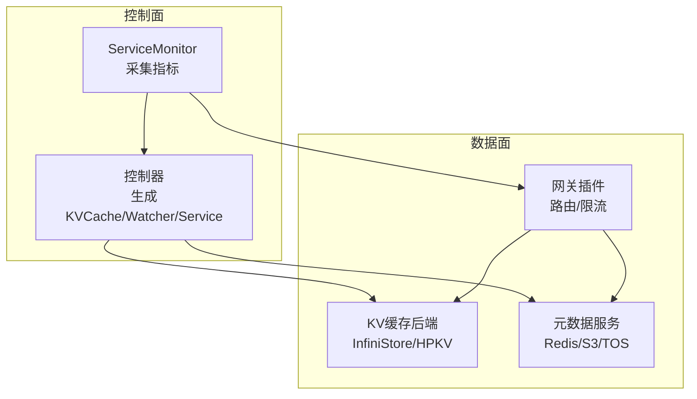
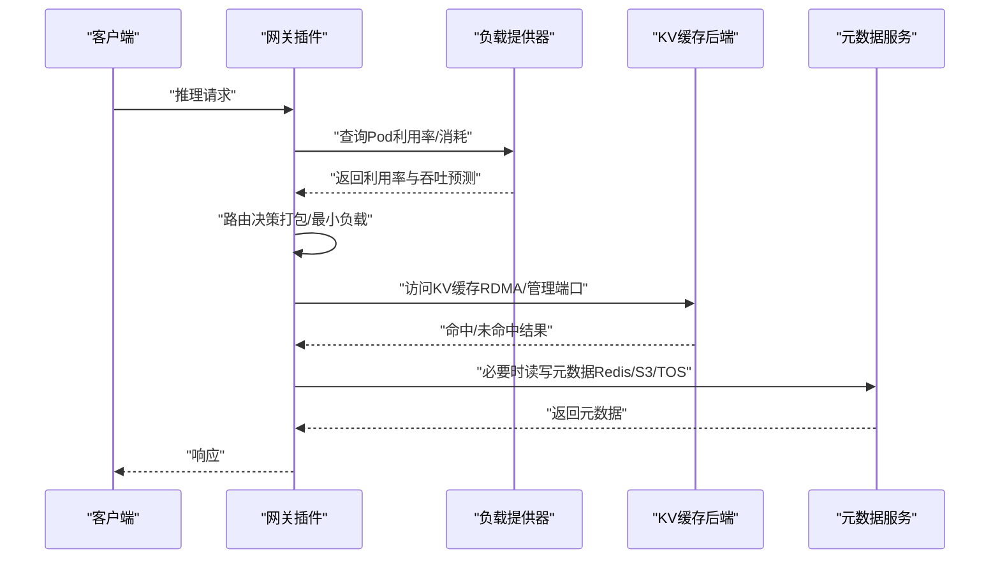
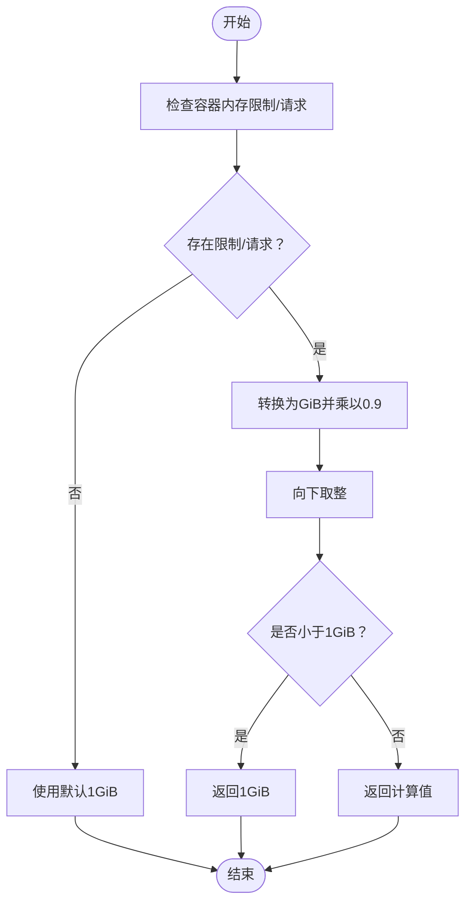
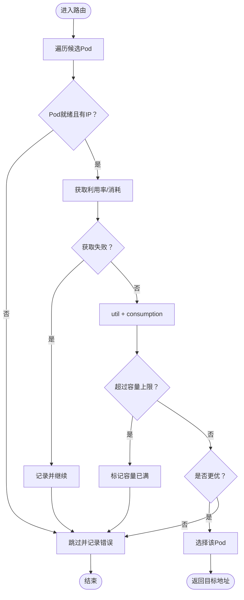
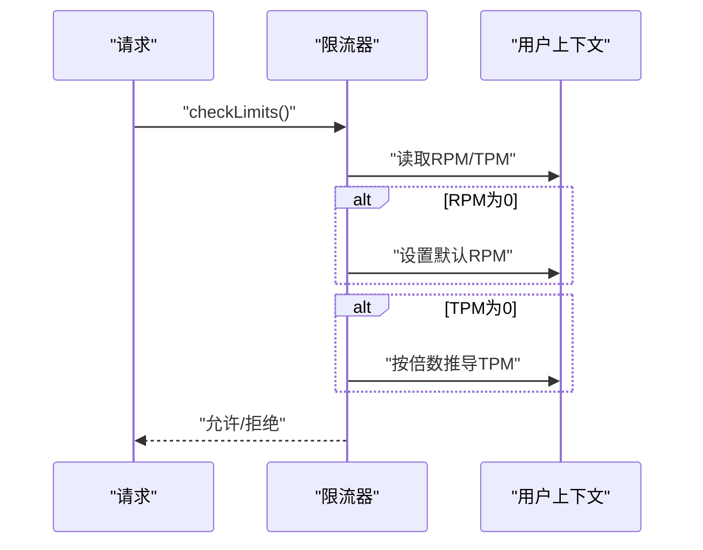
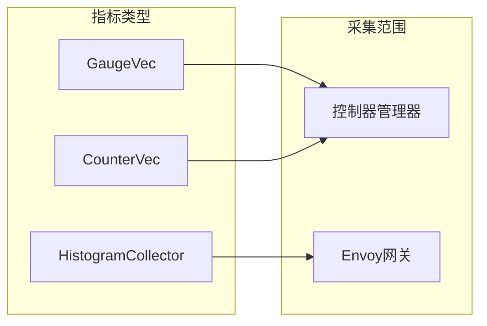
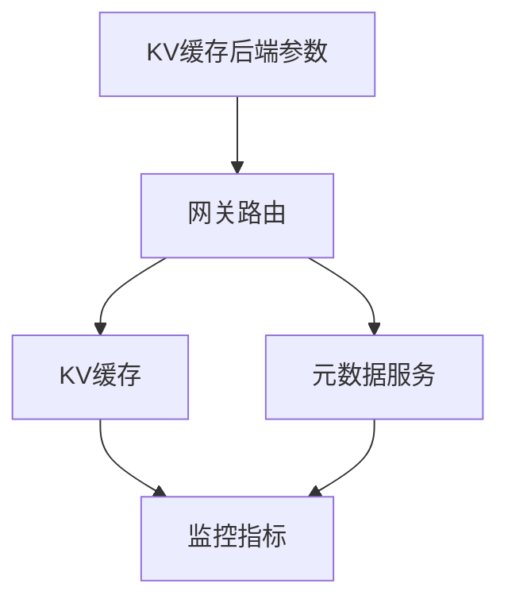

# 性能调优

<cite>
**本文引用的文件**   
- [config/metadata/redis.yaml](file://config/metadata/redis.yaml)
- [config/metadata/s3-env-patch.yaml](file://config/metadata/s3-env-patch.yaml)
- [config/metadata/tos-env-patch.yaml](file://config/metadata/tos-env-patch.yaml)
- [pkg/controller/kvcache/backends/infinistore.go](file://pkg/controller/kvcache/backends/infinistore.go)
- [pkg/controller/kvcache/backends/hpkv.go](file://pkg/controller/kvcache/backends/hpkv.go)
- [pkg/plugins/gateway/algorithms/pack_load.go](file://pkg/plugins/gateway/algorithms/pack_load.go)
- [pkg/plugins/gateway/algorithms/least_load_test.go](file://pkg/plugins/gateway/algorithms/least_load_test.go)
- [pkg/plugins/gateway/gateway_ratelimit.go](file://pkg/plugins/gateway/gateway_ratelimit.go)
- [pkg/cache/pending_load_provider.go](file://pkg/cache/pending_load_provider.go)
- [pkg/metrics/custom_metrics.go](file://pkg/metrics/custom_metrics.go)
- [observability/monitor/service_monitor_controller_manager.yaml](file://observability/monitor/service_monitor_controller_manager.yaml)
- [observability/monitor/service_monitor_gateway.yaml](file://observability/monitor/service_monitor_gateway.yaml)
- [benchmarks/config.yaml](file://benchmarks/config.yaml)
- [apps/console/api/config/config.go](file://apps/console/api/config/config.go)
</cite>

## 目录
1. [简介](#简介)
2. [项目结构](#项目结构)
3. [核心组件](#核心组件)
4. [架构总览](#架构总览)
5. [详细组件分析](#详细组件分析)
6. [依赖关系分析](#依赖关系分析)
7. [性能考量](#性能考量)
8. [故障排查指南](#故障排查指南)
9. [结论](#结论)
10. [附录](#附录)

## 简介
本指南面向AIBrix在生产环境中的性能调优需求，围绕资源配置、存储性能、网络性能与监控观测四个方面，结合代码实现与配置样例，给出可操作的优化建议与排障方法。内容覆盖：
- 资源配置：CPU/内存限制与请求、亲和性与调度约束
- 存储性能：Redis元数据、S3/TOS对象存储接入与调优要点
- 网络性能：网关路由与限流、连接池与超时策略
- 监控与瓶颈识别：指标采集、可视化与分析流程

## 项目结构
AIBrix通过控制器生成KV缓存后端（InfiniStore/HPKV）、网关插件路由、以及元数据服务（Redis/S3/TOS）等组件协同工作。性能调优的关键在于：
- 合理设置容器资源请求/限制，避免过度或不足
- 针对不同后端选择合适的RDMA/管理端口、一致性哈希槽位等参数
- 在网关层实施合理的负载分配与限流策略
- 建立完善的监控体系，持续观测关键指标并定位瓶颈

**章节来源**
- [pkg/controller/kvcache/backends/infinistore.go:1-438](file://pkg/controller/kvcache/backends/infinistore.go#L1-L438)
- [pkg/controller/kvcache/backends/hpkv.go:1-425](file://pkg/controller/kvcache/backends/hpkv.go#L1-L425)
- [observability/monitor/service_monitor_controller_manager.yaml:1-19](file://observability/monitor/service_monitor_controller_manager.yaml#L1-L19)
- [observability/monitor/service_monitor_gateway.yaml:1-20](file://observability/monitor/service_monitor_gateway.yaml#L1-L20)

## 核心组件
- KV缓存后端（InfiniStore/HPKV）
  - 支持通过注解与参数控制RDMA端口、管理端口、一致性哈希槽位、虚拟节点数等
  - 自动推导预分配内存大小，依据容器内存限制/请求计算
- 网关插件
  - 路由算法基于负载提供器（利用率+吞吐/延迟预测），支持打包式与最小负载策略
  - 限流器按用户维度（RPM/TPM）进行速率控制
- 元数据服务
  - Redis用于KV事件与状态同步
  - S3/TOS通过环境变量注入凭证与桶信息
- 监控
  - Prometheus ServiceMonitor采集控制器与Envoy指标
  - 自定义指标封装，支持Gauge/Counter/Histogram

**章节来源**
- [pkg/controller/kvcache/backends/infinistore.go:413-437](file://pkg/controller/kvcache/backends/infinistore.go#L413-L437)
- [pkg/controller/kvcache/backends/hpkv.go:415-424](file://pkg/controller/kvcache/backends/hpkv.go#L415-L424)
- [pkg/plugins/gateway/algorithms/pack_load.go:41-109](file://pkg/plugins/gateway/algorithms/pack_load.go#L41-L109)
- [pkg/plugins/gateway/gateway_ratelimit.go:31-37](file://pkg/plugins/gateway/gateway_ratelimit.go#L31-L37)
- [config/metadata/redis.yaml:1-49](file://config/metadata/redis.yaml#L1-L49)
- [config/metadata/s3-env-patch.yaml:1-40](file://config/metadata/s3-env-patch.yaml#L1-L40)
- [config/metadata/tos-env-patch.yaml:1-45](file://config/metadata/tos-env-patch.yaml#L1-L45)
- [pkg/metrics/custom_metrics.go:49-155](file://pkg/metrics/custom_metrics.go#L49-L155)

## 架构总览
下图展示从请求进入网关到KV缓存与元数据服务交互的典型路径，并标注性能相关参数位置。

**图表来源**
- [pkg/plugins/gateway/algorithms/pack_load.go:41-109](file://pkg/plugins/gateway/algorithms/pack_load.go#L41-L109)
- [pkg/controller/kvcache/backends/infinistore.go:402-411](file://pkg/controller/kvcache/backends/infinistore.go#L402-L411)
- [pkg/controller/kvcache/backends/hpkv.go:415-424](file://pkg/controller/kvcache/backends/hpkv.go#L415-L424)
- [config/metadata/redis.yaml:1-49](file://config/metadata/redis.yaml#L1-L49)
- [config/metadata/s3-env-patch.yaml:1-40](file://config/metadata/s3-env-patch.yaml#L1-L40)
- [config/metadata/tos-env-patch.yaml:1-45](file://config/metadata/tos-env-patch.yaml#L1-L45)

## 详细组件分析

### KV缓存后端参数与资源预分配
- 关键参数
  - RDMA端口、管理端口、链路类型、一致性哈希总槽位、虚拟节点数
  - HPKV：块大小、块数量
- 资源预分配
  - 依据容器内存限制/请求，按0.9倍向下取整推导预分配大小；若均未设置则默认1GiB
- RDMA网络
  - 当显式声明RDMA资源时，自动注入RDMA CNI网络注解

**图表来源**
- [pkg/controller/kvcache/backends/infinistore.go:413-437](file://pkg/controller/kvcache/backends/infinistore.go#L413-L437)

**章节来源**
- [pkg/controller/kvcache/backends/infinistore.go:402-411](file://pkg/controller/kvcache/backends/infinistore.go#L402-L411)
- [pkg/controller/kvcache/backends/infinistore.go:413-437](file://pkg/controller/kvcache/backends/infinistore.go#L413-L437)
- [pkg/controller/kvcache/backends/hpkv.go:415-424](file://pkg/controller/kvcache/backends/hpkv.go#L415-L424)

### 网关路由与负载策略
- 打包式负载（packLoadRouter）
  - 综合利用率与消耗，优先选择“最宽松”的Pod；当无可用度量时回退错误
- 最小负载测试用例
  - 展示了在给定利用率与消耗下的路由行为，便于验证策略效果

**图表来源**
- [pkg/plugins/gateway/algorithms/pack_load.go:41-109](file://pkg/plugins/gateway/algorithms/pack_load.go#L41-L109)

**章节来源**
- [pkg/plugins/gateway/algorithms/pack_load.go:41-109](file://pkg/plugins/gateway/algorithms/pack_load.go#L41-L109)
- [pkg/plugins/gateway/algorithms/least_load_test.go:311-368](file://pkg/plugins/gateway/algorithms/least_load_test.go#L311-L368)

### 限流与配额
- 默认RPM与TPM
  - 若用户未指定RPM，则采用默认值；TPM按RPM乘以固定倍数推导
- 限流器
  - 按用户维度进行滑动窗口计数，支持时间单位配置

**图表来源**
- [pkg/plugins/gateway/gateway_ratelimit.go:31-37](file://pkg/plugins/gateway/gateway_ratelimit.go#L31-L37)

**章节来源**
- [pkg/plugins/gateway/gateway_ratelimit.go:31-37](file://pkg/plugins/gateway/gateway_ratelimit.go#L31-L37)

### 元数据服务配置（Redis/S3/TOS）
- Redis
  - 提供轻量级元数据与事件存储，建议设置合理CPU/内存请求，避免被QoS抢占
- S3/TOS
  - 通过环境变量注入凭证与桶信息；确保密钥与区域正确，减少鉴权失败重试

**章节来源**
- [config/metadata/redis.yaml:1-49](file://config/metadata/redis.yaml#L1-L49)
- [config/metadata/s3-env-patch.yaml:1-40](file://config/metadata/s3-env-patch.yaml#L1-L40)
- [config/metadata/tos-env-patch.yaml:1-45](file://config/metadata/tos-env-patch.yaml#L1-L45)

### 指标与监控
- 自定义指标
  - 支持Gauge/Counter/Histogram，自动注册并按标签聚合
- 控制器与Envoy监控
  - ServiceMonitor分别采集控制器与Envoy指标，便于端到端观测

**图表来源**
- [pkg/metrics/custom_metrics.go:49-155](file://pkg/metrics/custom_metrics.go#L49-L155)
- [observability/monitor/service_monitor_controller_manager.yaml:1-19](file://observability/monitor/service_monitor_controller_manager.yaml#L1-L19)
- [observability/monitor/service_monitor_gateway.yaml:1-20](file://observability/monitor/service_monitor_gateway.yaml#L1-L20)

**章节来源**
- [pkg/metrics/custom_metrics.go:49-155](file://pkg/metrics/custom_metrics.go#L49-L155)
- [observability/monitor/service_monitor_controller_manager.yaml:1-19](file://observability/monitor/service_monitor_controller_manager.yaml#L1-L19)
- [observability/monitor/service_monitor_gateway.yaml:1-20](file://observability/monitor/service_monitor_gateway.yaml#L1-L20)

## 依赖关系分析
- KV缓存后端依赖注解与资源规格，决定RDMA端口、管理端口、一致性哈希参数与预分配内存
- 网关路由依赖负载提供器的利用率与吞吐预测，受模型特征与运行时指标影响
- 元数据服务通过环境变量注入，直接影响下载/上传性能与稳定性
- 监控体系通过ServiceMonitor与自定义指标，形成闭环观测

**图表来源**
- [pkg/controller/kvcache/backends/infinistore.go:402-411](file://pkg/controller/kvcache/backends/infinistore.go#L402-L411)
- [pkg/plugins/gateway/algorithms/pack_load.go:41-109](file://pkg/plugins/gateway/algorithms/pack_load.go#L41-L109)
- [pkg/metrics/custom_metrics.go:49-155](file://pkg/metrics/custom_metrics.go#L49-L155)

**章节来源**
- [pkg/controller/kvcache/backends/infinistore.go:402-411](file://pkg/controller/kvcache/backends/infinistore.go#L402-L411)
- [pkg/plugins/gateway/algorithms/pack_load.go:41-109](file://pkg/plugins/gateway/algorithms/pack_load.go#L41-L109)
- [pkg/metrics/custom_metrics.go:49-155](file://pkg/metrics/custom_metrics.go#L49-L155)

## 性能考量
- 资源配置优化
  - CPU/内存请求：根据模型大小与并发峰值估算，避免过度预留导致资源闲置，或不足导致频繁限速/驱逐
  - 亲和性与拓扑：结合GPU/网卡亲和，减少跨节点RDMA通信开销
  - 预分配内存：InfiniStore/HPKV会按内存限制推导预分配大小，建议在StatefulSet中明确requests/limits，确保一致
- 存储性能优化
  - Redis：保持较小延迟，避免高竞争；如需高可用可考虑主从或哨兵
  - S3/TOS：校验凭证与区域，启用多线程/分片传输；针对大文件可开启断点续传
- 网络性能优化
  - 路由策略：在高并发场景优先使用打包式负载，降低抖动；低延迟场景可选最小负载
  - 限流：按用户维度设置RPM/TPM，避免单用户拖累整体
  - 连接池与超时：在客户端与服务间统一设置合理的连接复用与超时阈值，减少握手与空闲占用
- 监控与分析
  - 使用ServiceMonitor与自定义指标，关注吞吐、P95/P99延迟、错误率、队列长度、利用率等
  - 结合基准测试配置，定期压测并对比指标变化，识别回归

[本节为通用指导，不直接分析具体文件]

## 故障排查指南
- 超时与重试
  - 控制器与事件处理中广泛使用带超时的上下文，若出现超时错误，优先检查资源配额与网络连通性
- 指标异常
  - 利用ServiceMonitor确认指标可达；通过自定义指标查看路由与负载分布是否符合预期
- 配置问题
  - S3/TOS凭证缺失会导致对象存储操作失败；Redis不可达会影响KV事件同步
- 基准测试
  - 使用基准配置文件调整并发、间隔与输出目标，定位吞吐与延迟瓶颈

**章节来源**
- [benchmarks/config.yaml:97-107](file://benchmarks/config.yaml#L97-L107)
- [apps/console/api/config/config.go:131-171](file://apps/console/api/config/config.go#L131-L171)

## 结论
AIBrix的性能调优应以“可观测—可调节—可验证”为主线：先建立完善监控，再依据业务特征调整资源与参数，最后通过基准测试验证效果。KV缓存后端的参数与预分配、网关路由与限流策略、以及元数据服务的配置，是影响端到端性能的关键环节。建议在生产环境中逐步迭代这些参数，并结合监控指标持续优化。

[本节为总结性内容，不直接分析具体文件]

## 附录
- 关键参数速查
  - InfiniStore/HPKV：RDMA端口、管理端口、一致性哈希槽位、虚拟节点数、块大小/块数量
  - 预分配内存：基于内存限制/请求按0.9倍计算
  - 网关：路由策略（打包/最小负载）、RPM/TPM、窗口时间单位
  - 元数据：Redis/S3/TOS的端点、凭证、区域、桶名

[本节为概览性内容，不直接分析具体文件]