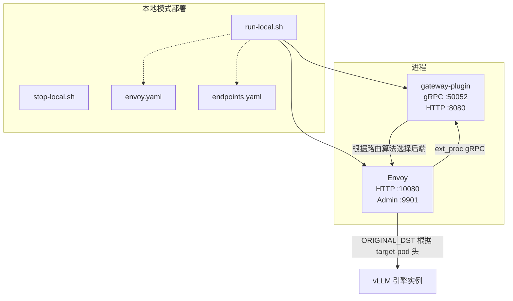
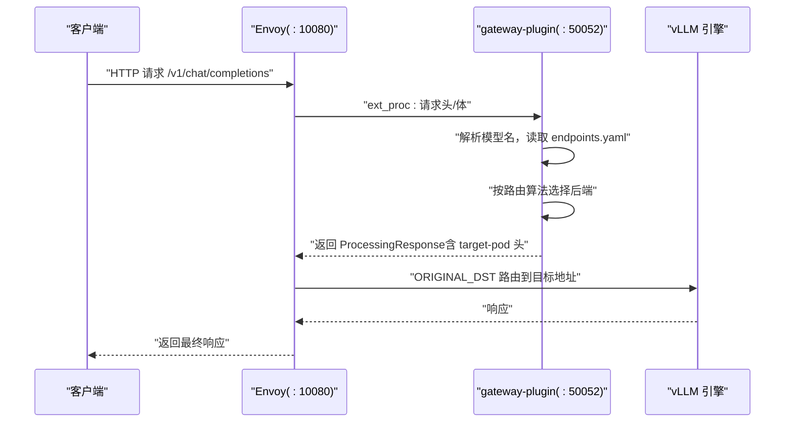
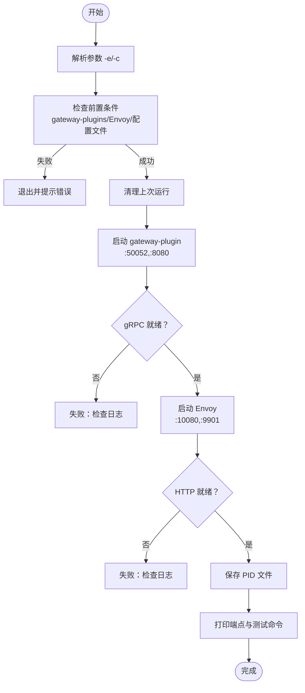
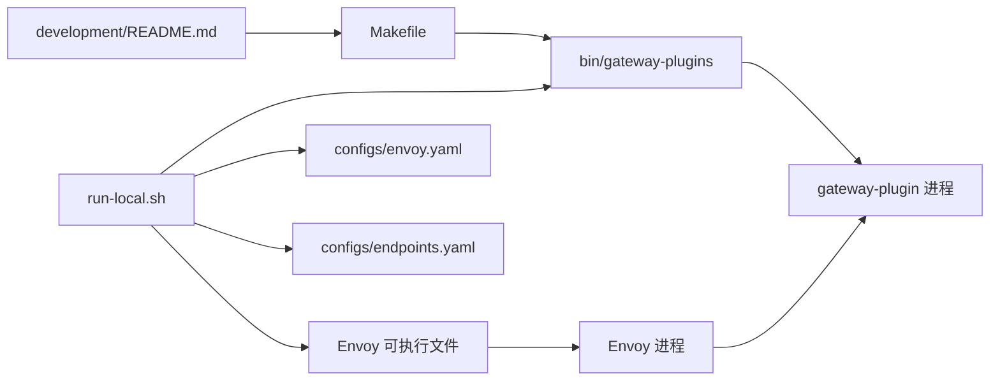

# 本地开发环境

<cite>
**本文引用的文件**
- [run-local.sh](file://deployment/local/run-local.sh)
- [stop-local.sh](file://deployment/local/stop-local.sh)
- [envoy.yaml](file://deployment/local/configs/envoy.yaml)
- [endpoints.yaml](file://deployment/local/configs/endpoints.yaml)
- [README.md（本地模式）](file://deployment/local/README.md)
- [Makefile](file://Makefile)
- [main.go（网关插件入口）](file://cmd/plugins/main.go)
- [gateway.go（网关处理核心）](file://pkg/plugins/gateway/gateway.go)
- [random.go（随机路由算法）](file://pkg/plugins/gateway/algorithms/random.go)
- [least_request.go（最少请求路由算法）](file://pkg/plugins/gateway/algorithms/least_request.go)
- [model_router_factory.go（路由工厂）](file://pkg/plugins/gateway/algorithms/model_router_factory.go)
- [development/README.md](file://development/README.md)
- [development/app/README.md](file://development/app/README.md)
</cite>

## 目录
1. [简介](#简介)
2. [项目结构](#项目结构)
3. [核心组件](#核心组件)
4. [架构总览](#架构总览)
5. [详细组件分析](#详细组件分析)
6. [依赖关系分析](#依赖关系分析)
7. [性能考量](#性能考量)
8. [故障排除指南](#故障排除指南)
9. [结论](#结论)
10. [附录](#附录)

## 简介
本指南面向在本地进行 AIBrix 开发与调试的工程师，围绕“本地模式”（bare-process 模式）提供从环境准备、二进制构建、服务启动到调试与排障的完整操作手册。本地模式通过两个原生进程运行：Envoy（反向代理与扩展处理器）与 gateway-plugin（扩展处理器 gRPC 服务），无需容器或 Kubernetes，适合单机快速验证与算法调试。

## 项目结构
本地开发相关的关键目录与文件：
- deployment/local：本地模式启动脚本与静态配置
  - run-local.sh：启动脚本，负责检查前置条件、启动进程并输出端点信息
  - stop-local.sh：停止脚本，读取 PID 文件并优雅终止进程
  - configs/envoy.yaml：Envoy 配置，定义监听、路由、过滤器与集群
  - configs/endpoints.yaml：后端 vLLM 引擎地址清单
  - README.md：本地模式说明、端点、配置与故障排除
- cmd/plugins/main.go：gateway-plugin 的入口，支持 standalone 模式与 HTTP 暴露
- pkg/plugins/gateway：网关处理逻辑（ext_proc 流程、路由选择、指标与错误处理）
- pkg/plugins/gateway/algorithms：多种路由算法实现（随机、最少请求等）
- Makefile：构建命令（含 gateway-plugins 构建目标）

图表来源
- [run-local.sh:1-165](file://deployment/local/run-local.sh#L1-L165)
- [envoy.yaml:1-155](file://deployment/local/configs/envoy.yaml#L1-L155)
- [endpoints.yaml:1-33](file://deployment/local/configs/endpoints.yaml#L1-L33)

章节来源
- [README.md（本地模式）:1-195](file://deployment/local/README.md#L1-L195)
- [run-local.sh:1-165](file://deployment/local/run-local.sh#L1-L165)
- [envoy.yaml:1-155](file://deployment/local/configs/envoy.yaml#L1-L155)
- [endpoints.yaml:1-33](file://deployment/local/configs/endpoints.yaml#L1-L33)

## 核心组件
- 启动脚本 run-local.sh
  - 负责检查前置条件（gateway-plugins 可执行文件、Envoy 可执行文件、配置文件存在性）
  - 启动 gateway-plugin（standalone 模式，绑定 gRPC :50052 与 HTTP :8080）
  - 启动 Envoy（监听 :10080，Admin :9901），等待就绪
  - 输出端点与测试命令，并记录 PID 以便停止
- 停止脚本 stop-local.sh
  - 读取 PID 文件，逐个终止进程，清理共享内存
- Envoy 配置 envoy.yaml
  - 定义监听器、路由规则、访问日志、ext_proc 过滤器、静态集群与 ORIGINAL_DST 动态集群
- 端点配置 endpoints.yaml
  - 定义模型名到后端引擎地址（可多后端、可角色集拆分）
- 网关插件 gateway-plugin
  - 入口 main.go 支持 standalone 模式与 HTTP 暴露
  - 处理核心 gateway.go 实现 ext_proc 生命周期、路由选择、指标与错误处理
  - 路由算法位于 algorithms 子包，如 random、least_request 等

章节来源
- [run-local.sh:1-165](file://deployment/local/run-local.sh#L1-L165)
- [stop-local.sh:1-35](file://deployment/local/stop-local.sh#L1-L35)
- [envoy.yaml:1-155](file://deployment/local/configs/envoy.yaml#L1-L155)
- [endpoints.yaml:1-33](file://deployment/local/configs/endpoints.yaml#L1-L33)
- [main.go（网关插件入口）:1-198](file://cmd/plugins/main.go#L1-L198)
- [gateway.go（网关处理核心）:1-535](file://pkg/plugins/gateway/gateway.go#L1-L535)

## 架构总览
本地模式采用“Envoy + gateway-plugin”的协作架构：
- Envoy 接收客户端请求，将请求头与体通过 ext_proc 发送给 gateway-plugin
- gateway-plugin 解析模型名，查询 endpoints.yaml，按路由算法选择最佳后端
- gateway-plugin 返回包含 target-pod 头的响应，Envoy 使用 ORIGINAL_DST 将请求转发至该地址
- Envoy 暴露 HTTP API（:10080）、Admin（:9901），gateway-plugin 暴露 HTTP（:8080，用于 /metrics 与 /v1/models）

图表来源
- [envoy.yaml:88-104](file://deployment/local/configs/envoy.yaml#L88-L104)
- [gateway.go（网关处理核心）:238-303](file://pkg/plugins/gateway/gateway.go#L238-L303)

章节来源
- [README.md（本地模式）:12-29](file://deployment/local/README.md#L12-L29)
- [envoy.yaml:1-155](file://deployment/local/configs/envoy.yaml#L1-L155)
- [gateway.go（网关处理核心）:1-535](file://pkg/plugins/gateway/gateway.go#L1-L535)

## 详细组件分析

### 启动脚本 run-local.sh 工作流
- 参数解析
  - -e：自定义 endpoints.yaml 路径
  - -c：自定义 envoy.yaml 路径
- 前置条件检查
  - gateway-plugins 是否存在
  - Envoy 是否在 PATH 中
  - envoy.yaml 与 endpoints.yaml 是否存在
- 清理上次运行
  - 若存在 PID 文件则调用 stop-local.sh 停止旧进程
- 启动顺序与就绪检测
  - 启动 gateway-plugin（standalone，绑定 :50052/:8080），等待 gRPC 监听就绪
  - 启动 Envoy，等待 :10080 就绪
- 记录 PID 并输出端点与测试命令

图表来源
- [run-local.sh:22-143](file://deployment/local/run-local.sh#L22-L143)

章节来源
- [run-local.sh:1-165](file://deployment/local/run-local.sh#L1-L165)

### 停止脚本 stop-local.sh 行为
- 读取 PID 文件，分别终止 gateway-plugin 与 Envoy
- 清理共享内存，避免重启时 base_id 冲突
- 输出已停止信息

章节来源
- [stop-local.sh:1-35](file://deployment/local/stop-local.sh#L1-L35)

### Envoy 配置要点
- 监听器与路由
  - 监听 :10080，域通配符，路由到 ORIGINAL_DST 或 gateway_http
  - /v1/models 与 /metrics 路由到 gateway_http（HTTP 服务器）
  - /healthz 直接返回 200
- 过滤器链
  - ext_proc：gRPC 服务指向 gateway_ext_proc 集群（:50052）
  - router：最终路由
- 集群
  - gateway_ext_proc：指向 gateway-plugin gRPC
  - gateway_http：指向 gateway-plugin HTTP（:8080）
  - original_destination_cluster：基于 target-pod 头动态路由

章节来源
- [envoy.yaml:1-155](file://deployment/local/configs/envoy.yaml#L1-L155)

### 端点配置 endpoints.yaml
- models[].name：模型名（需与请求一致）
- models[].engine：引擎类型（可选）
- models[].endpoints：后端地址列表（直连模式）
- models[].rolesets：角色集拆分（prefill/decode）

章节来源
- [endpoints.yaml:1-33](file://deployment/local/configs/endpoints.yaml#L1-L33)

### 网关插件入口与运行模式
- main.go
  - 支持 standalone 模式（必须提供 --endpoints-config）
  - 绑定 gRPC（:50052）与 HTTP（:8080，默认，可通过 --http-bind-address 覆盖）
  - 初始化缓存、路由工厂、健康检查与 HTTP 服务器
  - 提供 /metrics 与 /v1/models（本地模式下 Envoy 直接路由到此）
- 路由工厂
  - 默认使用 SLO 路由工厂（可被环境变量或配置覆盖）

章节来源
- [main.go（网关插件入口）:54-198](file://cmd/plugins/main.go#L54-L198)
- [model_router_factory.go（路由工厂）:1-19](file://pkg/plugins/gateway/algorithms/model_router_factory.go#L1-L19)

### 路由算法示例
- 随机算法（random.go）
  - 注册名称：random
  - 从候选 Pod 列表中随机选择
- 最少请求算法（least_request.go）
  - 基于实时请求数最小化选择
  - 支持多端口场景与回退策略

章节来源
- [random.go（随机路由算法）:1-62](file://pkg/plugins/gateway/algorithms/random.go#L1-L62)
- [least_request.go（最少请求路由算法）:1-233](file://pkg/plugins/gateway/algorithms/least_request.go#L1-L233)

### 网关处理流程（ext_proc）
- 生命周期
  - 接收 ProcessingRequest（请求头/体、响应头/体）
  - 调用 HandleRequestHeaders/HandleRequestBody/HandleResponseHeaders/HandleResponseBody
  - 设置 target-pod 头，返回 ProcessingResponse
- 错误处理与指标
  - 对 gRPC 错误、上下文取消、发送失败等情况进行分类统计
  - 指标通过 Prometheus 暴露（/metrics）

章节来源
- [gateway.go（网关处理核心）:123-331](file://pkg/plugins/gateway/gateway.go#L123-L331)

## 依赖关系分析
- 构建与运行
  - Makefile 提供构建 gateway-plugins 的目标（无 ZMQ 版本，适合 standalone）
  - development/README.md 提供通用开发流程与工具链要求
- 本地模式依赖
  - 必须先构建 gateway-plugins（无 ZMQ）
  - 需要 Envoy 可执行文件
  - 需要至少一个 vLLM 引擎实例（地址在 endpoints.yaml 中配置）

图表来源
- [Makefile:218-228](file://Makefile#L218-L228)
- [development/README.md:16-27](file://development/README.md#L16-L27)
- [run-local.sh:15-56](file://deployment/local/run-local.sh#L15-L56)

章节来源
- [Makefile:218-228](file://Makefile#L218-L228)
- [development/README.md:16-27](file://development/README.md#L16-L27)
- [run-local.sh:15-56](file://deployment/local/run-local.sh#L15-L56)

## 性能考量
- 路由算法选择
  - least-request 等算法依赖实时指标；在多副本场景下能更均衡负载
  - random 简单直接，适合快速验证
- Envoy 超时与空闲
  - stream_idle_timeout 与 request_timeout 较长，适配长尾响应
- 指标与可观测性
  - gateway-plugin 暴露 Prometheus 指标（/metrics）
  - Envoy Admin（:9901）可用于查看统计与配置快照

章节来源
- [envoy.yaml:33-35](file://deployment/local/configs/envoy.yaml#L33-L35)
- [gateway.go（网关处理核心）:409-431](file://pkg/plugins/gateway/gateway.go#L409-L431)

## 故障排除指南
- “no healthy upstream”
  - 检查 endpoints.yaml 中后端地址是否可达且正确
- “ext_proc gRPC error”
  - 查看 gateway-plugin 日志，确认进程是否正常启动
- Envoy 启动失败
  - 检查 :10080 或 :9901 是否被占用；查看 envoy.log
- 路由不生效
  - 确认请求中的模型名与 endpoints.yaml 中的 name 完全一致
- 进程无法停止或重启冲突
  - 使用 stop-local.sh 停止；若仍冲突，手动清理共享内存（脚本已处理）

章节来源
- [README.md（本地模式）:186-194](file://deployment/local/README.md#L186-L194)
- [run-local.sh:88-105](file://deployment/local/run-local.sh#L88-L105)
- [stop-local.sh:31-32](file://deployment/local/stop-local.sh#L31-L32)

## 结论
本地模式为 AIBrix 的本地开发与算法调试提供了轻量、可控的运行环境。通过 run-local.sh 一键启动、envoy.yaml 与 endpoints.yaml 的清晰配置，以及 gateway-plugin 的扩展处理器能力，开发者可以快速验证路由策略、观测指标并定位问题。建议在本地先完成核心功能验证后再进入容器/Kubernetes 环境进行集成测试。

## 附录

### 快速开始步骤
- 安装 Go 与 Envoy（见本地模式 README）
- 构建 gateway-plugins（无 ZMQ）
  - make build-gateway-plugins-nozmq
- 准备 vLLM 引擎（例如：vllm serve ... --port 8000）
- 编辑 endpoints.yaml，确保模型名与请求一致
- 启动本地网关
  - cd deployment/local && ./run-local.sh
- 停止本地网关
  - ./stop-local.sh

章节来源
- [README.md（本地模式）:31-98](file://deployment/local/README.md#L31-L98)
- [Makefile:226-228](file://Makefile#L226-L228)

### 端点与日志
- 端点
  - HTTP API：:10080（/v1/chat/completions 等）
  - Envoy Admin：:9901
  - 网关指标：:8080/metrics
  - 健康检查：:10080/healthz
- 日志
  - gateway-plugin.log
  - envoy.log

章节来源
- [README.md（本地模式）:170-184](file://deployment/local/README.md#L170-L184)
- [run-local.sh:148-162](file://deployment/local/run-local.sh#L148-L162)