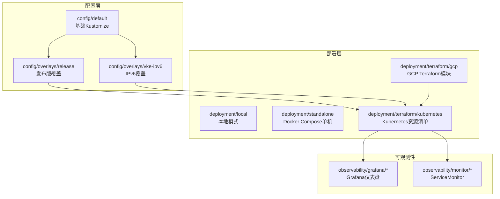
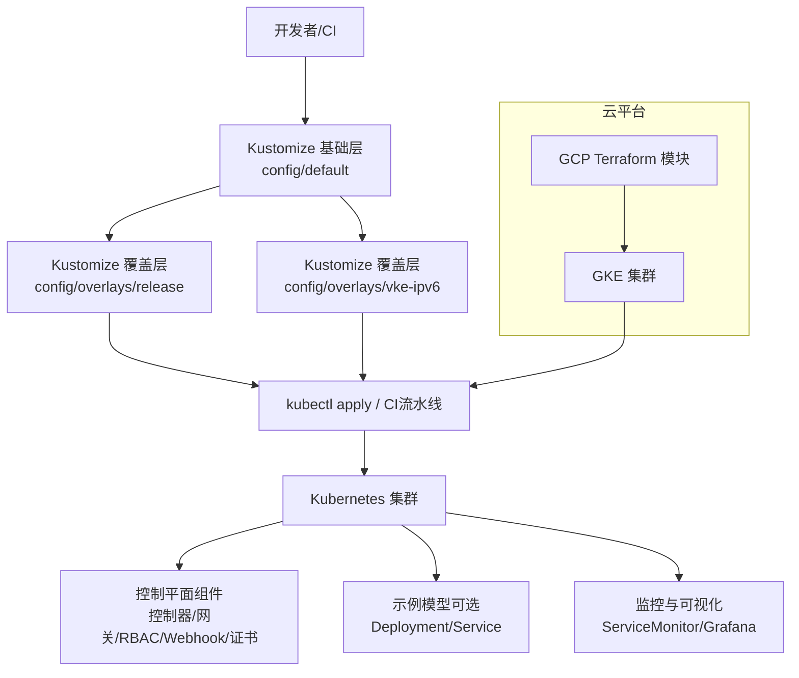
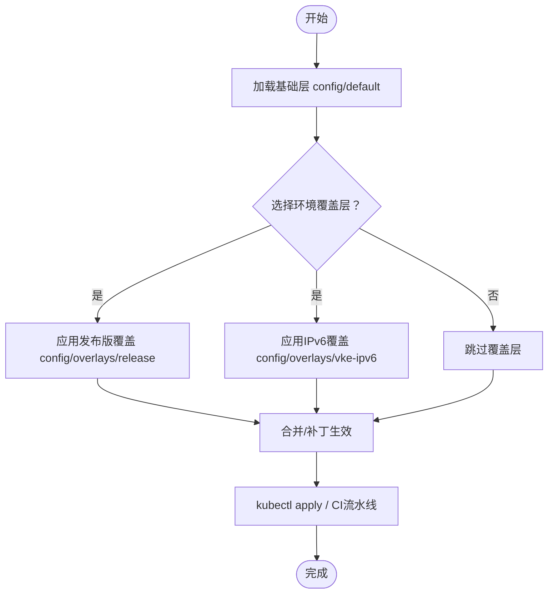
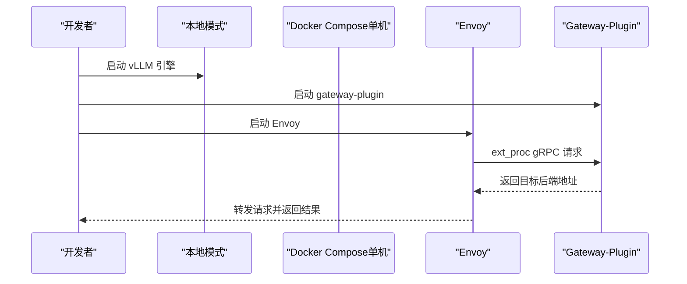
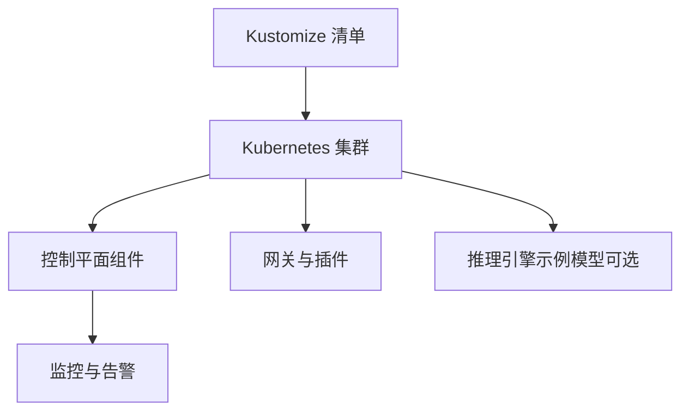
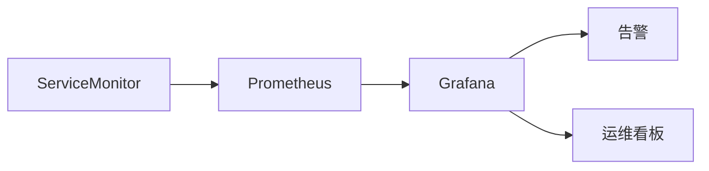
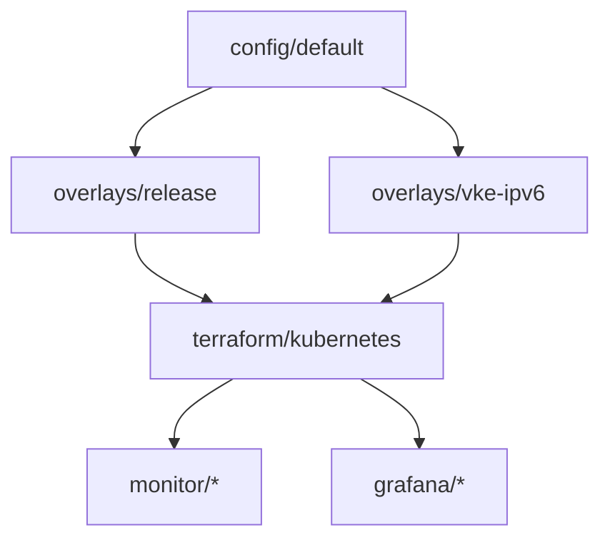

# 生产环境部署

<cite>
**本文引用的文件**
- [config/default/kustomization.yaml](file://config/default/kustomization.yaml)
- [config/overlays/release/kustomization.yaml](file://config/overlays/release/kustomization.yaml)
- [config/overlays/vke-ipv6/kustomization.yaml](file://config/overlays/vke-ipv6/kustomization.yaml)
- [deployment/local/README.md](file://deployment/local/README.md)
- [deployment/standalone/README.md](file://deployment/standalone/README.md)
- [deployment/terraform/gcp/README.md](file://deployment/terraform/gcp/README.md)
- [deployment/terraform/kubernetes/main.tf](file://deployment/terraform/kubernetes/main.tf)
- [deployment/terraform/gcp/variables.tf](file://deployment/terraform/gcp/variables.tf)
- [observability/grafana/AIBrix_Control_Plane_Runtime_Dashboard.json](file://observability/grafana/AIBrix_Control_Plane_Runtime_Dashboard.json)
- [observability/monitor/service_monitor_controller_manager.yaml](file://observability/monitor/service_monitor_controller_manager.yaml)
- [config/prometheus/monitor.yaml](file://config/prometheus/monitor.yaml)
- [config/rbac/autoscaling/autoscaling_podautoscaler_editor_role.yaml](file://config/rbac/autoscaling/autoscaling_podautoscaler_editor_role.yaml)
- [config/rbac/controller-manager/role_binding.yaml](file://config/rbac/controller-manager/role_binding.yaml)
</cite>

## 目录
1. [简介](#简介)
2. [项目结构](#项目结构)
3. [核心组件](#核心组件)
4. [架构总览](#架构总览)
5. [详细组件分析](#详细组件分析)
6. [依赖关系分析](#依赖关系分析)
7. [性能考量](#性能考量)
8. [故障排查指南](#故障排查指南)
9. [结论](#结论)
10. [附录](#附录)

## 简介
本文件面向AIBrix在生产环境的部署与运维，系统性梳理单节点部署、多节点集群部署与云平台部署的策略差异，深入解析Kustomize overlays在不同环境下的配置覆盖方式（如镜像版本、补丁、资源限制），并提供云平台（AWS/GCP）部署指引与最佳实践。同时，涵盖生产级安全配置、监控与可观测性、备份策略与运维建议，帮助团队在不同规模与合规要求下稳定运行AIBrix推理与网关体系。

## 项目结构
AIBrix的部署与配置主要集中在以下目录：
- config：Kubernetes清单与Kustomize基础层与覆盖层（overlays）
- deployment：本地模式、Docker Compose单机模式、Terraform云部署脚本
- observability：Grafana仪表盘与ServiceMonitor监控定义
- samples：示例工作负载与控制器资源样例
- docs：官方文档与设计说明

图表来源
- [config/default/kustomization.yaml:1-90](file://config/default/kustomization.yaml#L1-L90)
- [config/overlays/release/kustomization.yaml:1-30](file://config/overlays/release/kustomization.yaml#L1-L30)
- [config/overlays/vke-ipv6/kustomization.yaml:1-9](file://config/overlays/vke-ipv6/kustomization.yaml#L1-L9)
- [deployment/terraform/kubernetes/main.tf:1-170](file://deployment/terraform/kubernetes/main.tf#L1-L170)
- [deployment/terraform/gcp/README.md:1-77](file://deployment/terraform/gcp/README.md#L1-L77)

章节来源
- [config/default/kustomization.yaml:1-90](file://config/default/kustomization.yaml#L1-L90)
- [config/overlays/release/kustomization.yaml:1-30](file://config/overlays/release/kustomization.yaml#L1-L30)
- [config/overlays/vke-ipv6/kustomization.yaml:1-9](file://config/overlays/vke-ipv6/kustomization.yaml#L1-L9)
- [deployment/terraform/kubernetes/main.tf:1-170](file://deployment/terraform/kubernetes/main.tf#L1-L170)
- [deployment/terraform/gcp/README.md:1-77](file://deployment/terraform/gcp/README.md#L1-L77)

## 核心组件
- 控制平面与网关
  - 控制器管理器、RBAC、Webhook、内部证书、Prometheus监控等通过Kustomize默认层统一装配。
  - 发布版覆盖层对镜像标签进行锁定，并引入PodDisruptionBudget等生产级增强。
  - IPv6覆盖层针对特定网络栈进行代理补丁。
- 运行时与模型服务
  - Terraform模块在GKE上部署完整集群，并可选部署示例模型Deployment与Service，便于快速验证。
- 本地与单机部署
  - 本地模式（无K8s）适合开发调试；Docker Compose单机模式适合单GPU或多GPU推理场景，支持P/D解耦。
- 可观测性
  - Grafana仪表盘与ServiceMonitor用于采集控制面与网关指标，便于生产监控告警。

章节来源
- [config/default/kustomization.yaml:1-90](file://config/default/kustomization.yaml#L1-L90)
- [config/overlays/release/kustomization.yaml:1-30](file://config/overlays/release/kustomization.yaml#L1-L30)
- [deployment/terraform/kubernetes/main.tf:60-170](file://deployment/terraform/kubernetes/main.tf#L60-L170)
- [deployment/local/README.md:1-195](file://deployment/local/README.md#L1-L195)
- [deployment/standalone/README.md:1-397](file://deployment/standalone/README.md#L1-L397)
- [observability/grafana/AIBrix_Control_Plane_Runtime_Dashboard.json:1-1228](file://observability/grafana/AIBrix_Control_Plane_Runtime_Dashboard.json#L1-L1228)
- [observability/monitor/service_monitor_controller_manager.yaml:1-19](file://observability/monitor/service_monitor_controller_manager.yaml#L1-L19)

## 架构总览
下图展示从Kustomize到Kubernetes再到云平台的整体部署路径，以及生产环境的关键增强点（镜像锁定、补丁、监控、示例模型）。

图表来源
- [config/default/kustomization.yaml:1-90](file://config/default/kustomization.yaml#L1-L90)
- [config/overlays/release/kustomization.yaml:1-30](file://config/overlays/release/kustomization.yaml#L1-L30)
- [config/overlays/vke-ipv6/kustomization.yaml:1-9](file://config/overlays/vke-ipv6/kustomization.yaml#L1-L9)
- [deployment/terraform/kubernetes/main.tf:1-170](file://deployment/terraform/kubernetes/main.tf#L1-L170)
- [deployment/terraform/gcp/README.md:1-77](file://deployment/terraform/gcp/README.md#L1-L77)

## 详细组件分析

### Kustomize Overlays 使用方法
- 基础层（config/default）
  - 统一命名空间、资源聚合、镜像替换、RBAC绑定、Webhook与内部证书启用开关、Prometheus监控开关等。
- 发布版覆盖（config/overlays/release）
  - 锁定各组件镜像版本，引入PodDisruptionBudget等生产增强。
- IPv6覆盖（config/overlays/vke-ipv6）
  - 针对IPv6网络环境的代理补丁，确保网关代理兼容。
- 使用建议
  - 在CI中以“基础层 + 环境覆盖层”组合生成最终清单，避免直接修改基础层。
  - 将镜像tag固化为已验证的稳定版本，避免nightly漂移带来的风险。

图表来源
- [config/default/kustomization.yaml:1-90](file://config/default/kustomization.yaml#L1-L90)
- [config/overlays/release/kustomization.yaml:1-30](file://config/overlays/release/kustomization.yaml#L1-L30)
- [config/overlays/vke-ipv6/kustomization.yaml:1-9](file://config/overlays/vke-ipv6/kustomization.yaml#L1-L9)

章节来源
- [config/default/kustomization.yaml:1-90](file://config/default/kustomization.yaml#L1-L90)
- [config/overlays/release/kustomization.yaml:1-30](file://config/overlays/release/kustomization.yaml#L1-L30)
- [config/overlays/vke-ipv6/kustomization.yaml:1-9](file://config/overlays/vke-ipv6/kustomization.yaml#L1-L9)

### 单节点部署策略
- 本地模式（deployment/local）
  - 无需K8s，直接运行Envoy与gateway-plugin作为原生进程，适合开发与单机测试。
  - 关键点：端口规划、路由算法、日志定位。
- Docker Compose单机（deployment/standalone）
  - 支持简单模式与P/D解耦模式，适合单GPU或多GPU推理。
  - 关键点：GPU直通、内存利用率、健康检查与端点暴露。

图表来源
- [deployment/local/README.md:1-195](file://deployment/local/README.md#L1-L195)
- [deployment/standalone/README.md:1-397](file://deployment/standalone/README.md#L1-L397)

章节来源
- [deployment/local/README.md:1-195](file://deployment/local/README.md#L1-L195)
- [deployment/standalone/README.md:1-397](file://deployment/standalone/README.md#L1-L397)

### 多节点集群部署策略
- 基于Kustomize的集群化部署
  - 使用基础层与发布版覆盖层生成生产清单，结合RBAC、Webhook、内部证书与Prometheus监控。
- 示例模型部署（可选）
  - Terraform模块在GKE上部署示例模型的Deployment与Service，便于端到端验证。
- 高可用与弹性
  - 通过PodDisruptionBudget与控制器工作负载管理实现容灾与滚动更新。

图表来源
- [config/default/kustomization.yaml:1-90](file://config/default/kustomization.yaml#L1-L90)
- [config/overlays/release/kustomization.yaml:1-30](file://config/overlays/release/kustomization.yaml#L1-L30)
- [deployment/terraform/kubernetes/main.tf:60-170](file://deployment/terraform/kubernetes/main.tf#L60-L170)

章节来源
- [config/default/kustomization.yaml:1-90](file://config/default/kustomization.yaml#L1-L90)
- [config/overlays/release/kustomization.yaml:1-30](file://config/overlays/release/kustomization.yaml#L1-L30)
- [deployment/terraform/kubernetes/main.tf:1-170](file://deployment/terraform/kubernetes/main.tf#L1-L170)

### 云平台部署指南（AWS/GCP）
- GCP 快速开始
  - 使用GCP Terraform模块一键部署AIBrix集群，包含GKE节点池、GPU配额与认证插件。
  - 提供公共IP与端到端测试命令，便于快速验证。
- AWS 建议
  - 参考GCP模块的变量与资源组织方式，映射至AWS EKS或GKE的等价资源（IAM角色、节点组、GPU实例类型、安全组、存储与网络策略）。
  - 建议在CI中以“基础层 + 区域覆盖层”的方式生成最终清单，确保镜像版本与网络策略一致。
- 通用最佳实践
  - 固化镜像版本（参考发布版覆盖层），避免nightly漂移。
  - 启用PodDisruptionBudget与健康探针，保障SLA。
  - 使用专用命名空间与最小权限RBAC，配合Webhook与内部证书提升安全性。

章节来源
- [deployment/terraform/gcp/README.md:1-77](file://deployment/terraform/gcp/README.md#L1-L77)
- [deployment/terraform/gcp/variables.tf:1-78](file://deployment/terraform/gcp/variables.tf#L1-L78)
- [config/overlays/release/kustomization.yaml:1-30](file://config/overlays/release/kustomization.yaml#L1-L30)

### 安全配置
- RBAC与最小权限
  - 控制器管理器与各子系统的RBAC绑定应遵循最小权限原则，仅授予必要资源访问。
- Webhook与证书
  - 默认层提供Webhook与内部证书启用开关，建议在生产中启用Webhook并使用受信CA签发的证书。
- 访问控制
  - 对外暴露的网关入口应结合Ingress/Gateway API与WAF/防火墙策略，限制来源IP与速率。

章节来源
- [config/rbac/controller-manager/role_binding.yaml:1-16](file://config/rbac/controller-manager/role_binding.yaml#L1-L16)
- [config/rbac/autoscaling/autoscaling_podautoscaler_editor_role.yaml:1-28](file://config/rbac/autoscaling/autoscaling_podautoscaler_editor_role.yaml#L1-L28)
- [config/default/kustomization.yaml:29-38](file://config/default/kustomization.yaml#L29-L38)

### 监控与可观测性
- 指标采集
  - 通过ServiceMonitor暴露控制面与网关指标端点，Prometheus抓取并持久化。
- 可视化
  - 使用Grafana仪表盘查看控制面重调度、工作队列深度、延迟等关键指标。
- 告警建议
  - 基于ServiceMonitor与Grafana告警规则，建立“重调度异常、队列积压、探针失败、GPU利用率过高”等告警。

图表来源
- [config/prometheus/monitor.yaml:1-19](file://config/prometheus/monitor.yaml#L1-L19)
- [observability/monitor/service_monitor_controller_manager.yaml:1-19](file://observability/monitor/service_monitor_controller_manager.yaml#L1-L19)
- [observability/grafana/AIBrix_Control_Plane_Runtime_Dashboard.json:1-1228](file://observability/grafana/AIBrix_Control_Plane_Runtime_Dashboard.json#L1-L1228)

章节来源
- [config/prometheus/monitor.yaml:1-19](file://config/prometheus/monitor.yaml#L1-L19)
- [observability/monitor/service_monitor_controller_manager.yaml:1-19](file://observability/monitor/service_monitor_controller_manager.yaml#L1-L19)
- [observability/grafana/AIBrix_Control_Plane_Runtime_Dashboard.json:1-1228](file://observability/grafana/AIBrix_Control_Plane_Runtime_Dashboard.json#L1-L1228)

### 备份策略与运维建议
- 配置备份
  - 将Kustomize基础层与覆盖层纳入版本控制，记录镜像版本与补丁变更。
- 数据与元数据
  - 模型注册表与状态存储（如Redis）应配置持久化卷与定期快照。
- 滚动升级与回滚
  - 使用PodDisruptionBudget与分批滚动升级，保留回滚策略与灰度发布流程。
- 日志与审计
  - 统一收集Envoy、网关插件与控制器的日志，开启审计事件与访问日志。

## 依赖关系分析
- 组件耦合
  - 控制器管理器与各子控制器通过RBAC绑定，依赖Webhook与证书层。
  - 网关与推理引擎通过ServiceMonitor暴露指标，依赖Prometheus与Grafana。
- 外部依赖
  - GCP Terraform模块依赖Google Cloud SDK与GKE认证插件；AWS需映射至EKS与GPU实例族。
- 潜在环路
  - Kustomize层之间通过“基础层 + 覆盖层”组合，避免直接相互依赖，降低循环依赖风险。

图表来源
- [config/default/kustomization.yaml:1-90](file://config/default/kustomization.yaml#L1-L90)
- [config/overlays/release/kustomization.yaml:1-30](file://config/overlays/release/kustomization.yaml#L1-L30)
- [config/overlays/vke-ipv6/kustomization.yaml:1-9](file://config/overlays/vke-ipv6/kustomization.yaml#L1-L9)
- [deployment/terraform/kubernetes/main.tf:1-170](file://deployment/terraform/kubernetes/main.tf#L1-L170)
- [observability/monitor/service_monitor_controller_manager.yaml:1-19](file://observability/monitor/service_monitor_controller_manager.yaml#L1-L19)
- [observability/grafana/AIBrix_Control_Plane_Runtime_Dashboard.json:1-1228](file://observability/grafana/AIBrix_Control_Plane_Runtime_Dashboard.json#L1-L1228)

章节来源
- [config/default/kustomization.yaml:1-90](file://config/default/kustomization.yaml#L1-L90)
- [config/overlays/release/kustomization.yaml:1-30](file://config/overlays/release/kustomization.yaml#L1-L30)
- [config/overlays/vke-ipv6/kustomization.yaml:1-9](file://config/overlays/vke-ipv6/kustomization.yaml#L1-L9)
- [deployment/terraform/kubernetes/main.tf:1-170](file://deployment/terraform/kubernetes/main.tf#L1-L170)

## 性能考量
- 资源限制与亲和性
  - 推理引擎与网关容器应设置明确的CPU/内存requests/limits与GPU资源配额，避免资源争抢。
- 队列与重调度
  - 关注控制面工作队列深度与重调度耗时，及时扩容或优化控制器逻辑。
- 网络与路由
  - 在多节点环境下，确保网关代理与后端引擎的网络连通性与低延迟。

## 故障排查指南
- 本地模式常见问题
  - “无健康上游”：检查vLLM后端可达性与端口配置。
  - “ext_proc gRPC错误”：确认gateway-plugin进程状态与日志。
  - Envoy启动失败：检查端口占用与配置文件。
- 单机模式常见问题
  - GPU不可见：确认驱动、NVIDIA Container Toolkit与容器运行时。
  - 模型加载失败：检查缓存路径、显存与上下文长度。
  - 连接错误：检查Envoy健康与上游集群状态。
- 云平台问题
  - GCP GPU配额不足：根据提示调整实例类型或申请配额。
  - 端到端验证：使用模块输出的公共IP与示例请求进行测试。

章节来源
- [deployment/local/README.md:186-195](file://deployment/local/README.md#L186-L195)
- [deployment/standalone/README.md:210-270](file://deployment/standalone/README.md#L210-L270)
- [deployment/terraform/gcp/README.md:13-37](file://deployment/terraform/gcp/README.md#L13-L37)

## 结论
通过“基础层 + 环境覆盖层”的Kustomize策略，AIBrix可在不同规模与网络环境中实现一致、可审计且可复现的部署。结合生产级镜像锁定、补丁与监控，辅以安全RBAC与Webhook，可满足高可用与合规要求。云平台方面，GCP Terraform模块提供了快速验证路径，AWS可按相同模式映射至EKS。建议在CI中固化镜像版本与补丁，配合ServiceMonitor与Grafana构建完善的可观测体系。

## 附录
- 快速对照表
  - 环境覆盖层：发布版覆盖用于锁定镜像版本；IPv6覆盖用于特定网络栈。
  - 本地/单机：本地模式适合开发调试；Docker Compose适合单机推理。
  - 云平台：GCP提供一键部署；AWS建议按GCP模块映射至EKS。
  - 安全：启用Webhook与内部证书，最小权限RBAC。
  - 监控：ServiceMonitor + Grafana仪表盘 + 告警规则。