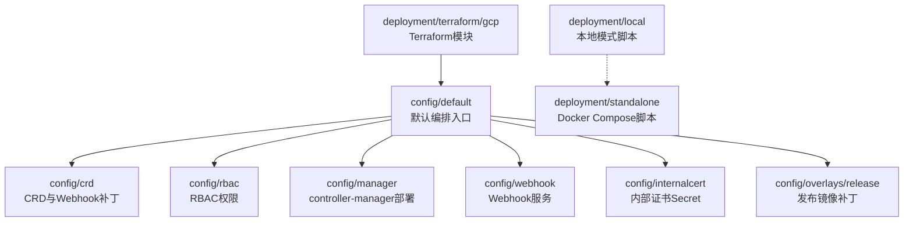
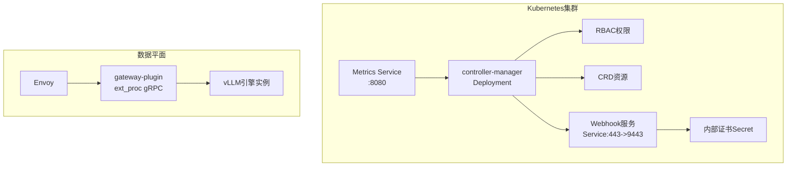
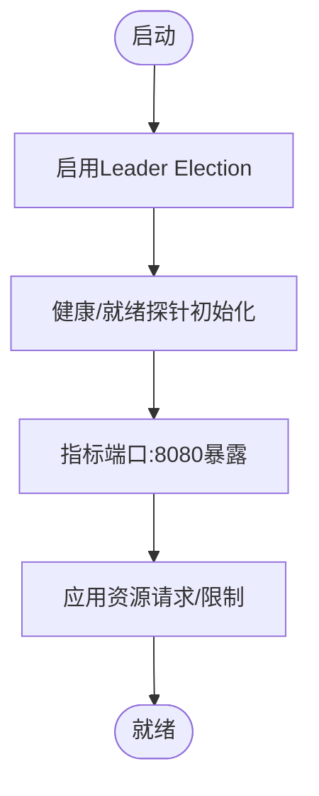
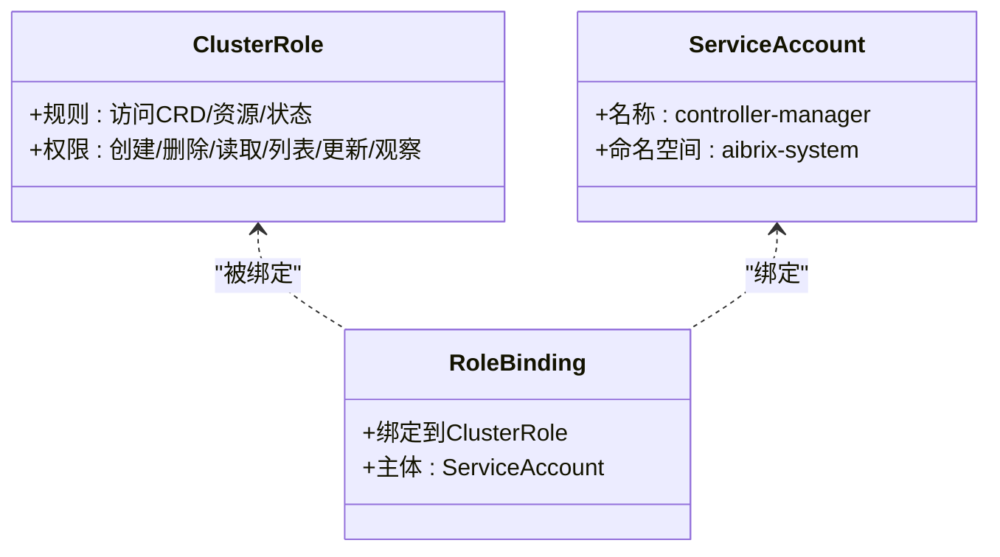
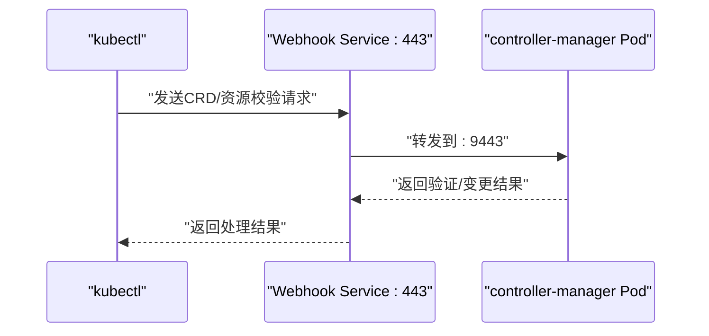
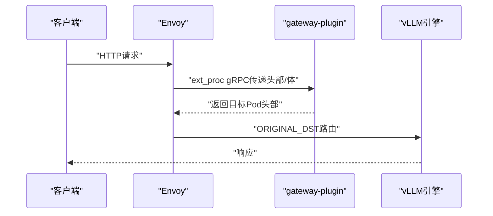
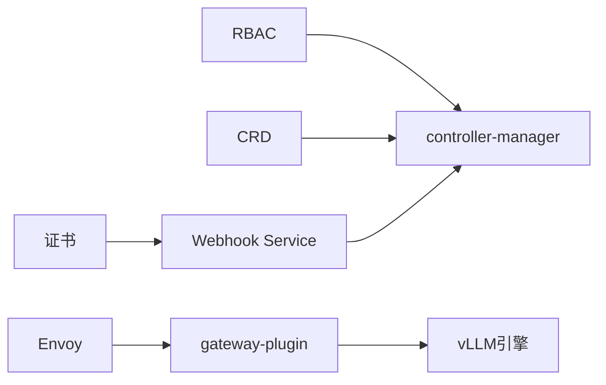

# 部署与配置

<cite>
**本文引用的文件**
- [config/crd/kustomization.yaml](file://config/crd/kustomization.yaml)
- [config/default/kustomization.yaml](file://config/default/kustomization.yaml)
- [config/manager/manager.yaml](file://config/manager/manager.yaml)
- [config/rbac/controller-manager/role.yaml](file://config/rbac/controller-manager/role.yaml)
- [config/webhook/service.yaml](file://config/webhook/service.yaml)
- [config/internalcert/secret.yaml](file://config/internalcert/secret.yaml)
- [config/overlays/release/kustomization.yaml](file://config/overlays/release/kustomization.yaml)
- [deployment/local/run-local.sh](file://deployment/local/run-local.sh)
- [deployment/local/README.md](file://deployment/local/README.md)
- [deployment/standalone/start.sh](file://deployment/standalone/start.sh)
- [deployment/terraform/gcp/main.tf](file://deployment/terraform/gcp/main.tf)
- [config/samples/autoscaling_v1alpha1_podautoscaler.yaml](file://config/samples/autoscaling_v1alpha1_podautoscaler.yaml)
- [config/samples/orchestration_v1alpha1_stormservice.yaml](file://config/samples/orchestration_v1alpha1_stormservice.yaml)
- [config/samples/model_v1alpha1_modeladapter.yaml](file://config/samples/model_v1alpha1_modeladapter.yaml)
- [config/samples/orchestration_v1alpha1_kvcache.yaml](file://config/samples/orchestration_v1alpha1_kvcache.yaml)
- [config/samples/orchestration_v1alpha1_rayclusterfleet.yaml](file://config/samples/orchestration_v1alpha1_rayclusterfleet.yaml)
- [config/samples/orchestration_v1alpha1_rayclusterreplicaset.yaml](file://config/samples/orchestration_v1alpha1_rayclusterreplicaset.yaml)
- [config/samples/orchestration_v1alpha1_roleset.yaml](file://config/samples/orchestration_v1alpha1_roleset.yaml)
- [config/samples/autoscaling_v1alpha1_demo_nginx.yaml](file://config/samples/autoscaling_v1alpha1_demo_nginx.yaml)
- [config/samples/autoscaling_v1alpha1_kpa.yaml](file://config/samples/autoscaling_v1alpha1_kpa.yaml)
- [config/samples/autoscaling_v1alpha1_mock_llama.yaml](file://config/samples/autoscaling_v1alpha1_mock_llama.yaml)
- [config/samples/autoscaling_v1alpha1_mock_llama_apa.yaml](file://config/samples/autoscaling_v1alpha1_mock_llama_apa.yaml)
- [config/samples/autoscaling_v1alpha1_podautoscaler.yaml](file://config/samples/autoscaling_v1alpha1_podautoscaler.yaml)
- [samples/quickstart/model.yaml](file://samples/quickstart/model.yaml)
- [samples/quickstart/pd-model.yaml](file://samples/quickstart/pd-model.yaml)
- [samples/disaggregation/vllm/deepseek-r1.yaml](file://samples/disaggregation/vllm/deepseek-r1.yaml)
- [samples/autoscaling/stormservice-pool.yaml](file://samples/autoscaling/stormservice-pool.yaml)
- [samples/autoscaling/stormservice-replica.yaml](file://samples/autoscaling/stormservice-replica.yaml)
- [samples/autoscaling/apa.yaml](file://samples/autoscaling/apa.yaml)
- [samples/autoscaling/kpa.yaml](file://samples/autoscaling/kpa.yaml)
- [samples/autoscaling/multimetrics-apa.yaml](file://samples/autoscaling/multimetrics-apa.yaml)
- [samples/autoscaling/optimizer-kpa.yaml](file://samples/autoscaling/optimizer-kpa.yaml)
- [development/tutorials/podautoscaler/README.md](file://development/tutorials/podautoscaler/README.md)
- [development/tutorials/distributed/fleet.yaml](file://development/tutorials/distributed/fleet.yaml)
- [development/tutorials/distributed/nvkind-single-node.yaml](file://development/tutorials/distributed/nvkind-single-node.yaml)
- [development/tutorials/distributed/nvkind-two-nodes.yaml](file://development/tutorials/distributed/nvkind-two-nodes.yaml)
- [development/tutorials/kvcache/kvcache.yaml](file://development/tutorials/kvcache/kvcache.yaml)
- [development/tutorials/lora/model_adapter.yaml](file://development/tutorials/lora/model_adapter.yaml)
- [development/tutorials/lora/model_adapter_api_key.yaml](file://development/tutorials/lora/model_adapter_api_key.yaml)
- [development/vllm/kind-config.yaml](file://development/vllm/kind-config.yaml)
- [development/app/config/templates/](file://development/app/config/templates/)
- [observability/monitor/service_monitor_controller_manager.yaml](file://observability/monitor/service_monitor_controller_manager.yaml)
- [observability/monitor/service_monitor_gateway.yaml](file://observability/monitor/service_monitor_gateway.yaml)
- [observability/monitor/service_monitor_vllm.yaml](file://observability/monitor/service_monitor_vllm.yaml)
- [observability/grafana/AIBrix_Control_Plane_Runtime_Dashboard.json](file://observability/grafana/AIBrix_Control_Plane_Runtime_Dashboard.json)
- [observability/grafana/AIBrix_Envoy_Gateway_Dashboard.json](file://observability/grafana/AIBrix_Envoy_Gateway_Dashboard.json)
- [observability/grafana/AIBrix_Envoy_Gateway_Plugins_Dashboard.json](file://observability/grafana/AIBrix_Envoy_Gateway_Plugins_Dashboard.json)
- [observability/grafana/AIBrix_vLLM_Engine_Dashboard.json](file://observability/grafana/AIBrix_vLLM_Engine_Dashboard.json)
</cite>

## 目录
1. [简介](#简介)
2. [项目结构](#项目结构)
3. [核心组件](#核心组件)
4. [架构总览](#架构总览)
5. [详细组件分析](#详细组件分析)
6. [依赖关系分析](#依赖关系分析)
7. [性能考虑](#性能考虑)
8. [故障排除指南](#故障排除指南)
9. [结论](#结论)
10. [附录](#附录)

## 简介
本文件面向AIBrix在Kubernetes上的原生部署与配置，覆盖CRD安装、RBAC权限、Webhook与证书、服务发现、控制器与网关组件、以及多环境部署策略（本地开发、单节点、多节点生产）。同时提供安全最佳实践、性能调优建议、常用部署脚本与配置模板路径，以及常见问题排查方法。

## 项目结构
AIBrix采用Kustomize组织部署清单，核心目录如下：
- config/crd：自定义资源定义（CRD）及转换Webhook补丁
- config/default：默认命名空间、名称前缀、资源编排入口
- config/manager：controller-manager部署与指标服务
- config/rbac：控制器所需ClusterRole/RoleBinding等权限
- config/webhook：Webhook服务暴露端口与选择器
- config/internalcert：内部CA证书Secret占位
- config/overlays/release：发布版镜像标签与补丁
- deployment/local：本地模式（无K8s）运行脚本与说明
- deployment/standalone：Docker Compose单机部署脚本
- deployment/terraform/gcp：GCP集群与AIBrix部署模块
- config/samples 与 samples：CRD示例与教程样例
- development：开发与演示用配置、Kind集群、教程
- observability：Prometheus监控与Grafana仪表盘

**图表来源**
- [config/default/kustomization.yaml:20-31](file://config/default/kustomization.yaml#L20-L31)
- [config/crd/kustomization.yaml:4-8](file://config/crd/kustomization.yaml#L4-L8)
- [config/manager/manager.yaml:1-20](file://config/manager/manager.yaml#L1-L20)
- [config/webhook/service.yaml:1-20](file://config/webhook/service.yaml#L1-L20)
- [config/internalcert/secret.yaml:1-6](file://config/internalcert/secret.yaml#L1-L6)
- [config/overlays/release/kustomization.yaml:6-13](file://config/overlays/release/kustomization.yaml#L6-L13)
- [deployment/local/run-local.sh:1-30](file://deployment/local/run-local.sh#L1-L30)
- [deployment/standalone/start.sh:1-30](file://deployment/standalone/start.sh#L1-L30)
- [deployment/terraform/gcp/main.tf:22-44](file://deployment/terraform/gcp/main.tf#L22-L44)

**章节来源**
- [config/default/kustomization.yaml:1-90](file://config/default/kustomization.yaml#L1-L90)
- [config/crd/kustomization.yaml:1-31](file://config/crd/kustomization.yaml#L1-L31)

## 核心组件
- 控制器管理器（controller-manager）
  - 部署于系统命名空间，启用Leader Election、健康检查与指标端口
  - 安全上下文限制特权提升，容器资源设置请求/限制
  - 参考路径：[config/manager/manager.yaml:1-87](file://config/manager/manager.yaml#L1-L87)
- RBAC权限
  - ClusterRole涵盖CRD、Deployment/STS、HPA、Service、Endpointslice、Gateway HTTPRoute、模型与编排CRD等资源的增删改查与状态更新
  - 参考路径：[config/rbac/controller-manager/role.yaml:1-319](file://config/rbac/controller-manager/role.yaml#L1-L319)
- Webhook服务
  - Service暴露443端口至控制器管理器Pod
  - 参考路径：[config/webhook/service.yaml:1-20](file://config/webhook/service.yaml#L1-L20)
- 内部证书
  - 占位Secret用于Webhook证书注入
  - 参考路径：[config/internalcert/secret.yaml:1-6](file://config/internalcert/secret.yaml#L1-L6)
- 发布补丁
  - 覆盖KubeRay Operator与各组件镜像版本
  - 参考路径：[config/overlays/release/kustomization.yaml:1-30](file://config/overlays/release/kustomization.yaml#L1-L30)

**章节来源**
- [config/manager/manager.yaml:1-87](file://config/manager/manager.yaml#L1-L87)
- [config/rbac/controller-manager/role.yaml:1-319](file://config/rbac/controller-manager/role.yaml#L1-L319)
- [config/webhook/service.yaml:1-20](file://config/webhook/service.yaml#L1-L20)
- [config/internalcert/secret.yaml:1-6](file://config/internalcert/secret.yaml#L1-L6)
- [config/overlays/release/kustomization.yaml:1-30](file://config/overlays/release/kustomization.yaml#L1-L30)

## 架构总览
AIBrix在Kubernetes中的核心组件交互如下：
- 控制器管理器负责CRD资源的协调与状态维护
- Webhook服务为CRD提供验证/变更钩子（需配合证书）
- Envoy作为入口网关，通过外部处理器扩展（ext_proc）对接gateway-plugin进行路由、限流与追踪
- vLLM引擎作为后端推理实例，由控制器或KubeRay Operator管理生命周期

**图表来源**
- [config/manager/manager.yaml:1-87](file://config/manager/manager.yaml#L1-L87)
- [config/webhook/service.yaml:1-20](file://config/webhook/service.yaml#L1-L20)
- [config/internalcert/secret.yaml:1-6](file://config/internalcert/secret.yaml#L1-L6)
- [deployment/local/README.md:12-29](file://deployment/local/README.md#L12-L29)

## 详细组件分析

### 控制器管理器（controller-manager）
- 关键点
  - 启用Leader Election以避免多副本竞争
  - 健康探针与就绪探针分别绑定8081与8080端口
  - 指标端口8080可被Prometheus抓取
  - 容器安全能力限制与非root运行
- 性能与资源
  - 设置CPU/Memory请求/限制，适配生产环境可按负载调整
- 参考路径
  - [config/manager/manager.yaml:1-87](file://config/manager/manager.yaml#L1-L87)

**图表来源**
- [config/manager/manager.yaml:30-52](file://config/manager/manager.yaml#L30-L52)

**章节来源**
- [config/manager/manager.yaml:1-87](file://config/manager/manager.yaml#L1-L87)

### RBAC权限与角色绑定
- 关键点
  - 覆盖事件、Secret、Mutating/ValidatingWebhook、CRD、Deployment/STS、HPA、Pod/Service、EndpointSlice、Gateway HTTPRoute、以及AIBrix各CRD的读写与状态更新
  - 与控制器管理器ServiceAccount绑定
- 参考路径
  - [config/rbac/controller-manager/role.yaml:1-319](file://config/rbac/controller-manager/role.yaml#L1-L319)

**图表来源**
- [config/rbac/controller-manager/role.yaml:1-319](file://config/rbac/controller-manager/role.yaml#L1-L319)

**章节来源**
- [config/rbac/controller-manager/role.yaml:1-319](file://config/rbac/controller-manager/role.yaml#L1-L319)

### Webhook与证书
- Webhook服务
  - Service暴露443端口，目标端口9443，选择器匹配控制面Pod
  - 参考路径：[config/webhook/service.yaml:1-20](file://config/webhook/service.yaml#L1-L20)
- 内部证书
  - Secret占位，用于Webhook证书注入
  - 参考路径：[config/internalcert/secret.yaml:1-6](file://config/internalcert/secret.yaml#L1-L6)
- CRD转换Webhook
  - 在CRD层开启转换Webhook补丁（需配合证书）
  - 参考路径：[config/crd/kustomization.yaml:10-24](file://config/crd/kustomization.yaml#L10-L24)

**图表来源**
- [config/webhook/service.yaml:14-19](file://config/webhook/service.yaml#L14-L19)
- [config/crd/kustomization.yaml:10-24](file://config/crd/kustomization.yaml#L10-L24)

**章节来源**
- [config/webhook/service.yaml:1-20](file://config/webhook/service.yaml#L1-L20)
- [config/internalcert/secret.yaml:1-6](file://config/internalcert/secret.yaml#L1-L6)
- [config/crd/kustomization.yaml:10-24](file://config/crd/kustomization.yaml#L10-L24)

### 服务发现与Envoy网关
- 本地模式（无K8s）
  - Envoy + gateway-plugin直连后端vLLM引擎
  - 通过ext_proc gRPC交换实现路由决策
  - 参考路径：[deployment/local/README.md:12-29](file://deployment/local/README.md#L12-L29)
- Docker Compose单机模式
  - 支持P/D解耦模式与默认模式；等待metadata、Envoy、vLLM健康
  - 参考路径：[deployment/standalone/start.sh:275-321](file://deployment/standalone/start.sh#L275-L321)

**图表来源**
- [deployment/local/README.md:12-29](file://deployment/local/README.md#L12-L29)

**章节来源**
- [deployment/local/README.md:12-29](file://deployment/local/README.md#L12-L29)
- [deployment/standalone/start.sh:275-321](file://deployment/standalone/start.sh#L275-L321)

### 多环境部署策略

#### 本地开发环境（本地模式）
- 特点
  - 无需K8s，直接运行Envoy与gateway-plugin进程
  - 适合快速调试与单机测试
- 快速启动
  - 参考路径：[deployment/local/run-local.sh:1-165](file://deployment/local/run-local.sh#L1-L165)
- 故障排除
  - 参考路径：[deployment/local/README.md:186-195](file://deployment/local/README.md#L186-L195)

**章节来源**
- [deployment/local/run-local.sh:1-165](file://deployment/local/run-local.sh#L1-L165)
- [deployment/local/README.md:186-195](file://deployment/local/README.md#L186-L195)

#### 单节点集群（Kind/K3s）
- 使用Kind配置
  - 参考路径：[development/vllm/kind-config.yaml](file://development/vllm/kind-config.yaml)
- 示例部署
  - 参考路径：[development/tutorials/distributed/nvkind-single-node.yaml](file://development/tutorials/distributed/nvkind-single-node.yaml)

**章节来源**
- [development/vllm/kind-config.yaml](file://development/vllm/kind-config.yaml)
- [development/tutorials/distributed/nvkind-single-node.yaml](file://development/tutorials/distributed/nvkind-single-node.yaml)

#### 多节点生产环境（GCP）
- Terraform模块
  - 自动创建GCP服务账号与节点池，并部署AIBrix
  - 参考路径：[deployment/terraform/gcp/main.tf:17-44](file://deployment/terraform/gcp/main.tf#L17-L44)
- 发布版镜像与补丁
  - 参考路径：[config/overlays/release/kustomization.yaml:14-29](file://config/overlays/release/kustomization.yaml#L14-L29)

**章节来源**
- [deployment/terraform/gcp/main.tf:17-44](file://deployment/terraform/gcp/main.tf#L17-L44)
- [config/overlays/release/kustomization.yaml:14-29](file://config/overlays/release/kustomization.yaml#L14-L29)

### 安全配置最佳实践
- TLS与证书
  - Webhook使用内部证书Secret占位；生产建议结合cert-manager或外部CA
  - 参考路径：[config/internalcert/secret.yaml:1-6](file://config/internalcert/secret.yaml#L1-L6)
- 访问控制
  - 最小权限原则：RBAC仅授予控制器所需资源与操作
  - 参考路径：[config/rbac/controller-manager/role.yaml:1-319](file://config/rbac/controller-manager/role.yaml#L1-L319)
- 网络安全
  - Webhook Service暴露443；确保入站流量仅允许受信来源
  - 参考路径：[config/webhook/service.yaml:14-19](file://config/webhook/service.yaml#L14-L19)
- 资源隔离
  - 控制器管理器使用非root与最小capabilities
  - 参考路径：[config/manager/manager.yaml:23-41](file://config/manager/manager.yaml#L23-L41)

**章节来源**
- [config/internalcert/secret.yaml:1-6](file://config/internalcert/secret.yaml#L1-L6)
- [config/rbac/controller-manager/role.yaml:1-319](file://config/rbac/controller-manager/role.yaml#L1-L319)
- [config/webhook/service.yaml:14-19](file://config/webhook/service.yaml#L14-L19)
- [config/manager/manager.yaml:23-41](file://config/manager/manager.yaml#L23-L41)

### 性能调优指南
- 资源限制与请求
  - 根据并发与延迟目标调整CPU/Memory请求/限制
  - 参考路径：[config/manager/manager.yaml:53-59](file://config/manager/manager.yaml#L53-L59)
- 调度策略
  - 使用亲和/反亲和、拓扑感知与节点选择器，结合HPA/APA优化扩缩容
  - 参考路径：[config/samples/autoscaling_v1alpha1_kpa.yaml](file://config/samples/autoscaling_v1alpha1_kpa.yaml)
- 网络配置
  - Envoy监听端口与超时参数；P/D模式下前后端分离降低尾延迟
  - 参考路径：[deployment/standalone/start.sh:307-315](file://deployment/standalone/start.sh#L307-L315)

**章节来源**
- [config/manager/manager.yaml:53-59](file://config/manager/manager.yaml#L53-L59)
- [config/samples/autoscaling_v1alpha1_kpa.yaml](file://config/samples/autoscaling_v1alpha1_kpa.yaml)
- [deployment/standalone/start.sh:307-315](file://deployment/standalone/start.sh#L307-L315)

## 依赖关系分析
- 组件耦合
  - 控制器管理器依赖RBAC与CRD；Webhook服务依赖证书；Envoy依赖gateway-plugin与后端引擎
- 外部依赖
  - KubeRay Operator用于Ray集群编排；Prometheus用于指标采集
- 参考路径
  - [config/default/kustomization.yaml:28-31](file://config/default/kustomization.yaml#L28-L31)
  - [config/overlays/release/kustomization.yaml:14-17](file://config/overlays/release/kustomization.yaml#L14-L17)

**图表来源**
- [config/default/kustomization.yaml:28-31](file://config/default/kustomization.yaml#L28-L31)
- [config/webhook/service.yaml:14-19](file://config/webhook/service.yaml#L14-L19)
- [deployment/local/README.md:12-29](file://deployment/local/README.md#L12-L29)

**章节来源**
- [config/default/kustomization.yaml:28-31](file://config/default/kustomization.yaml#L28-L31)
- [config/overlays/release/kustomization.yaml:14-17](file://config/overlays/release/kustomization.yaml#L14-L17)

## 性能考虑
- 控制器管理器
  - 调整探针与资源配额以适应高并发场景
  - 参考路径：[config/manager/manager.yaml:41-59](file://config/manager/manager.yaml#L41-L59)
- 网关与引擎
  - P/D解耦可显著降低尾延迟；根据模型大小与GPU资源规划前后端实例
  - 参考路径：[deployment/standalone/start.sh:307-315](file://deployment/standalone/start.sh#L307-L315)
- 监控与可观测性
  - Prometheus ServiceMonitor与Grafana仪表盘
  - 参考路径：[observability/monitor/service_monitor_controller_manager.yaml](file://observability/monitor/service_monitor_controller_manager.yaml)
  - 参考路径：[observability/grafana/AIBrix_Envoy_Gateway_Dashboard.json](file://observability/grafana/AIBrix_Envoy_Gateway_Dashboard.json)

**章节来源**
- [config/manager/manager.yaml:41-59](file://config/manager/manager.yaml#L41-L59)
- [deployment/standalone/start.sh:307-315](file://deployment/standalone/start.sh#L307-L315)
- [observability/monitor/service_monitor_controller_manager.yaml](file://observability/monitor/service_monitor_controller_manager.yaml)
- [observability/grafana/AIBrix_Envoy_Gateway_Dashboard.json](file://observability/grafana/AIBrix_Envoy_Gateway_Dashboard.json)

## 故障排除指南
- 本地模式
  - “无健康上游”：检查endpoints.yaml中后端地址可达
  - “ext_proc gRPC错误”：检查gateway-plugin日志
  - 参考路径：[deployment/local/README.md:186-195](file://deployment/local/README.md#L186-L195)
- Docker Compose单机模式
  - 等待metadata、Envoy、vLLM健康检查超时：确认端口占用与镜像拉取
  - 参考路径：[deployment/standalone/start.sh:275-321](file://deployment/standalone/start.sh#L275-L321)
- K8s原生部署
  - Webhook证书问题：确认internalcert Secret与转换Webhook补丁
  - 参考路径：[config/internalcert/secret.yaml:1-6](file://config/internalcert/secret.yaml#L1-L6)
  - 参考路径：[config/crd/kustomization.yaml:10-24](file://config/crd/kustomization.yaml#L10-L24)

**章节来源**
- [deployment/local/README.md:186-195](file://deployment/local/README.md#L186-L195)
- [deployment/standalone/start.sh:275-321](file://deployment/standalone/start.sh#L275-L321)
- [config/internalcert/secret.yaml:1-6](file://config/internalcert/secret.yaml#L1-L6)
- [config/crd/kustomization.yaml:10-24](file://config/crd/kustomization.yaml#L10-L24)

## 结论
AIBrix提供了从本地开发到多节点生产的完整部署路径。通过Kustomize统一编排CRD、RBAC、Webhook与控制器管理器，并结合Envoy与gateway-plugin实现高性能推理网关。生产环境建议完善证书与网络策略，利用HPA/APA与P/D解耦优化性能，并通过Prometheus/Grafana建立完善的可观测体系。

## 附录

### 部署脚本与配置模板路径
- 本地模式
  - 启动脚本：[deployment/local/run-local.sh:1-165](file://deployment/local/run-local.sh#L1-L165)
  - 说明文档：[deployment/local/README.md:1-195](file://deployment/local/README.md#L1-L195)
- Docker Compose单机
  - 启动脚本：[deployment/standalone/start.sh:1-373](file://deployment/standalone/start.sh#L1-L373)
- K8s原生
  - 默认编排入口：[config/default/kustomization.yaml:20-31](file://config/default/kustomization.yaml#L20-L31)
  - CRD与Webhook补丁：[config/crd/kustomization.yaml:10-24](file://config/crd/kustomization.yaml#L10-L24)
  - 控制器管理器：[config/manager/manager.yaml:1-87](file://config/manager/manager.yaml#L1-L87)
  - RBAC权限：[config/rbac/controller-manager/role.yaml:1-319](file://config/rbac/controller-manager/role.yaml#L1-L319)
  - Webhook服务：[config/webhook/service.yaml:1-20](file://config/webhook/service.yaml#L1-L20)
  - 内部证书：[config/internalcert/secret.yaml:1-6](file://config/internalcert/secret.yaml#L1-L6)
  - 发布补丁：[config/overlays/release/kustomization.yaml:14-29](file://config/overlays/release/kustomization.yaml#L14-L29)
- Terraform（GCP）
  - 主模块：[deployment/terraform/gcp/main.tf:17-44](file://deployment/terraform/gcp/main.tf#L17-L44)

**章节来源**
- [deployment/local/run-local.sh:1-165](file://deployment/local/run-local.sh#L1-L165)
- [deployment/local/README.md:1-195](file://deployment/local/README.md#L1-L195)
- [deployment/standalone/start.sh:1-373](file://deployment/standalone/start.sh#L1-L373)
- [config/default/kustomization.yaml:20-31](file://config/default/kustomization.yaml#L20-L31)
- [config/crd/kustomization.yaml:10-24](file://config/crd/kustomization.yaml#L10-L24)
- [config/manager/manager.yaml:1-87](file://config/manager/manager.yaml#L1-L87)
- [config/rbac/controller-manager/role.yaml:1-319](file://config/rbac/controller-manager/role.yaml#L1-L319)
- [config/webhook/service.yaml:1-20](file://config/webhook/service.yaml#L1-L20)
- [config/internalcert/secret.yaml:1-6](file://config/internalcert/secret.yaml#L1-L6)
- [config/overlays/release/kustomization.yaml:14-29](file://config/overlays/release/kustomization.yaml#L14-L29)
- [deployment/terraform/gcp/main.tf:17-44](file://deployment/terraform/gcp/main.tf#L17-L44)

### CRD与示例清单
- 自动扩缩容
  - 示例：APA/KPA/多指标APA/优化器KPA
  - 参考路径：[config/samples/autoscaling_v1alpha1_kpa.yaml](file://config/samples/autoscaling_v1alpha1_kpa.yaml)
  - 参考路径：[config/samples/autoscaling_v1alpha1_mock_llama_apa.yaml](file://config/samples/autoscaling_v1alpha1_mock_llama_apa.yaml)
  - 参考路径：[samples/autoscaling/kpa.yaml](file://samples/autoscaling/kpa.yaml)
  - 参考路径：[samples/autoscaling/multimetrics-apa.yaml](file://samples/autoscaling/multimetrics-apa.yaml)
  - 参考路径：[samples/autoscaling/optimizer-kpa.yaml](file://samples/autoscaling/optimizer-kpa.yaml)
- 编排与服务
  - StormService、KVCache、RayClusterFleet/ReplicaSet、RoleSet
  - 参考路径：[config/samples/orchestration_v1alpha1_stormservice.yaml](file://config/samples/orchestration_v1alpha1_stormservice.yaml)
  - 参考路径：[config/samples/orchestration_v1alpha1_kvcache.yaml](file://config/samples/orchestration_v1alpha1_kvcache.yaml)
  - 参考路径：[config/samples/orchestration_v1alpha1_rayclusterfleet.yaml](file://config/samples/orchestration_v1alpha1_rayclusterfleet.yaml)
  - 参考路径：[config/samples/orchestration_v1alpha1_rayclusterreplicaset.yaml](file://config/samples/orchestration_v1alpha1_rayclusterreplicaset.yaml)
  - 参考路径：[config/samples/orchestration_v1alpha1_roleset.yaml](file://config/samples/orchestration_v1alpha1_roleset.yaml)
- 模型适配器
  - 示例：基础适配器、API Key、多副本
  - 参考路径：[config/samples/model_v1alpha1_modeladapter.yaml](file://config/samples/model_v1alpha1_modeladapter.yaml)
  - 参考路径：[development/tutorials/lora/model_adapter.yaml](file://development/tutorials/lora/model_adapter.yaml)
  - 参考路径：[development/tutorials/lora/model_adapter_api_key.yaml](file://development/tutorials/lora/model_adapter_api_key.yaml)
- 快速开始与P/D
  - 参考路径：[samples/quickstart/model.yaml](file://samples/quickstart/model.yaml)
  - 参考路径：[samples/quickstart/pd-model.yaml](file://samples/quickstart/pd-model.yaml)
  - 参考路径：[samples/disaggregation/vllm/deepseek-r1.yaml](file://samples/disaggregation/vllm/deepseek-r1.yaml)

**章节来源**
- [config/samples/autoscaling_v1alpha1_kpa.yaml](file://config/samples/autoscaling_v1alpha1_kpa.yaml)
- [config/samples/autoscaling_v1alpha1_mock_llama_apa.yaml](file://config/samples/autoscaling_v1alpha1_mock_llama_apa.yaml)
- [samples/autoscaling/kpa.yaml](file://samples/autoscaling/kpa.yaml)
- [samples/autoscaling/multimetrics-apa.yaml](file://samples/autoscaling/multimetrics-apa.yaml)
- [samples/autoscaling/optimizer-kpa.yaml](file://samples/autoscaling/optimizer-kpa.yaml)
- [config/samples/orchestration_v1alpha1_stormservice.yaml](file://config/samples/orchestration_v1alpha1_stormservice.yaml)
- [config/samples/orchestration_v1alpha1_kvcache.yaml](file://config/samples/orchestration_v1alpha1_kvcache.yaml)
- [config/samples/orchestration_v1alpha1_rayclusterfleet.yaml](file://config/samples/orchestration_v1alpha1_rayclusterfleet.yaml)
- [config/samples/orchestration_v1alpha1_rayclusterreplicaset.yaml](file://config/samples/orchestration_v1alpha1_rayclusterreplicaset.yaml)
- [config/samples/orchestration_v1alpha1_roleset.yaml](file://config/samples/orchestration_v1alpha1_roleset.yaml)
- [config/samples/model_v1alpha1_modeladapter.yaml](file://config/samples/model_v1alpha1_modeladapter.yaml)
- [development/tutorials/lora/model_adapter.yaml](file://development/tutorials/lora/model_adapter.yaml)
- [development/tutorials/lora/model_adapter_api_key.yaml](file://development/tutorials/lora/model_adapter_api_key.yaml)
- [samples/quickstart/model.yaml](file://samples/quickstart/model.yaml)
- [samples/quickstart/pd-model.yaml](file://samples/quickstart/pd-model.yaml)
- [samples/disaggregation/vllm/deepseek-r1.yaml](file://samples/disaggregation/vllm/deepseek-r1.yaml)