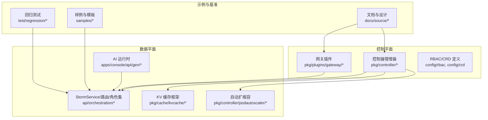
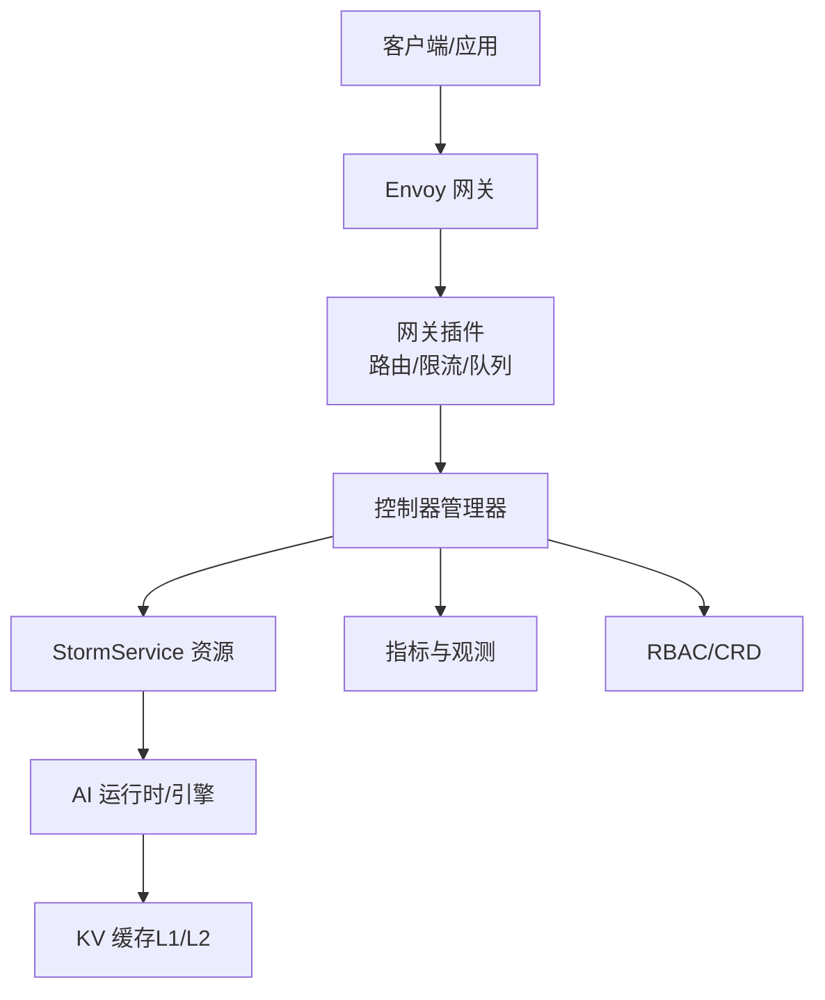
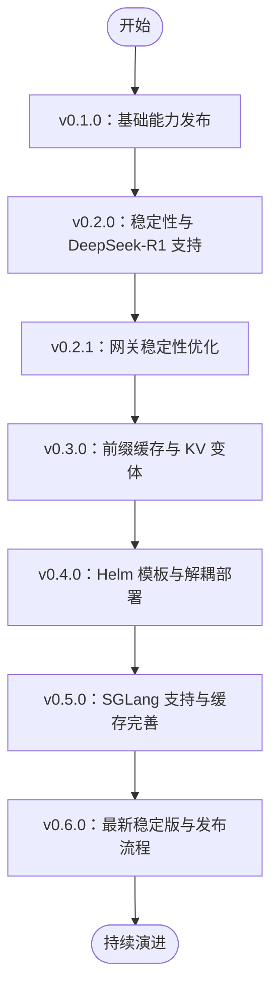
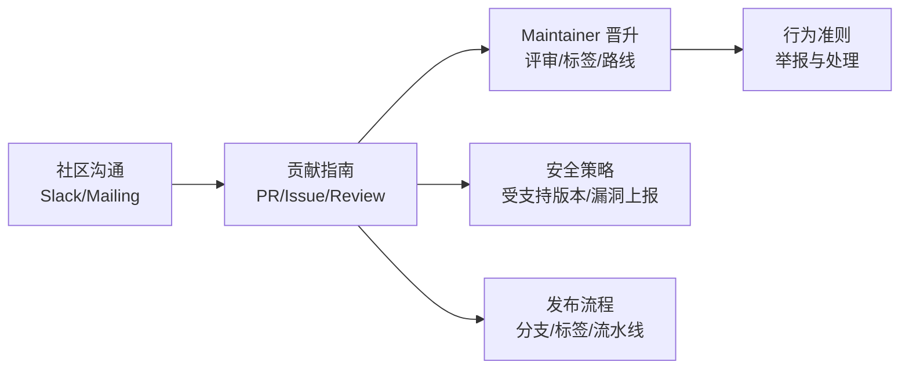
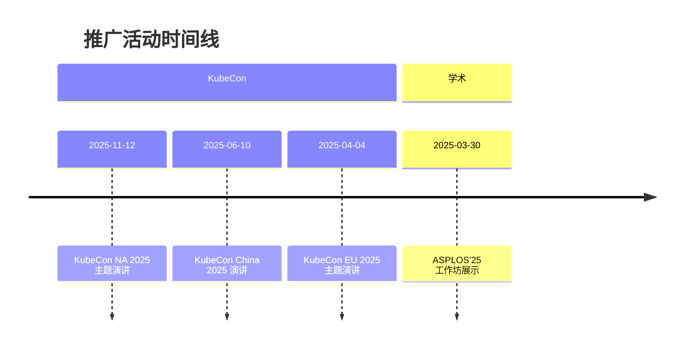
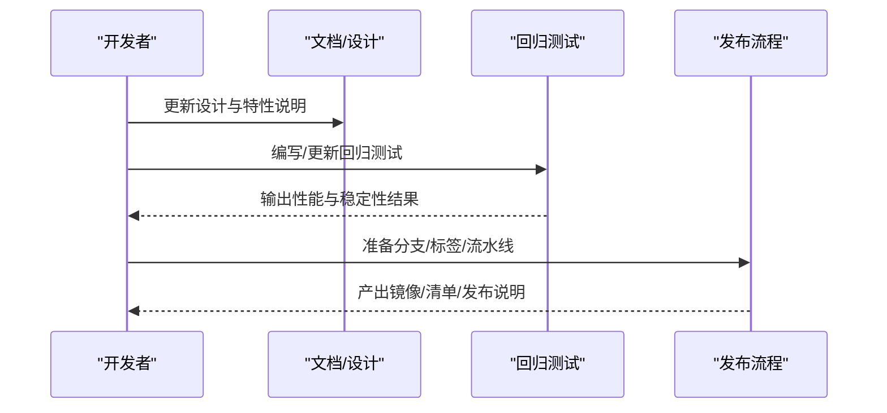
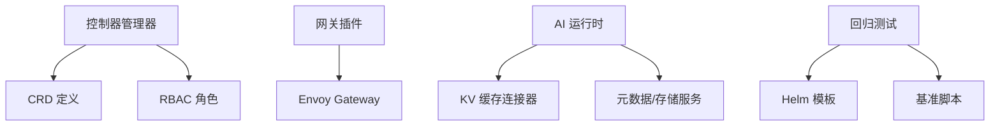

# 发展历程与社区

<cite>
**本文引用的文件**
- [README.md](file://README.md)
- [CONTRIBUTING.md](file://CONTRIBUTING.md)
- [CODE_OF_CONDUCT.md](file://CODE_OF_CONDUCT.md)
- [SECURITY.md](file://SECURITY.md)
- [docs/source/community/community.rst](file://docs/source/community/community.rst)
- [docs/source/community/contribution.rst](file://docs/source/community/contribution.rst)
- [docs/source/development/release.rst](file://docs/source/development/release.rst)
- [docs/source/features/kvcache-offloading.rst](file://docs/source/features/kvcache-offloading.rst)
- [test/regression/v0.2.1/README.md](file://test/regression/v0.2.1/README.md)
- [test/regression/v0.3.0/README.md](file://test/regression/v0.3.0/README.md)
- [test/regression/v0.4.0/README.md](file://test/regression/v0.4.0/README.md)
</cite>

## 目录
1. [引言](#引言)
2. [项目结构](#项目结构)
3. [核心组件](#核心组件)
4. [架构总览](#架构总览)
5. [详细组件分析](#详细组件分析)
6. [依赖关系分析](#依赖关系分析)
7. [性能考量](#性能考量)
8. [故障排查指南](#故障排查指南)
9. [结论](#结论)
10. [附录](#附录)

## 引言
本文件系统性梳理 AIBrix 从 v0.1.0 到 v0.6.0 的版本演进历程，总结各版本关键特性与改进；回顾项目在功能完善、性能优化、社区扩展等方面的里程碑；介绍开源社区建设现状（贡献者角色、治理结构、行为准则与安全策略）；汇总推广活动（KubeCon 演讲、技术会议展示、学术论文）；并提供社区参与指南与未来发展方向。

## 项目结构
AIBrix 是面向生成式人工智能（GenAI）推理的云原生基础设施，围绕 Kubernetes 提供统一的控制面与数据面能力，覆盖网关路由、自动扩缩容、分布式 KV 缓存、异构 GPU 推理、LoRA 动态加载、批量 API 等能力。项目采用多模块分层组织，包含控制器、运行时、网关插件、示例与基准测试等。

**图表来源**
- [docs/source/features/kvcache-offloading.rst:1-332](file://docs/source/features/kvcache-offloading.rst#L1-L332)
- [docs/source/development/release.rst:1-155](file://docs/source/development/release.rst#L1-L155)

**章节来源**
- [README.md:1-90](file://README.md#L1-L90)
- [docs/source/features/kvcache-offloading.rst:1-332](file://docs/source/features/kvcache-offloading.rst#L1-L332)

## 核心组件
- 控制器与 CRD：通过自定义资源（CRD）抽象 StormService、KVCache、PodSet、RayCluster 等，配套控制器实现声明式编排与状态收敛。
- 网关与路由：基于 Envoy Gateway 的插件化网关，支持多种路由策略（前缀缓存、随机、会话感知等），并与 KV 缓存协同提升吞吐与延迟。
- 自动扩缩容：结合 HPA 与自研算法，按请求速率、GPU 利用率等指标动态调整推理副本数。
- 分布式 KV 缓存：提供 L1（本地 DRAM）与 L2（InfiniStore/RDMA）两级缓存，支持跨引擎复用与性能剖析。
- 异构 GPU 与混合推理：支持不同 GPU 型号混部，保障 SLO 并降低总体成本。
- 批量 API 与模板：提供批量推理接口与可复用部署模板，便于企业级落地。

**章节来源**
- [README.md:28-40](file://README.md#L28-L40)
- [docs/source/features/kvcache-offloading.rst:1-332](file://docs/source/features/kvcache-offloading.rst#L1-L332)

## 架构总览
下图展示 AIBrix 在 v0.6.0 阶段的整体架构：控制平面负责编排与治理，数据平面承载推理服务与缓存，网关作为统一入口对接外部流量。

**图表来源**
- [docs/source/features/kvcache-offloading.rst:1-332](file://docs/source/features/kvcache-offloading.rst#L1-L332)
- [docs/source/development/release.rst:100-130](file://docs/source/development/release.rst#L100-L130)

## 详细组件分析

### 版本演进与里程碑（v0.1.0 → v0.6.0）
- v0.1.0（2024-11-13）：首次发布，奠定基础能力，包含高密度 LoRA 管理、LLM 网关与路由、LLM 应用定制化自动扩缩容、统一 AI 运行时、分布式推理、分布式 KV 缓存、异构 GPU 服务与 GPU 硬件故障检测等。
- v0.2.0（2025-02-19）：增强稳定性与可用性，引入 DeepSeek-R1 全权重部署支持与网关稳定性改进。
- v0.2.1（2025-03-09）：进一步优化网关稳定性，完善 DeepSeek-R1 支持。
- v0.3.0（2025-05-21）：引入前缀缓存路由与 KV 缓存 L1/L2 变体，提供更丰富的性能对比场景。
- v0.4.0（2025-08-05）：提供 Helm 模板与 StormService 统一部署方式，支持 SGLang/VLLM 解耦部署与路由策略多样化。
- v0.5.0（2025-11-10）：扩展对 SGLang 的支持，继续完善 KV 缓存生态与连接器兼容性。
- v0.6.0（2026-03-05）：最新稳定版，持续优化控制面与数据面集成，强化可观测性与发布流程自动化。

**图表来源**
- [README.md:12-19](file://README.md#L12-L19)

**章节来源**
- [README.md:12-19](file://README.md#L12-L19)
- [test/regression/v0.2.1/README.md:1-185](file://test/regression/v0.2.1/README.md#L1-L185)
- [test/regression/v0.3.0/README.md:1-199](file://test/regression/v0.3.0/README.md#L1-L199)
- [test/regression/v0.4.0/README.md:1-152](file://test/regression/v0.4.0/README.md#L1-L152)

### 社区建设与治理
- 社区渠道：使用 vLLM Slack 的 #AIBrix 频道进行非正式讨论与支持；官方邮件列表维护在 maintainers@aibrix.ai。
- 贡献者角色：鼓励贡献者通过高质量 PR、文档改进、问题反馈等方式参与；表现突出者可晋升为 Maintainer，承担代码评审、标签管理、路线规划与新人指导职责。
- 行为准则：遵循 CNCF 行为准则，违规举报邮箱为 steering@aibrix.ai，并与 CNCF 协调处理。
- 安全策略：明确 v0.2.x 受安全更新支持，漏洞报告邮箱为 maintainers@aibrix.ai。
- 发布流程：面向发布团队的内部流程文档，涵盖分支策略、RC 与正式版本发布、CI/CD 流水线监控、镜像同步与文档标签更新等。

**图表来源**
- [docs/source/community/community.rst:1-108](file://docs/source/community/community.rst#L1-L108)
- [docs/source/community/contribution.rst:1-90](file://docs/source/community/contribution.rst#L1-L90)
- [CODE_OF_CONDUCT.md:1-14](file://CODE_OF_CONDUCT.md#L1-L14)
- [SECURITY.md:1-15](file://SECURITY.md#L1-L15)
- [docs/source/development/release.rst:1-155](file://docs/source/development/release.rst#L1-L155)

**章节来源**
- [docs/source/community/community.rst:1-108](file://docs/source/community/community.rst#L1-L108)
- [docs/source/community/contribution.rst:1-90](file://docs/source/community/contribution.rst#L1-L90)
- [CODE_OF_CONDUCT.md:1-14](file://CODE_OF_CONDUCT.md#L1-L14)
- [SECURITY.md:1-15](file://SECURITY.md#L1-L15)
- [docs/source/development/release.rst:1-155](file://docs/source/development/release.rst#L1-L155)

### 推广活动与学术交流
- KubeCon 演讲与展示
  - 2025-11-12：KubeCon NA 2025 主题演讲，介绍 AIBrix 在 Kubernetes 上的 GenAI 推理基础设施。
  - 2025-06-10：KubeCon China 2025 演讲，探讨如何通过 Kubernetes 成本高效地优化 vLLM 部署。
  - 2025-04-04：KubeCon EU 2025 与 Google 合作主题演讲，聚焦 LLM 专用负载均衡。
- 学术与研究
  - 2025-03-30：ASPLOS'25 工作坊展示，题目为“AIBrix：面向系统研究的大规模 LLM 推理开源基础设施”。

**图表来源**
- [README.md:21-26](file://README.md#L21-L26)

**章节来源**
- [README.md:21-26](file://README.md#L21-L26)

### 社区参与指南
- 加入社区：通过 Slack #AIBrix 与邮件列表参与讨论。
- 选择任务：优先认领带 “good first issue” 或 “help wanted” 标签的问题，逐步熟悉项目。
- 提交 PR：遵循清晰描述、关联 Issue、提供测试与文档更新、使用清晰的提交信息与分支命名约定。
- 代码评审：保持开放心态接受反馈，及时响应与迭代，必要时总结修订要点。
- 成为维护者：持续高质量贡献、积极评审他人 PR、参与路线规划与新人指导，经评估后授予写权限与内部讨论资格。

**章节来源**
- [CONTRIBUTING.md:6-52](file://CONTRIBUTING.md#L6-L52)
- [docs/source/community/contribution.rst:18-90](file://docs/source/community/contribution.rst#L18-L90)
- [docs/source/community/community.rst:20-108](file://docs/source/community/community.rst#L20-L108)

### 关键特性演进与性能优化
- v0.2.1：回归测试覆盖 PS 场景，强调端到端稳定性与初始化等待验证。
- v0.3.0：引入前缀缓存路由与 KV 缓存 L1/L2 对比实验，提供 Helm 模板与资源命名规范。
- v0.4.0：标准化 StormService 部署，提供 SGLang/VLLM 解耦模板与路由策略配置，简化资源命名与参数覆盖。
- v0.5.0：继续完善 KV 缓存与连接器兼容性，扩展对 SGLang 的支持。
- v0.6.0：最新稳定版，发布流程自动化与镜像同步完善，强化可观测性与控制面稳定性。

**图表来源**
- [docs/source/development/release.rst:13-155](file://docs/source/development/release.rst#L13-L155)
- [test/regression/v0.2.1/README.md:1-185](file://test/regression/v0.2.1/README.md#L1-L185)
- [test/regression/v0.3.0/README.md:1-199](file://test/regression/v0.3.0/README.md#L1-L199)
- [test/regression/v0.4.0/README.md:1-152](file://test/regression/v0.4.0/README.md#L1-L152)

**章节来源**
- [docs/source/features/kvcache-offloading.rst:1-332](file://docs/source/features/kvcache-offloading.rst#L1-L332)
- [test/regression/v0.2.1/README.md:1-185](file://test/regression/v0.2.1/README.md#L1-L185)
- [test/regression/v0.3.0/README.md:1-199](file://test/regression/v0.3.0/README.md#L1-L199)
- [test/regression/v0.4.0/README.md:1-152](file://test/regression/v0.4.0/README.md#L1-L152)

## 依赖关系分析
- 控制平面依赖：控制器管理器依赖 CRD 与 RBAC；网关插件依赖 Envoy Gateway；运行时依赖存储与元数据服务。
- 数据平面依赖：引擎（VLLM/SGLang）依赖 KV 缓存连接器与 RDMA 设备（如启用 InfiniStore）。
- 回归测试依赖：基准脚本与 Helm 模板驱动多场景对比，确保版本间性能与稳定性。

**图表来源**
- [docs/source/features/kvcache-offloading.rst:1-332](file://docs/source/features/kvcache-offloading.rst#L1-L332)
- [docs/source/development/release.rst:100-130](file://docs/source/development/release.rst#L100-L130)

**章节来源**
- [docs/source/features/kvcache-offloading.rst:1-332](file://docs/source/features/kvcache-offloading.rst#L1-L332)
- [docs/source/development/release.rst:1-155](file://docs/source/development/release.rst#L1-L155)

## 性能考量
- 路由策略：前缀缓存与会话感知路由在低 QPS 场景中可提升吞吐，需注意缓存清理与轮转策略。
- KV 缓存：L1（DRAM）适合单节点高并发，L2（InfiniStore/RDMA）适合跨节点共享与大规模集群。
- 资源命名：使用描述性 Helm release 名称，避免资源冲突并便于追踪。
- 初始化与就绪：部分 YAML 未定义就绪探针，需等待应用完全初始化后再进行基准测试。

**章节来源**
- [test/regression/v0.3.0/README.md:68-165](file://test/regression/v0.3.0/README.md#L68-L165)
- [test/regression/v0.4.0/README.md:130-152](file://test/regression/v0.4.0/README.md#L130-L152)

## 故障排查指南
- 端口转发错误：在集群内直接运行基准客户端，避免频繁的 port-forward 超时。
- 应用未就绪：即使 Pod 显示 Ready，也需等待应用真正初始化完成再发起请求。
- 资源与镜像：根据环境差异调整镜像仓库前缀与节点亲和性；生产建议为网关插件与 Envoy 设置 2C8G 资源。
- 漏洞上报：发现安全问题请发送至 maintainers@aibrix.ai。

**章节来源**
- [test/regression/v0.2.1/README.md:62-108](file://test/regression/v0.2.1/README.md#L62-L108)
- [SECURITY.md:1-15](file://SECURITY.md#L1-L15)

## 结论
AIBrix 自 v0.1.0 起持续完善控制面与数据面能力，v0.3.0 引入前缀缓存与 KV 变体，v0.4.0 通过 Helm 模板标准化部署，v0.5.0 扩展 SGLang 支持，v0.6.0 达到最新稳定版。社区方面，通过 Slack、邮件列表与贡献流程建立协作机制，发布流程与回归测试保障质量。未来建议继续强化异构 GPU 与 RDMA 场景的自动化与可观测性，扩大社区影响力并推动更多企业用户采纳。

## 附录
- 快速开始与安装参考：见 README 中的安装与文档链接。
- 文档索引：docs/source 下包含设计、开发、特性与生产可观测性等文档。

**章节来源**
- [README.md:46-89](file://README.md#L46-L89)
- [docs/source/development/release.rst:1-155](file://docs/source/development/release.rst#L1-L155)