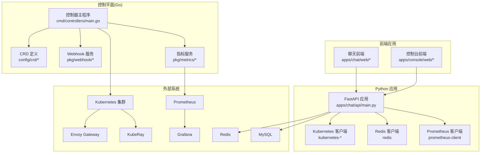
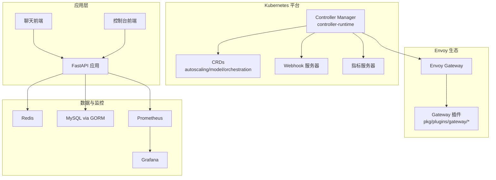
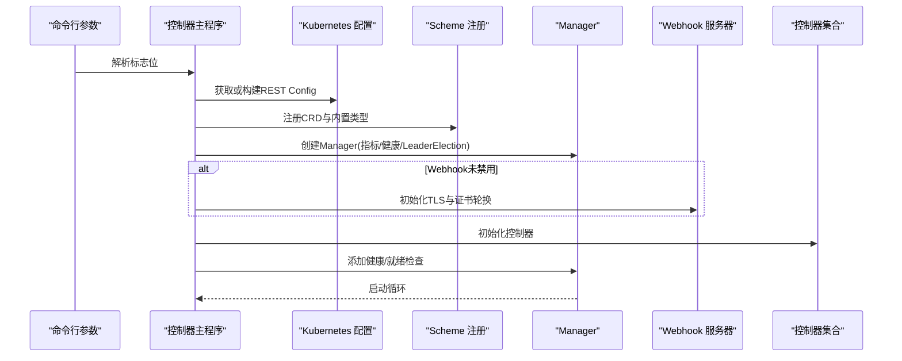
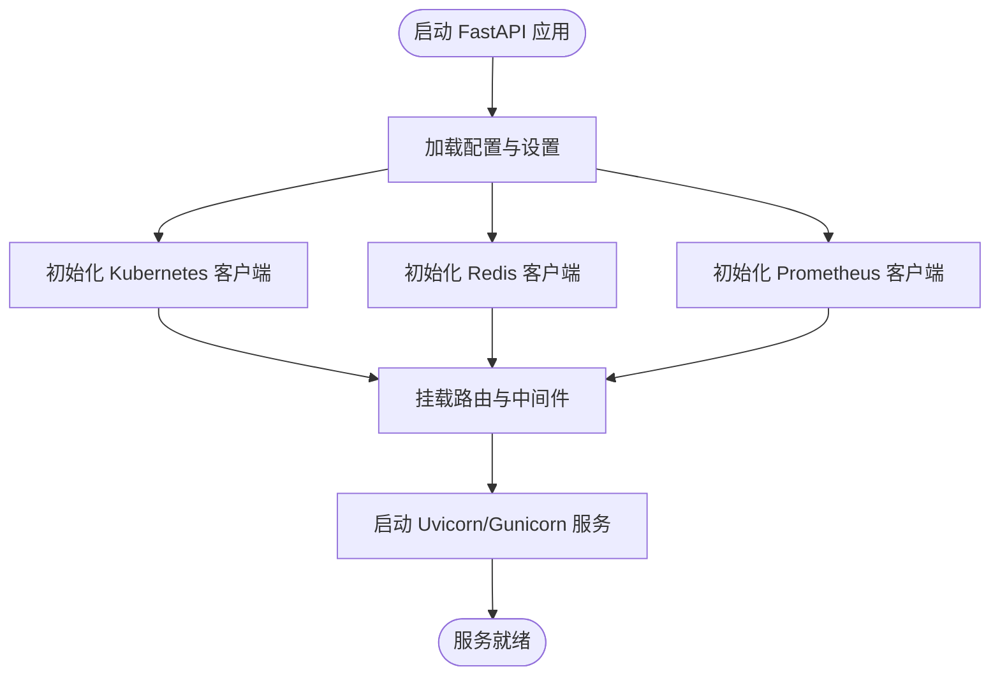
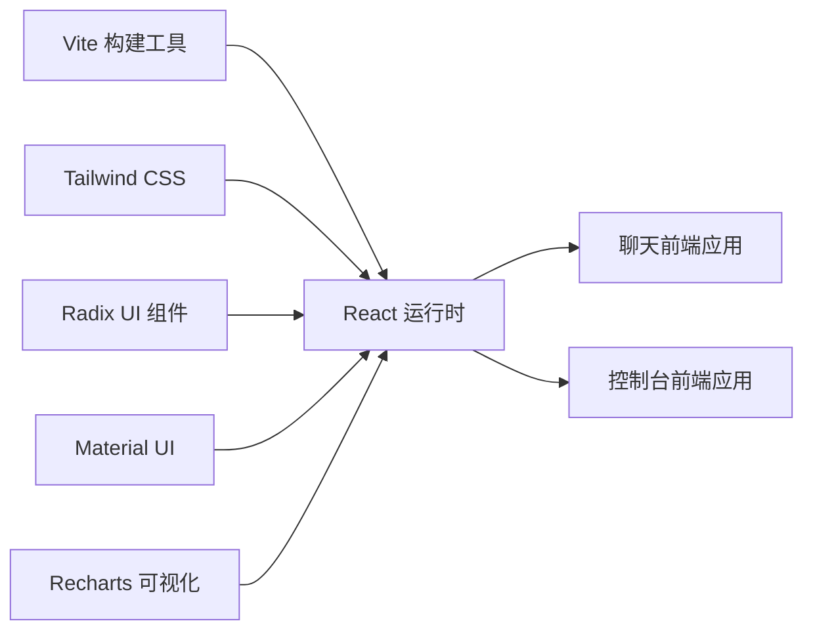
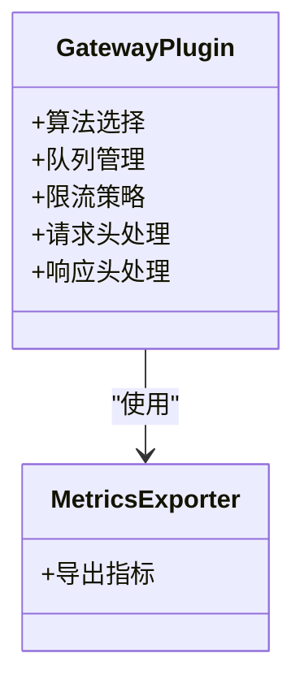
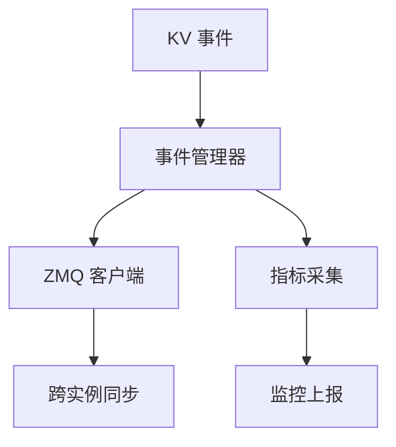

# 技术栈与依赖

<cite>
**本文引用的文件**
- [go.mod](file://go.mod)
- [cmd/controllers/main.go](file://cmd/controllers/main.go)
- [apps/chat/api/pyproject.toml](file://apps/chat/api/pyproject.toml)
- [apps/chat/api/requirements.txt](file://apps/chat/api/requirements.txt)
- [apps/chat/web/package.json](file://apps/chat/web/package.json)
- [apps/console/web/package.json](file://apps/console/web/package.json)
- [python/aibrix/pyproject.toml](file://python/aibrix/pyproject.toml)
- [python/aibrix_kvcache/pyproject.toml](file://python/aibrix_kvcache/pyproject.toml)
- [pkg/controller/controller.go](file://pkg/controller/controller.go)
- [pkg/plugins/gateway/gateway.go](file://pkg/plugins/gateway/gateway.go)
- [pkg/cache/kvcache/types.go](file://pkg/cache/kvcache/types.go)
- [pkg/metrics/metrics.go](file://pkg/metrics/metrics.go)
- [config/crd/autoscaling/autoscaling.aibrix.ai_podautoscalers.yaml](file://config/crd/autoscaling/autoscaling.aibrix.ai_podautoscalers.yaml)
- [config/crd/model/model.aibrix.ai_modeladapters.yaml](file://config/crd/model/model.aibrix.ai_modeladapters.yaml)
- [config/crd/orchestration/orchestration.aibrix.ai_kvcaches.yaml](file://config/crd/orchestration/orchestration.aibrix.ai_kvcaches.yaml)
- [deployment/local/run-local.sh](file://deployment/local/run-local.sh)
- [deployment/standalone/start.sh](file://deployment/standalone/start.sh)
- [deployment/standalone/docker-compose.yml](file://deployment/standalone/docker-compose.yml)
- [observability/grafana/AIBrix_Control_Plane_Runtime_Dashboard.json](file://observability/grafana/AIBrix_Control_Plane_Runtime_Dashboard.json)
- [observability/monitor/service_monitor_controller_manager.yaml](file://observability/monitor/service_monitor_controller_manager.yaml)
- [observability/monitor/service_monitor_gateway.yaml](file://observability/monitor/service_monitor_gateway.yaml)
- [observability/monitor/service_monitor_vllm.yaml](file://observability/monitor/service_monitor_vllm.yaml)
</cite>

## 目录
1. [引言](#引言)
2. [项目结构](#项目结构)
3. [核心组件](#核心组件)
4. [架构总览](#架构总览)
5. [详细组件分析](#详细组件分析)
6. [依赖分析](#依赖分析)
7. [性能考量](#性能考量)
8. [故障排查指南](#故障排查指南)
9. [结论](#结论)
10. [附录](#附录)

## 引言
本文件面向AIBrix项目的开发者与运维人员，系统梳理并解释项目采用的技术栈与依赖，涵盖后端Go生态（controller-runtime、Kubernetes客户端、Envoy集成）、Python生态（FastAPI、Redis客户端、Kubernetes客户端）、前端技术栈（React、Vite、Tailwind CSS），以及外部依赖（Kubernetes生态、Envoy生态、数据库与监控）。同时给出版本选择依据、兼容性考虑、内部组件间依赖关系与模块化设计，并提供依赖安装与环境配置指南，帮助快速搭建开发与运行环境。

## 项目结构
AIBrix采用多语言混合架构：
- 后端控制平面：Go实现，基于controller-runtime管理自定义资源控制器、Webhook与指标服务
- Python应用：FastAPI服务、Kubernetes客户端、Redis客户端、批处理与元数据工具
- 前端应用：React + Vite + Tailwind CSS，分别位于chat与console两个子应用
- 外部系统：Kubernetes、Envoy Gateway、KubeRay、Prometheus/Grafana、Redis、MySQL（通过GORM）

图表来源
- [cmd/controllers/main.go:112-360](file://cmd/controllers/main.go#L112-L360)
- [pkg/metrics/metrics.go:1-200](file://pkg/metrics/metrics.go#L1-L200)
- [python/aibrix/pyproject.toml:54-89](file://python/aibrix/pyproject.toml#L54-L89)
- [apps/chat/web/package.json:14-91](file://apps/chat/web/package.json#L14-L91)
- [apps/console/web/package.json:5-62](file://apps/console/web/package.json#L5-L62)

章节来源
- [go.mod:1-143](file://go.mod#L1-L143)
- [cmd/controllers/main.go:112-360](file://cmd/controllers/main.go#L112-L360)

## 核心组件
- 控制器主程序：负责初始化Kubernetes配置、注册CRD与Webhook、启动控制器与健康检查
- 自定义资源定义（CRD）：覆盖autoscaling、model、orchestration三大域，驱动控制器行为
- Webhook：模型适配器、KV缓存、StormService、Deployment、PodAutoscaler等校验与变更
- 指标与可观测性：内置指标端点、服务监控、Grafana仪表盘
- Python应用：Chat API（FastAPI）、Kubernetes与Redis客户端、批处理与元数据工具
- 前端应用：聊天界面与控制台界面，使用React生态与Tailwind CSS

章节来源
- [cmd/controllers/main.go:81-110](file://cmd/controllers/main.go#L81-L110)
- [config/crd/autoscaling/autoscaling.aibrix.ai_podautoscalers.yaml:1-50](file://config/crd/autoscaling/autoscaling.aibrix.ai_podautoscalers.yaml#L1-L50)
- [config/crd/model/model.aibrix.ai_modeladapters.yaml:1-50](file://config/crd/model/model.aibrix.ai_modeladapters.yaml#L1-L50)
- [config/crd/orchestration/orchestration.aibrix.ai_kvcaches.yaml:1-50](file://config/crd/orchestration/orchestration.aibrix.ai_kvcaches.yaml#L1-L50)

## 架构总览
AIBrix通过controller-runtime在Kubernetes上管理自定义资源，结合Envoy Gateway进行流量治理与插件扩展；Python侧提供API服务与工具链，前端通过React/Vite构建用户界面；监控体系由Prometheus采集、Grafana展示组成。

图表来源
- [cmd/controllers/main.go:227-257](file://cmd/controllers/main.go#L227-L257)
- [pkg/plugins/gateway/gateway.go:1-200](file://pkg/plugins/gateway/gateway.go#L1-L200)
- [python/aibrix/pyproject.toml:60-69](file://python/aibrix/pyproject.toml#L60-L69)
- [observability/monitor/service_monitor_controller_manager.yaml:1-50](file://observability/monitor/service_monitor_controller_manager.yaml#L1-L50)

## 详细组件分析

### Go 控制器与Webhook
- 初始化流程：解析命令行参数、构建Kubernetes配置、注册scheme、创建Manager、启动健康与就绪检查
- Webhook：按需启用，证书轮换，按控制器类型注册多个Webhook
- 控制器：统一入口初始化，支持特性开关与控制器列表控制

图表来源
- [cmd/controllers/main.go:112-360](file://cmd/controllers/main.go#L112-L360)

章节来源
- [cmd/controllers/main.go:112-360](file://cmd/controllers/main.go#L112-L360)

### Python FastAPI 应用
- 语言与框架：Python 3.10–3.12，FastAPI + Uvicorn/Gunicorn
- 关键依赖：kubernetes、redis、prometheus-client、PyYAML、aiohttp、kopf等
- 脚本入口：提供运行时、下载器、批处理、元数据等命令行工具

图表来源
- [python/aibrix/pyproject.toml:54-89](file://python/aibrix/pyproject.toml#L54-L89)
- [apps/chat/api/pyproject.toml:1-22](file://apps/chat/api/pyproject.toml#L1-L22)

章节来源
- [python/aibrix/pyproject.toml:54-89](file://python/aibrix/pyproject.toml#L54-L89)
- [apps/chat/api/pyproject.toml:1-22](file://apps/chat/api/pyproject.toml#L1-L22)

### 前端应用（React + Vite + Tailwind CSS）
- 聊天前端与控制台前端均采用React 18、Vite 6、Tailwind CSS 4
- 使用Radix UI、Material UI、Recharts等UI与可视化组件
- 开发脚本包含dev/build/lint/typecheck等

图表来源
- [apps/chat/web/package.json:14-91](file://apps/chat/web/package.json#L14-L91)
- [apps/console/web/package.json:5-62](file://apps/console/web/package.json#L5-L62)

章节来源
- [apps/chat/web/package.json:14-91](file://apps/chat/web/package.json#L14-L91)
- [apps/console/web/package.json:5-62](file://apps/console/web/package.json#L5-L62)

### Envoy Gateway 插件与路由
- 插件算法与队列、限流、请求/响应头/体处理等模块化设计
- 支持在网关层面进行策略扩展与性能优化

图表来源
- [pkg/plugins/gateway/gateway.go:1-200](file://pkg/plugins/gateway/gateway.go#L1-L200)

章节来源
- [pkg/plugins/gateway/gateway.go:1-200](file://pkg/plugins/gateway/gateway.go#L1-L200)

### KV缓存与事件同步
- KV缓存类型与事件处理，支持ZMQ客户端与指标采集
- 提供事件管理器与验证逻辑，支撑跨引擎KV复用

图表来源
- [pkg/cache/kvcache/types.go:1-200](file://pkg/cache/kvcache/types.go#L1-L200)

章节来源
- [pkg/cache/kvcache/types.go:1-200](file://pkg/cache/kvcache/types.go#L1-L200)

## 依赖分析

### Go 生态依赖与版本
- 语言与工具链：Go 1.22.5（toolchain 1.22.6）
- 控制器与Kubernetes：controller-runtime v0.19.2、client-go v0.31.8、k8s.io/api v0.31.8
- Envoy 集成：go-control-plane v0.12.0、gateway-api v1.0.0
- 数据与序列化：msgpack v5、sonic v1.14.2、uuid v1.6.0
- 监控：prometheus 客户端相关包
- 其他：gorm v1.25.12（含mysql/sqlite驱动）、redis/go-redis v9.6.1、ray-operator v1.2.1

章节来源
- [go.mod:3-56](file://go.mod#L3-L56)

### Python 生态依赖与版本
- 语言：Python >=3.10,<3.13
- Web：FastAPI ^0.112.2、Uvicorn ^0.30.6、Gunicorn ^23.0.0
- 云存储与SDK：boto3 ^1.35.5、google-cloud-storage ^2.10.0、tos ^2.8.0
- 客户端：kubernetes ^31.0.0、kubernetes-asyncio ^31.0.0、redis ^5.2.0、aiohttp ^3.11.7
- 工具：PyYAML ^6.0.1、Pydantic Settings ^2.6.1、structlog ^24.4.0、kopf(extras uvloop) ^1.37.2
- GPU优化：numpy 1.26.4、pandas ^2.2.3、matplotlib ^3.9.2、dash ^2.18.2、pulp 2.8.0

章节来源
- [python/aibrix/pyproject.toml:54-89](file://python/aibrix/pyproject.toml#L54-L89)

### 前端依赖与版本
- React 18.3.1、React DOM 18.3.1、React Router 7.x
- UI组件：Radix UI、Material UI、Recharts、Lucide React、Tailwind Merge
- 构建：Vite 6.3.5、Tailwind CSS 4.1.12、TypeScript ^5.7.0
- 开发工具：@vitejs/plugin-react、@tailwindcss/vite、@types/react等

章节来源
- [apps/chat/web/package.json:14-91](file://apps/chat/web/package.json#L14-L91)
- [apps/console/web/package.json:5-62](file://apps/console/web/package.json#L5-L62)

### 外部系统与兼容性
- Kubernetes：与controller-runtime v0.19.2、client-go v0.31.8配套，确保CRD与API版本一致
- Envoy Gateway：go-control-plane v0.12.0、gateway-api v1.0.0，保证XDS与Gateway API兼容
- KubeRay：ray-operator v1.2.1，用于分布式推理集群编排
- 数据库：GORM + MySQL驱动，SQLite驱动用于测试/本地
- 缓存：Redis go-redis v9.6.1
- 监控：Prometheus客户端与Grafana仪表盘

章节来源
- [go.mod:41-55](file://go.mod#L41-L55)
- [python/aibrix/pyproject.toml:60-69](file://python/aibrix/pyproject.toml#L60-L69)

## 性能考量
- 控制器并发与QPS：通过命令行参数调整Kubernetes API访问的QPS与Burst，避免对集群造成压力
- HTTP/2安全：默认禁用以规避已知漏洞，如需启用需评估风险
- 指标与日志：使用prometheus客户端与klog，建议在生产中开启安全指标端点与证书轮换
- 前端构建：Vite提供快速热更新与生产优化，Tailwind CSS按需引入减少体积

章节来源
- [cmd/controllers/main.go:130-131](file://cmd/controllers/main.go#L130-L131)
- [cmd/controllers/main.go:208-216](file://cmd/controllers/main.go#L208-L216)
- [pkg/metrics/metrics.go:1-200](file://pkg/metrics/metrics.go#L1-L200)

## 故障排查指南
- 控制器启动失败：检查Leader Election命名空间、资源锁类型、租约时长与续期时限
- Webhook未就绪：确认证书生成完成后再启动控制器；若禁用Webhook则跳过证书阶段
- 指标端点异常：确认绑定地址、是否启用安全服务与TLS选项
- Python依赖冲突：使用Poetry锁定版本，确保与项目要求一致
- 前端构建问题：清理node_modules与缓存，重新安装依赖；检查Vite与Tailwind配置

章节来源
- [cmd/controllers/main.go:141-150](file://cmd/controllers/main.go#L141-L150)
- [cmd/controllers/main.go:271-279](file://cmd/controllers/main.go#L271-L279)
- [cmd/controllers/main.go:294-312](file://cmd/controllers/main.go#L294-L312)
- [apps/chat/web/package.json:14-91](file://apps/chat/web/package.json#L14-L91)

## 结论
AIBrix通过Go的controller-runtime实现Kubernetes原生控制面，结合Envoy Gateway与自研插件实现高性能路由与扩展；Python生态提供API与工具链，前端采用现代化React/Vite/Tailwind组合。整体技术栈强调可扩展性、可观测性与工程化实践，适合在Kubernetes上构建大规模GenAI推理基础设施。

## 附录

### 依赖安装与环境配置指南
- Go 环境
  - 版本：1.22.5（toolchain 1.22.6）
  - 安装：使用官方二进制或包管理器安装指定版本
  - 验证：go version
- Kubernetes 集群
  - 推荐：Kind（本地开发）或云厂商托管集群
  - 准备：kubectl、kubeconfig
- 控制器与CRD
  - 安装：使用Kustomize清单部署CRD与控制器
  - 验证：kubectl get crd | grep aibrix.ai
- Python 环境
  - 版本：3.10–3.12
  - 安装：Poetry 或虚拟环境 + pip
  - 依赖：poetry install（含dev组）
- 前端环境
  - 包管理：pnpm（推荐）
  - 安装：npm install 或 pnpm install
  - 启动：npm run dev 或 pnpm dev
- 本地运行脚本
  - 单机模式：./deployment/standalone/start.sh
  - 本地演示：./deployment/local/run-local.sh
  - Compose：./deployment/standalone/docker-compose.yml

章节来源
- [go.mod:3-5](file://go.mod#L3-L5)
- [deployment/standalone/start.sh:1-50](file://deployment/standalone/start.sh#L1-L50)
- [deployment/local/run-local.sh:1-50](file://deployment/local/run-local.sh#L1-L50)
- [deployment/standalone/docker-compose.yml:1-100](file://deployment/standalone/docker-compose.yml#L1-L100)