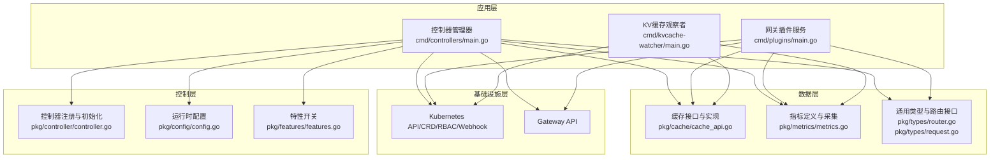
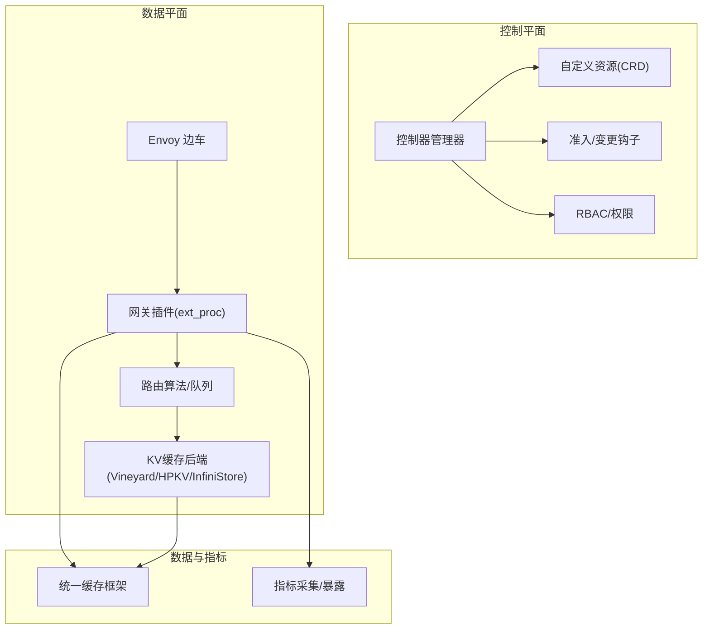
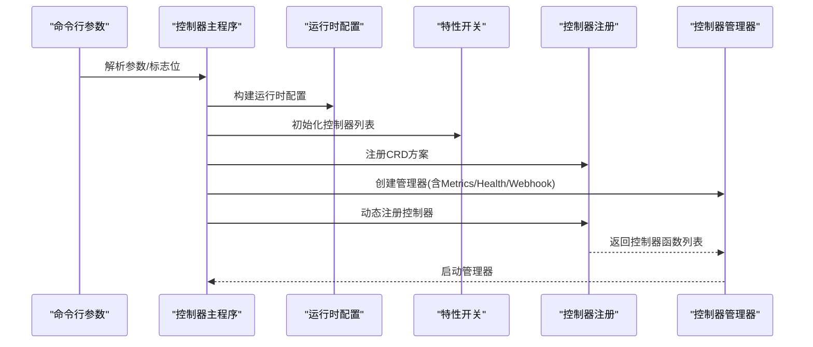
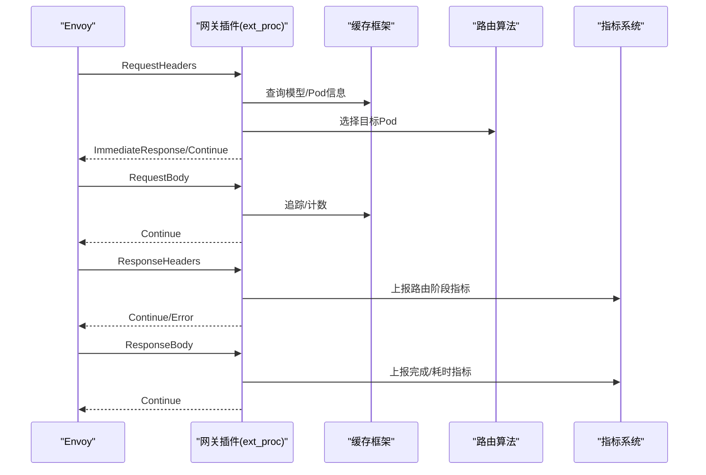
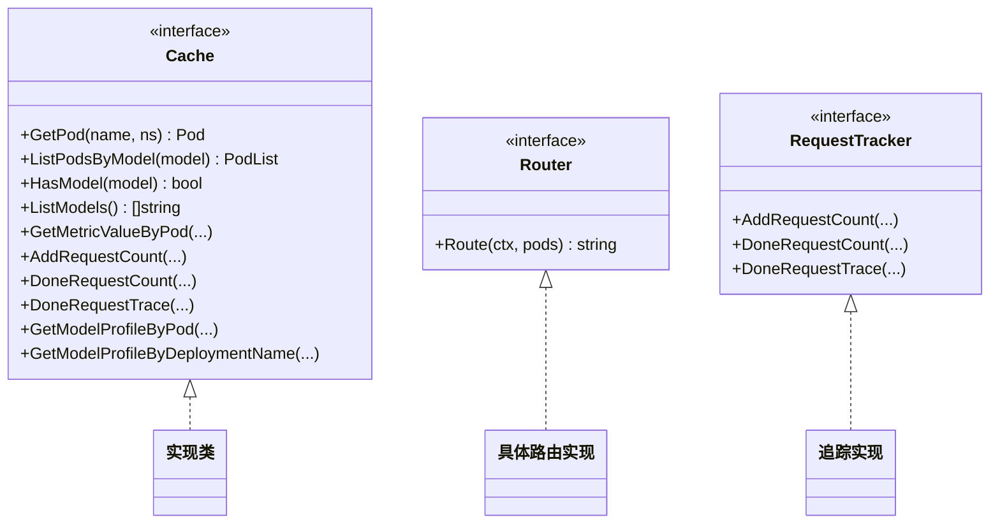
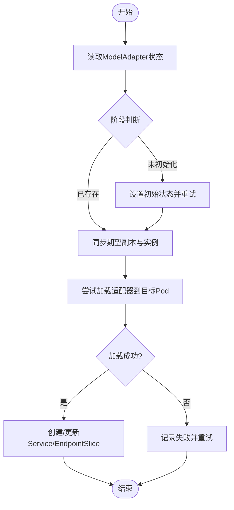
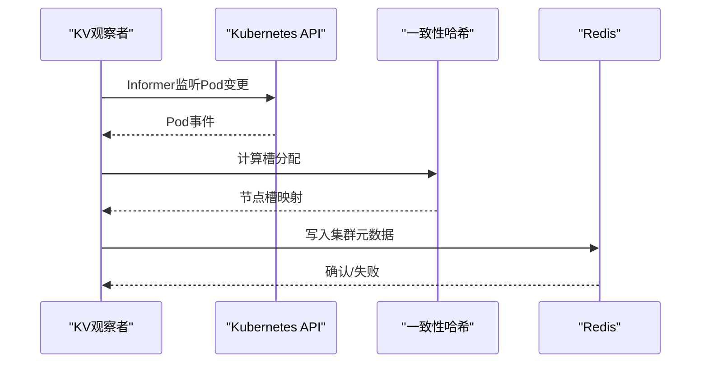
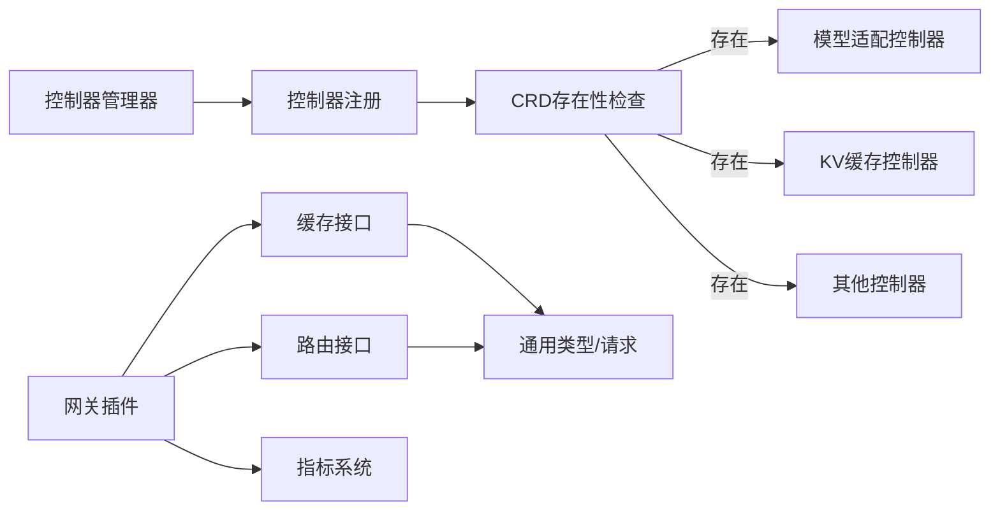

# 架构设计概览

<cite>
**本文引用的文件**
- [README.md](file://README.md)
- [cmd/controllers/main.go](file://cmd/controllers/main.go)
- [cmd/plugins/main.go](file://cmd/plugins/main.go)
- [cmd/kvcache-watcher/main.go](file://cmd/kvcache-watcher/main.go)
- [pkg/controller/controller.go](file://pkg/controller/controller.go)
- [pkg/cache/cache_api.go](file://pkg/cache/cache_api.go)
- [pkg/plugins/gateway/gateway.go](file://pkg/plugins/gateway/gateway.go)
- [pkg/types/router.go](file://pkg/types/router.go)
- [pkg/controller/modeladapter/modeladapter_controller.go](file://pkg/controller/modeladapter/modeladapter_controller.go)
- [pkg/controller/kvcache/kvcache_controller.go](file://pkg/controller/kvcache/kvcache_controller.go)
- [pkg/config/config.go](file://pkg/config/config.go)
- [pkg/features/features.go](file://pkg/features/features.go)
- [docs/source/designs/architecture.rst](file://docs/source/designs/architecture.rst)
- [api/orchestration/v1alpha1/groupversion_info.go](file://api/orchestration/v1alpha1/groupversion_info.go)
- [pkg/types/request.go](file://pkg/types/request.go)
- [pkg/metrics/metrics.go](file://pkg/metrics/metrics.go)
</cite>

## 目录
1. [引言](#引言)
2. [项目结构](#项目结构)
3. [核心组件](#核心组件)
4. [架构总览](#架构总览)
5. [详细组件分析](#详细组件分析)
6. [依赖分析](#依赖分析)
7. [性能考虑](#性能考虑)
8. [故障排查指南](#故障排查指南)
9. [结论](#结论)
10. [附录](#附录)

## 引言
本文件面向架构师与高级开发者，系统化阐述 AIBrix 的整体架构设计与实现要点。AIBrix 以“控制平面与数据平面分离”为核心理念，围绕 Kubernetes 原生生态构建 GenAI 推理基础设施，提供模型适配、分布式推理、KV 缓存、请求路由与自动扩缩容等能力。本文将从分层架构、关键组件、交互流程、高可用与可扩展性、性能优化等方面进行深入解析，并辅以架构图与时序图，帮助读者快速建立对系统的整体认知。

## 项目结构
AIBrix 采用模块化与分层组织方式：
- 应用层：包含控制平面控制器与数据平面插件（网关插件、KV 缓存观察者）。
- 控制层：基于 controller-runtime 的多控制器体系，负责 CRD 状态收敛与资源编排。
- 数据层：统一缓存框架与指标采集，支撑调度、路由与可观测性。
- 基础设施层：Kubernetes API、CRD、RBAC、Webhook、Metrics、Gateway API 等。

**图表来源**
- [cmd/controllers/main.go:112-360](file://cmd/controllers/main.go#L112-L360)
- [cmd/plugins/main.go:54-198](file://cmd/plugins/main.go#L54-L198)
- [cmd/kvcache-watcher/main.go:228-346](file://cmd/kvcache-watcher/main.go#L228-L346)
- [pkg/controller/controller.go:48-130](file://pkg/controller/controller.go#L48-L130)
- [pkg/config/config.go:19-42](file://pkg/config/config.go#L19-L42)
- [pkg/features/features.go:24-120](file://pkg/features/features.go#L24-L120)
- [pkg/cache/cache_api.go:25-170](file://pkg/cache/cache_api.go#L25-L170)
- [pkg/metrics/metrics.go:19-100](file://pkg/metrics/metrics.go#L19-L100)
- [pkg/types/router.go:19-56](file://pkg/types/router.go#L19-L56)
- [pkg/types/request.go:23-47](file://pkg/types/request.go#L23-L47)

**章节来源**
- [README.md:41-48](file://README.md#L41-L48)
- [docs/source/designs/architecture.rst:16-38](file://docs/source/designs/architecture.rst#L16-L38)

## 核心组件
- 控制器管理器：统一启动与管理多个控制器，支持特性开关与动态注册，具备健康检查与就地升级能力。
- 网关插件系统：基于 Envoy 外部处理扩展协议，提供请求头/体处理、速率限制、路由选择、错误处理与指标上报。
- 缓存框架：抽象统一缓存接口，覆盖 Pod/模型/指标/请求追踪/配置画像等能力，支撑调度与路由决策。
- 推理引擎适配层：通过运行时侧车或直接对接引擎，屏蔽不同引擎差异，统一指标与模型下载管理。
- KV 缓存控制器与观察者：编排不同后端的 KV 缓存实例，维护节点拓扑与一致性哈希元数据，保障跨实例缓存复用。

**章节来源**
- [cmd/controllers/main.go:112-360](file://cmd/controllers/main.go#L112-L360)
- [cmd/plugins/main.go:54-198](file://cmd/plugins/main.go#L54-L198)
- [pkg/cache/cache_api.go:25-170](file://pkg/cache/cache_api.go#L25-L170)
- [pkg/controller/kvcache/kvcache_controller.go:133-194](file://pkg/controller/kvcache/kvcache_controller.go#L133-L194)
- [cmd/kvcache-watcher/main.go:228-346](file://cmd/kvcache-watcher/main.go#L228-L346)

## 架构总览
AIBrix 将控制平面与数据平面清晰分离：
- 控制平面：通过 CRD 定义推理资源状态，控制器持续收敛至期望状态；Webhook 提供准入校验；Metrics 暴露控制面健康度。
- 数据平面：网关插件作为请求入口，结合缓存框架与路由算法完成请求分发；KV 观察者维护跨节点缓存拓扑；指标采集贯穿两端。

**图表来源**
- [docs/source/designs/architecture.rst:16-38](file://docs/source/designs/architecture.rst#L16-L38)
- [cmd/controllers/main.go:227-257](file://cmd/controllers/main.go#L227-L257)
- [pkg/plugins/gateway/gateway.go:62-121](file://pkg/plugins/gateway/gateway.go#L62-L121)
- [pkg/cache/cache_api.go:25-170](file://pkg/cache/cache_api.go#L25-L170)

## 详细组件分析

### 控制器管理器与特性开关
- 启动流程：解析参数、构建运行时配置、注册 CRD 方案、初始化证书与 Webhook、创建并启动控制器管理器。
- 特性开关：通过命令行指定启用/禁用控制器集合，支持通配符与负号前缀，确保在不同部署形态下按需启用。
- 控制器注册：根据特性开关动态注册控制器，若 CRD 不存在则跳过对应控制器，避免阻塞启动。

**图表来源**
- [cmd/controllers/main.go:112-360](file://cmd/controllers/main.go#L112-L360)
- [pkg/controller/controller.go:48-130](file://pkg/controller/controller.go#L48-L130)
- [pkg/config/config.go:19-42](file://pkg/config/config.go#L19-L42)
- [pkg/features/features.go:24-120](file://pkg/features/features.go#L24-L120)

**章节来源**
- [cmd/controllers/main.go:112-360](file://cmd/controllers/main.go#L112-L360)
- [pkg/controller/controller.go:48-130](file://pkg/controller/controller.go#L48-L130)
- [pkg/features/features.go:24-120](file://pkg/features/features.go#L24-L120)

### 网关插件系统
- 职责：实现 Envoy 外部处理协议，拦截请求头/体，执行速率限制、用户鉴权、模型路由与错误处理，同时暴露 HTTP 模型列表查询与指标端点。
- 关键能力：
  - 请求生命周期管理：预接收检查、流式处理、完成计数与追踪。
  - 路由选择：根据上下文选择目标 Pod，支持过滤与随机化。
  - 错误处理与指标：针对响应头/体错误生成标准化错误响应，上报成功/失败指标。
  - HTTP 服务：在本地/独立模式下提供 /v1/models 列表与 /metrics 指标。

**图表来源**
- [pkg/plugins/gateway/gateway.go:123-303](file://pkg/plugins/gateway/gateway.go#L123-L303)
- [pkg/plugins/gateway/gateway.go:333-360](file://pkg/plugins/gateway/gateway.go#L333-L360)
- [pkg/cache/cache_api.go:25-170](file://pkg/cache/cache_api.go#L25-L170)
- [pkg/types/router.go:19-56](file://pkg/types/router.go#L19-L56)

**章节来源**
- [pkg/plugins/gateway/gateway.go:62-121](file://pkg/plugins/gateway/gateway.go#L62-L121)
- [pkg/plugins/gateway/gateway.go:123-303](file://pkg/plugins/gateway/gateway.go#L123-L303)
- [pkg/plugins/gateway/gateway.go:333-360](file://pkg/plugins/gateway/gateway.go#L333-L360)

### 缓存框架
- 统一接口：聚合 Pod/模型/指标/请求追踪/画像/路由提供器等能力，便于上层控制器与网关插件复用。
- 典型能力：
  - Pod/模型查询：按名称/模型维度检索对象与关联列表。
  - 指标订阅：为不同来源的指标提供订阅与获取能力。
  - 请求追踪：对请求生命周期进行计数与追踪，支持带用量的完成事件。
  - 画像与路由：提供模型画像与路由提供器接口，支撑调度与路由决策。

**图表来源**
- [pkg/cache/cache_api.go:25-170](file://pkg/cache/cache_api.go#L25-L170)
- [pkg/types/router.go:19-56](file://pkg/types/router.go#L19-L56)

**章节来源**
- [pkg/cache/cache_api.go:25-170](file://pkg/cache/cache_api.go#L25-L170)

### 推理引擎适配层（模型适配控制器）
- 职责：管理模型适配（如 LoRA）在推理引擎中的加载与卸载，维护服务与 EndpointSlice，实现按策略的 Pod 选择与迁移。
- 关键流程：
  - 副本与实例管理：根据期望副本数与当前活跃 Pod 数，决定扩容/缩容与调度。
  - 加载与状态：尝试在目标 Pod 上加载适配器，失败重试并更新状态条件。
  - 服务与 Endpoints：为适配器暴露稳定的服务与 Endpoints，支持 Gateway API 集成。

**图表来源**
- [pkg/controller/modeladapter/modeladapter_controller.go:313-493](file://pkg/controller/modeladapter/modeladapter_controller.go#L313-L493)

**章节来源**
- [pkg/controller/modeladapter/modeladapter_controller.go:313-493](file://pkg/controller/modeladapter/modeladapter_controller.go#L313-L493)

### KV 缓存控制器与观察者
- 控制器：根据注解选择后端（Vineyard/HPKV/InfiniStore），委派给对应后端处理器进行状态收敛。
- 观察者：监听 KV 缓存 Pod 变更，计算一致性哈希槽分布，写入 Redis 集群元数据，供路由与缓存共享使用。

**图表来源**
- [cmd/kvcache-watcher/main.go:406-515](file://cmd/kvcache-watcher/main.go#L406-L515)
- [pkg/controller/kvcache/kvcache_controller.go:133-194](file://pkg/controller/kvcache/kvcache_controller.go#L133-L194)

**章节来源**
- [cmd/kvcache-watcher/main.go:228-346](file://cmd/kvcache-watcher/main.go#L228-L346)
- [cmd/kvcache-watcher/main.go:406-515](file://cmd/kvcache-watcher/main.go#L406-L515)
- [pkg/controller/kvcache/kvcache_controller.go:133-194](file://pkg/controller/kvcache/kvcache_controller.go#L133-L194)

## 依赖分析
- 控制器注册链路：控制器管理器通过特性开关与 CRD 检查决定是否注册具体控制器，避免在缺失依赖时阻塞。
- 缓存与路由：网关插件依赖缓存框架进行模型/Pod 查询与追踪；路由算法通过 Provider 获取具体实现。
- 指标与监控：统一指标定义与采集，控制平面与数据平面均通过指标系统上报关键指标，便于集中观测。

**图表来源**
- [pkg/controller/controller.go:111-130](file://pkg/controller/controller.go#L111-L130)
- [pkg/plugins/gateway/gateway.go:94-121](file://pkg/plugins/gateway/gateway.go#L94-L121)
- [pkg/cache/cache_api.go:25-170](file://pkg/cache/cache_api.go#L25-L170)
- [pkg/types/router.go:19-56](file://pkg/types/router.go#L19-L56)

**章节来源**
- [pkg/controller/controller.go:111-130](file://pkg/controller/controller.go#L111-L130)
- [pkg/metrics/metrics.go:19-100](file://pkg/metrics/metrics.go#L19-L100)

## 性能考虑
- 控制平面高可用与弹性
  - 支持就地升级与健康检查，通过 Leader Election 保证单实例写一致性。
  - Webhook 证书轮换与延迟注册，确保控制器在证书就绪后再启动，避免阻塞。
- 数据平面性能优化
  - 网关插件基于 Envoy 外部处理协议，减少代理层开销；支持速率限制与错误快速返回。
  - 缓存框架统一抽象，降低重复查询与状态不一致带来的额外成本。
  - KV 观察者采用一致性哈希与槽位合并，降低元数据更新频率与网络抖动。
- 指标与可观测性
  - 统一指标命名与作用域，支持按 Pod/模型/实例等维度聚合，便于定位热点与瓶颈。
  - 控制平面与数据平面指标并行采集，形成闭环反馈。

[本节为通用性能讨论，无需特定文件引用]

## 故障排查指南
- 控制器启动失败
  - 检查 CRD 是否安装、RBAC 权限是否正确、Webhook 证书是否生成。
  - 关注健康检查与就绪检查输出，确认 Metrics 与 Health 端口可达。
- 网关插件异常
  - 查看 /metrics 中的路由阶段与完成阶段指标，定位失败原因（认证、路由不可用、目标不可达）。
  - 检查 HTTP 模型列表接口是否正常，确认缓存中模型清单。
- KV 缓存拓扑异常
  - 检查 KV 观察者日志与 Redis 元数据版本，确认 Pod 状态与标签是否符合预期。
  - 核对一致性哈希槽范围与节点数量变化，避免频繁重分布。

**章节来源**
- [cmd/controllers/main.go:294-319](file://cmd/controllers/main.go#L294-L319)
- [pkg/plugins/gateway/gateway.go:403-431](file://pkg/plugins/gateway/gateway.go#L403-L431)
- [cmd/kvcache-watcher/main.go:406-515](file://cmd/kvcache-watcher/main.go#L406-L515)

## 结论
AIBrix 通过“控制平面与数据平面分离”的架构设计，结合 Kubernetes 原生能力与自研缓存/路由/指标体系，在 GenAI 推理场景下实现了高可用、可扩展与高性能。控制平面以 CRD 与控制器为核心，确保资源状态收敛与策略执行；数据平面以网关插件与 KV 观察者为骨干，提供低延迟、可扩展的请求分发与缓存复用。统一的缓存与指标抽象进一步降低了耦合，提升了系统的可维护性与可观测性。

[本节为总结性内容，无需特定文件引用]

## 附录
- 分层架构职责
  - 应用层：控制器管理器、网关插件、KV 观察者。
  - 控制层：控制器注册、特性开关、运行时配置。
  - 数据层：缓存接口、指标定义、通用类型与路由接口。
  - 基础设施层：Kubernetes API、CRD、RBAC、Webhook、Gateway API。

**章节来源**
- [docs/source/designs/architecture.rst:16-38](file://docs/source/designs/architecture.rst#L16-L38)
- [api/orchestration/v1alpha1/groupversion_info.go:27-50](file://api/orchestration/v1alpha1/groupversion_info.go#L27-L50)
- [pkg/types/request.go:23-47](file://pkg/types/request.go#L23-L47)
- [pkg/metrics/metrics.go:19-100](file://pkg/metrics/metrics.go#L19-L100)