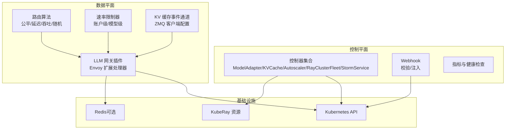
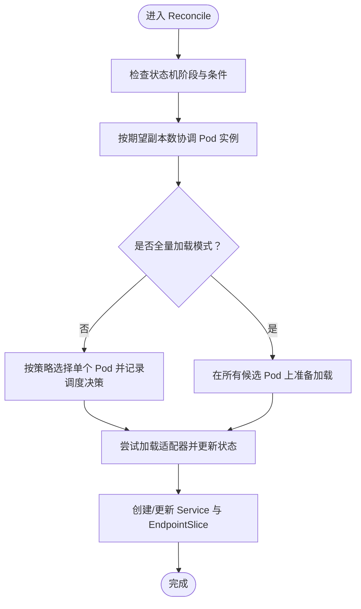
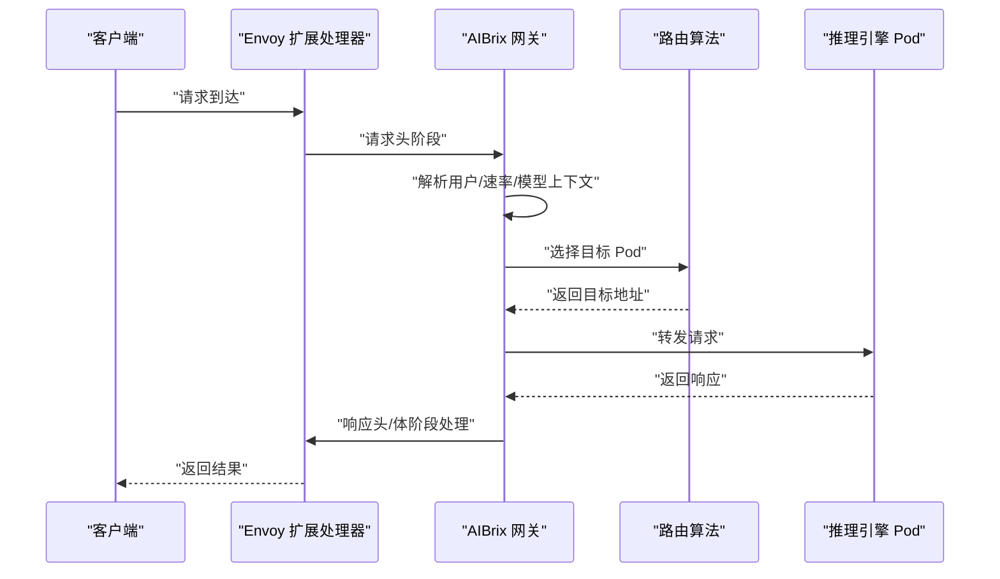
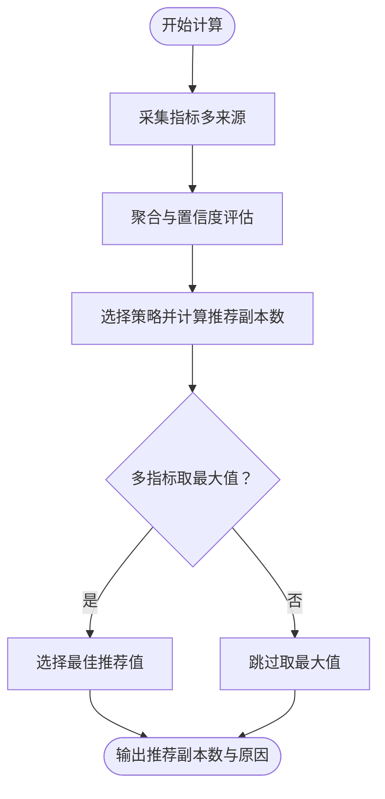
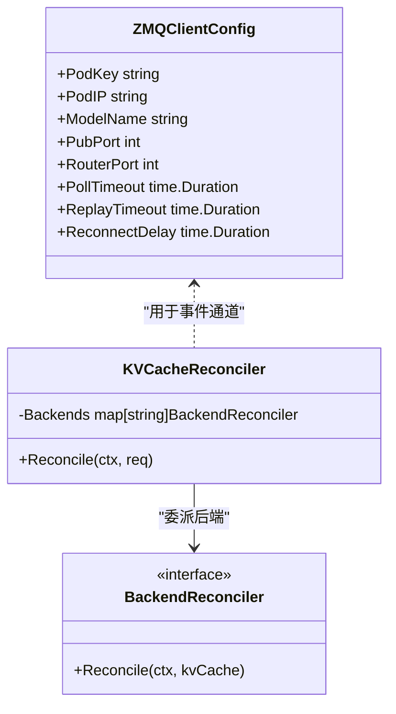
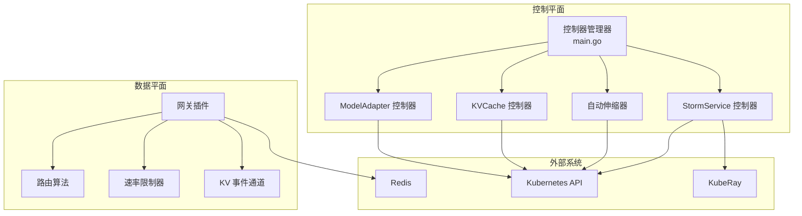
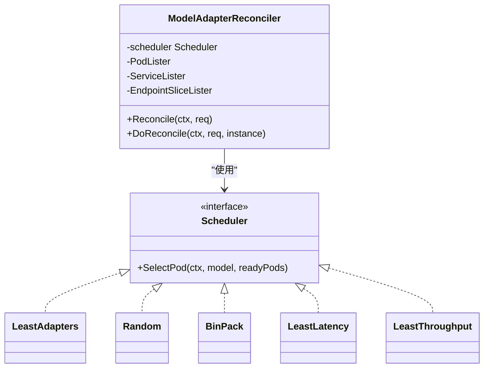
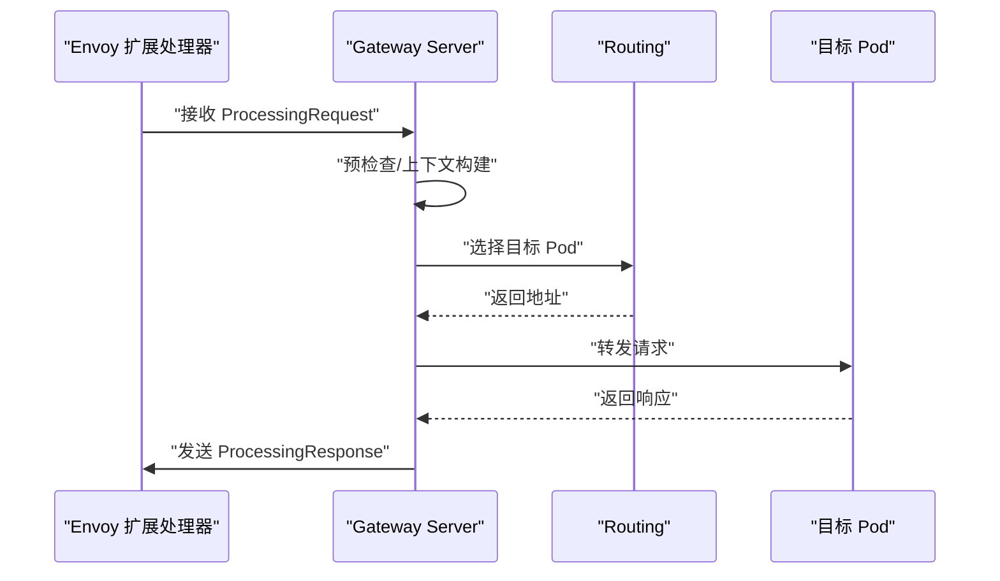
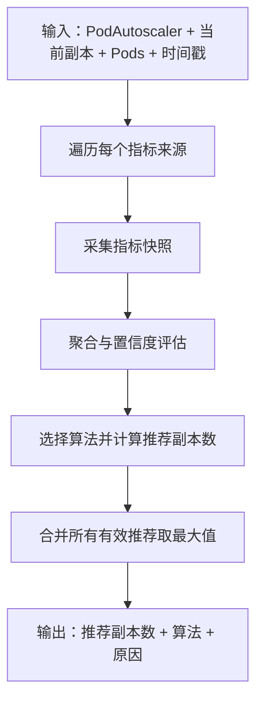
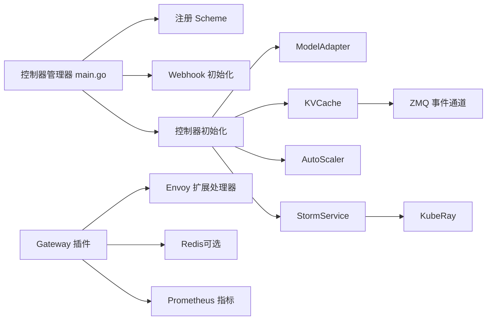

# 项目介绍与特性

<cite>
**本文引用的文件**
- [README.md](file://README.md)
- [docs/source/index.rst](file://docs/source/index.rst)
- [docs/source/designs/architecture.rst](file://docs/source/designs/architecture.rst)
- [cmd/controllers/main.go](file://cmd/controllers/main.go)
- [pkg/controller/modeladapter/modeladapter_controller.go](file://pkg/controller/modeladapter/modeladapter_controller.go)
- [pkg/controller/modeladapter/scheduling/scheduler.go](file://pkg/controller/modeladapter/scheduling/scheduler.go)
- [pkg/controller/modeladapter/resources.go](file://pkg/controller/modeladapter/resources.go)
- [pkg/controller/modeladapter/utils.go](file://pkg/controller/modeladapter/utils.go)
- [pkg/plugins/gateway/gateway.go](file://pkg/plugins/gateway/gateway.go)
- [pkg/controller/podautoscaler/autoscaler.go](file://pkg/controller/podautoscaler/autoscaler.go)
- [pkg/controller/kvcache/kvcache_controller.go](file://pkg/controller/kvcache/kvcache_controller.go)
- [pkg/cache/kvcache/types.go](file://pkg/cache/kvcache/types.go)
- [pkg/controller/stormservice/stormservice_controller.go](file://pkg/controller/stormservice/stormservice_controller.go)
</cite>

## 目录
1. [引言](#引言)
2. [项目结构](#项目结构)
3. [核心组件](#核心组件)
4. [架构总览](#架构总览)
5. [详细组件分析](#详细组件分析)
6. [依赖关系分析](#依赖关系分析)
7. [性能考量](#性能考量)
8. [故障排查指南](#故障排查指南)
9. [结论](#结论)
10. [附录](#附录)

## 引言
AIBrix 是一个面向企业级的大语言模型（LLM）生成式推理基础设施，采用云原生设计，围绕 Kubernetes 构建，提供从模型适配、路由调度、弹性伸缩到分布式推理与缓存复用的一体化能力。其核心价值在于通过“控制平面 + 数据平面”的分层架构，将 LLM 推理的复杂性封装为可编排、可观测、可扩展的工程化能力，显著降低企业在多模型、多副本、多引擎场景下的运维与成本压力。

本项目在企业级 LLM 推理领域具备以下独特优势：
- 高密度 LoRA 管理：支持多 LoRA 同时驻留与按需加载，提升资源利用率与多租户隔离能力
- LLM 网关与路由：基于 Envoy 扩展处理器的请求处理链路，实现细粒度的路由、限流与可观测性
- LLM 应用定制化自动伸缩器：以 KV 缓存利用率与推理指标为核心的多指标聚合与决策算法
- 统一 AI 运行时：轻量级 sidecar 抽象引擎交互，统一模型下载与管理接口
- 分布式推理：结合 KubeRay Fleet/ReplicaSet 等控制器，支撑跨节点推理集群
- 分布式 KV 缓存：跨引擎 KV 复用与事件同步，降低重复计算开销
- 成本高效异构服务：混合 GPU 推理与动态优化，保障 SLA 的同时降低成本
- GPU 硬件故障检测：主动探测与告警，提升系统韧性

## 项目结构
AIBrix 采用模块化与分层组织方式：
- 控制平面（Control Plane）：由多个控制器组成，负责模型元数据注册、模型适配器管理、自动伸缩策略执行、分布式推理编排、KV 缓存后端编排、StormService 等
- 数据平面（Data Plane）：由网关插件、路由算法、速率限制器、缓存事件通道等组成，负责请求接入、调度与转发、缓存复用与观测
- 文档与示例：提供安装、快速开始、架构设计与功能手册，覆盖开发、发布与生产可观测性

图示来源
- [cmd/controllers/main.go:112-360](file://cmd/controllers/main.go#L112-L360)
- [pkg/plugins/gateway/gateway.go:94-121](file://pkg/plugins/gateway/gateway.go#L94-L121)
- [pkg/controller/kvcache/kvcache_controller.go:62-75](file://pkg/controller/kvcache/kvcache_controller.go#L62-L75)

章节来源
- [docs/source/designs/architecture.rst:1-38](file://docs/source/designs/architecture.rst#L1-L38)
- [docs/source/index.rst:1-84](file://docs/source/index.rst#L1-L84)

## 核心组件
本节对八大核心特性进行系统化说明，包括技术原理、业务价值、典型应用场景与性能影响，并给出可视化流程图与参考路径。

### 1. 高密度 LoRA 管理
- 技术原理
  - 通过 ModelAdapter 控制器管理 LoRA 适配器的生命周期，支持多 LoRA 同时驻留于同一 Pod 或按需单实例部署；内置多种调度策略（随机、最少适配器、装箱、最低延迟、最低吞吐），结合缓存与状态机实现稳定加载与卸载
  - 通过 EndpointSlice 与 Service 将适配器暴露为可发现的服务入口，配合运行时 sidecar 统一模型下载与管理接口
- 业务价值
  - 提升 GPU 内存利用率与多租户隔离；降低模型切换与冷启动成本；简化多模型并行部署
- 典型场景
  - 多租户 SaaS 场景下，同一 GPU 上托管多个 LoRA 模型；根据负载选择最优调度策略
- 性能影响
  - 更高的资源密度与更短的切换时间；在装箱策略下进一步减少碎片化
- 参考路径
  - [pkg/controller/modeladapter/modeladapter_controller.go:313-493](file://pkg/controller/modeladapter/modeladapter_controller.go#L313-L493)
  - [pkg/controller/modeladapter/scheduling/scheduler.go:34-50](file://pkg/controller/modeladapter/scheduling/scheduler.go#L34-L50)
  - [pkg/controller/modeladapter/resources.go:28-102](file://pkg/controller/modeladapter/resources.go#L28-L102)
  - [pkg/controller/modeladapter/utils.go:118-158](file://pkg/controller/modeladapter/utils.go#L118-L158)

图示来源
- [pkg/controller/modeladapter/modeladapter_controller.go:417-493](file://pkg/controller/modeladapter/modeladapter_controller.go#L417-L493)

章节来源
- [pkg/controller/modeladapter/modeladapter_controller.go:1-800](file://pkg/controller/modeladapter/modeladapter_controller.go#L1-L800)
- [pkg/controller/modeladapter/scheduling/scheduler.go:1-51](file://pkg/controller/modeladapter/scheduling/scheduler.go#L1-L51)
- [pkg/controller/modeladapter/resources.go:1-103](file://pkg/controller/modeladapter/resources.go#L1-L103)
- [pkg/controller/modeladapter/utils.go:1-159](file://pkg/controller/modeladapter/utils.go#L1-L159)

### 2. LLM 网关与路由
- 技术原理
  - 基于 Envoy 扩展处理器（External Processor）实现请求头、请求体、响应头、响应体的可插拔处理；内置路由算法选择器，结合就绪 Pod 列表与标签过滤表达式进行目标选择；支持 HTTP 路由状态校验与错误码映射
  - 提供 Prometheus 指标端点与模型列表查询接口，便于观测与集成
- 业务价值
  - 统一接入层，实现公平调度、速率限制、API 兼容与可观测性；简化多模型/多副本的流量治理
- 典型场景
  - 多模型并行路由、按模型维度限流、按标签筛选可用后端
- 性能影响
  - 低侵入的扩展处理器链路，避免额外代理层开销；按需打点指标，降低观测成本
- 参考路径
  - [pkg/plugins/gateway/gateway.go:123-360](file://pkg/plugins/gateway/gateway.go#L123-L360)

图示来源
- [pkg/plugins/gateway/gateway.go:238-303](file://pkg/plugins/gateway/gateway.go#L238-L303)

章节来源
- [pkg/plugins/gateway/gateway.go:1-535](file://pkg/plugins/gateway/gateway.go#L1-L535)

### 3. LLM 应用定制化自动伸缩器
- 技术原理
  - 基于多指标采集与聚合，结合不同伸缩策略（如比例/预测/趋势），计算推荐副本数；支持多指标取最大值策略，确保伸缩决策稳健；算法缓存与线程安全设计，支持并发重入
  - 与 Kubernetes PodAutoscaler 自定义资源对接，输出 DesiredReplicas 与原因
- 业务价值
  - 第二级别实时弹性，结合 KV 缓存利用率与推理指标，避免过度或不足扩容
- 典型场景
  - 流量峰谷波动明显、需要快速收敛与稳定运行的对话/检索场景
- 性能影响
  - 多指标聚合与缓存算法减少重复计算；合理窗口与置信度增强提升稳定性
- 参考路径
  - [pkg/controller/podautoscaler/autoscaler.go:126-320](file://pkg/controller/podautoscaler/autoscaler.go#L126-L320)

图示来源
- [pkg/controller/podautoscaler/autoscaler.go:126-205](file://pkg/controller/podautoscaler/autoscaler.go#L126-L205)

章节来源
- [pkg/controller/podautoscaler/autoscaler.go:1-323](file://pkg/controller/podautoscaler/autoscaler.go#L1-L323)

### 4. 统一 AI 运行时
- 技术原理
  - 通过运行时 sidecar 抽象引擎差异，统一对接 vLLM/SGLang 等引擎的模型列表与 LoRA 加载/卸载接口；支持直连引擎或经 sidecar 转发两种模式，便于调试与一致性管理
- 业务价值
  - 降低引擎迁移成本；统一模型生命周期管理；简化控制面与数据面交互
- 典型场景
  - 多引擎混部、灰度升级、统一可观测与策略执行
- 性能影响
  - sidecar 模式增加少量网络开销，但换来一致的 API 与可观测性
- 参考路径
  - [pkg/controller/modeladapter/utils.go:118-158](file://pkg/controller/modeladapter/utils.go#L118-L158)

章节来源
- [pkg/controller/modeladapter/utils.go:1-159](file://pkg/controller/modeladapter/utils.go#L1-L159)

### 5. 分布式推理
- 技术原理
  - 通过 KubeRay Fleet/ReplicaSet 等控制器编排 Ray 集群，实现跨节点推理；StormService 控制器负责角色集与副本滚动同步，保障大规模推理任务的可编排性
- 业务价值
  - 支撑超大规模模型与高并发推理；提升资源利用率与弹性
- 典型场景
  - 多节点批处理、长序列生成、多模型并行推理
- 性能影响
  - 跨节点通信与数据分片带来额外开销，但可通过合理的拓扑与缓存复用缓解
- 参考路径
  - [pkg/controller/stormservice/stormservice_controller.go:99-149](file://pkg/controller/stormservice/stormservice_controller.go#L99-L149)

章节来源
- [pkg/controller/stormservice/stormservice_controller.go:1-149](file://pkg/controller/stormservice/stormservice_controller.go#L1-L149)

### 6. 分布式 KV 缓存
- 技术原理
  - 支持多种后端（如 Vineyard/HPKV/Infinistore），通过控制器编排缓存服务与 Pod；网关侧通过 ZMQ 客户端配置与事件通道实现跨引擎 KV 复用与事件同步
- 业务价值
  - 显著降低重复计算，提升 token 生成效率；支持跨引擎共享 KV，减少内存冗余
- 典型场景
  - 长上下文对话、多轮检索增强、多模型共享中间表示
- 性能影响
  - 事件同步与跨节点传输带来一定延迟，但整体收益显著
- 参考路径
  - [pkg/controller/kvcache/kvcache_controller.go:62-75](file://pkg/controller/kvcache/kvcache_controller.go#L62-L75)
  - [pkg/cache/kvcache/types.go:28-92](file://pkg/cache/kvcache/types.go#L28-L92)

图示来源
- [pkg/controller/kvcache/kvcache_controller.go:62-75](file://pkg/controller/kvcache/kvcache_controller.go#L62-L75)
- [pkg/cache/kvcache/types.go:28-92](file://pkg/cache/kvcache/types.go#L28-L92)

章节来源
- [pkg/controller/kvcache/kvcache_controller.go:1-194](file://pkg/controller/kvcache/kvcache_controller.go#L1-L194)
- [pkg/cache/kvcache/types.go:1-93](file://pkg/cache/kvcache/types.go#L1-L93)

### 7. 成本高效的异构服务
- 技术原理
  - 结合 GPU 型号与性能画像，动态分配与调度不同 GPU 的推理任务，在满足 SLA 的前提下最大化成本效率；与自动伸缩器协同，依据 KV 缓存与推理指标进行优化
- 业务价值
  - 在异构 GPU 环境中实现资源最优利用，降低总体拥有成本
- 典型场景
  - 混合 GPU 集群（如 V100/A100/H100）、多租户共享池
- 性能影响
  - 需要更精细的调度与监控，但长期收益显著
- 参考路径
  - [pkg/controller/modeladapter/scheduling/scheduler.go:34-50](file://pkg/controller/modeladapter/scheduling/scheduler.go#L34-L50)

章节来源
- [pkg/controller/modeladapter/scheduling/scheduler.go:1-51](file://pkg/controller/modeladapter/scheduling/scheduler.go#L1-L51)

### 8. GPU 硬件故障检测
- 技术原理
  - 通过控制器与运行时侧的健康检查、指标上报与告警机制，实现 GPU 硬件异常的早期发现与隔离；结合自动伸缩与路由降级策略，提升系统韧性
- 业务价值
  - 降低因硬件故障导致的业务中断风险；提升运维效率
- 典型场景
  - 生产环境 GPU 异常、热机/显存泄漏等
- 性能影响
  - 增加少量监控与探测开销，换取更高的可用性
- 参考路径
  - [cmd/controllers/main.go:112-360](file://cmd/controllers/main.go#L112-L360)

章节来源
- [cmd/controllers/main.go:1-360](file://cmd/controllers/main.go#L1-L360)

## 架构总览
AIBrix 的控制平面与数据平面协同工作：控制平面负责编排与策略执行，数据平面负责请求接入与调度转发。通过统一运行时与分布式 KV 缓存，实现跨引擎的资源复用与可观测性。

图示来源
- [cmd/controllers/main.go:112-360](file://cmd/controllers/main.go#L112-L360)
- [pkg/plugins/gateway/gateway.go:94-121](file://pkg/plugins/gateway/gateway.go#L94-L121)

章节来源
- [docs/source/designs/architecture.rst:1-38](file://docs/source/designs/architecture.rst#L1-L38)
- [docs/source/index.rst:1-84](file://docs/source/index.rst#L1-L84)

## 详细组件分析

### 组件 A：ModelAdapter 控制器
- 关键职责
  - 协调 Pod 实例数量与状态，按策略选择目标 Pod，加载/卸载 LoRA 适配器，维护 Service/EndpointSlice
- 设计要点
  - 状态机驱动与条件管理；周期性重入与事件通道；多策略调度器工厂
- 参考路径
  - [pkg/controller/modeladapter/modeladapter_controller.go:313-493](file://pkg/controller/modeladapter/modeladapter_controller.go#L313-L493)
  - [pkg/controller/modeladapter/scheduling/scheduler.go:34-50](file://pkg/controller/modeladapter/scheduling/scheduler.go#L34-L50)

图示来源
- [pkg/controller/modeladapter/modeladapter_controller.go:282-299](file://pkg/controller/modeladapter/modeladapter_controller.go#L282-L299)
- [pkg/controller/modeladapter/scheduling/scheduler.go:28-50](file://pkg/controller/modeladapter/scheduling/scheduler.go#L28-L50)

章节来源
- [pkg/controller/modeladapter/modeladapter_controller.go:1-800](file://pkg/controller/modeladapter/modeladapter_controller.go#L1-L800)
- [pkg/controller/modeladapter/scheduling/scheduler.go:1-51](file://pkg/controller/modeladapter/scheduling/scheduler.go#L1-L51)

### 组件 B：网关插件（Gateway）
- 关键职责
  - 处理请求头/体与响应头/体，选择目标 Pod，校验 HTTPRoute 状态，输出指标
- 设计要点
  - 扩展处理器流水线；路由算法选择；错误码映射与指标打点
- 参考路径
  - [pkg/plugins/gateway/gateway.go:123-360](file://pkg/plugins/gateway/gateway.go#L123-L360)

图示来源
- [pkg/plugins/gateway/gateway.go:238-303](file://pkg/plugins/gateway/gateway.go#L238-L303)

章节来源
- [pkg/plugins/gateway/gateway.go:1-535](file://pkg/plugins/gateway/gateway.go#L1-L535)

### 组件 C：自动伸缩器（AutoScaler）
- 关键职责
  - 多指标采集与聚合，基于策略计算推荐副本数，输出有效结果
- 设计要点
  - 算法缓存与线程安全；多指标取最大值；可扩展的指标获取器
- 参考路径
  - [pkg/controller/podautoscaler/autoscaler.go:126-320](file://pkg/controller/podautoscaler/autoscaler.go#L126-L320)

图示来源
- [pkg/controller/podautoscaler/autoscaler.go:126-205](file://pkg/controller/podautoscaler/autoscaler.go#L126-L205)

章节来源
- [pkg/controller/podautoscaler/autoscaler.go:1-323](file://pkg/controller/podautoscaler/autoscaler.go#L1-L323)

### 组件 D：KV 缓存控制器
- 关键职责
  - 根据注解选择后端（Vineyard/HPKV/Infinistore），编排缓存服务与 Pod，监听 Pod 变化触发重调度
- 设计要点
  - 后端可插拔；标签过滤；注解回退默认值
- 参考路径
  - [pkg/controller/kvcache/kvcache_controller.go:62-75](file://pkg/controller/kvcache/kvcache_controller.go#L62-L75)

章节来源
- [pkg/controller/kvcache/kvcache_controller.go:1-194](file://pkg/controller/kvcache/kvcache_controller.go#L1-L194)

### 组件 E：StormService 控制器
- 关键职责
  - 管理 RoleSet 生命周期与滚动同步，维护 Revision 历史，支持最终一致性与回滚
- 设计要点
  - Finalizer 管理；Revision 历史裁剪；幂等同步
- 参考路径
  - [pkg/controller/stormservice/stormservice_controller.go:99-149](file://pkg/controller/stormservice/stormservice_controller.go#L99-L149)

章节来源
- [pkg/controller/stormservice/stormservice_controller.go:1-149](file://pkg/controller/stormservice/stormservice_controller.go#L1-L149)

## 依赖关系分析
- 控制器依赖
  - 控制器管理器负责注册 Scheme、初始化证书、启动各控制器与 Webhook
  - ModelAdapter/KVCache/Autoscaler/StromService 等控制器依赖 Kubernetes API 与自定义 CRD
- 数据平面依赖
  - 网关依赖 Envoy 扩展处理器协议、可选 Redis 与 Prometheus 指标
  - KV 缓存依赖 ZMQ 事件通道与后端存储
- 外部依赖
  - KubeRay 用于分布式推理编排；Gateway API 用于路由状态校验

图示来源
- [cmd/controllers/main.go:112-360](file://cmd/controllers/main.go#L112-L360)
- [pkg/plugins/gateway/gateway.go:94-121](file://pkg/plugins/gateway/gateway.go#L94-L121)
- [pkg/controller/kvcache/kvcache_controller.go:62-75](file://pkg/controller/kvcache/kvcache_controller.go#L62-L75)

章节来源
- [cmd/controllers/main.go:1-360](file://cmd/controllers/main.go#L1-L360)

## 性能考量
- 资源密度与弹性
  - 高密度 LoRA 与装箱策略可显著提升 GPU 利用率；自动伸缩器以 KV 缓存利用率与推理指标为依据，避免过度扩容
- 网络与可观测性
  - 扩展处理器链路低侵入；指标打点与路由状态校验降低观测成本
- 分布式与缓存
  - 跨引擎 KV 复用与事件同步减少重复计算；ZMQ 客户端配置参数可调优延迟与吞吐
- 异构与韧性
  - 异构 GPU 动态分配与故障检测提升系统鲁棒性；建议结合 SLA 与成本目标进行策略权衡

## 故障排查指南
- 控制器健康检查
  - 使用健康探针与就绪探针确认控制器状态；Webhook 证书未就绪时会阻塞控制器启动
- 网关错误定位
  - 关注请求头/体与响应头/体阶段的错误码映射；校验 HTTPRoute 状态；查看指标端点
- KV 缓存事件
  - 检查 ZMQ 客户端配置与端口；验证事件通道缓冲区与重连策略
- 自动伸缩
  - 确认指标来源与聚合结果；核对策略与推荐副本数的原因字段

章节来源
- [cmd/controllers/main.go:294-312](file://cmd/controllers/main.go#L294-L312)
- [pkg/plugins/gateway/gateway.go:181-236](file://pkg/plugins/gateway/gateway.go#L181-L236)
- [pkg/cache/kvcache/types.go:71-92](file://pkg/cache/kvcache/types.go#L71-L92)

## 结论
AIBrix 通过“控制平面 + 数据平面”的分层设计，为企业级 LLM 推理提供了高密度、高可用、低成本与可观测的基础设施能力。八大核心特性相互协同，既满足了多模型、多副本、多引擎的复杂场景需求，又兼顾了易用性与工程化落地。建议在生产环境中结合业务 SLA 与成本目标，选择合适的调度策略、伸缩策略与后端 KV 缓存方案，并持续优化指标与告警体系。

## 附录
- 快速开始与安装
  - 参考项目根目录 README 与文档索引，按需安装依赖与核心组件
- 文档与示例
  - 架构设计、功能手册与用户手册覆盖从入门到生产的完整路径

章节来源
- [README.md:46-89](file://README.md#L46-L89)
- [docs/source/index.rst:24-84](file://docs/source/index.rst#L24-L84)