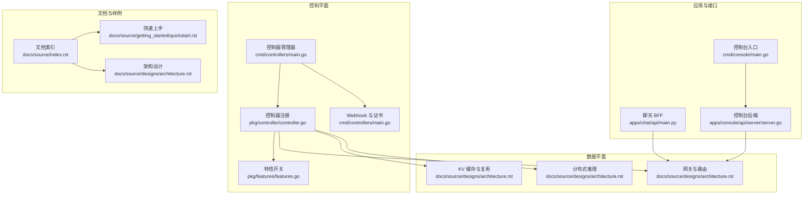
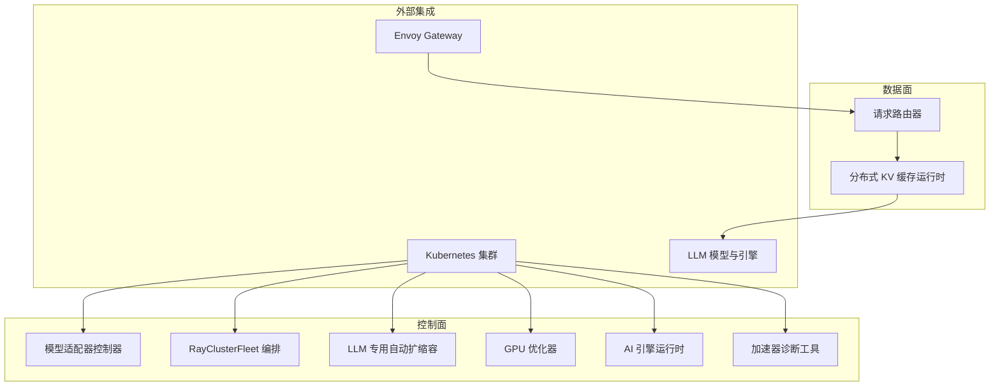
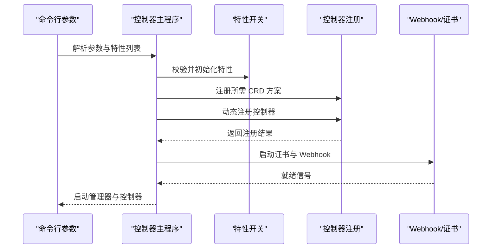
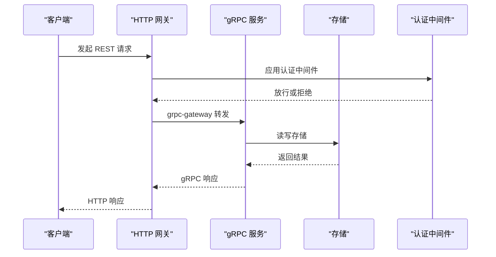
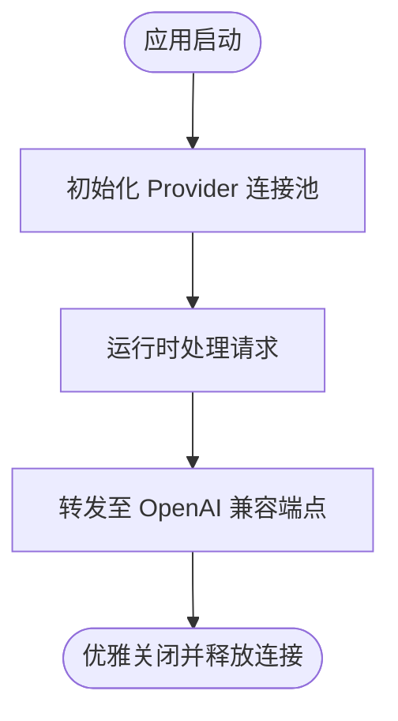
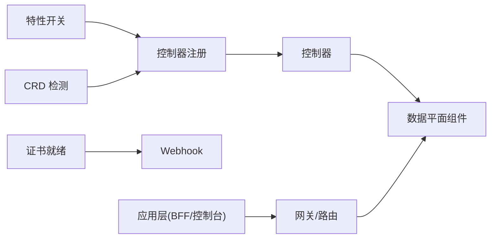

# 项目概述

<cite>
**本文引用的文件**
- [README.md](file://README.md)
- [docs/source/index.rst](file://docs/source/index.rst)
- [docs/source/designs/architecture.rst](file://docs/source/designs/architecture.rst)
- [docs/source/getting_started/quickstart.rst](file://docs/source/getting_started/quickstart.rst)
- [cmd/controllers/main.go](file://cmd/controllers/main.go)
- [cmd/console/main.go](file://cmd/console/main.go)
- [pkg/controller/controller.go](file://pkg/controller/controller.go)
- [pkg/features/features.go](file://pkg/features/features.go)
- [api/orchestration/v1alpha1/groupversion_info.go](file://api/orchestration/v1alpha1/groupversion_info.go)
- [apps/chat/api/main.py](file://apps/chat/api/main.py)
- [apps/console/api/server/server.go](file://apps/console/api/server/server.go)
- [CONTRIBUTING.md](file://CONTRIBUTING.md)
- [CODE_OF_CONDUCT.md](file://CODE_OF_CONDUCT.md)
- [SECURITY.md](file://SECURITY.md)
</cite>

## 目录
1. [引言](#引言)
2. [项目结构](#项目结构)
3. [核心组件](#核心组件)
4. [架构总览](#架构总览)
5. [详细组件分析](#详细组件分析)
6. [依赖关系分析](#依赖关系分析)
7. [性能考量](#性能考量)
8. [故障排查指南](#故障排查指南)
9. [结论](#结论)
10. [附录](#附录)

## 引言
AIBrix 是一个开源生成式 AI 推理基础设施，面向企业级 LLM（大语言模型）推理场景，提供云原生、Kubernetes 原生的可扩展解决方案。其核心价值主张在于通过统一的控制面与数据面能力，实现高密度 LoRA 管理、LLM 网关路由、统一 AI 运行时、分布式推理与 KV Cache 复用、异构 GPU 推理优化、以及可观测性与稳定性保障，帮助用户在 Kubernetes 上高效、稳定地构建与运营大规模 LLM 推理系统。

## 项目结构
AIBrix 采用模块化与分层组织方式：控制平面以控制器管理器为核心，围绕 CRD 扩展与 Webhook 安全策略；数据平面包含网关插件、路由、分布式推理与 KV Cache 运行时；应用侧提供聊天前端与控制台后端服务；文档与样例覆盖安装、快速上手与生产实践。

**图表来源**
- [cmd/controllers/main.go:112-360](file://cmd/controllers/main.go#L112-L360)
- [pkg/controller/controller.go:48-130](file://pkg/controller/controller.go#L48-L130)
- [pkg/features/features.go:24-120](file://pkg/features/features.go#L24-L120)
- [apps/chat/api/main.py:1-87](file://apps/chat/api/main.py#L1-L87)
- [apps/console/api/server/server.go:46-291](file://apps/console/api/server/server.go#L46-L291)
- [docs/source/index.rst:24-84](file://docs/source/index.rst#L24-L84)
- [docs/source/designs/architecture.rst:16-38](file://docs/source/designs/architecture.rst#L16-L38)

**章节来源**
- [README.md:1-90](file://README.md#L1-L90)
- [docs/source/index.rst:1-84](file://docs/source/index.rst#L1-L84)

## 核心组件
- 控制器管理器与控制器注册：以 controller-runtime 构建，按特性开关动态启用/禁用控制器，并在集群中检查 CRD 可用性后注册相应控制器。
- 特性开关与控制器清单：通过统一的特性表驱动控制器启停，支持按需裁剪部署面。
- Webhook 与证书轮换：在启用安全模式下，控制器管理器负责证书生成与轮换，确保 mutating/validation webhook 正常工作。
- 数据平面能力：请求路由、分布式 KV Cache、多节点推理编排等，支撑高吞吐与低延迟推理。
- 应用与接口：聊天 BFF 提供 OpenAI 兼容接口代理；控制台后端提供 gRPC/HTTP 网关，支持资源编排、作业调度与模板管理。

**章节来源**
- [cmd/controllers/main.go:81-110](file://cmd/controllers/main.go#L81-L110)
- [pkg/controller/controller.go:48-130](file://pkg/controller/controller.go#L48-L130)
- [pkg/features/features.go:24-120](file://pkg/features/features.go#L24-L120)
- [docs/source/designs/architecture.rst:16-38](file://docs/source/designs/architecture.rst#L16-L38)
- [apps/chat/api/main.py:1-87](file://apps/chat/api/main.py#L1-L87)
- [apps/console/api/server/server.go:46-291](file://apps/console/api/server/server.go#L46-L291)

## 架构总览
AIBrix 采用“控制面 + 数据面”的双平面架构。控制面负责模型元数据与适配器注册、自动扩缩容、策略执行与运行时抽象；数据面负责请求分发、调度与推理执行，支持跨节点 KV 复用与异构 GPU 资源优化。整体遵循云原生与 Kubernetes 原生设计，结合 Envoy Gateway 提供 LLM 专用路由与插件体系。

**图表来源**
- [docs/source/designs/architecture.rst:16-38](file://docs/source/designs/architecture.rst#L16-L38)

**章节来源**
- [docs/source/designs/architecture.rst:1-38](file://docs/source/designs/architecture.rst#L1-L38)

## 详细组件分析

### 控制器管理器与控制器注册
- 启动流程：解析命令行参数与特性开关，注册所需 CRD 方案，初始化控制器管理器与指标/健康探针，按特性列表动态注册控制器。
- 条件注册：针对 KubeRay CRD 的存在性进行条件注册，避免在缺少依赖时阻塞启动。
- Webhook 初始化：在证书就绪后启动各类 Webhook，确保资源创建与变更的安全校验。

**图表来源**
- [cmd/controllers/main.go:112-360](file://cmd/controllers/main.go#L112-L360)
- [pkg/controller/controller.go:48-130](file://pkg/controller/controller.go#L48-L130)
- [pkg/features/features.go:24-120](file://pkg/features/features.go#L24-L120)

**章节来源**
- [cmd/controllers/main.go:112-360](file://cmd/controllers/main.go#L112-L360)
- [pkg/controller/controller.go:48-130](file://pkg/controller/controller.go#L48-L130)
- [pkg/features/features.go:24-120](file://pkg/features/features.go#L24-L120)

### 控制台后端服务（Console）
- 架构：gRPC 服务承载业务逻辑，HTTP 网关通过 grpc-gateway 暴露 REST 接口；支持认证中间件、静态文件代理与健康检查。
- 能力：部署、作业、模型、API Key、密钥与配额等资源管理；批量作业通过 Planner 客户端对接元数据服务；Playground 聊天代理直连网关端点。
- 生命周期：优雅关闭，确保资源释放与连接平滑终止。

**图表来源**
- [apps/console/api/server/server.go:105-198](file://apps/console/api/server/server.go#L105-L198)
- [cmd/console/main.go:34-118](file://cmd/console/main.go#L34-L118)

**章节来源**
- [apps/console/api/server/server.go:46-291](file://apps/console/api/server/server.go#L46-L291)
- [cmd/console/main.go:1-118](file://cmd/console/main.go#L1-L118)

### 聊天 BFF（Chat）
- 角色：作为前端与后端服务之间的代理，统一 OpenAI 兼容接口，支持多提供商（AIBrix 网关、vLLM、云厂商）。
- 生命周期：应用启动时初始化各 Provider 的持久连接池，关闭时统一释放。
- 静态资源：内置前端静态文件，非 API 路由回退到 SPA 入口，支持深度链接。

**图表来源**
- [apps/chat/api/main.py:21-87](file://apps/chat/api/main.py#L21-L87)

**章节来源**
- [apps/chat/api/main.py:1-87](file://apps/chat/api/main.py#L1-L87)

### 架构与数据平面能力
- 控制面：模型适配器、RayClusterFleet、LLM 专用自动扩缩容、GPU 优化器、AI 引擎运行时、加速器诊断工具。
- 数据面：请求路由器、分布式 KV 缓存运行时，支持跨节点 KV 复用与低延迟访问。
- 部署与集成：通过 CRD 与控制器管理器在 Kubernetes 中编排；结合 Envoy Gateway 实现 LLM 专用路由与插件。

**章节来源**
- [docs/source/designs/architecture.rst:16-38](file://docs/source/designs/architecture.rst#L16-L38)

## 依赖关系分析
- 控制器注册依赖特性开关与 CRD 存在性检测，避免在缺失依赖时失败。
- 控制器管理器依赖 Webhook 证书就绪，确保资源安全策略生效。
- 数据平面依赖控制面提供的模型元数据与路由配置，结合网关插件实现 LLM 专用路由。
- 应用层（聊天 BFF 与控制台后端）依赖网关端点与存储后端，提供统一的 API 体验。

**图表来源**
- [pkg/features/features.go:24-120](file://pkg/features/features.go#L24-L120)
- [pkg/controller/controller.go:63-82](file://pkg/controller/controller.go#L63-L82)
- [cmd/controllers/main.go:271-291](file://cmd/controllers/main.go#L271-L291)

**章节来源**
- [pkg/features/features.go:24-120](file://pkg/features/features.go#L24-L120)
- [pkg/controller/controller.go:63-82](file://pkg/controller/controller.go#L63-L82)
- [cmd/controllers/main.go:271-291](file://cmd/controllers/main.go#L271-L291)

## 性能考量
- 自动扩缩容：基于 KV Cache 利用率与推理感知指标进行秒级弹性伸缩，提升资源利用率与成本效率。
- 分布式推理：通过 RayClusterFleet 与多节点编排，实现跨节点推理与负载均衡。
- KV Cache 复用：跨引擎共享 KV 缓存，减少重复计算，提高 Token 生成效率。
- 异构 GPU 推理：基于 Profiler 的优化器动态分配异构 GPU，兼顾 SLO 与成本。
- 网关路由：支持公平策略、速率限制与工作负载隔离，保障多租户场景下的稳定性与公平性。

**章节来源**
- [docs/source/designs/architecture.rst:16-38](file://docs/source/designs/architecture.rst#L16-L38)

## 故障排查指南
- 快速验证：参考快速上手文档中的安装步骤与示例，确认组件 Pod 状态与网关端点可达。
- 端点暴露：若 LoadBalancer 未返回外部 IP，可通过端口转发方式进行本地联调。
- 认证与权限：检查控制台后端的认证配置与存储后端连接状态。
- 日志与可观测性：结合 Prometheus/Grafana 监控与日志采集，定位控制器、网关与引擎异常。

**章节来源**
- [docs/source/getting_started/quickstart.rst:1-194](file://docs/source/getting_started/quickstart.rst#L1-L194)
- [apps/console/api/server/server.go:46-291](file://apps/console/api/server/server.go#L46-L291)

## 结论
AIBrix 以云原生与 Kubernetes 原生设计为核心，提供从控制面到数据面的一体化 LLM 推理基础设施。通过高密度 LoRA 管理、LLM 网关路由、统一 AI 运行时、分布式推理与 KV Cache 复用等关键能力，满足企业级场景对性能、成本与稳定性的综合需求。配套的控制台与聊天 BFF 降低了使用门槛，便于快速落地与运维。

## 附录
- 社区与贡献：欢迎通过 Issues 与 Pull Request 参与贡献，遵循代码风格与行为准则。
- 安全策略：明确受支持版本与漏洞上报渠道，确保供应链与运行时安全。
- 文档与样例：涵盖安装、快速上手、架构设计与生产可观测性，适合不同层次用户。

**章节来源**
- [CONTRIBUTING.md:1-52](file://CONTRIBUTING.md#L1-L52)
- [CODE_OF_CONDUCT.md:1-14](file://CODE_OF_CONDUCT.md#L1-L14)
- [SECURITY.md:1-15](file://SECURITY.md#L1-L15)
- [docs/source/index.rst:24-84](file://docs/source/index.rst#L24-L84)